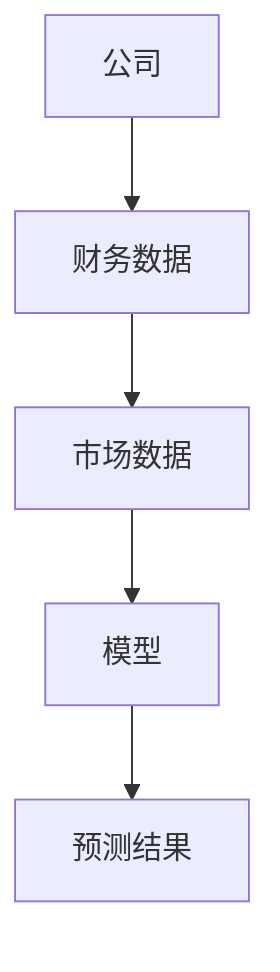
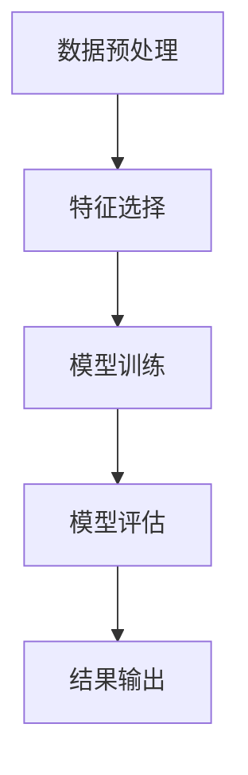
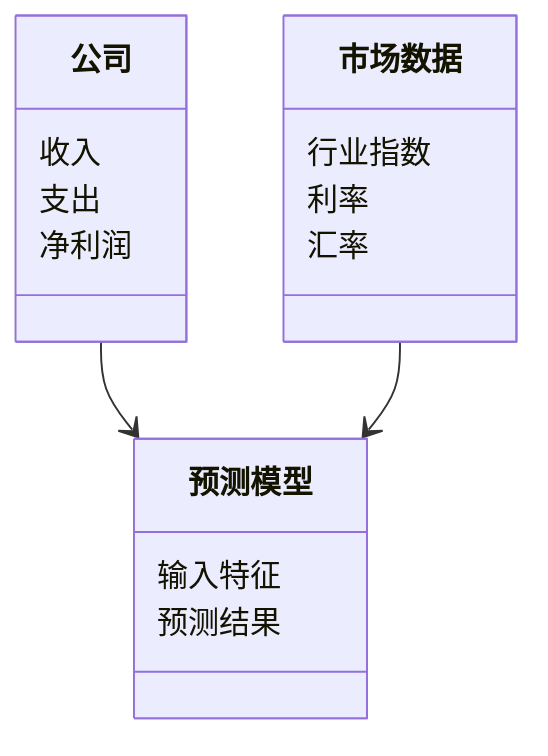
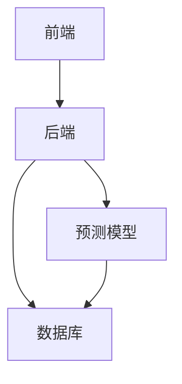
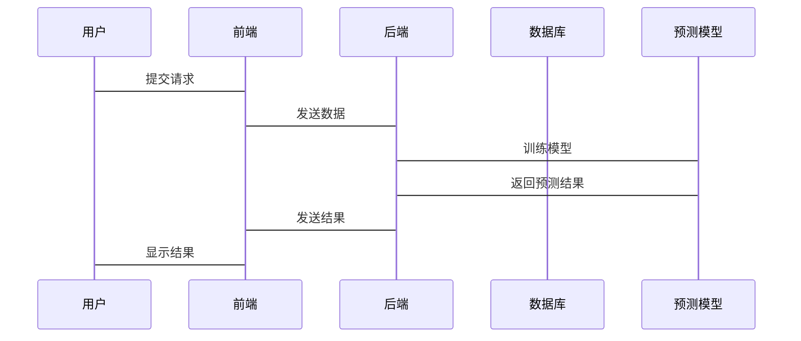

                 


# 机器学习预测公司自由现金流

> 关键词：机器学习，自由现金流，财务预测，算法，模型优化，特征工程

> 摘要：本文系统地探讨了如何利用机器学习技术预测公司自由现金流。从背景介绍到算法原理，从系统设计到项目实战，本文详细阐述了机器学习在财务预测中的应用。通过理论与实践相结合的方式，本文旨在帮助读者理解如何构建高效、准确的现金流预测模型，从而为企业的财务决策提供数据支持。

---

# 第1章: 机器学习与自由现金流预测的背景

## 1.1 机器学习的基本概念
### 1.1.1 机器学习的定义与特点
机器学习是一种人工智能技术，通过数据和经验来训练模型，使其能够进行预测或分类。其特点包括数据驱动、模型优化和自动决策。

### 1.1.2 机器学习的核心概念
- **监督学习**：给定输入和输出，训练模型进行预测。
- **无监督学习**：通过数据的内在结构发现模式。
- **特征工程**：选择和处理数据特征，提升模型性能。

### 1.1.3 机器学习与传统统计分析的区别
机器学习强调数据驱动和模型复杂性，而传统统计分析更注重假设检验和模型简化。

## 1.2 自由现金流的定义与重要性
### 1.2.1 自由现金流的定义
自由现金流是企业在扣除运营成本和资本支出后的剩余现金流量，反映了企业的盈利能力和现金流健康状况。

### 1.2.2 自由现金流在企业价值评估中的作用
自由现金流是企业估值的核心指标，常用于计算企业价值和投资决策。

### 1.2.3 自由现金流预测的挑战与意义
预测自由现金流面临数据稀疏性和噪声干扰等挑战，但其对企业的财务管理和投资决策具有重要意义。

## 1.3 机器学习在财务预测中的应用前景
### 1.3.1 机器学习在财务领域的应用现状
机器学习已在股票预测、信用评分和财务欺诈检测等领域取得显著成果。

### 1.3.2 机器学习在自由现金流预测中的优势
机器学习能够处理非线性关系和复杂特征，提升预测精度。

### 1.3.3 机器学习预测自由现金流的潜在价值
通过准确预测自由现金流，企业可以优化资本分配和风险管理。

## 1.4 本章小结
本章介绍了机器学习的基本概念、自由现金流的定义及其在财务预测中的重要性，为后续内容奠定了基础。

---

# 第2章: 机器学习预测自由现金流的核心概念

## 2.1 机器学习模型的分类与选择
### 2.1.1 监督学习、无监督学习与半监督学习
- **监督学习**：用于回归和分类任务。
- **无监督学习**：用于聚类和降维任务。
- **半监督学习**：结合有监督和无监督学习。

### 2.1.2 回归模型与分类模型的对比
- **回归模型**：预测连续值（如自由现金流）。
- **分类模型**：预测离散类别（如财务健康状况）。

### 2.1.3 常见机器学习算法在财务预测中的应用
- **线性回归**：用于简单线性关系的预测。
- **随机森林**：用于复杂非线性关系的预测。
- **支持向量机（SVM）**：用于分类和回归任务。

## 2.2 自由现金流预测的特征工程
### 2.2.1 数据特征的定义与选择
- **收入**：如营业收入、净利润。
- **支出**：如资本支出、运营成本。
- **市场因素**：如行业指数、利率。

### 2.2.2 特征的标准化与归一化处理
- **标准化**：将特征缩放到均值为0，方差为1。
- **归一化**：将特征缩放到0-1范围。

### 2.2.3 特征重要性分析与降维技术
- **特征重要性分析**：通过模型系数或特征贡献度排序。
- **降维技术**：如主成分分析（PCA）。

## 2.3 机器学习模型的评估与优化
### 2.3.1 常见模型评估指标
- **均方误差（MSE）**：预测值与实际值的平方差之和。
- **平均绝对误差（MAE）**：预测值与实际值的绝对差之和。
- **决定系数（R²）**：模型解释的方差比例。

### 2.3.2 超参数优化与模型调参
- **网格搜索（Grid Search）**：遍历所有可能的参数组合，选择最优参数。
- **随机搜索（Random Search）**：随机选择参数组合，减少计算量。

### 2.3.3 模型的过拟合与欠拟合问题
- **过拟合**：模型在训练数据上表现优异，但在测试数据上表现差。
- **欠拟合**：模型在训练数据上表现差，无法捕捉数据规律。

## 2.4 核心概念原理
### 2.4.1 机器学习模型的数学基础
- **线性回归**：$y = \beta_0 + \beta_1x + \epsilon$
- **随机森林**：基于决策树的集成模型，通过投票或平均进行预测。

### 2.4.2 自由现金流预测的业务逻辑
- **输入**：公司财务数据、市场数据。
- **输出**：预测的自由现金流。
- **挑战**：数据稀疏性、噪声干扰、模型解释性。

## 2.5 核心概念对比表格
| 概念 | 机器学习 | 自由现金流预测 |
|------|----------|----------------|
| 输入 | 特征数据 | 财务数据、市场数据 |
| 输出 | 预测值 | 自由现金流 |
| 挑战 | 数据特征选择 | 数据稀疏性、噪声干扰 |

## 2.6 ER实体关系图


## 2.7 本章小结
本章详细介绍了机器学习模型的核心概念、特征工程和模型评估方法，为后续的算法实现奠定了基础。

---

# 第3章: 机器学习预测自由现金流的算法原理

## 3.1 线性回归模型
### 3.1.1 线性回归的基本原理
线性回归通过最小化预测值与实际值的平方差之和，找到最佳拟合直线。

### 3.1.2 最小二乘法的数学推导
$$ \text{最小化} \sum_{i=1}^n (y_i - \hat{y}_i)^2 $$

### 3.1.3 线性回归在现金流预测中的应用
线性回归适用于简单线性关系的预测，但在实际应用中，其效果可能受限。

## 3.2 支持向量回归(SVR)
### 3.2.1 SVR的基本原理
支持向量回归通过构建支持向量，将问题转化为凸二次规划问题。

### 3.2.2 核函数的选择与影响
- **线性核**：适用于线性关系。
- **多项式核**：适用于高阶多项式关系。
- **径向基函数（RBF）核**：适用于非线性关系。

### 3.2.3 SVR在非线性数据中的优势
支持向量回归能够处理复杂的非线性关系，提升预测精度。

## 3.3 随机森林回归
### 3.3.1 随机森林的算法原理
随机森林通过构建多棵决策树，并通过投票或平均进行预测。

### 3.3.2 Bagging与Boosting的区别
- **Bagging**：通过随机采样数据，减少过拟合。
- **Boosting**：通过加权训练，提升模型性能。

### 3.3.3 随机森林在特征重要性分析中的应用
随机森林通过特征贡献度排序，帮助识别重要特征。

## 3.4 算法流程图


## 3.5 Python代码实现
```python
import numpy as np
from sklearn.linear_model import LinearRegression
from sklearn.ensemble import RandomForestRegressor
from sklearn.svm import SVR
from sklearn.metrics import mean_squared_error, mean_absolute_error, r2_score

# 示例数据
X = np.array([[1, 2], [3, 4], [5, 6]])
y = np.array([2, 4, 6])

# 线性回归模型
lr = LinearRegression()
lr.fit(X, y)
y_pred_lr = lr.predict(X)
print("线性回归均方误差:", mean_squared_error(y, y_pred_lr))

# 随机森林回归模型
rf = RandomForestRegressor(n_estimators=100, random_state=42)
rf.fit(X, y)
y_pred_rf = rf.predict(X)
print("随机森林均方误差:", mean_squared_error(y, y_pred_rf))

# 支持向量回归模型
svr = SVR(kernel='rbf', gamma=0.1, C=100)
svr.fit(X, y)
y_pred_svr = svr.predict(X)
print("支持向量回归均方误差:", mean_squared_error(y, y_pred_svr))
```

## 3.6 本章小结
本章详细讲解了线性回归、随机森林回归和支持向量回归的算法原理，并通过代码示例展示了其在自由现金流预测中的应用。

---

# 第4章: 系统分析与架构设计方案

## 4.1 问题场景介绍
自由现金流预测系统需要处理大量财务和市场数据，具有实时性和高精度要求。

## 4.2 系统功能设计
### 4.2.1 领域模型


### 4.2.2 系统架构设计


### 4.2.3 系统接口设计
- **输入接口**：接收公司财务数据和市场数据。
- **输出接口**：输出预测的自由现金流。

### 4.2.4 系统交互设计


## 4.3 本章小结
本章通过系统分析和架构设计，展示了自由现金流预测系统的整体结构和交互流程。

---

# 第5章: 项目实战——基于机器学习的自由现金流预测系统

## 5.1 环境安装与配置
### 5.1.1 Python环境的安装与配置
安装Python 3.x，建议使用虚拟环境（如virtualenv）管理依赖。

### 5.1.2 数据库的选择与安装
建议使用MySQL或MongoDB存储公司财务数据和市场数据。

### 5.1.3 机器学习框架的选择
推荐使用scikit-learn、xgboost和lightgbm等框架。

## 5.2 系统核心实现源代码
### 5.2.1 数据预处理代码
```python
import pandas as pd
from sklearn.preprocessing import StandardScaler

# 加载数据
df = pd.read_csv('financial_data.csv')

# 数据清洗
df.dropna(inplace=True)

# 特征选择
features = df[['收入', '支出', '净利润', '行业指数', '利率']]
target = df['自由现金流']

# 标准化处理
scaler = StandardScaler()
features_scaled = scaler.fit_transform(features)
```

### 5.2.2 模型训练与评估代码
```python
from sklearn.model_selection import train_test_split
from sklearn.ensemble import RandomForestRegressor
from sklearn.metrics import mean_squared_error, r2_score

# 数据分割
X_train, X_test, y_train, y_test = train_test_split(features_scaled, target, test_size=0.2, random_state=42)

# 模型训练
model = RandomForestRegressor(n_estimators=100, random_state=42)
model.fit(X_train, y_train)

# 模型预测
y_pred = model.predict(X_test)

# 模型评估
print("均方误差:", mean_squared_error(y_test, y_pred))
print("决定系数:", r2_score(y_test, y_pred))
```

## 5.3 代码应用解读与分析
### 5.3.1 数据预处理
- 数据清洗：处理缺失值。
- 特征选择：选择相关特征。
- 标准化处理：提升模型性能。

### 5.3.2 模型训练与评估
- 数据分割：将数据划分为训练集和测试集。
- 模型训练：使用随机森林回归模型训练。
- 模型评估：计算均方误差和决定系数。

## 5.4 实际案例分析
### 5.4.1 数据来源与获取
- 数据来源：公开的公司财务报告和市场数据。
- 数据获取：通过爬虫或API接口获取数据。

### 5.4.2 模型部署与应用
- 模型部署：将训练好的模型部署到服务器。
- 模型应用：通过API接口提供预测服务。

## 5.5 本章小结
本章通过实际案例分析，详细讲解了自由现金流预测系统的环境配置、核心实现和模型部署过程。

---

# 第6章: 总结与展望

## 6.1 本章总结
本文系统地探讨了机器学习在自由现金流预测中的应用，从理论到实践，详细讲解了相关概念、算法和系统设计。

## 6.2 未来展望
未来的研究方向包括：
- 更复杂的模型（如深度学习）的应用。
- 多模态数据的融合（如文本数据和图像数据）。
- 模型的实时性和可解释性优化。

## 6.3 最佳实践 Tips
- 数据预处理是关键，需注重特征选择和数据清洗。
- 模型评估需结合业务需求，选择合适的指标。
- 模型部署需考虑计算资源和数据隐私。

## 6.4 本章小结
本文总结了机器学习预测自由现金流的核心内容，并展望了未来的发展方向。

---

# 作者：AI天才研究院/AI Genius Institute & 禅与计算机程序设计艺术 /Zen And The Art of Computer Programming

---

通过以上目录结构和内容概述，您可以开始撰写完整的文章了。

