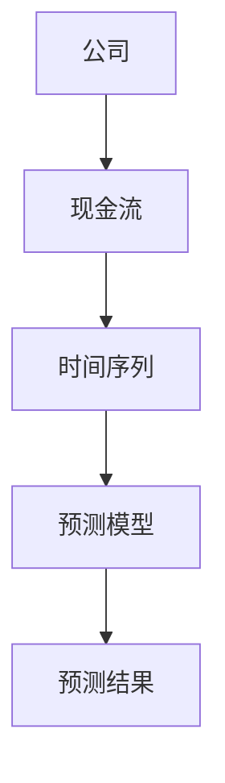
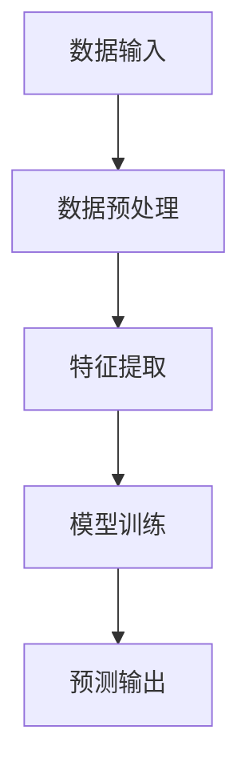
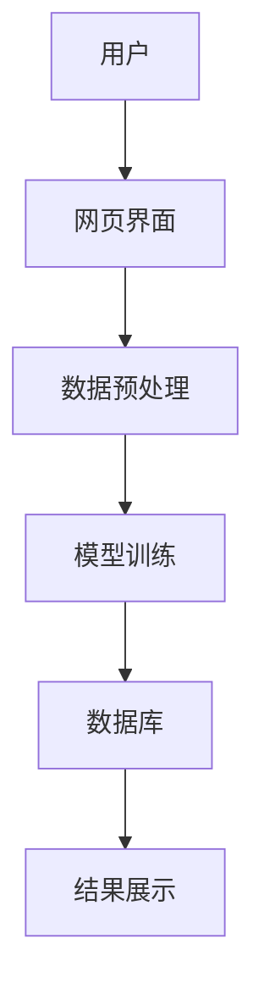
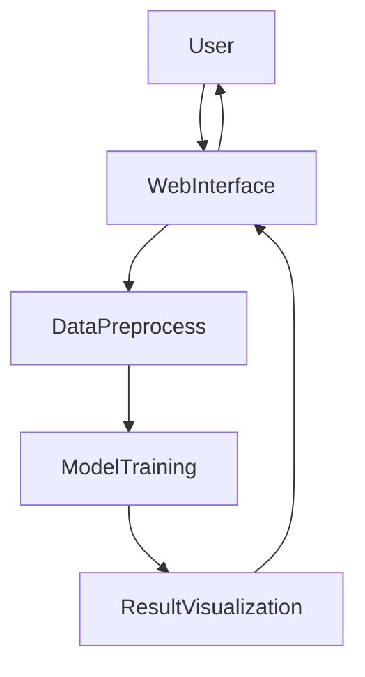
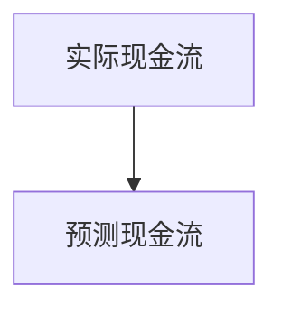

                 


# 机器学习预测公司自由现金流趋势

## 关键词：机器学习，自由现金流，时间序列，预测模型，深度学习，财务预测，现金流分析

## 摘要：  
机器学习在预测公司自由现金流方面展现了巨大的潜力。本文将从背景、概念、算法原理、系统设计、项目实战等多个维度详细探讨机器学习在自由现金流预测中的应用。通过对多种算法的分析和对比，结合实际案例，本文旨在为读者提供一个全面的视角，帮助他们理解如何利用机器学习技术预测公司自由现金流趋势。

---

# 第1章: 自由现金流预测的背景与意义

## 1.1 自由现金流的基本概念

### 1.1.1 自由现金流的定义  
自由现金流（Free Cash Flow，FCF）是指公司在扣除运营成本、税费和其他必要开支后，剩余的可用于投资或偿还债务的资金。它是衡量公司财务健康状况的重要指标，也是投资者评估公司价值的重要依据。

### 1.1.2 自由现金流的重要性  
自由现金流的预测对公司战略决策至关重要，尤其是在投资评估、资本预算和风险管理方面。准确预测自由现金流可以帮助公司制定合理的财务计划，优化资本分配，降低财务风险。

### 1.1.3 机器学习在自由现金流预测中的应用  
随着机器学习技术的发展，越来越多的企业开始利用这些算法来预测自由现金流。机器学习能够处理大量复杂数据，并通过模式识别发现传统统计方法难以捕捉的规律。

---

## 1.2 机器学习与财务预测的结合

### 1.2.1 机器学习的基本概念  
机器学习是一种人工智能技术，通过训练模型从数据中学习模式，并利用这些模式进行预测或分类。它分为监督学习、无监督学习、半监督学习和强化学习等类型。

### 1.2.2 机器学习在财务预测中的优势  
- **非线性关系捕捉**：机器学习能够发现数据中的非线性关系，而传统统计方法在这方面存在局限性。  
- **高维数据处理**：机器学习擅长处理高维数据，能够从多个特征中提取有价值的信息。  
- **实时更新**：机器学习模型可以实时更新，适应数据的变化。

### 1.2.3 自由现金流预测的挑战与机遇  
- **挑战**：自由现金流受多种因素影响，包括市场波动、宏观经济环境和公司内部决策等。  
- **机遇**：利用机器学习技术，可以构建更精准的预测模型，为公司提供数据支持。

---

## 1.3 本章小结  
本章介绍了自由现金流的基本概念及其在企业中的重要性，同时探讨了机器学习在财务预测中的应用和优势。接下来的章节将深入分析自由现金流预测的核心概念和机器学习算法的原理。

---

# 第2章: 自由现金流预测的核心概念与联系

## 2.1 核心概念原理

### 2.1.1 数据预处理与特征工程  
数据预处理是预测模型的基础，包括数据清洗、标准化和特征提取。特征工程则是从原始数据中提取有助于模型预测的特征，例如公司收入、利润、成本等。

### 2.1.2 时间序列分析  
自由现金流的预测本质上是一个时间序列问题。时间序列分析通过研究数据的时间依赖性，预测未来的现金流趋势。

### 2.1.3 模型评估与选择  
选择合适的模型是预测成功的关键。常用的评估指标包括均方误差（MSE）、平均绝对误差（MAE）和R²值等。

---

## 2.2 核心概念属性特征对比表格

| 特征             | 线性回归       | 随机森林       | LSTM          |
|------------------|----------------|----------------|---------------|
| 模型复杂性       | 低             | 高             | 极高           |
| 数据依赖性       | 线性            | 非线性          | 非线性         |
| 时间序列处理    | 不擅长          | 一般           | 善于处理       |
| 适用场景         | 简单关系       | 复杂关系        | 时间序列数据   |

---

## 2.3 ER实体关系图架构



---

## 2.4 本章小结  
本章详细探讨了自由现金流预测的核心概念，包括数据预处理、时间序列分析和模型选择。通过对比不同算法的特征，为后续的模型选择提供了依据。

---

# 第3章: 机器学习算法原理与数学模型

## 3.1 算法原理讲解

### 3.1.1 线性回归  
线性回归是一种简单的预测模型，假设目标变量与特征变量之间存在线性关系。其数学公式为：

$$ y = \beta_0 + \beta_1x + \epsilon $$

其中，$\beta_0$ 和 $\beta_1$ 是模型的参数，$\epsilon$ 是误差项。

### 3.1.2 随机森林  
随机森林是一种基于决策树的集成学习算法。它通过构建多个决策树并取其平均值，提高了模型的泛化能力。

### 3.1.3 支持向量机（SVM）  
SVM通过构建一个超平面，将数据分为两类。在时间序列预测中，SVM可以用于分类任务，例如预测现金流的涨跌趋势。

### 3.1.4 时间序列模型（ARIMA、LSTM）  
- **ARIMA**：自回归积分滑动平均模型，适用于线性时间序列数据。  
- **LSTM**：长短期记忆网络，能够捕捉时间序列中的长期依赖关系，其数学公式为：

$$ f_t = \text{LSTM}(f_{t-1}, x_t) $$

---

## 3.2 算法流程图



---

## 3.3 数学模型和公式

### 线性回归模型  
$$ y = \beta_0 + \beta_1x + \epsilon $$

### LSTM模型  
$$ f_t = \text{LSTM}(f_{t-1}, x_t) $$

---

## 3.4 举例说明

### 线性回归举例  
假设我们有以下数据：

| 年份 | 收入（x） | 现金流（y） |
|------|------------|-------------|
| 2020 | 100        | 20          |
| 2021 | 150        | 30          |

通过线性回归，我们可以预测2022年的现金流为：

$$ y = 10 + 0.1x $$

当x=200时，y=30。

### LSTM举例  
假设我们有以下时间序列数据：

| 时间 | 现金流 |
|------|--------|
| t-1  | 50     |
| t-2  | 60     |
| t-3  | 40     |

LSTM模型可以利用这些数据预测t时刻的现金流。

---

## 3.5 本章小结  
本章详细讲解了常用的机器学习算法及其原理，并通过公式和流程图展示了它们的数学模型和实现步骤。

---

# 第4章: 系统分析与架构设计方案

## 4.1 问题场景介绍

### 4.1.1 预测目标  
预测公司未来三年的自由现金流。

### 4.1.2 数据来源  
公司财务报表、市场数据和宏观经济指标。

### 4.1.3 系统需求  
- 实时数据获取  
- 模型训练与部署  
- 预测结果可视化

---

## 4.2 系统功能设计

### 4.2.1 数据预处理模块  
- 数据清洗  
- 特征提取  

### 4.2.2 模型训练模块  
- 选择合适的算法  
- 调参优化  

### 4.2.3 预测结果展示模块  
- 可视化图表  
- 预测结果导出  

---

## 4.3 系统架构设计



---

## 4.4 接口设计与交互流程

### 4.4.1 系统接口设计  
- 数据接口：从数据库获取历史现金流数据。  
- 模型接口：调用训练好的模型进行预测。  

### 4.4.2 系统交互流程  



---

## 4.5 本章小结  
本章详细介绍了系统的设计与架构，包括功能模块、接口设计和交互流程。接下来的章节将通过实际案例展示系统的实现过程。

---

# 第5章: 项目实战与代码实现

## 5.1 项目介绍

### 5.1.1 项目背景  
本文将通过一个实际案例，使用LSTM模型预测公司的自由现金流。

### 5.1.2 数据来源  
某公司过去五年的财务数据。

---

## 5.2 环境安装与配置

### 5.2.1 安装Python环境  
安装Python 3.8及以上版本，并安装以下库：

```bash
pip install numpy pandas scikit-learn keras tensorflow matplotlib
```

### 5.2.2 数据获取与预处理  
使用Pandas库读取数据并进行预处理：

```python
import pandas as pd

data = pd.read_csv('cash_flow.csv')
data = data[['year', 'revenue', 'profit', 'cash_flow']]
data = data.dropna()
```

---

## 5.3 系统核心实现源代码

### 5.3.1 数据预处理  
```python
from sklearn.preprocessing import MinMaxScaler

scaler = MinMaxScaler()
scaled_data = scaler.fit_transform(data['cash_flow'].values.reshape(-1, 1))
```

### 5.3.2 模型训练  
```python
from keras.models import Sequential
from keras.layers import LSTM, Dense

model = Sequential()
model.add(LSTM(50, input_shape=(1, 1)))
model.add(Dense(1))
model.compile(loss='mean_squared_error', optimizer='adam')
model.fit(scaled_data[:-10], scaled_data[10:], epochs=50, batch_size=1)
```

### 5.3.3 预测与可视化  
```python
import matplotlib.pyplot as plt

predicted = model.predict(scaled_data[-10:])
predicted = scaler.inverse_transform(predicted)

plt.plot(data['year'][-10:], data['cash_flow'][-10:], label='Actual')
plt.plot(data['year'][-10:], predicted.flatten(), label='Predicted')
plt.legend()
plt.show()
```

---

## 5.4 实际案例分析与结果解读

### 5.4.1 预测结果  
预测结果与实际结果的对比图如下：



### 5.4.2 模型优化  
通过调整LSTM的层数和神经元数量，进一步优化模型性能。

---

## 5.5 本章小结  
本章通过实际案例展示了如何利用机器学习技术预测公司自由现金流。通过代码实现和结果分析，验证了模型的有效性。

---

# 第6章: 总结与展望

## 6.1 总结

### 6.1.1 核心观点回顾  
- 机器学习在自由现金流预测中具有重要作用。  
- 时间序列模型（如LSTM）在处理这类问题时表现优异。  

### 6.1.2 最佳实践 tips  
- 数据预处理是模型成功的关键。  
- 选择合适的算法和模型参数可以显著提高预测精度。

---

## 6.2 展望

### 6.2.1 未来研究方向  
- 开发更复杂的模型，如Transformer架构。  
- 研究多变量时间序列预测方法。  

### 6.2.2 技术发展趋势  
- 实时预测与动态调整。  
- 结合NLP技术，分析文本数据对现金流的影响。

---

## 6.3 本章小结  
本文总结了机器学习在自由现金流预测中的应用，并展望了未来的研究方向和技术发展趋势。

---

# 作者：AI天才研究院/AI Genius Institute & 禅与计算机程序设计艺术/Zen And The Art of Computer Programming

