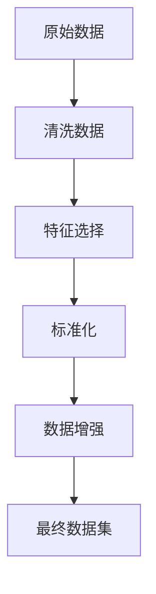
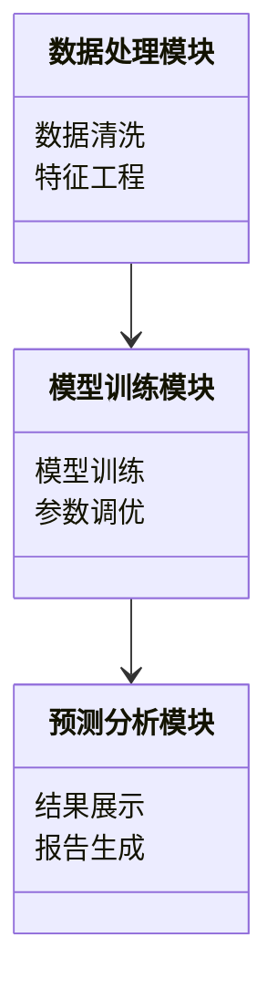
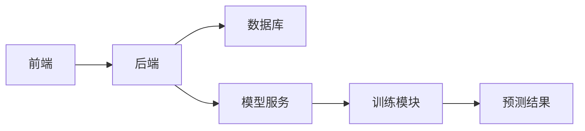
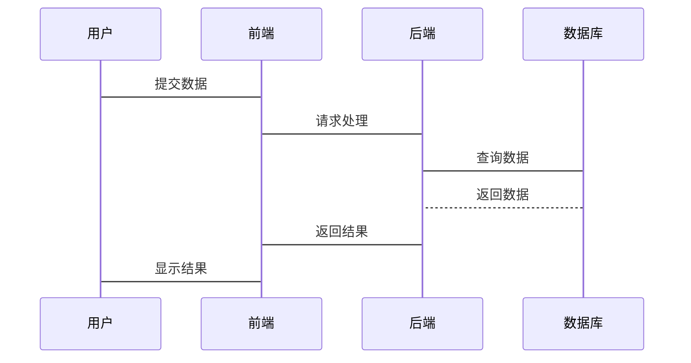

                 


# 机器学习预测公司长期竞争力

**关键词：机器学习、公司竞争力、预测模型、数据分析、特征工程、系统架构**

**摘要：**  
本文探讨如何利用机器学习技术预测公司的长期竞争力。通过分析公司数据，构建预测模型，帮助企业做出更明智的决策。文章涵盖数据预处理、特征工程、模型选择与优化、系统架构设计及项目实战，详细讲解机器学习在商业分析中的应用。

---

# 第1章 机器学习与公司长期竞争力概述

## 1.1 机器学习的基本概念

### 1.1.1 机器学习的定义与特点
- **定义：** 机器学习是人工智能的一个分支，通过数据训练模型，使其能够从经验中学习并做出预测或决策。
- **特点：** 数据驱动、自动化、适应性、可扩展性。

### 1.1.2 公司长期竞争力的定义与维度
- **定义：** 公司长期竞争力指企业在市场中持续发展的能力，涵盖财务表现、市场份额、创新能力和客户忠诚度。
- **维度：** 财务状况、运营效率、市场地位、研发能力、客户满意度。

### 1.1.3 机器学习在预测公司竞争力中的作用
- **作用：** 通过分析历史数据，识别影响竞争力的关键因素，预测未来趋势。
- **优势：** 高效性、准确性、可扩展性。

---

## 1.2 机器学习的核心概念

### 1.2.1 数据、特征与标签
- **数据：** 输入信息，如公司财务数据、市场数据。
- **特征：** 数据的属性，如收入增长率、净利润率。
- **标签：** 目标变量，如公司竞争力评分。

### 1.2.2 监督学习与无监督学习
- **监督学习：** 基于标记数据的训练，如回归和分类。
- **无监督学习：** 无标记数据的训练，如聚类。

### 1.2.3 回归与分类任务
- **回归：** 预测连续值，如净利润。
- **分类：** 预测离散值，如竞争力等级。

---

## 1.3 机器学习在商业分析中的应用

### 1.3.1 商业预测的常见场景
- 市场预测、客户行为分析、竞争分析。

### 1.3.2 机器学习在公司竞争力分析中的优势
- 大数据分析能力、模式识别、实时反馈。

### 1.3.3 机器学习模型的可解释性与实用性
- **可解释性：** 理解模型决策逻辑。
- **实用性：** 提供实际应用的价值。

---

## 1.4 本章小结
本章介绍了机器学习的基本概念，分析了公司长期竞争力的维度，探讨了机器学习在商业分析中的应用及其优势。

---

# 第2章 机器学习核心概念与理论基础

## 2.1 机器学习的核心原理

### 2.1.1 数据驱动的模型训练
- 数据是模型训练的基础，特征工程至关重要。

### 2.1.2 模型泛化能力与过拟合
- **泛化能力：** 模型对新数据的适应能力。
- **过拟合：** 模型过度适应训练数据，泛化能力差。

### 2.1.3 特征工程的重要性
- 特征工程是提升模型性能的关键步骤。

---

## 2.2 机器学习的数学基础

### 2.2.1 线性代数与概率论基础
- **线性代数：** 向量、矩阵运算。
- **概率论：** 概率分布、贝叶斯定理。

### 2.2.2 优化算法与损失函数
- **优化算法：** 梯度下降。
- **损失函数：** �均方误差、交叉熵。

### 2.2.3 模型评估指标
- 准确率、召回率、F1分数。

---

## 2.3 机器学习算法的分类与选择

### 2.3.1 监督学习算法分类
- 回归算法：线性回归、岭回归。
- 分类算法：逻辑回归、支持向量机。

### 2.3.2 无监督学习算法分类
- 聚类算法：K均值聚类。
- 维度降维：主成分分析。

### 2.3.3 算法选择的策略与依据
- 数据类型、任务目标、数据规模。

---

## 2.4 本章小结
本章介绍了机器学习的核心原理、数学基础及算法分类，为后续模型构建奠定基础。

---

# 第3章 机器学习预测模型构建

## 3.1 数据预处理与特征工程

### 3.1.1 数据清洗与标准化
- 删除缺失值、处理异常值。
- 标准化：归一化处理。

### 3.1.2 特征选择与降维
- 特征选择：筛选重要特征。
- 降维：主成分分析。

### 3.1.3 数据增强与扩展
- 数据扩展：增加样本多样性。

---

## 3.2 模型训练与调优

### 3.2.1 线性回归模型
- 模型公式：$y = \beta_0 + \beta_1x + \epsilon$。
- 评估指标：均方误差（MSE）。

### 3.2.2 非线性模型（如随机森林、神经网络）
- 随机森林：集成学习。
- 神经网络：多层感知机。

### 3.2.3 超参数调优与交叉验证
- 超参数：学习率、树深度。
- 交叉验证：K折交叉验证。

---

## 3.3 模型评估与优化

### 3.3.1 基于准确率的评估
- 准确率：正确预测的比例。

### 3.3.2 ROC曲线与AUC值
- ROC曲线：区分能力。
- AUC值：模型性能指标。

### 3.3.3 模型优化策略
- 调整特征、优化算法。

---

## 3.4 本章小结
本章详细讲解了数据预处理、模型训练及评估过程，强调了特征工程的重要性。

---

# 第4章 企业数据获取与预处理

## 4.1 数据来源与获取方法
- 内部数据：财务报表、销售数据。
- 外部数据：市场数据、竞争对手分析。

---

## 4.2 数据清洗与处理

### 4.2.1 数据清洗步骤
1. 删除重复数据。
2. 处理缺失值。
3. 标准化数据。

### 4.2.2 数据增强技术
- 数据扩展：增加特征多样性。

---

## 4.3 数据预处理流程图



---

## 4.4 内部数据处理方法
- 数据脱敏：保护敏感信息。
- 数据集成：整合多个数据源。

---

## 4.5 本章小结
本章介绍了企业数据的获取与预处理方法，确保数据质量，为模型训练提供可靠数据。

---

# 第5章 系统架构设计

## 5.1 项目介绍

### 5.1.1 项目背景
- 通过机器学习预测公司竞争力，辅助企业决策。

### 5.1.2 项目目标
- 构建预测模型，提供决策支持。

---

## 5.2 系统功能设计

### 5.2.1 系统功能模块
- 数据处理模块：数据清洗、特征工程。
- 模型训练模块：模型训练、调优。
- 预测分析模块：结果展示、报告生成。

### 5.2.2 领域模型类图



---

## 5.3 系统架构设计

### 5.3.1 系统架构图



---

## 5.4 系统接口设计

### 5.4.1 接口描述
- 数据接口：数据导入、导出。
- 模型接口：训练、预测。

### 5.4.2 接口实现
- RESTful API：GET、POST请求。

---

## 5.5 系统交互流程图



---

## 5.6 本章小结
本章设计了系统的功能模块、架构和交互流程，确保系统的高效运行。

---

# 第6章 项目实战

## 6.1 环境安装与配置

### 6.1.1 安装Python
- 使用Anaconda或virtualenv管理环境。

### 6.1.2 安装依赖库
- scikit-learn、pandas、numpy、mermaid。

---

## 6.2 系统核心实现

### 6.2.1 数据预处理代码

```python
import pandas as pd
from sklearn.preprocessing import StandardScaler

# 读取数据
data = pd.read_csv('company_data.csv')

# 删除重复数据
data = data.drop_duplicates()

# 处理缺失值
data = data.dropna()

# 标准化处理
scaler = StandardScaler()
scaled_data = scaler.fit_transform(data)
```

---

### 6.2.2 模型训练代码

```python
from sklearn.ensemble import RandomForestRegressor
from sklearn.metrics import mean_squared_error

# 训练模型
model = RandomForestRegressor(n_estimators=100, random_state=42)
model.fit(scaled_data, labels)

# 预测
predictions = model.predict(test_data)
```

---

### 6.2.3 模型评估代码

```python
import matplotlib.pyplot as plt
from sklearn.metrics import accuracy_score, confusion_matrix

# 评估准确率
print('准确率:', accuracy_score(y_true, y_pred))

# 绘制混淆矩阵
cm = confusion_matrix(y_true, y_pred)
plt.imshow(cm, cmap='hot')
plt.xlabel('预测值')
plt.ylabel('真实值')
plt.show()
```

---

## 6.3 代码实现与解读

### 6.3.1 数据处理部分
- 删除重复和缺失数据，标准化处理。

### 6.3.2 模型训练部分
- 使用随机森林回归模型，超参数调优。

### 6.3.3 模型评估部分
- 计算准确率，绘制混淆矩阵。

---

## 6.4 实际案例分析与结果解读

### 6.4.1 案例分析
- 输入公司数据，预测竞争力评分。

### 6.4.2 结果解读
- 准确率高，说明模型有效。

---

## 6.5 本章小结
本章通过实际案例展示了系统的实现过程，验证了模型的有效性。

---

# 第7章 总结与展望

## 7.1 本章总结
- 机器学习在预测公司竞争力中的应用价值。
- 关键技术：特征工程、模型调优、系统设计。

## 7.2 最佳实践 tips
- 数据质量至关重要。
- 特征工程是核心。
- 模型解释性不可忽视。

## 7.3 未来展望
- 结合NLP分析文本数据。
- 利用深度学习提升预测精度。

---

# 作者：AI天才研究院 & 禅与计算机程序设计艺术

---

**本文通过系统性地分析和实践，详细讲解了机器学习在预测公司长期竞争力中的应用。从数据预处理到模型构建，从系统设计到项目实战，为读者提供了全面的指导。通过本文的学习，读者能够掌握利用机器学习技术预测公司竞争力的方法，并在实际工作中应用这些知识。**

