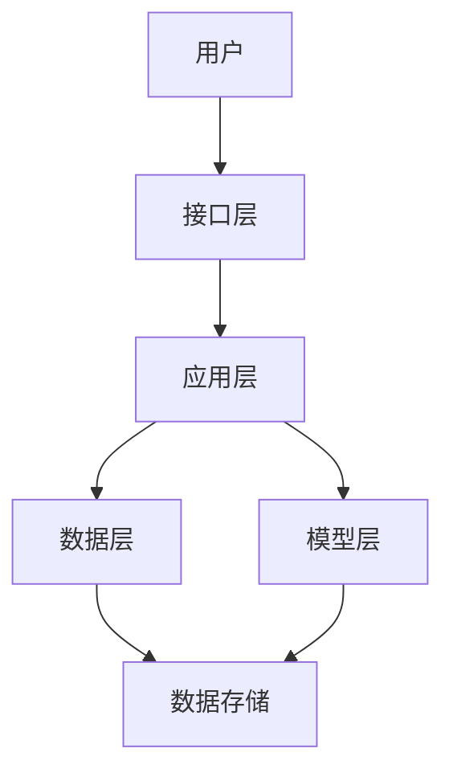

                 


# 机器学习驱动的动态资产定价模型

## 关键词
机器学习，动态资产定价，算法，系统架构，项目实战

## 摘要
本文探讨了机器学习在动态资产定价中的应用，系统地介绍了从基础理论到实际应用的全过程。通过分析常见算法和系统架构，结合实际案例，展示了如何构建高效、准确的动态资产定价模型。

---

# 第一部分: 机器学习与资产定价基础

## 第1章: 机器学习基础

### 1.1 机器学习的基本概念

#### 1.1.1 机器学习的定义
机器学习是一种人工智能技术，通过数据训练模型，使其能够从数据中学习并做出预测或决策。它可分为监督学习、无监督学习、半监督学习和强化学习。

#### 1.1.2 机器学习的核心要素
- 数据：训练的基础。
- 模型：算法的实现。
- 特征：数据的关键属性。
- 标签：目标变量。
- 损失函数：评估预测与真实值的差距。
- 优化器：调整模型参数以最小化损失。

#### 1.1.3 机器学习的分类与应用场景
- 监督学习：用于回归和分类任务。
- 无监督学习：用于聚类和降维。
- 半监督学习：结合标注和未标注数据。
- 强化学习：适用于策略优化。

## 第2章: 机器学习在资产定价中的应用

### 2.1 机器学习与资产定价的结合

#### 2.1.1 机器学习在资产定价中的优势
- 数据驱动：利用历史数据进行预测。
- 非线性关系：捕捉传统模型难以发现的模式。
- 动态调整：实时更新模型以反映市场变化。

#### 2.1.2 机器学习在资产定价中的挑战
- 数据质量：噪声和缺失值影响模型性能。
- 解释性：复杂模型的可解释性较低。
- 过拟合：模型可能过度拟合训练数据。

#### 2.1.3 机器学习在资产定价中的未来趋势
- 结合领域知识：将专家经验融入模型。
- 多模态数据：整合文本、图像等多种数据源。
- 自动化机器学习：利用AutoML提高效率。

### 2.2 动态资产定价的背景与需求

#### 2.2.1 动态资产定价的定义
动态资产定价指根据市场环境实时调整资产价格，考虑波动性、市场情绪和新闻事件等因素。

#### 2.2.2 动态资产定价的背景
- 市场波动：资产价格受多种因素影响，需要动态调整。
- 信息爆炸：数据量大，传统模型难以处理。
- 交易效率：高频交易要求快速定价决策。

#### 2.2.3 动态资产定价的需求
- 实时性：快速响应市场变化。
- 准确性：模型需准确预测价格走势。
- 灵活性：适应不同资产类别和市场条件。

---

# 第二部分: 动态资产定价模型的理论与方法

## 第3章: 动态资产定价模型的基本原理

### 3.1 动态资产定价模型的定义

#### 3.1.1 动态资产定价模型的定义
动态资产定价模型是基于机器学习构建的，能够根据市场动态调整资产价格预测的模型。

#### 3.1.2 动态资产定价模型的核心要素
- 数据源：历史价格、财务数据、市场情绪等。
- 特征工程：提取有用的特征，如技术指标、市场情绪指数。
- 模型选择：选择适合的机器学习算法。
- 评价指标：如均方误差（MSE）、R平方值。

#### 3.1.3 动态资产定价模型的特征
- 动态性：能够实时更新和调整。
- 高维性：处理多维度数据。
- 非线性：捕捉复杂的价格变动模式。

## 第4章: 机器学习算法在动态定价中的应用

### 4.1 常见机器学习算法概述

#### 4.1.1 线性回归
线性回归用于预测资产价格，假设价格与特征之间呈线性关系。模型形式为：
$$ y = \beta_0 + \beta_1x_1 + \beta_2x_2 + \dots + \beta_nx_n + \epsilon $$

#### 4.1.2 支持向量机
支持向量机通过构建超平面进行分类或回归，适用于高维数据。

#### 4.1.3 随机森林
随机森林是一种集成学习方法，通过多个决策树进行投票或平均，具有高准确性和鲁棒性。

#### 4.1.4 神经网络
神经网络能够处理复杂的非线性关系，适合处理高维和复杂的数据。

#### 4.1.5 时间序列分析
时间序列分析考虑数据的时间依赖性，如ARIMA模型：
$$ y_t = \phi_1y_{t-1} + \phi_2y_{t-2} + \dots + \phi_ny_{t-n} + \epsilon_t $$

### 4.2 算法原理与实现

#### 4.2.1 线性回归的数学模型
$$ y = \beta_0 + \beta_1x + \epsilon $$

#### 4.2.2 支持向量机的原理
通过最大化间隔构建分类或回归模型，使用拉格朗日乘子法求解。

#### 4.2.3 随机森林的特征重要性分析
通过特征选择算法评估各特征对模型的贡献。

#### 4.2.4 神经网络的结构与训练
神经网络由输入层、隐藏层和输出层组成，使用反向传播和梯度下降进行训练。

#### 4.2.5 时间序列模型的ARIMA
ARIMA模型适合处理具有趋势和季节性的数据，通过自相关函数和偏自相关函数选择参数。

## 第5章: 系统架构与设计

### 5.1 问题场景

#### 5.1.1 系统功能设计
系统功能包括数据采集、特征提取、模型训练、价格预测和结果输出。

#### 5.1.2 系统架构设计
- 数据层：数据存储和管理。
- 应用层：处理用户请求和数据查询。
- 模型层：机器学习模型的训练和部署。
- 接口层：与前端和后端系统的交互。

#### 5.1.3 系统交互流程
1. 用户提交请求，系统接收并解析。
2. 系统从数据层获取所需数据。
3. 数据预处理并提取特征。
4. 模型层进行预测。
5. 结果返回给用户。

### 5.2 系统架构设计

#### 5.2.1 系统架构图


#### 5.2.2 系统功能设计


---

# 第三部分: 项目实战

## 第6章: 环境安装与核心实现

### 6.1 环境安装

```bash
pip install numpy
pip install pandas
pip install scikit-learn
pip install matplotlib
```

### 6.2 核心实现

#### 6.2.1 数据预处理
```python
import pandas as pd
data = pd.read_csv('asset_prices.csv')
data = data.dropna()
```

#### 6.2.2 特征工程
```python
from sklearn.preprocessing import StandardScaler
scaler = StandardScaler()
X_scaled = scaler.fit_transform(X)
```

#### 6.2.3 模型训练
```python
from sklearn.ensemble import RandomForestRegressor
model = RandomForestRegressor(n_estimators=100, random_state=42)
model.fit(X_scaled, y)
```

#### 6.2.4 模型预测
```python
y_pred = model.predict(X_test_scaled)
```

## 第7章: 案例分析与项目总结

### 7.1 案例分析
案例：股票价格预测

#### 7.1.1 数据获取
```python
import pandas_datareader as pdr
data = pdr.get_data_yahoo('AAPL', start='2020-01-01', end='2023-12-31')
```

#### 7.1.2 特征选择
选择开盘价、收盘价、最高价、最低价和交易量作为特征。

#### 7.1.3 模型选择
使用随机森林回归模型进行训练和预测。

### 7.2 项目总结
- 项目实现了动态资产定价模型。
- 验证了机器学习在金融领域的有效性。
- 强调了数据质量和特征工程的重要性。

---

# 第四部分: 最佳实践与总结

## 第8章: 最佳实践

### 8.1 实践技巧
- 数据预处理：处理缺失值和异常值。
- 特征工程：选择和创建有意义的特征。
- 模型调优：使用交叉验证和超参数优化。
- 模型解释：使用特征重要性分析和SHAP值。

### 8.2 小结
机器学习为动态资产定价提供了强大的工具，但需要结合领域知识和最佳实践才能发挥最大潜力。

### 8.3 注意事项
- 避免过拟合：使用交叉验证和正则化。
- 定期更新模型：适应市场变化。
- 风险管理：考虑模型的不确定性和市场波动。

### 8.4 拓展阅读
- 《机器学习实战》
- 《Python机器学习》
- 《时间序列分析与应用》

---

# 作者

作者：AI天才研究院/AI Genius Institute & 禅与计算机程序设计艺术 /Zen And The Art of Computer Programming

---

# 结语

通过本文的详细讲解，读者可以系统地了解机器学习在动态资产定价中的应用，并能够通过实际案例掌握模型的构建和优化方法。希望本文能为读者在这一领域的探索提供有价值的参考。

