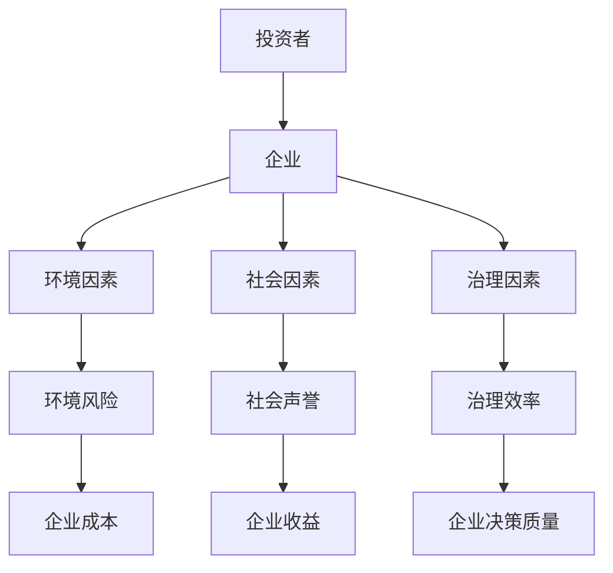
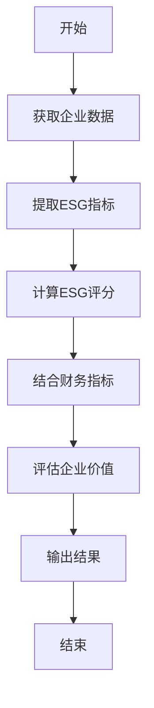
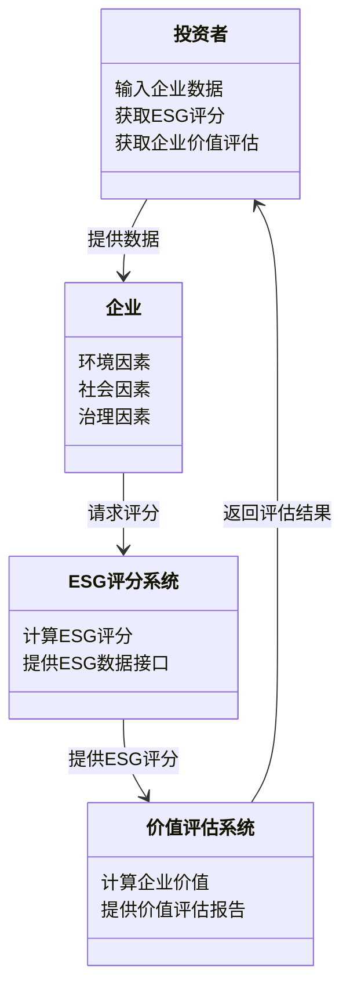
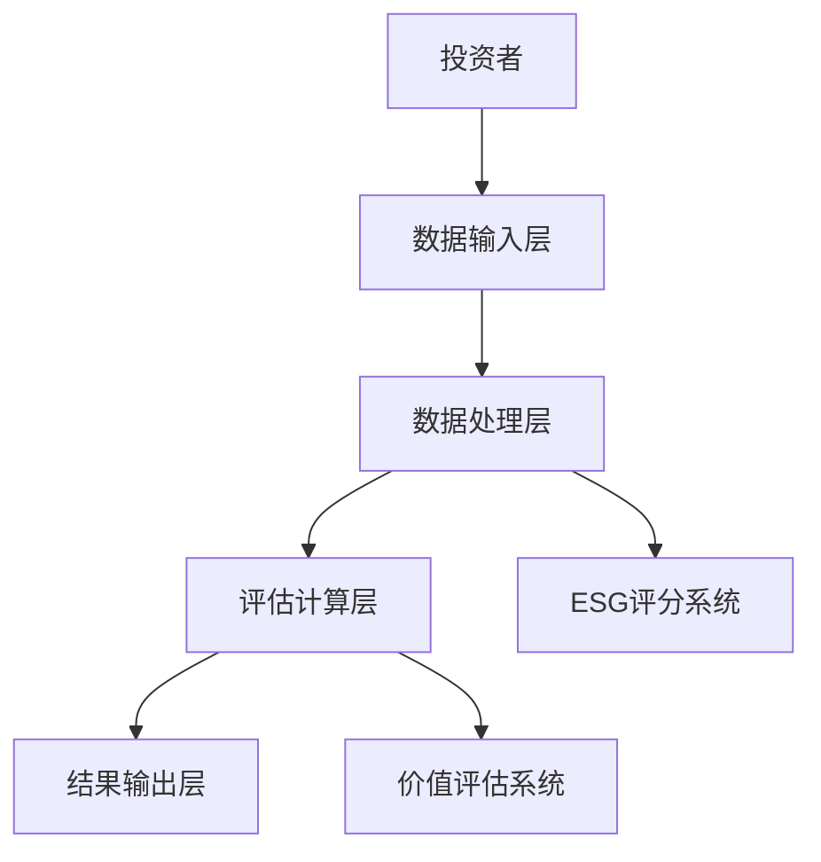
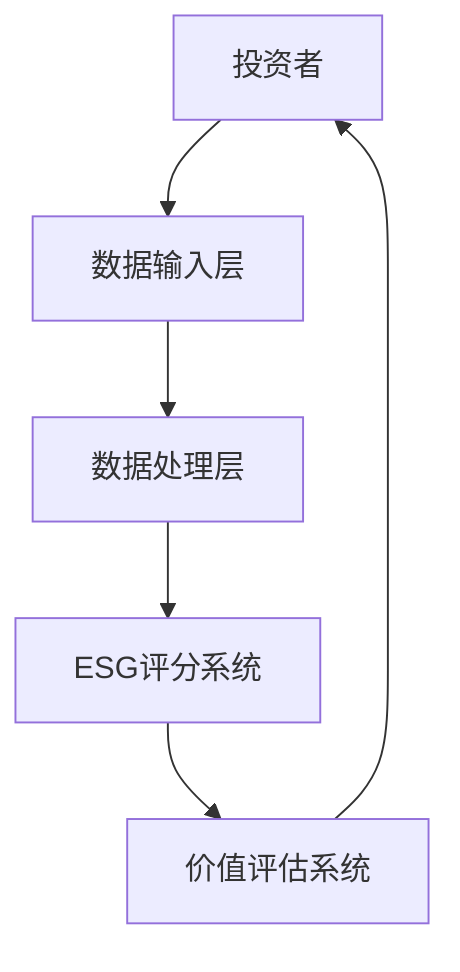

                 


# 杰里米·格兰瑟姆的ESG价值投资整合

> 关键词：杰里米·格兰瑟姆, ESG投资, 价值投资, 企业价值评估, 可持续投资

> 摘要：本文深入探讨了杰里米·格兰瑟姆的价值投资理论与ESG（环境、社会、治理）投资理念的整合。通过分析ESG因素对企业价值的影响，结合格兰瑟姆的安全边际理论，构建了一个基于ESG的多维度企业价值评估模型。文章从理论基础、算法原理、系统架构到实际应用，详细阐述了ESG价值投资整合的全过程，为投资者提供了新的思路和方法。

---

## 目录

1. [背景介绍](#背景介绍)
   - 1.1 核心概念术语说明
   - 1.2 问题背景与问题描述
   - 1.3 问题解决思路
   - 1.4 界定与外延
   - 1.5 核心概念结构与组成

2. [核心概念与联系](#核心概念与联系)
   - 2.1 核心概念原理
   - 2.2 核心概念属性对比
   - 2.3 实体关系图

3. [算法原理讲解](#算法原理讲解)
   - 3.1 算法流程图
   - 3.2 核心算法代码
   - 3.3 数学模型与公式
   - 3.4 举例说明

4. [系统分析与架构设计](#系统分析与架构设计)
   - 4.1 项目背景与目标
   - 4.2 系统功能设计
   - 4.3 系统架构图
   - 4.4 系统接口设计
   - 4.5 系统交互流程图

5. [项目实战](#项目实战)
   - 5.1 环境与工具安装
   - 5.2 核心代码实现
   - 5.3 代码解读与分析
   - 5.4 实际案例分析

6. [最佳实践与小结](#最佳实践与小结)
   - 6.1 实践经验总结
   - 6.2 注意事项
   - 6.3 拓展阅读

---

## 1. 背景介绍

### 1.1 核心概念术语说明
- **ESG投资**：基于环境（Environmental）、社会（Social）和治理（Governance）三个维度对企业进行投资决策的方法。
- **价值投资**：以企业内在价值为核心，通过分析企业的基本面因素进行投资的策略。
- **杰里米·格兰瑟姆**：价值投资理论的重要代表人物，强调安全边际和长期价值。

### 1.2 问题背景与问题描述
随着全球对可持续发展的关注增加，ESG投资逐渐成为主流。然而，传统的价值投资方法更多关注财务指标，忽视了企业的社会责任和治理结构。如何将ESG因素整合到价值投资模型中，成为当前投资领域的重要课题。

### 1.3 问题解决思路
通过分析ESG因素对企业价值的影响，构建一个多维度的企业价值评估模型，将ESG与财务指标相结合，提升投资决策的科学性和可持续性。

### 1.4 界定与外延
本文的研究范围限定在将ESG因素整合到杰里米·格兰瑟姆的价值投资模型中，重点关注企业内在价值的评估方法。外延部分包括ESG数据的获取与处理、模型的应用场景等。

### 1.5 核心概念结构与组成
- **环境因素**：碳排放、能源使用效率。
- **社会因素**：员工权益、社会责任。
- **治理因素**：董事会结构、高管薪酬。

---

## 2. 核心概念与联系

### 2.1 核心概念原理
ESG因素通过影响企业的运营成本、社会声誉和治理效率，最终影响企业的长期价值。

### 2.2 核心概念属性对比

| 因素维度 | 环境（Environmental） | 社会（Social） | 治理（Governance） |
|----------|---------------------|---------------|-------------------|
| 示例指标 | 碳排放、能源使用效率 | 员工权益、社会责任 | 董事会结构、高管薪酬 |
| 影响方面 | 影响企业成本和环境风险 | 影响企业声誉和员工稳定性 | 影响企业治理效率和决策质量 |

### 2.3 实体关系图


---

## 3. 算法原理讲解

### 3.1 算法流程图


### 3.2 核心算法代码
```python
def calculate_esg_score(environment_score, social_score, governance_score):
    # 环境、社会、治理评分的权重
    weights = {'environment': 0.4, 'social': 0.3, 'governance': 0.3}
    # 计算加权总分
    total_score = environment_score * weights['environment'] + \
                   social_score * weights['social'] + \
                   governance_score * weights['governance']
    return total_score

# 示例数据
environment_score = 0.8
social_score = 0.7
governance_score = 0.6

esg_score = calculate_esg_score(environment_score, social_score, governance_score)
print(f"ESG综合评分：{esg_score}")
```

### 3.3 数学模型与公式
企业价值评估公式：
$$ V = \frac{E}{k} $$
其中，$E$是企业的预期收益，$k$是折现率。结合ESG因素后，调整折现率：
$$ k_{adjusted} = k + \alpha \times (1 - ESG\_score) $$
其中，$\alpha$是调整系数。

### 3.4 举例说明
假设某企业财务指标显示其价值为100亿元，但ESG评分为0.7，调整系数$\alpha=0.1$，则调整后的折现率为：
$$ k_{adjusted} = k + 0.1 \times (1 - 0.7) = k + 0.03 $$
最终价值评估为：
$$ V_{adjusted} = \frac{100}{k + 0.03} $$

---

## 4. 系统分析与架构设计

### 4.1 项目背景与目标
开发一个基于ESG的价值投资系统，帮助投资者快速评估企业的长期价值。

### 4.2 系统功能设计


### 4.3 系统架构图


### 4.4 系统接口设计
- **输入接口**：接收企业数据。
- **输出接口**：提供ESG评分和价值评估结果。
- **内部接口**：ESG评分系统与价值评估系统的交互。

### 4.5 系统交互流程图


---

## 5. 项目实战

### 5.1 环境与工具安装
安装Python和相关库：
```bash
pip install numpy pandas scikit-learn
```

### 5.2 核心代码实现
```python
import pandas as pd
from sklearn.linear_model import LinearRegression

# 示例数据
data = {
    '环境因素': [0.8, 0.7, 0.6],
    '社会因素': [0.7, 0.6, 0.5],
    '治理因素': [0.6, 0.5, 0.4]
}

df = pd.DataFrame(data)

# 训练模型
model = LinearRegression()
model.fit(df[['环境因素', '社会因素', '治理因素']], df['企业价值'])

# 预测新企业价值
new_data = pd.DataFrame({
    '环境因素': [0.75],
    '社会因素': [0.65],
    '治理因素': [0.55]
})

predicted_value = model.predict(new_data)
print(f"预测企业价值：{predicted_value[0]}")
```

### 5.3 代码解读与分析
- 使用线性回归模型预测企业价值。
- 输入ESG因素，输出预测结果。

### 5.4 实际案例分析
以某企业为例，输入其ESG评分，预测其企业价值。

---

## 6. 最佳实践与小结

### 6.1 实践经验总结
- ESG因素与企业价值密切相关。
- 综合考虑多维度因素，提升投资决策的科学性。

### 6.2 注意事项
- 数据来源的可靠性。
- 模型的适用性和可解释性。

### 6.3 拓展阅读
- 推荐阅读杰里米·格兰瑟姆的《价值投资入门》。
- 关注ESG投资领域的最新研究。

---

## 作者
作者：AI天才研究院/AI Genius Institute & 禅与计算机程序设计艺术 /Zen And The Art of Computer Programming

