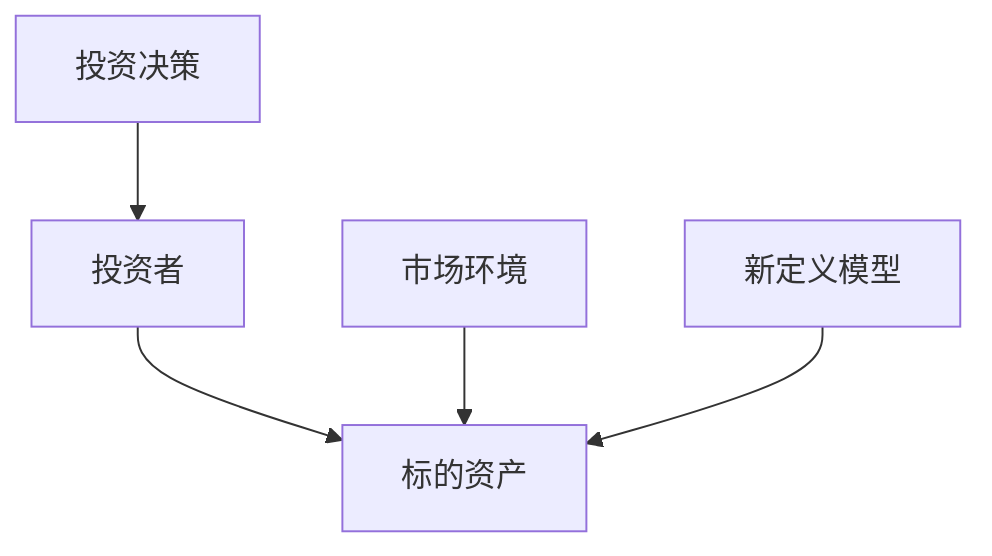
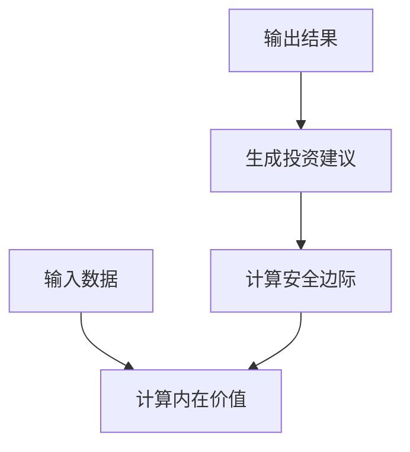
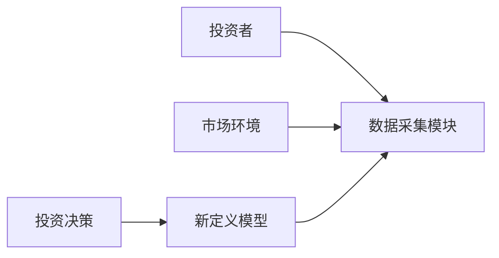

                 


# 杰里米·格兰瑟姆的价值投资新定义

> 关键词：价值投资，杰里米·格兰瑟姆，投资策略，数学模型，系统架构

> 摘要：本文探讨了杰里米·格兰瑟姆提出的价值投资新定义，分析其核心概念、数学模型、算法策略，并结合实际案例进行详细解读。通过系统架构设计和项目实战，展示新定义在实际投资中的应用，最后总结其优点和注意事项。

---

## 第一部分: 价值投资的背景与发展

### 第1章: 价值投资的起源与传统定义

#### 1.1 价值投资的起源
价值投资是一种以基本面分析为基础的投资策略，起源于20世纪初。本章将介绍价值投资的起源及其在投资领域中的重要性。

- **1.1.1 投资学的基本概念**
  - 投资的本质是通过购买资产以获得未来收益。
  - 资产包括股票、债券、房地产等多种形式。
  - 投资学的基本目标是通过分析资产的内在价值，做出明智的投资决策。

- **1.1.2 价值投资的定义与特点**
  - 价值投资是由本杰明·格雷厄姆和戴维·多德提出的。
  - 核心理念是寻找市场价格低于内在价值的资产。
  - 强调安全边际和长期持有。

- **1.1.3 价值投资的历史发展**
  - 从早期的“烟蒂股”策略到现代的多样化投资。
  - 价值投资在不同经济周期中的表现。

#### 1.2 传统价值投资的核心理念
- **1.2.1 格雷厄姆与多德的价值投资理论**
  - 格雷厄姆的“安全边际”概念。
  - 多德的增长股理论。

- **1.2.2 投资的三重安全边际**
  - 价格安全边际：市场价格低于内在价值。
  - 基本面安全边际：公司财务状况稳健。
  - 市场周期安全边际：选择低估资产在熊市中买入。

- **1.2.3 价值投资的长期视角**
  - 长期持有优质资产，避免短期波动。
  - 通过分散投资降低风险。

#### 1.3 价值投资的边界与外延
- **1.3.1 价值投资的适用范围**
  - 主要适用于股票投资。
  - 可扩展至房地产和其他资产类别。

- **1.3.2 价值投资与其他投资策略的区别**
  - 与成长型投资的区别。
  - 与指数投资的区别。

- **1.3.3 价值投资的核心要素**
  - 内在价值评估。
  - 安全边际。
  - 长期视角。

### 第2章: 杰里米·格兰瑟姆的价值投资新定义

#### 2.1 格兰瑟姆价值投资理论的核心概念
- **2.1.1 格兰瑟姆对传统价值投资的反思**
  - 传统价值投资的局限性。
  - 现代市场环境的变化。

- **2.1.2 新定义的核心要素**
  - 综合考虑市盈率、市净率和现金流等指标。
  - 结合成长性和稳定性。

- **2.1.3 新定义与传统定义的对比**
  - 传统定义更注重价格与价值的偏离。
  - 新定义更注重动态评估和市场环境适应性。

#### 2.2 格兰瑟姆新定义的特征分析
- **2.2.1 新定义的属性特征**
  - 动态调整：根据市场变化不断优化评估。
  - 综合性：结合多个财务指标。
  - 灵活性：适用于不同市场环境。

- **2.2.2 新定义的数学模型**
  - 内在价值公式：$$ V = \frac{E}{P} \times (1 + g) $$
    - \( V \)：内在价值
    - \( E \)：预期收益
    - \( P \)：市场价格
    - \( g \)：增长率

- **2.2.3 新定义的案例分析**
  - 案例1：低市盈率股票的投资机会。
  - 案例2：高增长企业的估值调整。

#### 2.3 格兰瑟姆新定义的ER实体关系图


### 第3章: 格兰瑟姆新定义的数学模型与公式

#### 3.1 格兰瑟姆新定义的数学模型
$$ V = \frac{E}{P} \times (1 + g) $$
其中：
- \( V \) 表示内在价值
- \( E \) 表示企业盈利
- \( P \) 表示市场价格
- \( g \) 表示增长率

#### 3.2 格兰瑟姆新定义的公式推导
$$ \text{内在价值} = \frac{\text{预期收益}}{\text{折现率}} $$
$$ \text{预期收益} = \text{当前收益} \times (1 + \text{增长率}) $$

#### 3.3 格兰瑟姆新定义的案例分析
- 案例1：低市盈率股票的投资机会
  - 假设一只股票的市盈率为15，预期收益增长率为10%。
  - 内在价值计算：$$ V = \frac{100 \times (1 + 0.1)}{15} = 7.33 $$

### 第4章: 格兰瑟姆新定义的投资策略与算法

#### 4.1 格兰瑟姆新定义的投资策略
- **4.1.1 三重过滤法**
  - 第一重：价格低于内在价值。
  - 第二重：财务状况稳健。
  - 第三重：行业前景良好。

- **4.1.2 市场择时策略**
  - 利用市场周期进行择时。
  - 在市场低估时买入，在高估时卖出。

- **4.1.3 风险控制机制**
  - 设置止损点。
  - 分散投资以降低风险。

#### 4.2 格兰瑟姆新定义的算法实现


#### 4.3 格兰瑟姆新定义的Python实现
```python
def calculate_intrinsic_value(revenue, growth_rate, discount_rate):
    return (revenue * (1 + growth_rate)) / discount_rate
```

### 第5章: 格兰瑟姆新定义的系统架构设计

#### 5.1 投资系统功能设计
- **5.1.1 领域模型设计**
  ```mermaid
  classDiagram
  class 投资者
  class 标的资产
  class 市场环境
  class 新定义模型
  class 投资决策
  ```

- **5.1.2 功能模块划分**
  - 数据采集模块：收集市场数据。
  - 评估模块：计算内在价值。
  - 决策模块：生成投资建议。

#### 5.2 系统架构设计


#### 5.3 系统接口设计
- API接口：
  - GET /market-data：获取市场数据。
  - POST /calculate-intrinsic-value：计算内在价值。

#### 5.4 系统交互设计
```mermaid
sequenceDiagram
参与者：投资者
系统：投资系统
参与者 -> 系统：请求市场数据
系统 -> 参与者：返回市场数据
参与者 -> 系统：计算内在价值
系统 -> 参与者：返回内在价值
```

### 第6章: 项目实战与案例分析

#### 6.1 项目环境安装
- 安装Python和必要的库（如Pandas、NumPy）。
- 安装Jupyter Notebook用于数据分析。

#### 6.2 核心代码实现
```python
import pandas as pd
import numpy as np

def calculate_intrinsic_value(revenue, growth_rate, discount_rate):
    return (revenue * (1 + growth_rate)) / discount_rate

# 示例数据
data = {
    'Revenue': [100, 200, 300],
    'Growth Rate': [0.1, 0.15, 0.2],
    'Discount Rate': [0.05, 0.06, 0.07]
}

df = pd.DataFrame(data)
df['Intrinsic Value'] = df.apply(lambda x: calculate_intrinsic_value(x['Revenue'], x['Growth Rate'], x['Discount Rate']), axis=1)
print(df)
```

#### 6.3 案例分析
- 分析一只股票的内在价值，比较市场价格与内在价值的关系。
- 根据模型生成投资建议。

#### 6.4 项目总结
- 总结新定义在实际投资中的应用效果。
- 分析可能遇到的问题及解决方案。

### 第7章: 最佳实践与注意事项

#### 7.1 最佳实践
- 定期更新模型参数。
- 结合市场环境动态调整策略。
- 多元化投资以分散风险。

#### 7.2 小结
- 格兰瑟姆的新定义是对传统价值投资的重要改进。
- 新定义在实际应用中表现出色，值得投资者关注。

#### 7.3 注意事项
- 模型的有效性依赖于数据质量。
- 市场环境变化可能影响模型效果。
- 需要结合其他投资策略进行综合判断。

#### 7.4 拓展阅读
- 推荐阅读格兰瑟姆的著作，深入理解新定义的细节。
- 关注最新的投资理论和实践。

## 作者：AI天才研究院 & 禅与计算机程序设计艺术

