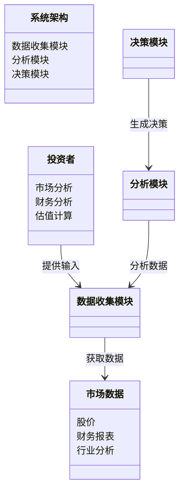
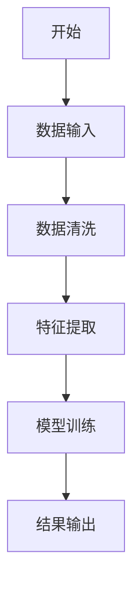

                 

# 杰里米·格兰瑟姆的价值投资新思维

> **关键词**：价值投资、投资新思维、数学模型、系统架构、风险管理

> **摘要**：本文深入探讨了杰里米·格兰瑟姆的价值投资新思维，从背景、核心概念、数学模型、系统架构到项目实战，全面分析了其方法论的创新与应用。文章通过详细的分析和推理，展示了如何将价值投资的理念系统化，并结合实际案例进行详细解读，为读者提供了一种全新的投资视角。

---

## 第1章: 价值投资的背景与核心概念

### 1.1 价值投资的历史演变

#### 1.1.1 价值投资的起源与发展

价值投资是一种以基本面分析为基础的投资策略，起源于20世纪初。其核心思想是通过分析企业的内在价值，寻找市场估值低于内在价值的投资标的。这一理念最早由本杰明·格雷厄姆提出，并在其经典著作《证券分析》中得到系统阐述。

格兰瑟姆作为格雷厄姆的学生，继承并发展了价值投资的理论。他将价值投资的理念进一步系统化，并提出了更为精细的数学模型和投资策略。

#### 1.1.2 格兰瑟姆在价值投资中的地位

杰里米·格兰瑟姆（Jeremy Grantham）是价值投资领域的领军人物，他是格雷厄姆-多德投资理念的忠实继承者。他在《机构投资者》杂志上发表了大量关于价值投资的论文，提出了许多创新性的投资策略，尤其是在周期性分析和市场估值方面具有深远影响。

#### 1.1.3 价值投资的核心理念与原则

价值投资的核心理念是：市场先生是不理性的。投资者可以通过分析企业的基本面，找到那些市场价格低于内在价值的股票进行投资，长期持有，等待市场重新认识其价值。

价值投资的原则包括：
1. 以合理的价格买入优质的资产。
2. 长期持有，避免频繁交易。
3. 避免情绪化决策，坚持基本面分析。

---

### 1.2 价值投资的核心概念

#### 1.2.1 价值投资的定义与特征

价值投资是一种以企业内在价值为核心的投资策略。其特征包括：
- 以基本面分析为基础。
- 寻找市场价格低于内在价值的投资标的。
- 长期持有，注重安全边际。

#### 1.2.2 核心概念对比分析

以下是传统价值投资与格兰瑟姆新思维的核心概念对比：

| **对比维度** | **传统价值投资** | **格兰瑟姆新思维** |
|--------------|-------------------|---------------------|
| 核心理念     | 内在价值         | 市场估值与周期性   |
| 分析方法     | 财务报表分析     | 市场周期分析       |
| 投资策略     | 购买低估资产     | 周期性低点投资     |

#### 1.2.3 价值投资的边界与外延

价值投资的边界在于其对市场的假设，即市场价格与内在价值之间的差异是可以通过分析发现的。其外延则包括对行业、企业生命周期、宏观经济环境等多个维度的综合分析。

---

### 1.3 价值投资的数学模型与公式

#### 1.3.1 价值评估的数学模型

格兰瑟姆提出了一个简化的企业内在价值计算公式：

$$
V = \frac{E}{P}
$$

其中：
- $V$ 表示企业内在价值。
- $E$ 表示企业未来现金流的现值。
- $P$ 表示市场价格。

#### 1.3.2 安全边际的计算公式

安全边际是价值投资中一个重要的概念，它表示市场价格与内在价值之间的差异：

$$
Margin\ of\ Safety = V - P
$$

当 $Margin\ of\ Safety$ 为正时，意味着市场价格低于内在价值，适合买入。

#### 1.3.3 现金流折现模型

现金流折现模型（DCF）是计算企业内在价值的重要工具：

$$
DCF = \sum_{t=1}^{n} \frac{CF_t}{(1+r)^t}
$$

其中：
- $CF_t$ 表示第 $t$ 年的现金流。
- $r$ 表示折现率。
- $n$ 表示预测的年数。

---

### 1.4 价值投资的系统架构设计

#### 1.4.1 系统功能设计

以下是价值投资系统的功能模块设计：

---

## 第2章: 格兰瑟姆的价值投资新思维

### 2.1 格兰瑟姆投资理念的创新

#### 2.1.1 新思维的核心要素

格兰瑟姆的价值投资新思维主要体现在以下几个方面：
1. **市场周期性分析**：他认为市场具有周期性，可以通过分析市场周期来判断投资机会。
2. **估值模型的改进**：提出了更为精细的估值方法，结合市场情绪和行业特点进行调整。
3. **风险管理**：引入了风险管理的概念，强调在市场周期性波动中保护资本。

#### 2.1.2 新思维与传统价值投资的对比

以下是新思维与传统价值投资的对比：

| **对比维度** | **传统价值投资** | **格兰瑟姆新思维** |
|--------------|-------------------|---------------------|
| 核心理念     | 内在价值         | 市场估值与周期性   |
| 分析方法     | 财务报表分析     | 市场周期分析       |
| 投资策略     | 购买低估资产     | 周期性低点投资     |
| 风险管理     | 无                | 强调风险管理       |

---

### 2.2 新思维的投资策略

#### 2.2.1 基于市场的动态调整

格兰瑟姆的新思维强调动态调整投资策略，根据市场周期的变化进行仓位调整。以下是具体的策略：

1. **市场周期分析**：通过分析市场周期，判断当前市场所处的阶段（牛市、熊市、震荡市）。
2. **仓位调整**：在牛市中增加仓位，在熊市中减少仓位。

#### 2.2.2 风险管理与组合优化

新思维中，风险管理是投资策略的重要组成部分。以下是风险管理的步骤：

1. **风险评估**：通过波动率、相关性等指标评估投资组合的风险。
2. **组合优化**：通过调整资产配置降低整体风险。

---

### 2.3 新思维的数学模型与算法

#### 2.3.1 算法原理

以下是格兰瑟姆新思维的核心算法：

---

## 第3章: 价值投资的系统化方法

### 3.1 系统化投资的流程

#### 3.1.1 数据收集与处理

以下是数据收集与处理的步骤：

1. **数据来源**：获取市场数据（如股价、财务报表）。
2. **数据清洗**：去除异常数据，填补缺失值。
3. **特征提取**：提取有用特征（如市盈率、市净率）。

#### 3.1.2 模型训练与验证

1. **模型训练**：使用历史数据训练价值评估模型。
2. **模型验证**：通过回测验证模型的有效性。

---

## 第4章: 项目实战

### 4.1 环境配置与代码实现

以下是项目实战的环境配置与代码实现：

1. **环境配置**：安装Python、Pandas、NumPy等库。
2. **代码实现**：编写价值评估模型的代码。

---

## 第5章: 风险管理与总结

### 5.1 风险管理

1. **风险评估**：通过波动率、相关性等指标评估投资组合的风险。
2. **组合优化**：通过调整资产配置降低整体风险。

### 5.2 总结

杰里米·格兰瑟姆的价值投资新思维为投资者提供了一种全新的投资视角。通过结合市场周期性分析和风险管理，投资者可以在复杂多变的市场环境中更好地实现财富增长。

---

## 第6章: 未来展望

### 6.1 未来投资趋势

随着人工智能和大数据技术的发展，价值投资将更加系统化和智能化。投资者可以利用这些技术手段，进一步提高投资决策的效率和准确性。

---

## 附录: 推荐阅读

1. 《证券分析》——本杰明·格雷厄姆
2. 《机构投资者》杂志上的相关文章

---

**作者：AI天才研究院/AI Genius Institute & 禅与计算机程序设计艺术 /Zen And The Art of Computer Programming**

