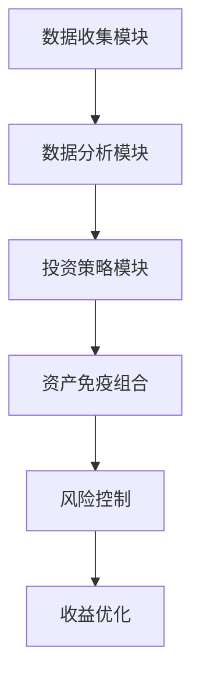
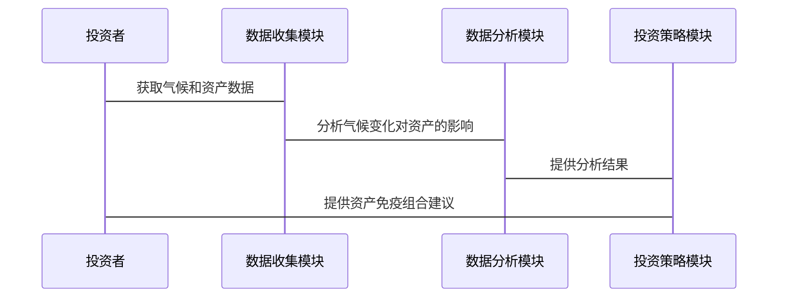

                 


# 杰里米·格兰瑟姆的气候变化投资影响

> 关键词：气候变化，投资影响，杰里米·格兰瑟姆，风险管理，ESG因素，碳中和目标，资产免疫

> 摘要：本文深入探讨杰里米·格兰瑟姆在气候变化投资影响领域的研究，分析气候变化对全球经济和投资的影响，介绍其核心理论、数学模型、系统架构及实际案例。文章详细讲解了如何量化气候风险，构建气候免疫投资组合，并通过算法和系统设计实现风险控制和收益优化。

---

## 第一部分: 气候变化投资影响的背景与核心概念

### 第1章: 气候变化与投资影响概述

#### 1.1 气候变化的现状与挑战

##### 1.1.1 气候变化的定义与特征

气候变化是指地球气候系统长期的变化，主要由人类活动（如化石燃料使用、森林砍伐）和自然因素（如火山活动、太阳辐射）引起。其特征包括全球变暖、极端天气频发和生态系统破坏。

##### 1.1.2 气候变化对全球经济的影响

气候变化导致自然灾害增加、资源短缺和经济不稳定。例如，极端天气可能导致农业减产、基础设施损毁，进而影响GDP和企业盈利。

##### 1.1.3 投资领域中的气候变化问题

投资者需考虑气候变化带来的物理风险（如资产损失）、转型风险（如政策变化）和声誉风险（如ESG评分下降）。这些风险可能影响企业盈利和股价。

#### 1.2 杰里米·格兰瑟姆的背景与研究方法

##### 1.2.1 杰里米·格兰瑟姆的学术与实践背景

杰里米·格兰瑟姆是可持续投资领域的权威，专注于气候变化对投资的影响。他的研究结合了环境科学和金融学，提出了一系列创新模型。

##### 1.2.2 格兰瑟姆研究方法的核心理念

格兰瑟姆的研究强调将环境、社会和治理（ESG）因素纳入投资决策，特别是气候变化的量化分析。他提出通过情景分析和蒙特卡洛模拟来评估气候风险。

##### 1.2.3 格兰瑟姆气候变化投资模型的框架

格兰瑟姆模型将气候变化因素与资产定价模型（如CAPM）结合，评估气候风险对资产回报的影响。模型包括气候情景分析、资产敏感性评估和风险调整收益预测。

#### 1.3 气候变化对投资影响的核心问题

##### 1.3.1 气候风险的定义与分类

气候风险分为物理风险（如洪水）、转型风险（如政策变化）和法律风险（如诉讼）。这些风险可能影响企业的运营和财务状况。

##### 1.3.2 气候变化对资产价格的影响

气候变化可能导致资产价值重估。例如，高碳排放企业的估值可能下降，而可再生能源企业的估值可能上升。

##### 1.3.3 投资者如何应对气候变化挑战

投资者应采用ESG投资策略，分散投资组合中的气候风险，并关注政策变化。此外，使用气候模型预测资产表现，制定长期投资策略。

---

## 第2章: 气候变化与投资影响的核心概念

### 2.1 气候变化对投资影响的理论框架

#### 2.1.1 环境、社会和治理（ESG）因素

ESG因素包括环境（如碳排放）、社会（如劳工权益）和治理（如公司治理）指标。这些因素影响企业的长期表现，是投资决策的重要参考。

#### 2.1.2 碳中和目标与投资策略

碳中和目标要求企业在2050年前实现零排放。投资者应选择符合碳中和目标的企业，避免投资高碳排放行业。

#### 2.1.3 气候风险的量化模型

格兰瑟姆模型通过量化气候风险，评估其对资产价格的影响。模型包括气候情景分析、资产敏感性评估和风险调整收益预测。

### 2.2 格兰瑟姆气候变化投资影响模型

#### 2.2.1 模型的核心假设

- 气候变化对资产收益的影响可量化。
- 投资者可通过调整投资组合分散气候风险。
- 政策变化对资产价格有显著影响。

#### 2.2.2 模型的输入变量与输出结果

输入变量包括温度变化、政策变化、企业碳排放等。输出结果为资产在不同气候情景下的表现。

#### 2.2.3 模型的验证与优化

通过历史数据验证模型，并根据最新气候数据优化模型参数。

### 2.3 气候变化与投资影响的系统性分析

#### 2.3.1 系统性风险的定义与特征

系统性风险影响整个金融系统，如市场崩盘。气候变化可能引发系统性风险，导致资产价格大幅波动。

#### 2.3.2 气候变化对金融系统的冲击

气候变化可能导致金融市场的流动性风险和信用风险。例如，极端天气可能引发企业违约，影响金融系统的稳定性。

#### 2.3.3 投资者如何构建气候风险免疫组合

投资者应分散投资组合中的气候风险，选择抗气候风险能力强的资产，如可再生能源和绿色科技企业。

---

## 第三部分: 气候变化投资影响的算法与数学模型

---

## 第三部分: 气候变化投资影响的算法与数学模型

## 第3章: 气候变化风险的量化与建模

### 3.1 气候变化风险的量化方法

#### 3.1.1 气候情景分析法

气候情景分析法通过模拟不同气候情景，评估其对资产的影响。例如，模拟全球变暖2°C和4°C的情况，分析对企业盈利的影响。

#### 3.1.2 蒙特卡洛模拟在气候变化风险中的应用

蒙特卡洛模拟用于量化气候风险的不确定性。通过多次模拟，评估资产在不同气候情景下的表现。

#### 3.1.3 气候变化对资产收益分布的影响

气候变化可能改变资产收益的分布，增加极端值的概率。例如，极端天气可能导致资产收益出现极端波动。

### 3.2 气候变化影响的数学模型

#### 3.2.1 线性回归模型在气候变化风险中的应用

线性回归模型用于分析气候变化与资产收益的关系。例如，建立气温变化与企业盈利的回归模型，预测气候风险对收益的影响。

#### 3.2.2 时间序列分析在气候变化预测中的应用

时间序列分析用于预测气候变化趋势。例如，使用ARIMA模型预测未来气温变化。

#### 3.2.3 马尔可夫链模型在气候变化状态转移中的应用

马尔可夫链模型用于分析气候变化的状态转移。例如，分析气候系统从稳定状态到极端状态的转移概率。

---

## 第4章: 气候变化投资影响的算法实现

### 4.1 气候变化影响的算法选择

根据具体问题选择合适的算法，例如使用蒙特卡洛模拟量化气候风险，或使用时间序列分析预测气候变化趋势。

### 4.2 气候变化风险的量化与建模

#### 4.2.1 基于Python的气候变化风险量化代码示例

```python
import numpy as np
import pandas as pd

# 假设我们有一个包含气温数据和资产收益的数据集
data = pd.DataFrame({
    'temperature': np.random.uniform(15, 30, 1000),
    'returns': np.random.normal(0, 0.1, 1000)
})

# 使用线性回归模型分析气温对资产收益的影响
from sklearn.linear_model import LinearRegression
model = LinearRegression()
model.fit(data[['temperature']], data['returns'])

# 模型系数
print('回归系数:', model.coef_[0])
print('截距:', model.intercept_)

# 预测气温变化对资产收益的影响
new_temp = np.array([[25]])  # 假设气温为25
predicted_returns = model.predict(new_temp)
print('预测收益:', predicted_returns[0])
```

#### 4.2.2 算法实现的详细步骤

1. 数据收集：收集气温数据和资产收益数据。
2. 数据预处理：标准化数据，处理缺失值。
3. 模型选择：选择线性回归模型或蒙特卡洛模拟。
4. 模型训练：使用数据训练模型。
5. 模型验证：使用测试数据验证模型的准确性。
6. 模型应用：使用模型预测气温变化对资产收益的影响。

---

## 第5章: 气候变化投资影响的系统架构设计

### 5.1 系统架构设计概述

设计一个气候变化投资影响分析系统，包括数据收集、分析模块和投资策略模块。

### 5.2 系统功能设计

#### 5.2.1 数据收集模块

从可靠的气候数据源（如世界气象组织）获取气温数据，从金融数据源（如彭博社）获取资产收益数据。

#### 5.2.2 数据分析模块

使用统计分析和机器学习算法量化气候变化对资产收益的影响。

#### 5.2.3 投资策略模块

根据分析结果制定投资策略，如分散投资组合中的气候风险。

### 5.3 系统架构设计



### 5.4 系统交互设计

使用序列图展示系统交互过程：



---

## 第6章: 项目实战

### 6.1 项目介绍

构建一个基于Python的气候变化投资影响分析系统，帮助投资者制定气候免疫投资策略。

### 6.2 项目环境配置

安装必要的Python库，如NumPy、Pandas、Scikit-learn和Matplotlib。

### 6.3 核心实现代码

```python
import numpy as np
import pandas as pd
from sklearn.linear_model import LinearRegression
import matplotlib.pyplot as plt

# 数据收集与预处理
data = pd.DataFrame({
    'temperature': np.random.uniform(15, 30, 1000),
    'returns': np.random.normal(0, 0.1, 1000)
})

# 数据可视化
plt.scatter(data['temperature'], data['returns'])
plt.xlabel('Temperature')
plt.ylabel('Returns')
plt.title('Temperature vs Returns Scatter Plot')
plt.show()

# 线性回归模型训练
model = LinearRegression()
model.fit(data[['temperature']], data['returns'])

# 模型可视化
plt.plot(data['temperature'], model.predict(data[['temperature']], color='blue')
plt.scatter(data['temperature'], data['returns'], color='red')
plt.xlabel('Temperature')
plt.ylabel('Predicted Returns')
plt.title('Linear Regression Model Visualization')
plt.show()

# 模型评估
print('回归系数:', model.coef_[0])
print('截距:', model.intercept_)
```

### 6.4 项目结果分析

分析回归模型的结果，理解气温变化对资产收益的影响，制定相应的投资策略。

### 6.5 项目优化与改进

根据分析结果优化模型，如引入更多的气候变量，提高模型的准确性。

---

## 第7章: 总结与展望

### 7.1 全文总结

本文详细介绍了杰里米·格兰瑟姆的气候变化投资影响研究，分析了气候变化对全球经济和投资的影响，提出了系统的解决方案。

### 7.2 未来研究方向

未来的研究可以关注动态气候风险模型和区域化投资策略，以应对气候变化的复杂性。

---

## 作者：AI天才研究院 & 禅与计算机程序设计艺术

---

以上是《杰里米·格兰瑟姆的气候变化投资影响》的完整内容，涵盖了背景、理论、算法、系统设计和项目实战。

