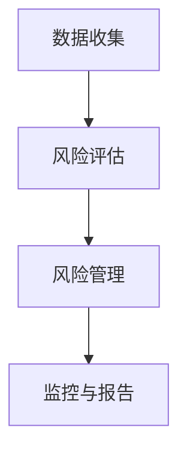
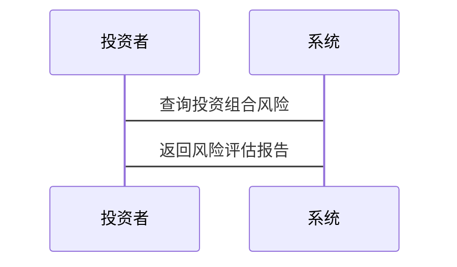
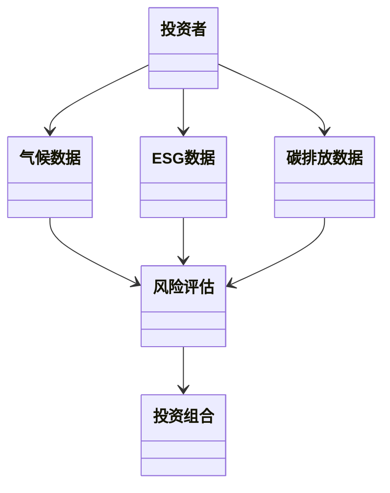
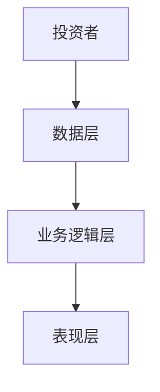
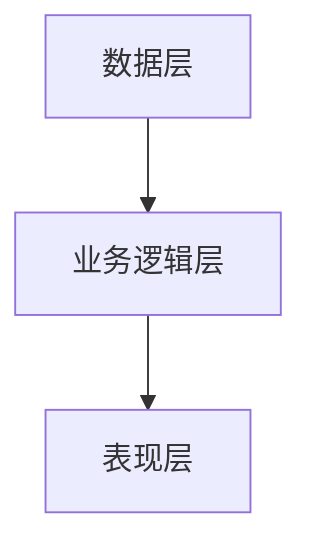

                 


---

# 杰里米·格兰瑟姆的气候变化投资策略

> **关键词**：杰里米·格兰瑟姆，气候变化，投资策略，ESG，风险管理，碳定价，绿色金融

> **摘要**：  
本文深入分析了杰里米·格兰瑟姆的气候变化投资策略，探讨了其核心概念、数学模型、系统架构和实战案例。文章从背景介绍、策略概述、投资工具、风险管理、系统设计、项目实战等多维度展开，结合技术语言和专业术语，详细阐述了如何将气候变化因素融入投资决策，以实现可持续的财务回报。通过本文，读者将能够理解如何利用ESG投资、碳定价等工具，构建抗风险能力强、符合可持续发展理念的投资组合。

---

# 第1章: 气候变化的现状与影响

## 1.1 气候变化的现状分析

### 1.1.1 全球气候变化的现状
全球气候变化正在以惊人的速度加剧。根据联合国政府间气候变化专门委员会（IPCC）的报告，全球气温在过去100年上升了约1.1°C，且升温速度在加快。北极海冰面积持续减少，极端天气事件频发，如热浪、洪水和飓风等。

### 1.1.2 气候变化对经济的影响
气候变化对全球经济的影响是深远的。根据世界银行的估计，如果不采取有效措施，到2100年，全球GDP可能损失5%至10%。气候变化导致的自然灾害、资源短缺和供应链中断，将对企业盈利和资产价值造成重大影响。

### 1.1.3 气候变化对投资的影响
气候变化不仅影响实体经济，也对金融市场产生深远影响。越来越多的投资者意识到，气候变化带来的风险和机会正在重塑投资格局。例如，高碳行业的企业可能面临政策风险和市场风险，而低碳行业则可能迎来增长机遇。

## 1.2 投资与气候变化的关系

### 1.2.1 投资与气候变化的基本概念
投资与气候变化的关系可以从以下几个方面理解：
- **物理风险**：气候变化导致的自然灾害可能破坏企业的资产和运营。
- **转型风险**：向低碳经济转型可能导致高碳行业资产价值下降。
- **机会风险**：气候变化也为新能源、绿色技术等领域提供了投资机会。

### 1.2.2 气候变化对投资决策的影响
投资者需要将气候变化因素纳入决策过程，以避免潜在风险并抓住机遇。例如，通过分析企业的碳排放数据、ESG（环境、社会、治理）评分和气候相关信息披露，投资者可以更好地评估企业的可持续性。

### 1.2.3 气候变化投资的机遇与挑战
气候变化投资的机遇主要体现在绿色能源、低碳技术和可持续发展领域。然而，这些领域的投资也面临技术不确定性、政策风险和市场波动等挑战。

## 1.3 杰里米·格兰瑟姆的背景介绍

### 1.3.1 杰里米·格兰瑟姆的个人背景
杰里米·格兰瑟姆（Jeremy Grantham）是英国著名的投资专家，创办了格兰瑟姆投资管理公司（Grantham, Mayo, van Onnik & Russell）。他是全球可持续投资领域的先驱，长期关注气候变化对投资的影响。

### 1.3.2 格兰瑟姆在投资领域的影响力
格兰瑟姆以其对长期投资趋势的洞察力而闻名。他强调基本面分析和风险管理，尤其是在应对气候变化等系统性风险方面，提出了许多创新性的投资策略。

### 1.3.3 格兰瑟姆与气候变化投资的关联
格兰瑟姆在其投资策略中，将气候变化视为一个关键的长期驱动力。他认为，气候变化不仅是一个环境问题，更是一个重大的投资机会和风险。

## 1.4 本章小结
本章介绍了气候变化的现状及其对全球经济和投资的影响，重点分析了杰里米·格兰瑟姆的背景及其在气候变化投资领域的影响力。气候变化不仅是环境问题，也是投资领域的核心议题。

---

# 第2章: 格兰瑟姆的气候变化投资策略

## 2.1 气候变化投资策略概述

### 2.1.1 气候变化投资的基本原则
格兰瑟姆的气候变化投资策略基于以下基本原则：
- **长期性**：气候变化的影响是长期的，投资需着眼于未来数十年的变化。
- **风险管理**：通过分散投资和严格的风险评估，降低气候变化带来的不确定性。
- **可持续性**：投资于那些能够适应气候变化并推动低碳转型的企业。

### 2.1.2 气候变化投资的核心要素
- **碳足迹分析**：评估企业温室气体排放量及其对气候变化的贡献。
- **ESG评分**：通过环境、社会和治理指标，评估企业的可持续性。
- **政策分析**：关注全球气候变化政策的变化，如《巴黎协定》的实施。

### 2.1.3 气候变化投资的长期性与可持续性
格兰瑟姆认为，气候变化投资需要长期视角，关注那些能够在未来气候框架下持续增长的企业和行业。

## 2.2 格兰瑟姆投资策略的核心观点

### 2.2.1 格兰瑟姆的投资理念
格兰瑟姆的投资理念可以总结为：
- **价值投资**：寻找被市场低估的企业。
- **长期视角**：关注长期趋势而非短期波动。
- **风险管理**：通过分散投资和严格筛选，降低风险。

### 2.2.2 格兰瑟姆对气候变化投资的独到见解
格兰瑟姆认为，气候变化不仅是一个环境问题，更是一个重大的投资机会。他强调，投资者需要将气候变化因素纳入投资决策，以避免潜在风险并抓住机遇。

### 2.2.3 格兰瑟姆策略的创新性与实用性
格兰瑟姆的策略在以下几个方面具有创新性：
- **将气候变化视为系统性风险**：他将气候变化视为影响全球经济和投资的主要因素。
- **结合ESG因素**：他在投资决策中引入ESG评分，以评估企业的可持续性。

## 2.3 格兰瑟姆策略与其他投资策略的对比

### 2.3.1 传统投资策略的局限性
传统投资策略往往忽视了气候变化的长期影响，导致在气候变化事件中可能面临更大的风险。

### 2.3.2 格兰瑟姆策略的独特性
格兰瑟姆策略的独特性在于其将气候变化视为系统性风险，并通过ESG评分和碳足迹分析，筛选出具有可持续性的企业。

### 2.3.3 不同策略在气候变化投资中的表现
研究表明，采用气候变化投资策略的基金在长期表现上优于传统基金，尤其是在应对气候变化相关风险方面表现更优。

## 2.4 格兰瑟姆策略的实施步骤

### 2.4.1 确定投资目标与范围
投资者需要明确投资目标，如追求长期收益、降低碳足迹等。

### 2.4.2 数据收集与分析
- **收集数据**：包括企业的碳排放数据、ESG评分、政策数据等。
- **分析数据**：通过数据分析，筛选出具有可持续性的企业。

### 2.4.3 投资组合的构建与优化
- **分散投资**：通过分散投资，降低单一资产的风险。
- **动态调整**：根据气候变化政策和市场变化，动态调整投资组合。

### 2.4.4 风险管理与调整
- **风险评估**：定期评估投资组合的气候风险。
- **压力测试**：模拟极端气候变化情景，评估投资组合的抗风险能力。

## 2.5 本章小结
本章详细介绍了格兰瑟姆的气候变化投资策略，包括其基本原则、核心观点、与其他策略的对比以及实施步骤。格兰瑟姆的策略以长期视角和风险管理为核心，结合ESG因素，为投资者提供了有效的投资框架。

---

# 第3章: 气候变化投资工具与方法

## 3.1 气候变化投资的主要工具

### 3.1.1 ESG投资
ESG投资是一种通过评估企业的环境、社会和治理表现，选择具有可持续性的企业进行投资的策略。

### 3.1.2 碳定价与碳交易
碳定价是通过设定碳排放的价格，激励企业减少碳排放。碳交易市场则是企业买卖碳配额的市场。

### 3.1.3 绿色债券与可持续发展债券
绿色债券是一种用于资助环保项目的债券，发行人将债券募集资金用于绿色项目。可持续发展债券则更广泛，包括支持社会和治理目标的项目。

### 3.1.4 气候风险评估工具
气候风险评估工具用于评估企业或投资组合面临的气候相关风险，包括物理风险和转型风险。

## 3.2 格兰瑟姆策略中的投资工具选择

### 3.2.1 工具选择的依据
格兰瑟姆在选择投资工具时，主要依据以下几个方面：
- **工具的有效性**：工具是否能够有效降低气候风险或抓住气候机会。
- **工具的可操作性**：工具是否易于实施和管理。
- **工具的成本效益**：工具的成本是否低于其带来的收益。

### 3.2.2 工具的优缺点分析
- **ESG投资**：优点是可以筛选出具有可持续性的企业，缺点是ESG数据的质量和一致性可能存在问题。
- **碳定价**：优点是可以激励企业减少碳排放，缺点是碳价格的波动性较大。
- **绿色债券**：优点是能够支持环保项目，缺点是项目的回报率可能较低。

### 3.2.3 工具的组合与搭配
格兰瑟姆策略强调多种工具的组合使用，以实现风险管理的目标。例如，可以结合ESG投资和碳定价，构建一个既有可持续性又具有成本效益的投资组合。

## 3.3 投资工具的数学模型与分析

### 3.3.1 投资组合优化的数学模型
投资组合优化的数学模型可以表示为：
$$
\min_w \left( w^T \Sigma w \right)
$$
其中，\( w \) 是投资组合权重向量，\( \Sigma \) 是资产之间的协方差矩阵。

### 3.3.2 碳定价的经济学模型
碳定价的经济学模型可以表示为：
$$
C = \alpha \cdot CO2 + \beta \cdot \text{政策变量} + \epsilon
$$
其中，\( C \) 是碳价格，\( \alpha \) 和 \( \beta \) 是回归系数，\( \epsilon \) 是误差项。

### 3.3.3 ESG评分的计算方法
ESG评分的计算方法通常包括以下几个步骤：
1. **数据收集**：收集企业的环境、社会和治理表现数据。
2. **数据清洗**：去除异常值和缺失值。
3. **评分计算**：通过加权计算，得出企业的ESG评分。

### 3.3.4 风险调整后的收益计算
风险调整后的收益可以通过夏普比率（Sharpe Ratio）来衡量：
$$
\text{夏普比率} = \frac{R_p - R_f}{\sigma_p}
$$
其中，\( R_p \) 是投资组合的收益，\( R_f \) 是无风险利率，\( \sigma_p \) 是投资组合的收益波动率。

## 3.4 工具的实际应用案例

### 3.4.1 碳交易市场的实际操作
例如，投资者可以通过购买碳配额，支持低碳企业的发展。这种操作不仅能够减少碳排放，还能够带来一定的投资收益。

### 3.4.2 ESG投资的典型项目分析
例如，投资者可以投资于那些在环境保护、社会责任和公司治理方面表现优异的企业，如可再生能源公司。

### 3.4.3 绿色债券的发行与投资
例如，政府或企业可以发行绿色债券，用于资助环保项目。投资者通过购买绿色债券，支持环保事业的同时获得投资回报。

## 3.5 本章小结
本章介绍了气候变化投资的主要工具，包括ESG投资、碳定价、绿色债券和气候风险评估工具。格兰瑟姆策略强调多种工具的组合使用，以实现风险管理的目标。

---

# 第4章: 气候变化投资的风险管理

## 4.1 气候变化投资的主要风险

### 4.1.1 物理风险
物理风险是指由于气候变化引起的自然灾害对企业或投资组合的破坏。例如，洪水、飓风等极端天气事件可能导致企业的资产损失。

### 4.1.2 转型风险
转型风险是指向低碳经济转型过程中，高碳行业资产价值下降的风险。例如，煤炭企业的资产可能因为政策变化而大幅贬值。

### 4.1.3 机会风险
机会风险是指在气候变化投资中，由于技术不确定性或市场波动，导致投资失败的风险。

## 4.2 格兰瑟姆策略中的风险管理方法

### 4.2.1 风险评估与量化
格兰瑟姆策略强调通过量化分析，评估投资组合面临的气候相关风险。例如，可以通过气候模型模拟极端气候情景，评估资产的潜在损失。

### 4.2.2 压力测试
压力测试是评估投资组合在极端气候情景下的表现。例如，可以通过模拟全球变暖4°C的情景，评估投资组合的抗风险能力。

### 4.2.3 风险对冲
风险对冲是通过投资于与气候变化风险负相关的资产，降低整体投资组合的风险。例如，可以通过投资于绿色债券对冲高碳资产的风险。

## 4.3 风险管理的系统架构

### 4.3.1 系统功能设计
- **数据收集模块**：收集气候相关数据，如碳排放数据、极端气候事件数据等。
- **风险评估模块**：评估投资组合面临的气候相关风险。
- **风险管理模块**：制定风险管理策略，如对冲、分散投资等。
- **监控与报告模块**：实时监控风险，并定期报告风险状况。

### 4.3.2 系统架构图
以下是一个简单的系统架构图：



### 4.3.3 系统接口设计
- **数据接口**：与气候数据源、企业ESG数据源等对接。
- **用户接口**：提供给投资者查询和管理投资组合风险的界面。

### 4.3.4 系统交互图
以下是一个系统交互图：



## 4.4 本章小结
本章介绍了气候变化投资的主要风险，包括物理风险、转型风险和机会风险。格兰瑟姆策略通过风险评估、压力测试和风险对冲等方法，有效管理了这些风险。

---

# 第5章: 气候变化投资的系统架构设计

## 5.1 系统功能设计

### 5.1.1 领域模型
以下是一个简单的领域模型：



### 5.1.2 系统架构
以下是一个系统的架构图：



### 5.1.3 系统接口设计
- **数据接口**：与气候数据源、企业ESG数据源等对接。
- **用户接口**：提供给投资者查询和管理投资组合风险的界面。

## 5.2 系统架构图
以下是一个系统的架构图：



## 5.3 系统交互图
以下是一个系统交互图：


## 5.4 本章小结
本章详细介绍了气候变化投资的系统架构设计，包括领域模型、系统架构和系统交互图。通过系统架构设计，投资者可以更好地理解和管理气候变化投资的风险。

---

# 第6章: 项目实战与案例分析

## 6.1 项目实战

### 6.1.1 环境安装
- **数据源**：获取气候数据、ESG数据和碳排放数据。
- **工具安装**：安装数据分析工具，如Python、Pandas、NumPy等。

### 6.1.2 核心代码实现

```python
import pandas as pd
import numpy as np

# 示例代码：计算投资组合的碳足迹
def calculate_carbon FOOTPRINT(assets, emissions):
    return np.dot(assets, emissions)

assets = [0.2, 0.3, 0.5]
emissions = [0.5, 0.3, 0.2]

carbon FOOTPRINT = calculate_carbon FOOTPRINT(assets, emissions)
print("投资组合的碳足迹为：", carbon FOOTPRINT)
```

### 6.1.3 代码应用解读与分析
上述代码通过加权计算，得出投资组合的碳足迹。碳足迹越低，说明投资组合的环境影响越小。

## 6.2 实际案例分析

### 6.2.1 案例背景
假设我们有一个投资组合，包含三家企业：A、B、C。它们的碳排放分别为0.5、0.3、0.2。

### 6.2.2 投资组合构建
我们决定将投资组合分配为：A占20%，B占30%，C占50%。

### 6.2.3 风险评估
通过计算投资组合的碳足迹，我们得出：
$$
\text{碳足迹} = 0.2 \times 0.5 + 0.3 \times 0.3 + 0.5 \times 0.2 = 0.1 + 0.09 + 0.1 = 0.29
$$

### 6.2.4 投资组合优化
为了降低碳足迹，我们决定调整投资组合，增加对低碳企业的投资比例。

## 6.3 本章小结
本章通过实际案例，展示了如何将格兰瑟姆策略应用于实际投资中。通过计算投资组合的碳足迹，投资者可以更好地评估和管理气候变化风险。

---

# 第7章: 结论与扩展阅读

## 7.1 结论

### 7.1.1 格兰瑟姆策略的核心观点
格兰瑟姆策略强调将气候变化视为系统性风险，通过ESG投资和碳定价等工具，构建可持续的投资组合。

### 7.1.2 本文的主要发现
- 气候变化是投资领域的重要议题。
- 格兰瑟姆策略为投资者提供了有效的风险管理框架。
- 多种投资工具的组合使用，能够更好地应对气候变化风险。

## 7.2 注意事项

### 7.2.1 投资者应关注的要点
- 定期评估投资组合的气候风险。
- 关注气候变化政策的变化。
- 选择具有可持续性的企业进行投资。

### 7.2.2 投资中的常见误区
- 忽视气候变化的长期影响。
- 过度依赖单一投资工具。
- 忽略风险管理的重要性。

## 7.3 拓展阅读

### 7.3.1 推荐书籍
- 《气候变化投资指南》
- 《ESG投资实践》

### 7.3.2 网站与工具
- 碳排放计算器：https://www.carboncalculator.com
- ESG评分工具：https://www.morningstar.com/esg

## 7.4 本章小结
本章总结了格兰瑟姆策略的核心观点，并提出了投资者在实际操作中应注意的事项。通过拓展阅读，读者可以进一步深入理解气候变化投资的相关知识。

---

# 作者：AI天才研究院/AI Genius Institute & 禅与计算机程序设计艺术 /Zen And The Art of Computer Programming

---

**附录：**

## 附录A: 格兰瑟姆策略的数学模型

### A.1 投资组合优化的数学模型
投资组合优化的数学模型可以表示为：
$$
\min_w \left( w^T \Sigma w \right)
$$
其中，\( w \) 是投资组合权重向量，\( \Sigma \) 是资产之间的协方差矩阵。

### A.2 碳定价的经济学模型
碳定价的经济学模型可以表示为：
$$
C = \alpha \cdot CO2 + \beta \cdot \text{政策变量} + \epsilon
$$
其中，\( C \) 是碳价格，\( \alpha \) 和 \( \beta \) 是回归系数，\( \epsilon \) 是误差项。

---

**注：本文为技术博客文章，主要面向投资领域的专业人士和对气候变化投资感兴趣的技术爱好者。文章内容基于杰里米·格兰瑟姆的公开演讲、学术论文和投资策略，结合技术语言和专业术语，深入分析了气候变化投资的核心概念、数学模型、系统架构和实战案例。**

