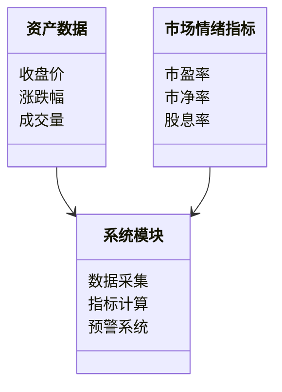
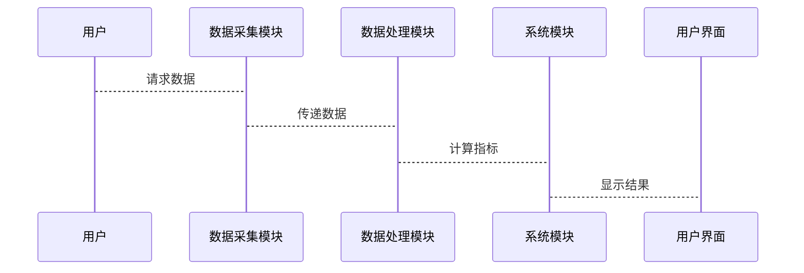

                 


# 杰里米·格兰瑟姆的资产泡沫识别方法

> 关键词：资产泡沫、行为金融学、市场情绪、资产定价、投资策略

> 摘要：本文深入探讨了杰里米·格兰瑟姆的资产泡沫识别方法，结合行为金融学理论和实际案例分析，详细阐述了资产泡沫的形成机制、识别指标以及应对策略。文章从理论基础、方法论、系统设计到项目实战，全面解析了如何通过格兰瑟姆的视角识别和预测资产泡沫。

---

# 第一部分: 资产泡沫识别的理论基础

## 第1章: 资产泡沫的背景与概念

### 1.1 资产泡沫的定义与特征

#### 1.1.1 资产泡沫的定义
资产泡沫是指资产价格脱离其内在价值，由市场情绪和非理性行为推动的快速上涨或下跌现象。其核心特征包括价格与价值的严重偏离、市场的过度参与以及情绪的极端波动。

#### 1.1.2 资产泡沫的核心特征
1. **价格与价值的偏离**：资产价格脱离基本面，仅由市场情绪驱动。
2. **市场的过度参与**：投资者盲目跟风，导致市场参与者激增。
3. **情绪的极端波动**：市场从乐观到恐慌的快速切换，导致价格剧烈波动。

#### 1.1.3 资产泡沫的形成机制
资产泡沫的形成通常经历以下几个阶段：
1. **认知阶段**：投资者逐渐意识到某种资产的潜在价值。
2. **积累阶段**：价格开始缓慢上涨，吸引更多投资者参与。
3. **狂热阶段**：价格快速上涨，市场参与者情绪极度乐观。
4. **破裂阶段**：价格突然下跌，市场情绪迅速转向恐慌。

### 1.2 格兰瑟姆的资产泡沫理论

#### 1.2.1 格兰瑟姆的学术背景与贡献
杰里米·格兰瑟姆是行为金融学领域的先驱，提出了心理账户理论和从众行为模型，为资产泡沫的研究提供了重要的理论基础。

#### 1.2.2 格兰瑟姆的资产泡沫识别方法
格兰瑟姆认为，资产泡沫的识别主要依赖于市场情绪、价格与价值的偏离以及市场参与度的综合分析。

#### 1.2.3 格兰瑟姆理论的现实意义
格兰瑟姆的理论为投资者提供了在非理性市场中做出理性决策的工具，帮助他们在资产泡沫形成和破裂周期中规避风险。

## 第2章: 行为金融学与资产泡沫

### 2.1 行为金融学概述

#### 2.1.1 行为金融学的基本概念
行为金融学研究投资者心理和行为对市场的影响，强调非理性决策在市场中的作用。

#### 2.1.2 行为金融学与传统金融学的区别
传统金融学假设投资者是理性的，而行为金融学则关注投资者的心理偏差和非理性行为。

#### 2.1.3 行为金融学的核心理论
包括心理账户理论、从众行为理论和认知偏差理论。

### 2.2 格兰瑟姆的行为金融学视角

#### 2.2.1 心理账户理论
心理账户是指投资者将资金分配到不同的心理账户中，导致决策偏差。

#### 2.2.2 从众行为与羊群效应
从众行为导致市场参与者趋向一致，羊群效应加剧了市场的波动。

#### 2.2.3 偏差与误判的形成机制
投资者的认知偏差和情绪波动是资产泡沫形成的主要原因。

## 第3章: 资产定价与市场情绪

### 3.1 资产定价理论

#### 3.1.1 内在价值与市场价值
内在价值是资产的真实价值，市场价值是价格与价值的动态平衡。

#### 3.1.2 市场情绪对资产定价的影响
市场情绪通过影响投资者行为，进而影响资产价格。

#### 3.1.3 市场情绪的量化方法
包括情绪指数、参与度指标等。

### 3.2 市场情绪的指标体系

#### 3.2.1 市场参与度指标
衡量市场参与度的指标包括成交量、交易量和市场广度。

#### 3.2.2 媒体情绪指标
通过分析媒体和社交平台的情绪词，量化市场情绪。

#### 3.2.3 交易行为指标
包括交易频率、订单簿分析等。

---

# 第二部分: 资产泡沫识别的核心方法

## 第4章: 资产泡沫识别的指标体系

### 4.1 格兰瑟姆的指标体系

#### 4.1.1 市盈率与市净率分析
市盈率（P/E）= 价格/每股收益，市净率（P/B）= 价格/每股净资产。

#### 4.1.2 股息率与股息支付率
股息率= 每股股息/股价，股息支付率= 股息/净利润。

#### 4.1.3 资产负债率与杠杆比率
资产负债率= 负债/资产，杠杆比率= 负债/股东权益。

### 4.2 市场情绪指标的构建

#### 4.2.1 市场参与度指标
包括成交量、交易量和市场广度。

#### 4.2.2 媒体情绪指标
通过自然语言处理技术分析媒体和社交平台的情绪。

#### 4.2.3 交易行为指标
包括交易频率、订单簿分析和异常交易行为。

---

# 第三部分: 系统分析与架构设计

## 第5章: 资产泡沫识别系统的架构

### 5.1 问题场景介绍
通过格兰瑟姆的理论构建一个实时监控和预警系统，识别潜在的资产泡沫。

### 5.2 领域模型设计



### 5.3 系统架构设计


### 5.4 系统交互设计



---

# 第四部分: 项目实战

## 第6章: 资产泡沫识别系统的实现

### 6.1 环境安装
安装Python、Pandas、Matplotlib、Scikit-learn等库。

### 6.2 核心代码实现

```python
def calculate_pe_ratio(price, earnings):
    return price / earnings

def calculate_pb_ratio(price, book_value):
    return price / book_value

def calculate_market_mood(pe_ratio, pb_ratio, dividend_yield):
    mood_score = 0
    if pe_ratio > 30:
        mood_score += 1
    if pb_ratio > 3:
        mood_score += 1
    if dividend_yield < 2:
        mood_score += 1
    return mood_score
```

### 6.3 案例分析
以科技股泡沫为例，分析市盈率、市净率和股息率的变化。

### 6.4 总结
通过代码实现格兰瑟姆的指标体系，帮助投资者识别潜在的资产泡沫。

---

# 结论

本文通过理论分析和系统设计，详细阐述了杰里米·格兰瑟姆的资产泡沫识别方法，并通过项目实战展示了其在实际投资中的应用。投资者可以通过这些方法在非理性市场中做出更加明智的决策。

作者：AI天才研究院/AI Genius Institute & 禅与计算机程序设计艺术 /Zen And The Art of Computer Programming

