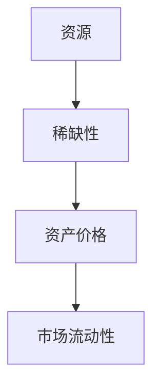
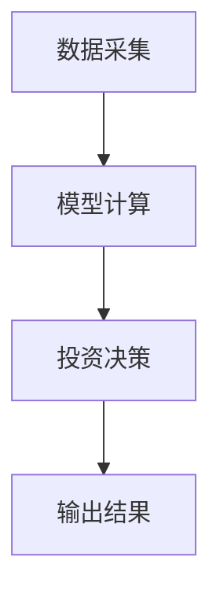
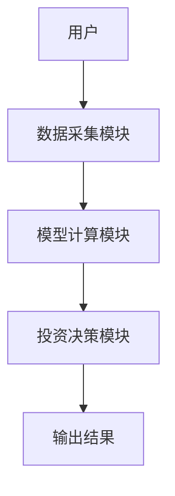
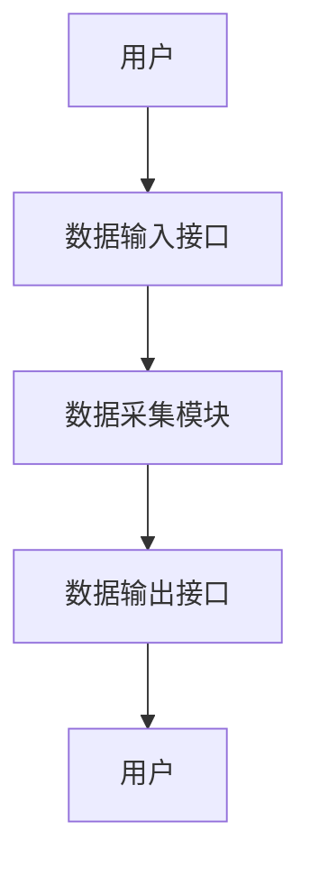

                 


# 杰里米·格兰瑟姆的资源稀缺性投资理论

## 关键词：
资源稀缺性，投资理论，资产定价，经济学，市场周期，杰里米·格兰瑟姆

## 摘要：
本文系统地阐述了杰里米·格兰瑟姆的资源稀缺性投资理论，从理论背景、核心概念、数学模型、系统架构到实际应用进行了全面分析。通过对比不同资源类型的稀缺性对市场的影响，结合数学公式和系统设计，为读者提供了一个完整的理论框架和实践指南。

---

# 第一部分: 资源稀缺性投资理论的背景与基础

## 第1章: 资源稀缺性投资理论概述

### 1.1 资源稀缺性的基本概念

#### 1.1.1 资源稀缺性的定义
资源稀缺性是指某种资源在市场上的供应量无法满足需求的情况，通常表现为价格上升和市场流动性下降。

#### 1.1.2 资源稀缺性与经济学的关系
资源稀缺性是经济学的核心概念之一，直接影响市场供需关系和资产定价。

#### 1.1.3 资源稀缺性对投资的影响
资源稀缺性直接影响资产价格，投资者应关注稀缺性较高的资产。

### 1.2 资源稀缺性投资理论的提出

#### 1.2.1 理论的起源与发展
杰里米·格兰瑟姆提出资源稀缺性投资理论，强调稀缺性对资产定价的影响。

#### 1.2.2 杰里米·格兰瑟姆的理论贡献
格兰瑟姆通过数学模型解释了稀缺性如何影响资产价格。

#### 1.2.3 理论的核心思想与框架
资源稀缺性是投资决策的关键因素，需结合市场周期进行分析。

### 1.3 资源稀缺性与资产定价的关系

#### 1.3.1 资源稀缺性对资产价格的影响
稀缺性高的资产价格更高，市场流动性较低。

#### 1.3.2 稀缺性与市场情绪的互动
市场情绪影响稀缺性资产的需求，进而影响价格。

#### 1.3.3 稀缺性在不同资产类别中的表现
金、房地产、石油等资产的稀缺性表现不同，影响其价格波动。

---

## 第2章: 资源稀缺性投资理论的核心概念与模型

### 2.1 核心概念与联系

#### 2.1.1 资源稀缺性的核心要素
资源类型、稀缺性、资产价格、市场流动性是核心要素。

#### 2.1.2 资源稀缺性与市场周期的关系
稀缺性在市场周期中波动，影响资产价格。

#### 2.1.3 资源稀缺性与投资决策的逻辑框架
投资者应根据稀缺性评估资产价值。

### 2.2 核心概念原理

#### 2.2.1 资源稀缺性的经济学原理
稀缺性影响供需关系，推高资产价格。

#### 2.2.2 资源稀缺性与市场供需的关系
供需失衡导致价格上升，市场流动性下降。

#### 2.2.3 资源稀缺性对资产流动性的影响
稀缺性高的资产流动性较低，交易难度增加。

### 2.3 核心概念属性特征对比表格

| 资源类型 | 稀缺性 | 对资产价格的影响 | 对市场流动性的影 �响 |
|----------|--------|------------------|---------------------|
| 金      | 高     | 高               | 高                   |
| 房地产  | 中     | 中               | 中                   |
| 石油     | 高     | 高               | 低                   |

### 2.4 ER实体关系图（Mermaid流程图）



---

## 第3章: 资源稀缺性投资理论的数学模型与算法

### 3.1 资源稀缺性与资产定价的数学模型

#### 3.1.1 资源稀缺性的基本公式
$$ P = S \times D $$
其中，\( P \) 表示资产价格，\( S \) 表示资源的稀缺性，\( D \) 表示市场对资源的需求。

#### 3.1.2 公式解释与应用
- 当 \( S \) 高时，\( P \) 上升。
- 当 \( D \) 高时，\( P \) 上升。

#### 3.1.3 案例分析
假设金的稀缺性 \( S = 0.8 \)，需求 \( D = 0.6 \)，则 \( P = 0.8 \times 0.6 = 0.48 \)。

---

## 第4章: 资源稀缺性投资理论的系统分析与架构设计

### 4.1 系统功能设计

#### 4.1.1 系统模块划分
- 数据采集模块：收集资源稀缺性数据。
- 模型计算模块：计算资产价格。
- 投资决策模块：基于模型结果做出投资决策。

#### 4.1.2 系统功能流程图



### 4.2 系统架构设计

#### 4.2.1 系统架构图



### 4.3 系统接口设计

#### 4.3.1 接口定义
- 数据输入接口：接收资源数据。
- 数据输出接口：输出投资建议。

#### 4.3.2 接口交互流程图



---

## 第5章: 资源稀缺性投资理论的项目实战

### 5.1 环境安装

#### 5.1.1 环境要求
- 操作系统：Windows/Mac/Linux
- 开发工具：Python、Jupyter Notebook
- 依赖库：numpy, pandas, matplotlib

#### 5.1.2 安装步骤
```bash
pip install numpy pandas matplotlib
```

### 5.2 系统核心实现源代码

#### 5.2.1 核心代码
```python
import numpy as np
import pandas as pd
import matplotlib.pyplot as plt

def calculate_asset_price(scarcity, demand):
    return scarcity * demand

scar = np.array([0.8, 0.6, 0.7])
dem = np.array([0.6, 0.5, 0.7])

prices = calculate_asset_price(scar, dem)
print(prices)

plt.plot(scar, prices, 'r-')
plt.xlabel('Scarcity')
plt.ylabel('Price')
plt.title('Asset Price vs Scarcity')
plt.show()
```

#### 5.2.2 代码解读
- `calculate_asset_price`函数计算资产价格。
- 使用numpy数组计算多个价格。
- 用matplotlib绘制价格与稀缺性关系图。

### 5.3 案例分析

#### 5.3.1 案例背景
分析金、房地产、石油的稀缺性对价格的影响。

#### 5.3.2 数据分析
- 金：稀缺性高，价格高。
- 房地产：稀缺性中，价格中。
- 石油：稀缺性高，价格高但流动性低。

### 5.4 最佳实践 tips

#### 5.4.1 投资建议
- 关注稀缺性高的资产。
- 结合市场周期进行投资决策。

#### 5.4.2 风险管理
- 分散投资，降低风险。

#### 5.4.3 长期投资
- 长期持有稀缺性高的资产。

---

## 第6章: 总结与展望

### 6.1 总结
杰里米·格兰瑟姆的资源稀缺性投资理论提供了有效的资产定价和投资决策框架。

### 6.2 展望
未来需结合人工智能和大数据技术，进一步优化投资策略。

---

## 参考文献

1. 杰里米·格兰瑟姆，《资源稀缺性与投资理论》
2. 《经济学原理》
3. 《投资学基础》

---

## 作者：AI天才研究院/AI Genius Institute & 禅与计算机程序设计艺术 /Zen And The Art of Computer Programming

