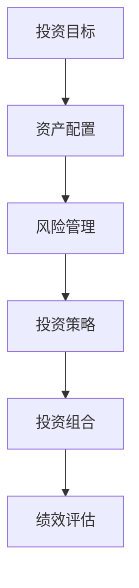

                 

# 杰里米格兰瑟姆的价值投资哲学

## 关键词
- 价值投资
- 格兰瑟姆
- 安全边际
- 逆向思维
- 投资策略
- 风险管理
- 投资系统

## 摘要
《杰里米格兰瑟姆的价值投资哲学》系统地探讨了价值投资的核心理念、策略和哲学思想，以杰里米·格兰瑟姆的经典理论为基础，深入分析了安全边际、逆向投资等关键概念，并结合实际案例和风险管理策略，为读者提供了全面的价值投资框架。文章通过技术化的分析方法，结合系统架构设计和算法原理，详细阐述了如何在现代投资环境中应用格兰瑟姆的价值投资哲学，帮助投资者构建稳健的投资系统，应对复杂多变的市场环境。

---

# 引言

## 1.1 价值投资的背景与意义
### 1.1.1 价值投资的起源与发展
价值投资作为一种经典的长期投资策略，起源于20世纪初，其核心理念是寻找被市场低估的优质资产进行投资。杰里米·格兰瑟姆作为价值投资领域的领军人物，继承并发展了本杰明·格雷厄姆的价值投资理论，将其推向了新的高度。

### 1.1.2 价值投资的核心理念
价值投资的核心在于寻找市场定价错误的机会，通过深入分析企业的基本面，识别出具有持续竞争优势和合理估值的公司，进行长期持有，以实现资本的稳健增值。

### 1.1.3 格兰瑟姆的价值投资框架
格兰瑟姆的价值投资框架强调安全边际、逆向投资和长期持有的理念。他提出了“价格是仆人，价值是主人”的观点，认为投资者应关注企业的内在价值，而非市场的短期波动。

---

# 正文

## 第1章: 价值投资的背景与定义

### 1.1 价值投资的起源与发展
价值投资的起源可以追溯到20世纪初，本杰明·格雷厄姆和戴维·多德是这一理论的奠基人。他们提出了“安全边际”的概念，强调在投资时应关注企业的内在价值，而非市场的短期波动。杰里米·格兰瑟姆继承了这一理念，并将其应用于实践，成为价值投资领域的权威。

### 1.2 价值投资的核心理念
价值投资的核心理念在于寻找被市场低估的资产。通过对企业基本面的深入分析，识别出具有持续竞争优势和合理估值的公司，进行长期持有，以实现资本的稳健增值。这种投资策略强调的是长期价值，而非短期收益。

### 1.3 格兰瑟姆的价值投资框架
格兰瑟姆的价值投资框架包括以下几个关键要素：
1. **安全边际**：通过购买价格低于内在价值的资产，确保投资的安全性。
2. **逆向投资**：在市场恐慌时寻找被低估的资产，在市场狂热时保持冷静。
3. **长期持有**：避免频繁交易，降低交易成本，同时利用复利效应实现资产增值。

---

## 第2章: 格兰瑟姆的价值投资哲学

### 2.1 格兰瑟姆的投资哲学
格兰瑟姆的投资哲学强调以下几点：
1. **市场有效性**：市场并非总是有效，价格波动往往反映了投资者的非理性行为。
2. **安全边际**：通过购买价格低于内在价值的资产，降低投资风险。
3. **逆向思维**：在市场低迷时买入，在市场高估时卖出。

### 2.2 安全边际的计算与应用
安全边际是价值投资的核心概念，其计算公式如下：
$$ \text{安全边际} = \text{内在价值} - \text{市场价格} $$
通过安全边际的计算，投资者可以识别出具有较高安全边际的资产，从而降低投资风险。

### 2.3 逆向投资策略
逆向投资策略的核心在于“逆市场而行”。当市场恐慌时，许多优质资产会被低估，此时是买入的好时机；当市场狂热时，许多资产会被高估，此时应保持冷静，避免盲目追高。

### 2.4 选股标准与动态调整
格兰瑟姆提出了以下选股标准：
1. 企业的财务状况稳健，具有持续的盈利能力。
2. 企业的估值低于其内在价值。
3. 企业具有较强的竞争优势和成长潜力。
投资者需要根据市场环境的变化，动态调整自己的选股标准，以应对市场的变化。

---

## 第3章: 价值投资的分析方法

### 3.1 基本面分析
基本面分析是价值投资的核心方法之一。通过对企业财务报表的分析，评估企业的盈利能力、财务状况和成长潜力。以下是常见的财务指标：
- **市盈率（P/E）**：$$ \text{市盈率} = \frac{\text{股价}}{\text{每股收益}} $$
- **市净率（P/B）**：$$ \text{市净率} = \frac{\text{股价}}{\text{每股净资产}} $$
- **股息率**：$$ \text{股息率} = \frac{\text{每股股息}}{\text{股价}} $$

### 3.2 估值模型与方法
常用的估值模型包括：
1. **现金流折现法（DCF）**：通过预测企业的未来现金流，计算其现值。
2. **市盈率法**：通过比较企业的市盈率与行业平均水平，判断其估值是否合理。
3. **市净率法**：通过比较企业的市净率与行业平均水平，判断其估值是否合理。

### 3.3 企业竞争优势分析
企业竞争优势是价值投资的重要考量因素。以下是常见的竞争优势类型：
1. **成本优势**：企业具有更低的生产成本。
2. **品牌优势**：企业拥有强大的品牌影响力。
3. **技术优势**：企业掌握核心技术。

---

## 第4章: 风险管理与投资组合优化

### 4.1 风险管理的重要性
风险管理是价值投资中不可忽视的一部分。通过合理的风险管理，投资者可以降低投资组合的波动性，提高投资的稳定性。

### 4.2 投资组合的构建
投资组合的构建需要考虑以下几个方面：
1. **资产配置**：根据市场环境和个人风险偏好，合理配置股票、债券、现金等资产。
2. **分散投资**：通过投资于不同行业和不同地区的资产，降低投资风险。
3. **定期调整**：根据市场变化和个人财务状况，定期调整投资组合。

### 4.3 风险控制策略
1. **止损策略**：设定止损点，避免亏损过大。
2. **分散投资**：通过投资于不同的资产类别和行业，降低投资风险。
3. **长期持有**：避免频繁交易，降低交易成本和市场波动的影响。

---

## 第5章: 投资者心态与行为管理

### 5.1 心理偏差与投资决策
心理偏差是影响投资决策的重要因素。常见的心理偏差包括：
1. **过度自信**：认为自己能够准确预测市场走势。
2. **从众心理**：盲目跟随市场潮流，忽视独立思考。
3. **损失厌恶**：对潜在亏损的过度关注，影响投资决策。

### 5.2 心理因素对投资的影响
心理因素对投资的影响不容忽视。投资者需要克服贪婪和恐惧，保持冷静和理性，避免被市场情绪左右。

### 5.3 行为管理策略
1. **制定投资计划**：根据个人财务状况和风险偏好，制定详细的投资计划。
2. **坚持长期投资**：避免短期波动的影响，坚持长期持有的理念。
3. **定期反思与调整**：根据市场变化和个人情况，定期反思和调整投资策略。

---

## 第6章: 价值投资的实践与案例分析

### 6.1 经典案例分析
通过分析经典案例，投资者可以更好地理解价值投资的理论和实践。例如，格兰瑟姆在2008年金融危机期间，通过逆向投资策略，成功捕捉到了市场低估的机会。

### 6.2 投资策略的实施步骤
1. **确定投资目标**：明确投资目标和风险偏好。
2. **选择优质资产**：通过基本面分析和估值模型，选择具有安全边际的资产。
3. **构建投资组合**：根据市场环境和个人情况，构建合理投资组合。
4. **定期监控与调整**：根据市场变化和个人情况，定期监控和调整投资组合。

---

## 第7章: 价值投资系统的构建与优化

### 7.1 投资系统的设计原则
投资系统的构建需要遵循以下原则：
1. **简洁性**：系统应简单易用，避免过于复杂。
2. **可扩展性**：系统应具有较强的扩展性，适应市场变化。
3. **可操作性**：系统应具有较强的可操作性，方便投资者实施。

### 7.2 系统架构设计
以下是价值投资系统的架构设计：

### 7.3 系统优化与调整
1. **定期评估**：根据市场变化和个人情况，定期评估投资系统的有效性。
2. **动态调整**：根据评估结果，动态调整投资系统的参数和策略。

---

## 结论

### 8.1 价值投资的核心思想
价值投资的核心思想在于寻找被市场低估的优质资产，通过长期持有实现资本的稳健增值。杰里米·格兰瑟姆的价值投资哲学为投资者提供了系统的理论框架和实践方法。

### 8.2 未来展望
随着市场环境的变化，价值投资的理论和实践也在不断发展和创新。投资者需要与时俱进，不断学习和适应新的市场环境，以实现投资目标。

---

# 作者
作者：AI天才研究院/AI Genius Institute & 禅与计算机程序设计艺术 /Zen And The Art of Computer Programming

