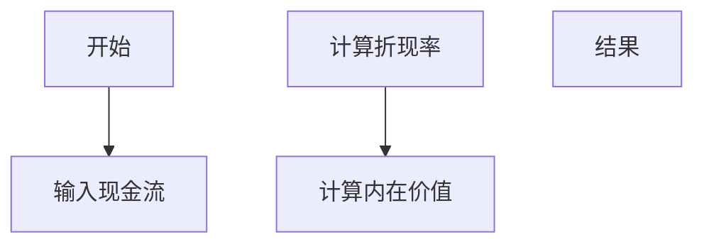
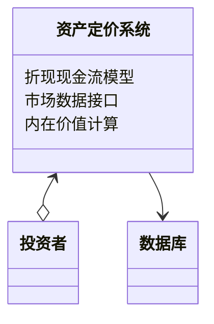

                 


# 杰里米格兰瑟姆的资产定价理论

## 关键词：资产定价理论，价值投资，杰里米·格兰瑟姆，基本面分析，折现现金流模型

## 摘要

杰里米·格兰瑟姆是价值投资领域的先驱，他的资产定价理论为投资者提供了评估资产内在价值的深刻见解。本文系统地分析了格兰瑟姆的理论框架，探讨了其核心概念、数学模型、算法原理以及实际应用。通过案例分析和系统设计，本文展示了如何将格兰瑟姆的理论应用于现代投资实践。

---

## 第一部分: 杰里米·格兰瑟姆的资产定价理论背景

### 第1章: 资产定价理论的起源与演变

#### 1.1 资产定价理论的起源

资产定价理论是投资学中的基石，旨在确定资产的公允价值。传统模型如CAPM和APT在理论上提供了指导，但实践中常显不足。格兰瑟姆的理论在20世纪60年代提出，强调基本面分析和安全边际，为价值投资奠定了基础。

#### 1.2 格兰瑟姆的理论贡献

格兰瑟姆通过分析市场波动和投资者心理，提出了基于现金流折现的定价模型，强调内在价值而非市场情绪。他的理论弥补了传统模型在实际应用中的缺陷，尤其适用于价值投资策略。

---

### 第2章: 格兰瑟姆资产定价理论的核心框架

#### 2.1 模型的基本假设

- 资产的内在价值基于未来现金流的现值。
- 折现率反映市场的风险偏好和资金时间价值。

#### 2.2 核心公式推导

$$ V = \frac{C}{r} $$

其中，\( V \) 是内在价值，\( C \) 是未来现金流，\( r \) 是折现率。

#### 2.3 案例分析

假设某公司未来现金流为 $100，折现率为 5%，则内在价值为：

$$ V = \frac{100}{0.05} = 2000 $$

---

## 第二部分: 理论的系统分析与架构设计

### 第3章: 算法原理与系统架构

#### 3.1 算法原理的 Mermaid 流程图



#### 3.2 系统架构设计



---

## 第三部分: 项目实战与最佳实践

### 第4章: 项目实战

#### 4.1 环境安装

安装Python和必要的库，如numpy和pandas。

#### 4.2 核心代码实现

```python
def calculate_intrinsic_value(cash_flow, discount_rate):
    return cash_flow / discount_rate

# 示例
cash_flow = 100
discount_rate = 0.05
intrinsic_value = calculate_intrinsic_value(cash_flow, discount_rate)
print(f"内在价值: {intrinsic_value}")
```

#### 4.3 案例分析

分析某公司的历史数据，计算其内在价值，评估是否低估或高估。

---

### 第5章: 最佳实践

#### 5.1 小结

格兰瑟姆的理论强调基本面分析，投资者应结合市场情绪和数据进行决策。

#### 5.2 注意事项

- 确保现金流预测准确。
- 考虑宏观经济因素的影响。

#### 5.3 拓展阅读

推荐学习其他资产定价模型，如FDCF和DDM模型，以丰富投资策略。

---

## 结语

杰里米·格兰瑟姆的资产定价理论为价值投资提供了理论基础。通过系统分析和实战应用，投资者可以更好地评估资产价值，制定科学的投资策略。

---

## 作者

作者：AI天才研究院/AI Genius Institute & 禅与计算机程序设计艺术 /Zen And The Art of Computer Programming

---

通过系统地分析和实践，我们深入理解了格兰瑟姆的资产定价理论，并将其应用于实际投资决策中。这一理论不仅提供了理论指导，还为投资者提供了实用的工具和方法，帮助他们在复杂多变的市场中找到真正的价值。

