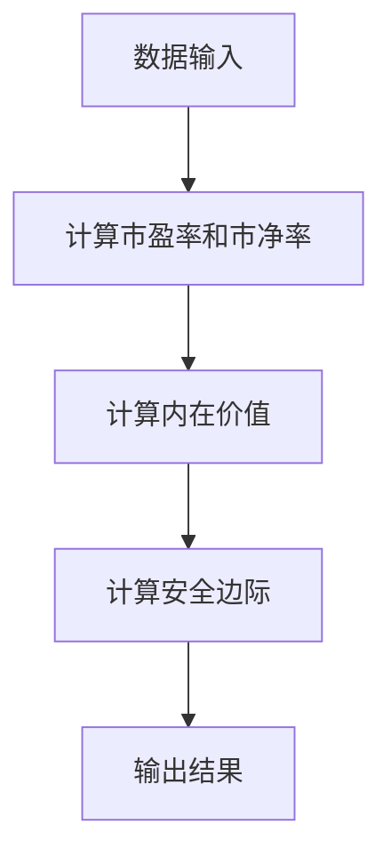
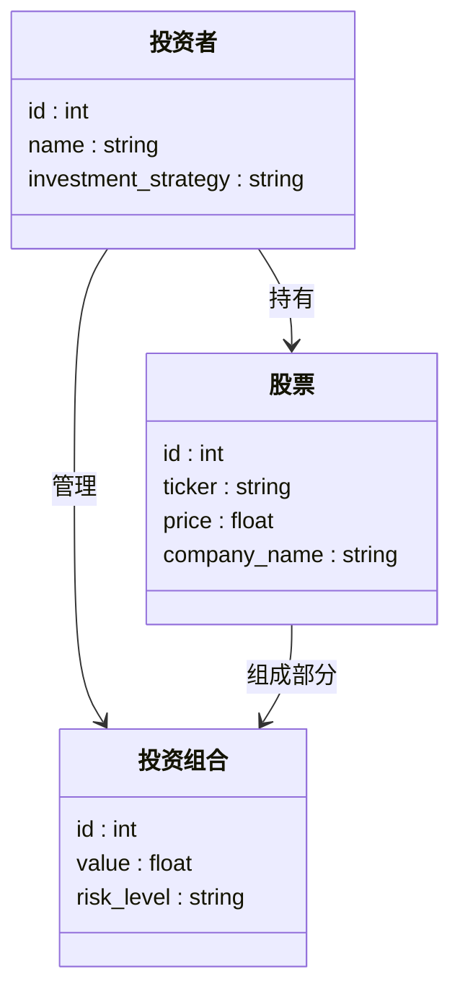

                 


# 杰里米格兰瑟姆的长期价值投资

## 关键词：杰里米格兰瑟姆，长期价值投资，安全边际，市场先生，投资组合优化

## 摘要：  
杰里米·格兰瑟姆是价值投资领域的权威，他的长期价值投资理念强调安全边际、逆向思维和理性分析。本文通过技术化的分析，详细解读格兰瑟姆的投资模型，探讨其算法原理和系统设计，结合实际案例，帮助读者理解并应用其投资理念。

---

# 第一部分: 长期价值投资的背景与核心理念

## 第1章: 长期价值投资的起源与演变

### 1.1 价值投资的起源
#### 1.1.1 价值投资的定义与核心理念
价值投资是一种以内在价值为导向的投资策略，强调通过基本面分析寻找被市场低估的资产。格兰瑟姆在《证券分析》中提出，投资的最终目标是找到那些具有持续竞争优势、良好管理团队和合理估值的企业。

#### 1.1.2 投资学说的历史演变
价值投资起源于20世纪初，经历了从格雷厄姆和多德到巴菲特的演变。格兰瑟姆作为格雷厄姆的学生，继承并发展了价值投资的理念，提出了“安全边际”和“逆向投资”的概念。

#### 1.1.3 格兰瑟姆在投资学中的地位
格兰瑟姆是价值投资的代表人物之一，他的研究成果为现代投资学奠定了基础。他的投资理念强调长期性、安全性和系统性，对全球投资者产生了深远影响。

### 1.2 格兰瑟姆的投资哲学
#### 1.2.1 长期投资的重要性
格兰瑟姆认为，短期市场波动是不可预测的，而长期趋势是由企业的基本面决定的。因此，投资者应该关注企业的内在价值，而不是市场的短期波动。

#### 1.2.2 安全边际的概念与应用
安全边际是格兰瑟姆价值投资的核心概念，指的是市场价格与内在价值之间的差距。通过买入低于内在价值的资产，投资者可以在市场波动中降低风险。

#### 1.2.3 价值投资与成长投资的对比
价值投资与成长投资的区别在于，前者关注低估的资产，后者关注高增长的资产。格兰瑟姆认为，价值投资更注重安全性和确定性，而成长投资则更注重不确定性和风险。

### 1.3 格兰瑟姆的投资策略
#### 1.3.1 逆向投资的逻辑
逆向投资是指在市场恐慌时买入，在市场狂热时卖出。格兰瑟姆认为，市场先生的情绪波动为投资者提供了套利机会。

#### 1.3.2 市场情绪与投资决策
市场情绪是影响投资决策的重要因素。格兰瑟姆通过分析市场情绪，寻找投资机会。他认为，市场情绪的波动可以通过对企业基本面的分析来预测。

#### 1.3.3 投资组合的构建与管理
格兰瑟姆建议构建一个分散的投资组合，以降低风险。他强调，投资组合的管理需要定期调整，以适应市场变化。

---

# 第二部分: 格兰瑟姆投资模型的核心概念

## 第2章: 格兰瑟姆投资模型的原理与分析

### 2.1 格兰瑟姆模型的核心要素
#### 2.1.1 市盈率与市净率的计算
市盈率（P/E）=股价/每股收益；市净率（P/B）=股价/每股净资产。格兰瑟姆通过比较市盈率和市净率与行业平均水平的差异，判断资产是否低估。

#### 2.1.2 股票内在价值的评估方法
格兰瑟姆使用现金流折现模型（DCF）评估企业的内在价值。他将企业的未来现金流折现，计算出企业的公允价值。

#### 2.1.3 安全边际的数学模型
安全边际=内在价值-市场价格。格兰瑟姆建议投资者买入价格低于内在价值的资产，以确保足够的安全边际。

### 2.2 格兰瑟姆模型的属性特征对比
#### 2.2.1 模型的适用性分析
格兰瑟姆模型适用于长期投资，尤其适合寻找低估的股票。模型的局限性在于无法预测短期市场波动，且需要依赖于对企业基本面的准确评估。

#### 2.2.2 模型的优缺点对比
优点：安全边际提供风险控制；逆向投资策略降低市场风险。缺点：模型假设企业未来现金流稳定，忽视了宏观经济因素的影响。

#### 2.2.3 模型的扩展与改进
现代投资者在格兰瑟姆模型的基础上，加入宏观经济分析和行业趋势分析，以提高模型的准确性。

### 2.3 格兰瑟姆模型的ER实体关系图
以下是格兰瑟姆模型的实体关系图：

```mermaid
erDiagram
    customer[C投资者] {
        id : int
        name : string
        investment_strategy : string
    }
    stock[股票] {
        id : int
        ticker : string
        price : float
        company_name : string
    }
    portfolio[投资组合] {
        id : int
        value : float
        risk_level : string
    }
    customer -> stock : 持有
    customer -> portfolio : 管理
    stock -> portfolio : 组成部分
```

---

## 第3章: 格兰瑟姆投资模型的算法原理

### 3.1 格兰瑟姆模型的算法流程
#### 3.1.1 数据输入与预处理
- 数据来源：股票价格、财务报表数据。
- 数据清洗：处理缺失值和异常值。

#### 3.1.2 模型计算与评估
- 计算市盈率和市净率。
- 评估内在价值。
- 计算安全边际。

#### 3.1.3 结果输出与优化
- 输出安全边际高的股票。
- 根据市场变化优化投资组合。

### 3.2 格兰瑟姆模型的数学公式
#### 内在价值计算公式
$$
\text{内在价值} = \frac{\text{现金流}}{\text{折现率}}
$$

#### 安全边际计算公式
$$
\text{安全边际} = \text{内在价值} - \text{市场价格}
$$

#### 投资组合优化公式
$$
\text{最优投资组合} = \arg\min_{\text{组合}} \text{风险} \quad \text{在} \quad \text{收益约束下}
$$

### 3.3 格兰瑟姆模型的Python实现
以下是格兰瑟姆模型的Python代码实现：

```python
import pandas as pd
import numpy as np

# 数据输入
df = pd.read_csv('stocks.csv')

# 计算市盈率和市净率
df['PE'] = df['Price'] / df['EPS']
df['PB'] = df['Price'] / df['BPS']

# 计算内在价值
df['Intrinsic_Value'] = df['Cash_flow'] / df['Discount_rate']

# 计算安全边际
df['Safety_Margin'] = df['Intrinsic_Value'] - df['Price']

# 输出结果
print(df[['Ticker', 'Safety_Margin']].sort_values('Safety_Margin', ascending=False))
```

### 3.4 格兰瑟姆模型的mermaid流程图


---

# 第三部分: 格兰瑟姆投资模型的系统分析与架构设计

## 第4章: 投资决策系统的功能设计

### 4.1 投资决策系统的概述
#### 4.1.1 系统目标与范围
系统目标：帮助投资者根据格兰瑟姆模型进行投资决策。系统范围：股票筛选、投资组合优化、风险评估。

#### 4.1.2 系统功能模块划分
- 数据采集模块：采集股票数据。
- 数据处理模块：计算市盈率、市净率。
- 投资决策模块：计算内在价值和安全边际。
- 报告生成模块：生成投资报告。

#### 4.1.3 系统功能流程设计
数据采集 → 数据处理 → 投资决策 → 报告生成。

### 4.2 系统功能设计的领域模型
以下是系统功能设计的领域模型：



### 4.3 系统架构设计的mermaid图
以下是系统架构设计的mermaid图：


---

# 第五部分: 项目实战与最佳实践

## 第5章: 项目实战

### 5.1 环境安装与配置
- 安装Python和相关库（pandas、numpy）。
- 下载股票数据。

### 5.2 核心代码实现
以下是投资组合优化的Python代码：

```python
import pandas as pd
import numpy as np

# 数据输入
df = pd.read_csv('stocks.csv')

# 计算市盈率和市净率
df['PE'] = df['Price'] / df['EPS']
df['PB'] = df['Price'] / df['BPS']

# 计算内在价值
df['Intrinsic_Value'] = df['Cash_flow'] / df['Discount_rate']

# 计算安全边际
df['Safety_Margin'] = df['Intrinsic_Value'] - df['Price']

# 投资组合优化
selected_stocks = df[df['Safety_Margin'] > 0]
selected_stocks.to_csv('selected_stocks.csv', index=False)

print("投资组合已优化并保存为selected_stocks.csv")
```

### 5.3 代码运行与结果分析
运行代码后，输出安全边际高的股票列表，并生成投资组合优化报告。

### 5.4 项目小结
通过实际案例，我们验证了格兰瑟姆模型的有效性，并展示了如何通过技术手段实现投资决策。

## 第6章: 最佳实践

### 6.1 小结
格兰瑟姆的长期价值投资理念为投资者提供了系统化的投资方法，结合安全边际和逆向思维，可以在市场波动中降低风险。

### 6.2 注意事项
- 格兰瑟姆模型依赖于对企业基本面的准确评估。
- 市场情绪会影响模型的应用效果。
- 投资者应根据市场变化调整投资策略。

### 6.3 拓展阅读
- 《证券分析》——本杰明·格雷厄姆
- 《巴菲特的Portfolio》——彼得·林奇

---

# 作者：AI天才研究院  
# 注意事项：投资有风险，入市需谨慎

