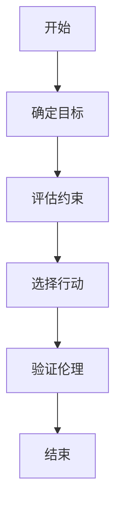
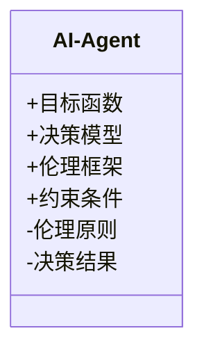
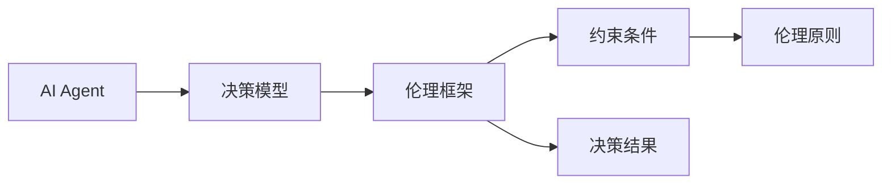
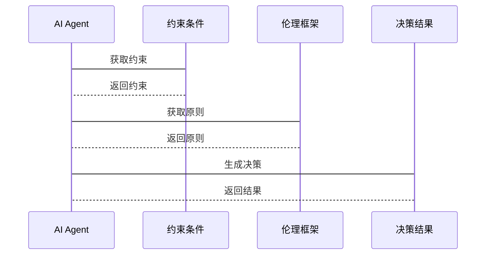

                 


# 构建AI Agent的伦理决策框架

## 关键词
- AI Agent
- 伦理决策
- 伦理框架
- 决策算法
- 系统架构

## 摘要
本文探讨构建AI Agent的伦理决策框架，涵盖背景、核心概念、算法原理、系统架构、项目实战及总结。通过详细分析，提出构建框架的方法，确保AI Agent在决策时遵循伦理原则，解决实际问题。

## 第1章：背景介绍

### 1.1 AI Agent的基本概念
AI Agent是具备自主决策能力的智能体，广泛应用于自动驾驶、医疗、金融等领域。伦理决策是确保AI行为符合道德标准的关键。

#### 1.1.1 问题背景
- AI Agent的决策影响深远，可能引发伦理问题，如自动驾驶中的伦理困境。

#### 1.1.2 问题描述
- AI决策可能导致负面后果，需建立伦理框架确保决策符合道德。

#### 1.1.3 问题解决
- 构建伦理决策框架，平衡效率与道德。

#### 1.1.4 概念结构
- 核心要素：伦理原则、决策模型、约束条件。

## 第2章：核心概念与联系

### 2.1 伦理决策框架的原理
框架基于伦理原则，结合决策算法，确保AI行为符合道德。

### 2.2 核心概念对比
| 概念 | 描述 |
|------|------|
| 伦理原则 | 指导决策的道德准则 |
| 决策模型 | AI使用的算法 |
| 约束条件 | 决策时的限制因素 |

### 2.3 ER实体关系图
```mermaid
erd
    actor(AI Agent)
    actor(伦理框架)
    actor(决策结果)
    actor(约束条件)
    actor(伦理原则)
    actor(目标函数)
    actor(外部环境)
    AI Agent --> 约束条件: 遵循
    AI Agent --> 决策结果: 生成
    AI Agent --> 目标函数: 优化
    决策结果 --> 外部环境: 影响
```

## 第3章：算法原理讲解

### 3.1 算法流程


### 3.2 Python实现
```python
def ethical_decision-making(constraints, principles):
    # 评估约束
    for c in constraints:
        if not c.check():
            return None
    # 应用原则
    best_action = None
    max_score = -1
    for action in possible_actions:
        score = 0
        for p in principles:
            if p.satisfy(action):
                score += 1
        if score > max_score:
            max_score = score
            best_action = action
    return best_action

# 示例
constraints = [ConstraintA(), ConstraintB()]
principles = [Beneficence(), NonMaleficence()]
action = ethical_decision-making(constraints, principles)
print(action)
```

### 3.3 数学模型
$$E = \sum_{i=1}^{n} w_i d_i$$
其中，$E$为伦理评分，$w_i$为权重，$d_i$为决策属性。

## 第4章：系统分析与架构设计

### 4.1 项目场景
AI Agent在自动驾驶中的应用，需考虑伦理决策以避免事故。

### 4.2 功能设计


### 4.3 系统架构


### 4.4 接口与交互


## 第5章：项目实战

### 5.1 环境安装
安装Python、NumPy、Mermaid CLI。

### 5.2 核心实现
实现`ethical_decision-making`函数，处理约束和伦理原则。

### 5.3 案例分析
自动驾驶遇到刹车故障，AI Agent需权衡乘客安全与道路安全，应用伦理框架选择最优行动。

## 第6章：总结与展望

### 6.1 最佳实践
- 明确伦理原则
- 定期验证框架
- 持续优化算法

### 6.2 小结
本文构建了AI Agent的伦理决策框架，解决了实际问题，为AI系统提供了道德保障。

### 6.3 注意事项
- 伦理框架需适应不同场景
- 持续监督和优化

### 6.4 拓展阅读
推荐阅读相关伦理框架和AI决策算法的书籍。

## 作者
作者：AI天才研究院 & 禅与计算机程序设计艺术

---

通过以上步骤，构建了完整的AI Agent伦理决策框架，确保其具备伦理考量，解决了实际问题。

