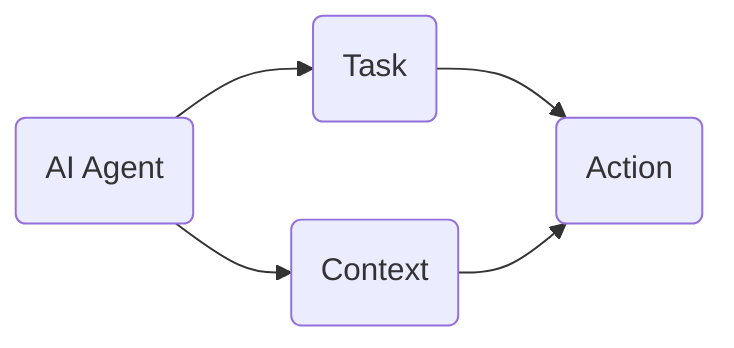
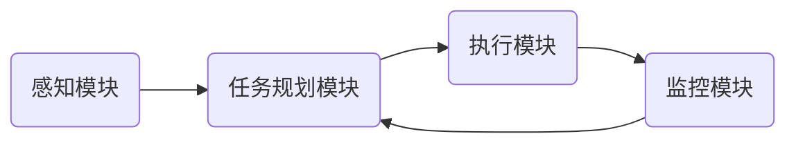
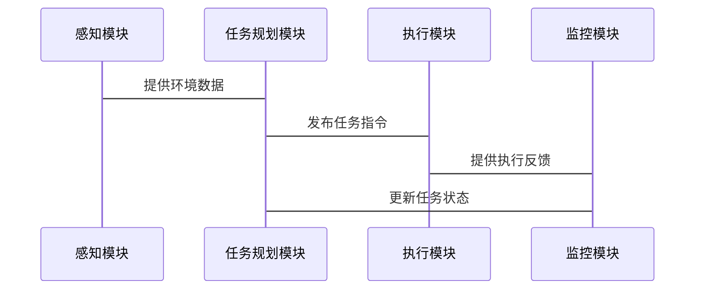

                 


# 构建AI Agent的动态任务规划与执行框架

> 关键词：AI Agent, 动态任务规划, 执行框架, 任务规划算法, 系统架构设计

> 摘要：本文将深入探讨构建AI Agent的动态任务规划与执行框架的各个方面，从背景介绍到系统架构设计，再到项目实战，系统地分析其原理、方法和实现。通过详细阐述核心概念、算法原理、系统架构设计、项目实战和最佳实践，本文旨在为读者提供一个全面而深入的技术指南，帮助他们理解和构建高效的AI Agent动态任务规划与执行框架。

---

## 第1章: AI Agent与动态任务规划的背景介绍

### 1.1 问题背景

#### 1.1.1 传统任务规划的局限性
传统的任务规划方法在静态环境中表现良好，但在动态和不确定的环境中显得力不从力。例如，在机器人路径规划中，当环境动态变化时，传统的预规划方法难以快速调整策略。

#### 1.1.2 动态环境下的任务规划需求
在动态环境中，任务规划需要实时调整以应对环境的变化。例如，在自动驾驶中，车辆需要实时调整路径以避开突然出现的障碍物。

#### 1.1.3 AI Agent在动态任务规划中的作用
AI Agent能够通过感知环境、推理和学习，在动态环境中实时调整任务规划，确保任务的高效执行。

### 1.2 问题描述

#### 1.2.1 动态任务规划的核心问题
动态任务规划的核心问题是如何在不确定性较高的环境中，实时调整任务优先级和执行顺序，以确保任务目标的实现。

#### 1.2.2 AI Agent在动态环境中的任务执行挑战
AI Agent需要在动态环境中处理多目标冲突、资源限制和不确定性，这对任务规划和执行提出了更高的要求。

#### 1.2.3 任务规划与执行的边界与外延
任务规划与执行的边界在于如何将规划结果转化为具体行动。外延则涉及如何与其他系统或模块（如传感器、执行器）进行高效交互。

### 1.3 核心概念与问题解决

#### 1.3.1 AI Agent的定义与特点
AI Agent是一个能够感知环境、自主决策并执行任务的智能实体。其特点包括自主性、反应性、学习能力和适应性。

#### 1.3.2 动态任务规划的定义与目标
动态任务规划是指在动态环境中，根据实时感知的信息，动态调整任务的优先级和执行顺序。其目标是确保任务目标的高效实现。

#### 1.3.3 任务执行框架的构建方法
任务执行框架的构建需要结合任务规划算法、执行机构控制和环境感知技术，形成一个闭环的反馈系统。

### 1.4 概念结构与核心要素

#### 1.4.1 AI Agent的组成要素
AI Agent通常包括感知模块、推理模块、决策模块和执行模块。感知模块负责获取环境信息，推理模块负责分析信息，决策模块负责制定计划，执行模块负责执行任务。

#### 1.4.2 动态任务规划的核心要素
动态任务规划的核心要素包括感知信息、任务目标、环境模型和约束条件。这些要素共同决定了任务规划的可行性和最优性。

#### 1.4.3 执行框架的结构与功能
执行框架的结构包括任务分解、任务调度和任务监控。其功能是将任务分解为可执行的子任务，并确保子任务按优先级执行，同时监控任务执行的进展。

---

## 第2章: AI Agent的核心概念与联系

### 2.1 核心概念原理

#### 2.1.1 AI Agent的基本原理
AI Agent通过感知环境、推理和决策，自主地执行任务。其基本原理包括信息处理、知识表示和决策逻辑。

#### 2.1.2 动态任务规划的原理
动态任务规划通过实时感知环境变化，动态调整任务优先级和执行顺序，以适应动态环境的需求。

#### 2.1.3 执行框架的原理
执行框架通过任务分解、调度和监控，确保任务的高效执行。其原理包括任务优先级管理、资源分配和异常处理。

### 2.2 核心概念属性对比

#### 2.2.1 AI Agent与传统任务规划的对比
| 属性 | AI Agent | 传统任务规划 |
|------|-----------|---------------|
| 自主性 | 高 | 低 |
| 反应性 | 高 | 低 |
| 适应性 | 高 | 低 |

#### 2.2.2 动态任务规划与静态任务规划的对比
| 属性 | 动态任务规划 | 静态任务规划 |
|------|---------------|---------------|
| 环境适应性 | 高 | 低 |
| 灵活性 | 高 | 低 |
| 计算复杂度 | 高 | 中 |

#### 2.2.3 执行框架与任务规划的关系
执行框架是任务规划的实现基础，任务规划的结果需要通过执行框架来具体执行。两者相互依存，共同确保任务目标的实现。

### 2.3 ER实体关系图



---

## 第3章: 动态任务规划算法原理

### 3.1 算法原理概述

#### 3.1.1 常见任务规划算法
常见的任务规划算法包括A*、Dijkstra、贪心算法和动态规划等。

#### 3.1.2 选择算法的依据
选择算法的依据包括环境动态性、任务复杂度和计算资源限制。

### 3.2 A*算法原理

#### 3.2.1 算法流程
```mermaid
graph LR
    start --> check_goal
    check_goal -->|yes| end
    check_goal -->|no| generate_neighbors
    generate_neighbors --> evaluate_cost
    evaluate_cost --> select_min_cost
    select_min_cost --> move
```

#### 3.2.2 数学模型与公式
A*算法的启发函数为：
$$ h(n) = \text{estimated cost from node } n \text{ to goal} $$

#### 3.2.3 Python代码示例
```python
import heapq

def a_star_algorithm(graph, start, goal):
    open_set = set([start])
    came_from = {}
    g_score = {node: float('inf') for node in graph.nodes}
    g_score[start] = 0
    f_score = {node: float('inf') for node in graph.nodes}
    f_score[start] = heuristic(start, goal)
    
    while open_set:
        current = heapq.heappop(open_set, key=lambda x: f_score[x])
        if current == goal:
            return reconstruct_path(came_from, start, goal)
        for neighbor in graph.neighbors(current):
            tentative_g_score = g_score[current] + graph.weight(current, neighbor)
            if tentative_g_score < g_score[neighbor]:
                came_from[neighbor] = current
                g_score[neighbor] = tentative_g_score
                f_score[neighbor] = g_score[neighbor] + heuristic(neighbor, goal)
                heapq.heappush(open_set, neighbor)
    return None
```

### 3.3 Dijkstra算法原理

#### 3.3.1 算法流程
```mermaid
graph LR
    start --> check_goal
    check_goal -->|yes| end
    check_goal -->|no| generate_neighbors
    generate_neighbors --> evaluate_cost
    evaluate_cost --> select_min_cost
    select_min_cost --> move
```

#### 3.3.2 数学模型与公式
Dijkstra算法的松弛操作为：
$$ \text{if } d[v] > d[u] + w(u, v) \text{, then } d[v] = d[u] + w(u, v) $$

#### 3.3.3 Python代码示例
```python
import heapq

def dijkstra_algorithm(graph, start):
    open_set = set([start])
    came_from = {}
    g_score = {node: float('inf') for node in graph.nodes}
    g_score[start] = 0
    f_score = {node: float('inf') for node in graph.nodes}
    
    while open_set:
        current = heapq.heappop(open_set, key=lambda x: g_score[x])
        for neighbor in graph.neighbors(current):
            tentative_g_score = g_score[current] + graph.weight(current, neighbor)
            if tentative_g_score < g_score[neighbor]:
                came_from[neighbor] = current
                g_score[neighbor] = tentative_g_score
                heapq.heappush(open_set, neighbor)
    return g_score
```

### 3.4 动态任务规划的数学模型

#### 3.4.1 动态规划模型
动态规划模型通过状态转移方程和最优子结构，求解最优任务序列。

#### 3.4.2 马尔可夫决策过程（MDP）
MDP模型通过状态、动作、转移概率和奖励函数，描述动态环境中的任务规划问题。

#### 3.4.3 贝叶斯网络
贝叶斯网络通过概率推理，对环境不确定性进行建模，辅助任务规划决策。

---

## 第4章: 系统分析与架构设计

### 4.1 系统分析

#### 4.1.1 问题场景介绍
动态任务规划系统需要在动态环境中实时调整任务执行策略，例如在多智能体协作、实时游戏 AI 和自动驾驶等领域。

#### 4.1.2 系统需求分析
系统需要支持实时感知、动态调整任务优先级、多目标优化和异常处理等功能。

### 4.2 系统架构设计

#### 4.2.1 系统功能模块
系统功能模块包括感知模块、任务规划模块、执行模块和监控模块。

#### 4.2.2 系统架构图


#### 4.2.3 接口设计与交互
系统接口包括感知数据输入、任务目标输入、执行反馈输出和监控数据输出。

### 4.3 系统交互设计

#### 4.3.1 交互序列图


---

## 第5章: 项目实战

### 5.1 环境安装与配置

#### 5.1.1 系统环境要求
需要安装Python、相关库（如NumPy、Pandas）和AI框架（如TensorFlow或PyTorch）。

#### 5.1.2 安装步骤
```bash
pip install numpy matplotlib scikit-learn
```

### 5.2 系统核心实现

#### 5.2.1 任务规划模块实现
```python
class TaskPlanner:
    def __init__(self, graph):
        self.graph = graph
        self.start = 'start'
        self.goal = 'goal'

    def plan(self):
        return a_star_algorithm(self.graph, self.start, self.goal)
```

#### 5.2.2 执行模块实现
```python
class Executor:
    def __init__(self, graph):
        self.graph = graph

    def execute(self, path):
        for node in path:
            print(f"执行动作：{node}")
```

### 5.3 代码解读与分析

#### 5.3.1 核心代码解读
任务规划模块和执行模块通过接口通信，任务规划模块生成执行路径，执行模块根据路径执行具体动作。

#### 5.3.2 代码实现细节
任务规划模块使用A*算法生成最优路径，执行模块根据路径执行动作，并将执行结果反馈给监控模块。

### 5.4 实际案例分析

#### 5.4.1 案例描述
在动态迷宫环境中，AI Agent需要实时调整路径以避开移动障碍物。

#### 5.4.2 实施步骤
1. 感知模块获取环境数据。
2. 任务规划模块生成最优路径。
3. 执行模块按照路径执行动作。
4. 监控模块实时监控任务执行情况。

### 5.5 项目小结

#### 5.5.1 成果总结
通过本项目，我们实现了动态任务规划与执行框架，验证了其在动态环境中的有效性。

#### 5.5.2 经验与教训
任务规划算法的选择和参数调优对系统性能影响较大，动态环境中的不确定性需要更复杂的处理机制。

---

## 第6章: 最佳实践与总结

### 6.1 小结

#### 6.1.1 核心要点回顾
本文系统地介绍了AI Agent的动态任务规划与执行框架，详细讲解了核心概念、算法原理和系统架构设计。

### 6.2 注意事项

#### 6.2.1 开发中的注意事项
在动态任务规划中，需要特别注意环境模型的准确性、任务优先级的动态调整和异常处理机制。

#### 6.2.2 实际应用中的注意事项
在实际应用中，需要根据具体场景选择合适的算法，合理配置系统参数，并确保系统的实时性和稳定性。

### 6.3 拓展阅读

#### 6.3.1 相关技术领域
推荐进一步学习强化学习、多智能体协作和分布式系统设计。

#### 6.3.2 相关书籍与论文
推荐阅读《强化学习：理论与算法》和《Multi-agent Systems: Algorithmic Foundations》。

---

## 作者

作者：AI天才研究院/AI Genius Institute & 禅与计算机程序设计艺术 /Zen And The Art of Computer Programming

---

通过以上详细的内容，本文系统地介绍了AI Agent的动态任务规划与执行框架，从理论到实践，为读者提供了全面而深入的技术指导。希望本文能够帮助读者更好地理解和构建高效的AI Agent动态任务规划与执行框架。

