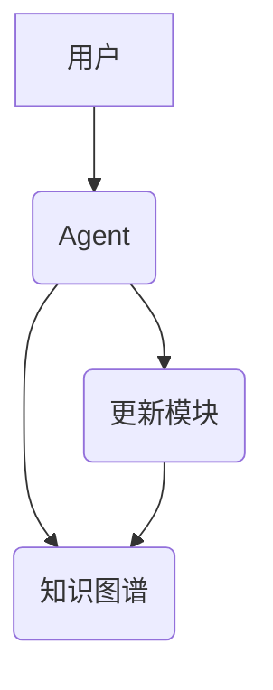
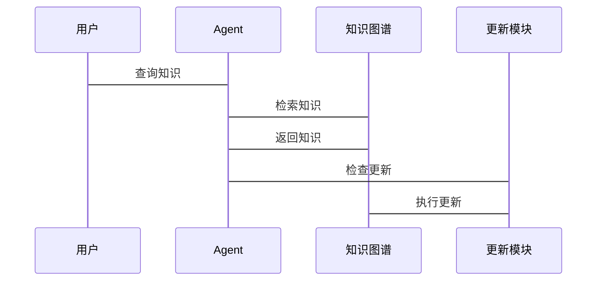
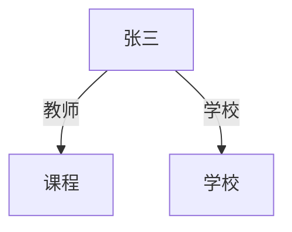
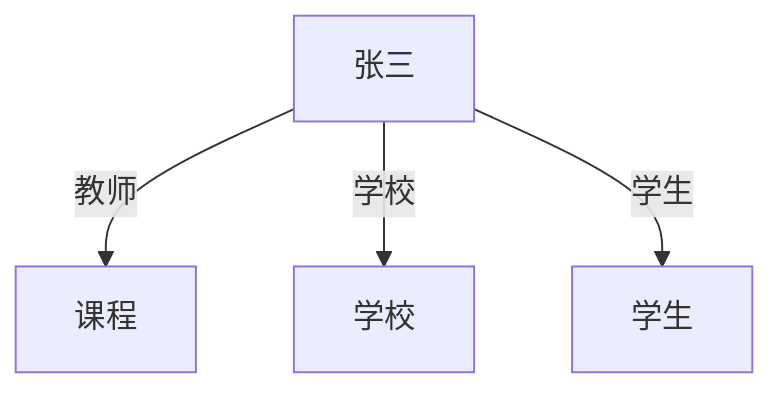

                 


# 构建AI Agent的动态知识图谱更新系统

> 关键词：AI Agent，动态知识图谱，知识更新，知识图谱表示，动态更新算法

> 摘要：本文详细探讨了如何构建一个高效的AI Agent动态知识图谱更新系统。从背景介绍到核心概念，再到算法原理、系统架构设计和项目实战，本文全面解析了该系统的构建过程，结合实际案例和代码实现，为读者提供了一套完整的解决方案。

---

# 第一部分：AI Agent与动态知识图谱概述

## 第1章：AI Agent与动态知识图谱概述

### 1.1 问题背景与挑战

#### 1.1.1 知识图谱的定义与作用
知识图谱是一种以图结构形式表示知识的数据库，由实体（概念）和关系（属性）组成。它能够帮助AI Agent理解语义和上下文，从而更好地完成任务。

#### 1.1.2 动态知识图谱的更新需求
知识图谱需要实时更新以反映最新信息，例如新增实体、修改关系或删除过时数据。动态更新是确保知识图谱准确性和有效性的关键。

#### 1.1.3 AI Agent在动态知识图谱中的角色
AI Agent作为知识图谱的管理者和使用者，负责监控数据变化、触发更新操作，并利用更新后的知识进行推理和决策。

### 1.2 问题描述与目标

#### 1.2.1 知识图谱动态更新的核心问题
- 实体与关系的动态变化
- 更新操作的事务管理
- 更新后知识图谱的重构与一致性维护

#### 1.2.2 AI Agent的动态知识更新需求
- 实时获取最新知识
- 灵活的更新策略（时间驱动、事件驱动、用户反馈驱动）
- 高效的知识检索与推理能力

#### 1.2.3 系统设计的目标与边界
- 目标：构建一个高效、可靠的动态知识图谱更新系统。
- 边界：专注于知识图谱的更新机制，不涉及具体AI Agent的任务执行。

### 1.3 解决方案与实现路径

#### 1.3.1 知识图谱动态更新的实现方法
- 增量更新：仅更新变化的部分，减少计算开销。
- 分布式更新：在分布式环境中高效处理大规模数据。

#### 1.3.2 AI Agent的知识获取与更新机制
- 主动获取：定期从数据源拉取最新信息。
- 被动触发：根据特定事件或用户反馈启动更新。

#### 1.3.3 系统架构的设计思路
- 分层架构：将系统划分为数据层、逻辑层和应用层，便于管理和扩展。
- 高可用性：确保系统在更新过程中不会中断AI Agent的正常使用。

### 1.4 核心概念与系统架构

#### 1.4.1 知识图谱的实体与关系
- 实体：知识图谱中的基本单元，如“人”、“地点”、“事件”。
- 关系：实体之间的连接，如“人住在地点”、“人参加事件”。

#### 1.4.2 动态更新的触发条件与策略
- 时间驱动：定期自动更新。
- 事件驱动：检测到特定事件时触发更新。
- 用户反馈驱动：根据用户反馈启动更新。

#### 1.4.3 AI Agent的知识表示与推理
- 知识表示：使用图结构表示知识，支持语义理解和推理。
- 推理机制：基于知识图谱进行逻辑推理，辅助决策。

### 1.5 本章小结
本章介绍了AI Agent和动态知识图谱的基本概念，分析了动态更新的必要性和挑战，并提出了系统的总体设计思路。

---

# 第二部分：知识图谱的表示与存储

## 第2章：知识图谱的表示与存储

### 2.1 知识图谱的表示方法

#### 2.1.1 RDF与三元组表示
RDF（Resource Description Framework）使用三元组（主语-谓词-宾语）表示知识，例如：“张三 is a 教师”。

#### 2.1.2 图嵌入与向量表示
通过图嵌入算法（如Word2Vec、GraphSAGE）将图结构转化为低维向量，便于机器学习模型处理。

#### 2.1.3 知识图谱的层次化结构
将知识图谱组织成层次化的树结构，便于分类和检索。

### 2.2 知识图谱的动态更新机制

#### 2.2.1 实体新增与删除的处理
- 新增实体：在知识图谱中添加新的三元组。
- 删除实体：删除相关的三元组，并处理依赖关系。

#### 2.2.2 关系更新的算法实现
- 更新关系：修改或删除实体之间的关系，可能需要重构部分图结构。

#### 2.2.3 更新后的知识图谱重构
在更新后，需要重构知识图谱以保持一致性，并优化存储结构。

### 2.3 知识图谱的存储与管理

#### 2.3.1 图数据库的选择与设计
选择适合的图数据库（如Neo4j、AllegroGraph），并设计合理的存储模型。

#### 2.3.2 分布式知识图谱的存储方案
在分布式系统中，采用分片存储和分布式事务管理，确保数据一致性。

#### 2.3.3 更新操作的事务管理
使用事务机制确保更新操作的原子性、一致性、隔离性和持久性。

### 2.4 本章小结
本章详细介绍了知识图谱的表示方法和动态更新机制，分析了存储与管理的关键问题，并提出了相应的解决方案。

---

# 第三部分：AI Agent的知识获取与更新算法

## 第3章：AI Agent的知识获取与更新算法

### 3.1 知识抽取与表示

#### 3.1.1 文本挖掘与信息抽取
从文本中提取实体、关系和事件信息，构建知识图谱。

#### 3.1.2 知识图谱的构建方法
使用爬虫、自然语言处理和数据集成技术构建知识图谱。

#### 3.1.3 知识表示的标准化
将不同来源的知识进行标准化处理，确保一致性。

### 3.2 知识融合与冲突处理

#### 3.2.1 多源知识的融合策略
- 合并实体：处理重复实体，统一标识。
- 合并关系：处理多个相同或相似的关系。

#### 3.2.2 知识冲突的检测与解决
- 冲突检测：发现知识中的矛盾。
- 冲突解决：基于规则或人工干预消除冲突。

#### 3.2.3 知识融合的算法实现
使用图匹配算法（如最大匹配算法）和冲突解决策略，实现多源知识的融合。

### 3.3 知识更新的触发条件

#### 3.3.1 时间驱动的更新策略
定期检查知识图谱，更新过时的信息。

#### 3.3.2 事件驱动的更新机制
检测到相关事件（如实体属性变化）时，启动更新操作。

#### 3.3.3 用户反馈驱动的更新方法
根据用户反馈（如纠错、新增需求）动态更新知识图谱。

### 3.4 本章小结
本章探讨了AI Agent的知识获取与更新算法，分析了知识融合和冲突处理的关键问题，并提出了动态更新的触发策略。

---

# 第四部分：系统架构与实现

## 第4章：系统架构设计

### 4.1 系统功能设计

#### 4.1.1 知识图谱的动态更新功能
- 实体与关系的新增、修改和删除。
- 更新操作的事务管理。
- 更新后知识图谱的重构与优化。

#### 4.1.2 AI Agent的知识检索与推理
- 基于知识图谱的语义检索。
- 基于规则或学习的推理算法。

### 4.2 系统架构设计

#### 4.2.1 系统架构图


#### 4.2.2 系统功能模块
- 知识图谱存储模块：负责存储和管理知识图谱数据。
- 更新触发模块：检测更新条件并触发更新操作。
- 更新执行模块：执行具体的更新操作，如新增、修改、删除。

### 4.3 系统接口设计

#### 4.3.1 系统接口
- API接口：提供RESTful API供AI Agent调用。
- 数据接口：与数据源对接，获取最新知识。

### 4.4 系统交互设计

#### 4.4.1 交互流程图


### 4.5 本章小结
本章详细设计了系统的架构，包括功能模块、接口和交互流程，确保系统的高效运行和管理。

---

# 第五部分：项目实战

## 第5章：项目实战

### 5.1 环境配置

#### 5.1.1 系统环境
- 操作系统：Linux/Windows
- 开发工具：Python、Jupyter Notebook
- 数据库：Neo4j图数据库

#### 5.1.2 依赖安装
- Python库：networkx、py2neo
- 图数据库：Neo4j社区版

### 5.2 核心代码实现

#### 5.2.1 知识图谱的表示与存储
```python
# 使用NetworkX表示知识图谱
import networkx as nx

G = nx.Graph()
G.add_nodes_from(["张三", "教师", "学校"])
G.add_edges_from([("张三", "教师"), ("张三", "学校")])
```

#### 5.2.2 动态更新算法实现
```python
# 更新知识图谱的函数
def update_knowledge_graph(G, entity, relation, value):
    # 检测实体是否存在
    if entity in G.nodes():
        # 更新关系
        G.add_edge(entity, relation, label=value)
    else:
        # 新增实体
        G.add_node(entity)
        G.add_edge(entity, relation, label=value)
    return G
```

#### 5.2.3 知识推理与应用
```python
# 基于规则的推理
def infer(G, entity):
    for neighbor in G.neighbors(entity):
        if G.get_edge_data(entity, neighbor)[0]['label'] == '属于':
            return neighbor
    return None
```

### 5.3 案例分析与结果展示

#### 5.3.1 更新前的知识图谱


#### 5.3.2 更新后的知识图谱


### 5.4 项目总结

#### 5.4.1 知识图谱更新的实现效果
- 成功实现了知识图谱的动态更新。
- 更新操作不影响知识图谱的其他部分。

#### 5.4.2 系统性能与优化
- 更新操作的时间复杂度：O(n)，n为更新涉及的实体数量。
- 优化方向：优化图数据库的查询效率和分布式更新的性能。

### 5.5 本章小结
本章通过实际项目展示了知识图谱动态更新系统的实现过程，验证了系统的可行性和有效性。

---

# 第六部分：最佳实践与总结

## 第6章：最佳实践与总结

### 6.1 最佳实践

#### 6.1.1 知识图谱的管理
- 定期备份：防止数据丢失。
- 权限控制：确保数据安全。

#### 6.1.2 动态更新的优化
- 使用增量更新减少计算开销。
- 采用分布式架构处理大规模数据。

#### 6.1.3 系统的可扩展性
- 支持多种数据源：如文本、数据库、API。
- 灵活的更新策略：根据需求选择合适的更新方式。

### 6.2 小结

#### 6.2.1 本文总结
本文详细探讨了AI Agent动态知识图谱更新系统的构建过程，从理论到实践，全面解析了系统的设计与实现。

#### 6.2.2 注意事项
- 更新操作需要考虑一致性。
- 知识图谱的规模可能影响性能。

#### 6.2.3 拓展阅读
- 图嵌入算法的研究进展。
- 分布式知识图谱的优化方法。

### 6.3 本章小结
本文总结了构建AI Agent动态知识图谱更新系统的最佳实践，为读者提供了实际应用的参考。

---

# 作者：AI天才研究院（AI Genius Institute） & 禅与计算机程序设计艺术（Zen And The Art of Computer Programming）

---

以上是《构建AI Agent的动态知识图谱更新系统》的完整目录和文章内容，涵盖了从背景介绍到系统实现的全过程。通过清晰的逻辑和专业的技术语言，本文为读者提供了一个全面的解决方案，帮助他们理解和实现AI Agent的动态知识图谱更新系统。

