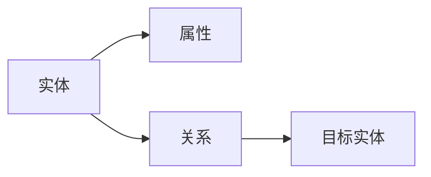
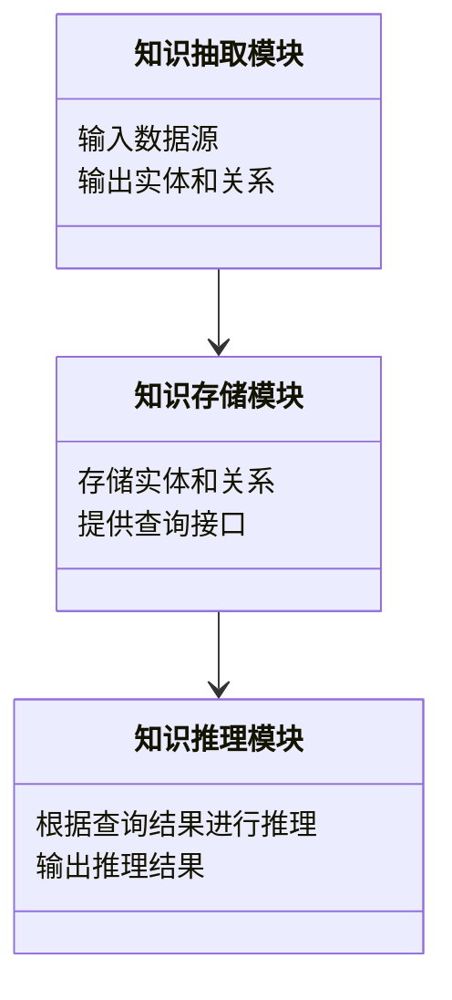
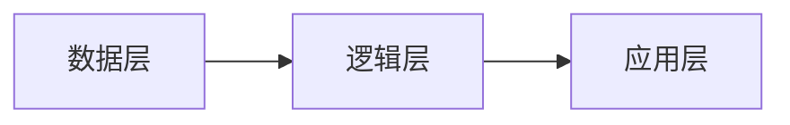

                 


# 构建AI Agent的动态知识图谱：实时更新与推理

**关键词**：AI Agent，知识图谱，动态更新，实时推理，系统架构，算法原理

**摘要**：  
本文探讨了如何构建AI Agent的动态知识图谱，重点分析了实时更新与推理的关键技术。从动态知识图谱的基本概念出发，详细阐述了其在AI Agent中的应用，包括知识图谱的构建算法、动态更新机制、推理方法以及系统架构设计。通过实际案例分析和代码实现，为读者提供全面的技术指导，帮助其掌握动态知识图谱在AI Agent中的构建与应用。

---

## 第一部分: 动态知识图谱与AI Agent概述

### 第1章: 动态知识图谱与AI Agent的背景介绍

#### 1.1 知识图谱的基本概念

##### 1.1.1 知识图谱的定义  
知识图谱是一种以结构化方式表示知识的网络，由实体（概念或对象）及其之间的关系组成。例如，知识图谱可以表示为“人”与“职位”之间的关系，如“张三担任CEO”。

##### 1.1.2 知识图谱的构建过程  
构建知识图谱通常包括数据抽取、实体识别、关系抽取和知识融合等步骤。例如，从文本中提取实体并建立它们之间的关系。

##### 1.1.3 知识图谱的表示方法  
知识图谱可以用图论中的图结构表示，节点表示实体，边表示关系。例如，使用RDF（Resource Description Framework）或图嵌入方法（如Node2Vec）表示。

#### 1.2 AI Agent的基本概念

##### 1.2.1 AI Agent的定义  
AI Agent是一种智能实体，能够感知环境并采取行动以实现目标。例如，智能音箱能够理解用户的语音指令并执行操作。

##### 1.2.2 AI Agent的核心功能  
AI Agent的核心功能包括感知环境、推理、决策和执行。例如，智能助手能够通过自然语言处理技术理解用户需求并提供解决方案。

##### 1.2.3 AI Agent的应用场景  
AI Agent广泛应用于智能助手、推荐系统、自动驾驶等领域。例如，Siri和Alexa是典型的AI Agent应用。

#### 1.3 动态知识图谱与AI Agent的关系

##### 1.3.1 动态知识图谱的特性  
动态知识图谱具有实时更新、可扩展性和自适应性等特点。例如，实时更新确保知识图谱能够反映最新信息。

##### 1.3.2 AI Agent对知识图谱的需求  
AI Agent需要动态知识图谱来支持实时推理和决策。例如，自动驾驶系统需要实时更新的道路信息来做出准确的导航决策。

##### 1.3.3 动态知识图谱在AI Agent中的作用  
动态知识图谱为AI Agent提供了动态知识支持，使其能够适应环境变化并做出实时决策。例如，在医疗领域，动态知识图谱可以帮助AI Agent实时更新疾病信息，辅助医生进行诊断。

---

### 第2章: 动态知识图谱的核心概念与联系

#### 2.1 知识图谱的核心要素

##### 2.1.1 实体与属性  
实体是知识图谱的基本单元，属性描述实体的特征。例如，“张三”是实体，其属性包括“姓名”、“年龄”等。

##### 2.1.2 关系与边  
关系描述实体之间的关联。例如，“张三”与“职位”之间的关系可以表示为“担任”。

##### 2.1.3 知识图谱的结构  
知识图谱通常采用层次化结构或网状结构。例如，层次化结构可以将实体按类别组织，如“人物”、“组织”等。

#### 2.2 动态知识图谱的更新机制

##### 2.2.1 数据源的实时更新  
动态知识图谱需要实时从多源数据中抽取新信息并更新知识图谱。例如，社交网络上的实时信息可以用来更新用户的最新状态。

##### 2.2.2 知识图谱的增量更新  
增量更新只对新增或变化的部分进行处理，以提高效率。例如，当检测到某个实体的属性发生变化时，仅更新该部分信息。

##### 2.2.3 更新策略与算法  
更新策略包括基于规则的更新和基于机器学习的更新。例如，基于规则的更新可以定义一些条件，当满足条件时触发更新。

#### 2.3 知识图谱与AI Agent的实体关系图



---

### 第3章: 动态知识图谱的算法原理

#### 3.1 知识图谱的构建算法

##### 3.1.1 基于规则的构建算法  
基于规则的算法通过预定义规则从文本中抽取实体和关系。例如，使用正则表达式从简历中提取“姓名”、“职位”等信息。

##### 3.1.2 基于学习的构建算法  
基于学习的算法利用机器学习模型（如CRF）从文本中抽取实体和关系。例如，使用深度学习模型（如BERT）进行关系抽取。

##### 3.1.3 深度学习模型在知识图谱构建中的应用  
深度学习模型（如Graph Neural Networks）可以用于构建知识图谱。例如，使用GAT（Graph Attention Network）进行图结构学习。

#### 3.2 动态知识图谱的更新算法

##### 3.2.1 基于规则的更新算法  
基于规则的更新算法通过预定义规则检测变化并更新知识图谱。例如，当检测到某个实体的属性发生变化时，触发更新。

##### 3.2.2 基于概率的更新算法  
基于概率的更新算法通过概率模型评估信息的变化并进行更新。例如，使用贝叶斯网络评估某个实体的最新状态。

##### 3.2.3 基于图嵌入的更新算法  
基于图嵌入的更新算法通过嵌入向量表示节点，并根据新信息更新向量。例如，使用Node2Vec进行节点嵌入更新。

#### 3.3 算法的数学模型与公式

##### 3.3.1 知识图谱表示的数学模型  
知识图谱可以用图论中的三元组表示：
$$
E = \{ (e_1, r, e_2) \}
$$  
其中，$e_1$和$e_2$是实体，$r$是它们之间的关系。

##### 3.3.2 动态更新的数学公式  
动态更新可以通过增量更新公式表示：
$$
\Delta E = E_{\text{new}} \setminus E_{\text{old}}
$$  
其中，$E_{\text{new}}$是更新后的知识图谱，$E_{\text{old}}$是旧的知识图谱。

---

### 第4章: 系统分析与架构设计方案

#### 4.1 系统功能设计

##### 4.1.1 知识抽取模块  
知识抽取模块负责从多源数据中抽取实体和关系。例如，从文本、数据库中抽取信息。

##### 4.1.2 知识存储模块  
知识存储模块负责存储抽取的实体和关系，并支持高效的查询和更新操作。例如，使用图数据库（如Neo4j）存储知识图谱。

##### 4.1.3 知识推理模块  
知识推理模块负责根据知识图谱进行推理和生成新的知识。例如，通过规则推理或机器学习模型进行推理。

#### 4.2 系统架构设计

##### 4.2.1 领域模型设计  
领域模型描述系统的核心功能模块及其交互关系。例如，知识抽取模块与知识存储模块之间的数据流。



##### 4.2.2 系统架构设计  
系统架构采用分层设计，包括数据层、逻辑层和应用层。例如，数据层负责存储，逻辑层负责推理，应用层负责与用户交互。



##### 4.2.3 系统接口设计  
系统接口包括数据输入接口、知识查询接口和推理结果输出接口。例如，通过REST API提供接口服务。

##### 4.2.4 系统交互设计  
系统交互设计描述用户与系统之间的交互流程。例如，用户通过API提交查询请求，系统返回推理结果。

---

### 第5章: 项目实战

#### 5.1 环境安装

##### 5.1.1 安装Python环境  
安装Python 3.8及以上版本。例如，使用Anaconda安装Python环境。

##### 5.1.2 安装相关库  
安装必要的库，如Neo4j用于知识存储，networkx用于图分析。例如，使用pip安装库：
```
pip install neo4j networkx
```

#### 5.2 系统核心实现源代码

##### 5.2.1 知识抽取模块  
实现从文本中抽取实体和关系的代码示例：
```python
from spacy.lang.zh import Chinese
import spacy

# 加载中文分词模型
nlp = Chinese()
doc = nlp("张三担任CEO职位。")

# 提取实体
entities = [(ent.text, ent.label_) for ent in doc.ents]

# 提取关系
relations = []
for i, token in enumerate(doc):
    if token.dep_ == "ROOT":
        relations.append((token.text, i))
```

##### 5.2.2 知识存储模块  
实现将实体和关系存储到Neo4j中的代码示例：
```python
from neo4j import GraphDatabase

# 连接到Neo4j实例
driver = GraphDatabase.driver("bolt://localhost:7687", auth=("neo4j", "password"))

# 创建节点和关系
def create_entity(tx, entity_type, entity_name):
    tx.run("CREATE (n:{EntityType} {{ name: '{EntityType}' }}) RETURN n", EntityType=entity_type)
    
with driver.session() as session:
    session.write_transaction(create_entity, "Person", "张三")
    session.write_transaction(create_entity, "Position", "CEO")
    session.write_transaction(lambda tx: tx.run("MATCH (a:Person {name: '张三'}), (b:Position {name: 'CEO'}) CREATE (a)-[r:HAS_ROLE]->(b)"))
```

##### 5.2.3 知识推理模块  
实现基于规则的推理算法：
```python
def infer_new_knowledge(old_knowledge, new_data):
    # 简单的推理逻辑，可以根据具体需求扩展
    inferred = []
    for relation in old_knowledge:
        if relation[0] in new_data:
            inferred.append((relation[0], relation[1], relation[2]))
    return inferred
```

#### 5.3 实际案例分析

##### 5.3.1 案例背景  
假设我们正在构建一个智能助手的知识图谱，需要实时更新用户的最新状态。

##### 5.3.2 数据来源  
数据来源包括用户的输入、外部数据库和实时传感器数据。

##### 5.3.3 知识抽取与存储  
从用户的输入中抽取实体和关系，并将其存储到知识图谱中。

##### 5.3.4 动态更新与推理  
根据实时数据更新知识图谱，并通过推理模块生成新的知识。

#### 5.4 代码应用解读与分析  
通过代码示例分析，展示如何实现知识抽取、存储和推理模块。

#### 5.5 项目小结  
总结项目实现的关键点，包括算法选择、系统设计和实现难点。

---

## 第六章: 最佳实践与总结

### 6.1 最佳实践

#### 6.1.1 数据源的多样性  
尽量使用多种数据源以提高知识图谱的准确性和全面性。

#### 6.1.2 更新策略的合理性  
根据具体需求选择合适的更新策略，平衡更新频率和系统性能。

#### 6.1.3 系统架构的可扩展性  
设计可扩展的系统架构，以应对未来的需求变化。

### 6.2 小结  
总结本文的主要内容，强调动态知识图谱在AI Agent中的重要性。

### 6.3 注意事项  
在实际应用中，需要注意数据质量和系统性能，确保知识图谱的实时更新和高效推理。

### 6.4 拓展阅读  
推荐进一步阅读的知识图谱和AI Agent相关的文献和资源。

---

## 作者：AI天才研究院/AI Genius Institute & 禅与计算机程序设计艺术 /Zen And The Art of Computer Programming

