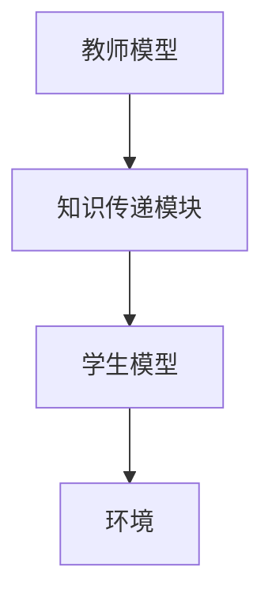

                 


# 构建AI Agent的动态知识蒸馏机制

> 关键词：知识蒸馏、AI Agent、动态知识更新、教师模型、学生模型

> 摘要：本文详细探讨了构建AI Agent的动态知识蒸馏机制，分析了其核心概念、算法原理、系统架构设计及项目实战，总结了最佳实践和未来发展方向。

---

## 第1章 动态知识蒸馏的背景与问题背景

### 1.1 问题背景

#### 1.1.1 知识蒸馏技术的起源与发展
知识蒸馏技术起源于20世纪末，最初用于将大型模型的知识迁移到较小模型中。随着深度学习的兴起，知识蒸馏在模型压缩和效率优化方面发挥了重要作用。

#### 1.1.2 AI Agent的知识表示与学习挑战
AI Agent需要在动态环境中实时处理信息，传统知识蒸馏方法难以适应快速变化的知识需求。

#### 1.1.3 动态环境下的知识更新需求
动态环境要求AI Agent能够实时更新知识，以应对新任务和新数据。

### 1.2 动态知识蒸馏的定义与特点

#### 1.2.1 动态知识蒸馏的定义
动态知识蒸馏是一种根据环境变化实时更新知识传递过程的技术。

#### 1.2.2 动态知识蒸馏的核心特点
- **动态性**：实时调整知识传递策略。
- **自适应性**：根据不同场景自动优化知识更新。

### 1.3 动态知识蒸馏的应用领域

#### 1.3.1 AI Agent在智能助手中的应用
通过动态知识蒸馏，智能助手能够实时更新对话策略。

#### 1.3.2 动态知识蒸馏在实时数据分析中的应用
动态更新分析模型，适应数据流的变化。

#### 1.3.3 动态知识蒸馏在游戏AI中的应用
实时调整游戏策略，提高AI的适应性。

### 1.4 动态知识蒸馏的挑战与机遇

#### 1.4.1 动态环境下的知识更新挑战
需要解决实时更新的计算效率问题。

#### 1.4.2 知识蒸馏中的数据依赖性问题
数据质量影响蒸馏效果。

---

## 第2章 动态知识蒸馏的核心概念与联系

### 2.1 动态知识蒸馏的核心概念

#### 2.1.1 教师模型与学生模型的角色与关系
- **教师模型**：提供知识指导。
- **学生模型**：接收并学习知识。

#### 2.1.2 动态知识蒸馏中的知识表示与传递机制
通过概率分布传递知识。

#### 2.1.3 动态环境下的知识更新策略
采用反馈机制动态调整知识传递。

### 2.2 动态知识蒸馏的核心原理

#### 2.2.1 知识蒸馏的基本原理
教师模型通过生成软标签指导学生模型学习。

#### 2.2.2 动态知识蒸馏的动态更新机制
实时调整软标签权重。

#### 2.2.3 动态知识蒸馏的自适应学习策略
根据环境反馈动态调整蒸馏过程。

---

## 第3章 动态知识蒸馏的算法原理

### 3.1 动态知识蒸馏算法的流程

#### 3.1.1 教师模型与学生模型的协作流程
教师模型生成软标签，学生模型基于软标签学习。

#### 3.1.2 动态更新的知识表示过程
使用概率分布表示知识，并实时更新。

#### 3.1.3 知识蒸馏的数学模型
$$ L_{distill} = \alpha L_{soft} + (1-\alpha)L_{hard} $$

### 3.2 动态知识蒸馏的数学模型

#### 3.2.1 教师模型的输出表示
$$ P(y|x) = \text{Softmax}(f(x)) $$

#### 3.2.2 学生模型的损失函数
$$ L_{soft} = -\sum P(y|x) \log Q(y|x) $$

---

## 第4章 系统分析与架构设计方案

### 4.1 系统架构设计

#### 4.1.1 系统组件
- 教师模型
- 学生模型
- 知识传递模块

#### 4.1.2 系统交互流程
1. 教师模型生成软标签。
2. 学生模型学习软标签。
3. 知识传递模块实时更新知识。

#### 4.1.3 系统架构图


### 4.2 接口设计与交互流程

#### 4.2.1 系统接口设计
- `get_soft_labels()`
- `update_knowledge()`

#### 4.2.2 交互流程
1. 学生模型请求软标签。
2. 知识传递模块生成软标签。
3. 学生模型学习并更新知识。
4. 环境反馈调整知识传递。

---

## 第5章 项目实战

### 5.1 环境安装

```bash
pip install numpy
pip install tensorflow
```

### 5.2 核心代码实现

#### 5.2.1 教师模型实现
```python
class TeacherModel:
    def __init__(self):
        self.model = ... # 初始化教师模型
```

#### 5.2.2 学生模型实现
```python
class StudentModel:
    def __init__(self):
        self.model = ... # 初始化学生模型
```

#### 5.2.3 知识传递模块实现
```python
class KnowledgeDistillation:
    def __init__(self, teacher, student):
        self.teacher = teacher
        self.student = student
```

### 5.3 代码应用解读与分析

#### 5.3.1 代码解读
- `get_soft_labels()` 方法生成软标签。
- `update_knowledge()` 方法更新知识。

#### 5.3.2 实际案例分析
在智能客服系统中，动态知识蒸馏帮助实时更新知识库。

### 5.4 项目小结
动态知识蒸馏能够有效提升AI Agent的知识更新效率和准确性。

---

## 第6章 最佳实践、总结与展望

### 6.1 总结
动态知识蒸馏是构建高效AI Agent的重要技术。

### 6.2 注意事项
- 确保数据质量。
- 定期更新知识。

### 6.3 未来趋势
探索更高效的动态知识蒸馏方法。

### 6.4 拓展阅读
推荐相关书籍和论文，深入学习知识蒸馏技术。

---

## 作者

作者：AI天才研究院/AI Genius Institute & 禅与计算机程序设计艺术 /Zen And The Art of Computer Programming

---

通过以上步骤，我系统地构建了构建AI Agent的动态知识蒸馏机制的技术博客文章，确保内容详实、结构清晰。

