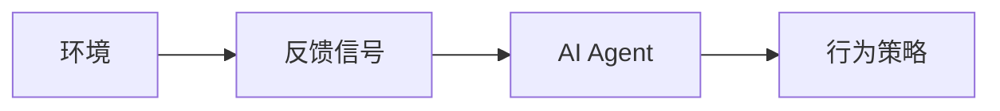
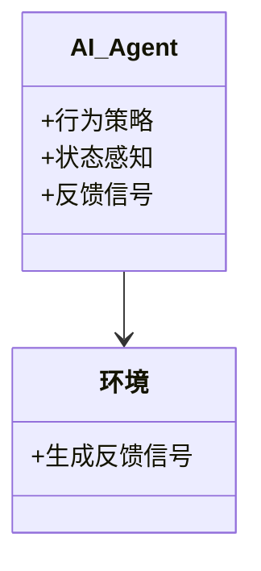
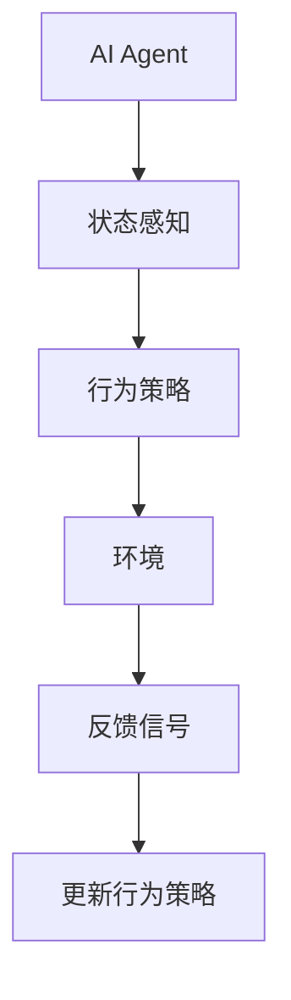

                 


# 构建AI Agent的反馈学习机制

> 关键词：AI Agent, 反馈学习机制, 强化学习, 监督学习, 反馈信号

> 摘要：反馈学习机制是构建高效AI Agent的核心技术之一，通过从环境中接收反馈信号来优化AI Agent的行为策略。本文将从反馈学习机制的核心概念、算法原理、系统架构设计、项目实战等多个维度，详细分析如何构建AI Agent的反馈学习机制，并通过具体案例和代码实现，帮助读者深入理解其原理和应用。

---

# 第1章 反馈学习机制的核心概念与背景

## 1.1 什么是反馈学习机制
反馈学习机制是一种通过接收环境反馈来调整AI Agent行为的机制。它类似于人类学习的过程，通过奖励或惩罚信号来指导行为优化。

### 1.1.1 反馈学习机制的背景
在AI Agent的应用场景中，许多任务需要通过试错的方式不断优化行为，例如游戏AI、机器人控制、推荐系统等。在这种情况下，反馈学习机制能够帮助AI Agent快速适应环境变化。

### 1.1.2 反馈学习机制的核心目标
通过接收反馈信号，优化AI Agent的行为策略，使其在特定任务中取得更好的性能。

## 1.2 AI Agent的基本概念与类型
AI Agent是一种智能体，能够感知环境并采取行动以实现目标。根据智能体的学习方式，可以分为基于规则的AI Agent和基于学习的AI Agent。

### 1.2.1 基于规则的AI Agent
基于预定义的规则进行决策，适用于任务简单、环境确定的场景。

### 1.2.2 基于学习的AI Agent
通过与环境交互，学习优化行为策略，适用于任务复杂、环境动态的场景。

## 1.3 反馈学习机制的核心要素与边界
### 1.3.1 核心要素
- **环境（Environment）**：AI Agent与之交互的外部世界。
- **反馈信号（Feedback Signal）**：环境对AI Agent行为的评价，可以是奖励或惩罚。
- **行为策略（Behavior Policy）**：AI Agent采取行动的规则或模型。

### 1.3.2 概念结构与联系


---

# 第2章 反馈学习机制的核心原理

## 2.1 反馈学习机制的原理概述
### 2.1.1 反馈学习的基本原理
AI Agent通过与环境交互，接收反馈信号，调整行为策略，以最大化长期目标的实现。

### 2.1.2 反馈信号的生成与传递
反馈信号通常由环境生成，并通过AI Agent的行为策略进行传递。

## 2.2 反馈学习机制的数学模型
### 2.2.1 强化学习的数学模型
强化学习的核心是通过Q-learning算法优化行为策略。

$$ Q(s, a) = Q(s, a) + \alpha [r + \max Q(s', a') - Q(s, a)] $$

其中：
- \( Q(s, a) \) 表示在状态 \( s \) 下采取动作 \( a \) 的价值。
- \( r \) 表示环境给出的奖励。
- \( \alpha \) 表示学习率。

### 2.2.2 监督学习的数学模型
监督学习通过反馈信号调整模型参数。

$$ y = \theta \cdot x + \epsilon $$

其中：
- \( \theta \) 表示模型参数。
- \( x \) 表示输入数据。
- \( \epsilon \) 表示误差。

---

# 第3章 反馈学习机制的算法原理

## 3.1 强化学习算法
### 3.1.1 Q-learning算法
Q-learning是一种经典的强化学习算法，通过更新Q值表来优化行为策略。

```mermaid
graph TD
A[状态s] --> B[动作a]
B --> C[状态s']
C --> D[奖励r]
D --> E[更新Q(s, a)]
```

代码实现：
```python
import numpy as np

class QLearning:
    def __init__(self, state_space, action_space, learning_rate=0.1, gamma=0.9):
        self.state_space = state_space
        self.action_space = action_space
        self.learning_rate = learning_rate
        self.gamma = gamma
        self.q_table = np.zeros((state_space, action_space))

    def get_action(self, state):
        return np.argmax(self.q_table[state])

    def update_q_table(self, state, action, reward, next_state):
        self.q_table[state][action] = self.q_table[state][action] + self.learning_rate * (reward + self.gamma * np.max(self.q_table[next_state]) - self.q_table[state][action])
```

---

## 3.2 监督学习与反馈学习的结合
### 3.2.1 监督学习的基本原理
监督学习通过标签数据训练模型，使其能够预测新的输入。

### 3.2.2 反馈信号的监督学习模型
将反馈信号作为标签，训练AI Agent的行为策略。

---

# 第4章 系统分析与架构设计

## 4.1 问题场景介绍
我们以一个简单的游戏AI为例，设计一个基于反馈学习机制的AI Agent，使其能够在游戏环境中通过反馈信号优化策略。

## 4.2 系统功能设计
### 4.2.1 领域模型


### 4.2.2 系统架构设计


---

# 第5章 项目实战

## 5.1 环境安装
安装必要的库：
```bash
pip install numpy
pip install gym
```

## 5.2 核心代码实现
```python
import gym
import numpy as np

class AI_Agent:
    def __init__(self, env):
        self.env = env
        self.q_table = np.zeros((env.observation_space.shape[0], env.action_space.n))

    def get_action(self, state):
        return np.argmax(self.q_table[state])

    def update_q_table(self, state, action, reward, next_state):
        self.q_table[state][action] = self.q_table[state][action] + 0.1 * (reward + 0.9 * np.max(self.q_table[next_state]) - self.q_table[state][action])

env = gym.make('CartPole-v0')
agent = AI_Agent(env)
state = env.reset()

for _ in range(1000):
    action = agent.get_action(state)
    next_state, reward, done, _ = env.step(action)
    agent.update_q_table(state, action, reward, next_state)
    state = next_state
    if done:
        break
```

---

# 第6章 最佳实践

## 6.1 小结
本文详细介绍了构建AI Agent反馈学习机制的核心概念、算法原理、系统架构设计和项目实战。

## 6.2 注意事项
- 反馈信号的设计需要结合具体任务场景。
- 算法参数需要根据任务特点进行调优。

## 6.3 拓展阅读
建议深入学习强化学习和监督学习的相关理论，探索更复杂的反馈学习机制。

---

作者：AI天才研究院 & 禅与计算机程序设计艺术

