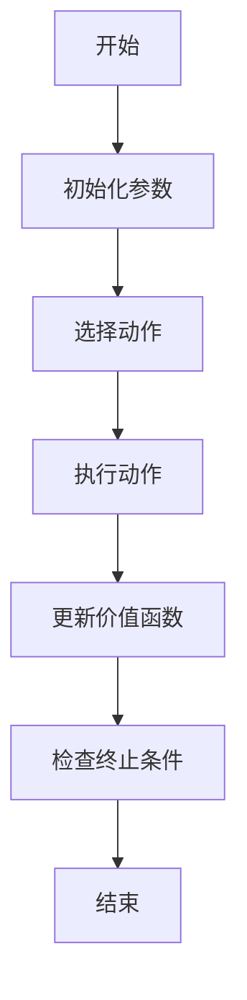
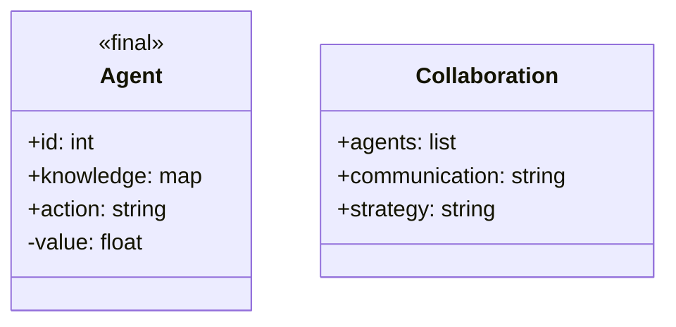

                 


# 构建AI Agent的多Agent协作学习系统

## 关键词：多智能体、协作学习、机器学习、分布式系统、人工智能、算法设计、系统架构

## 摘要：  
本文深入探讨了构建AI Agent的多Agent协作学习系统的理论基础、算法设计和系统架构。从背景与概念入手，详细分析了多Agent协作学习的核心原理，通过数学模型和算法流程图，阐述了系统的实现机制。同时，结合实际项目案例，展示了系统的应用场景和实现方法。本文旨在为读者提供一个多维度、系统化的视角，帮助理解并实践多Agent协作学习系统的设计与实现。

---

# 第1章 多Agent协作学习系统概述

## 1.1 多Agent协作学习的背景与问题背景

### 1.1.1 人工智能与Agent的基本概念
人工智能（AI）的目标是通过技术手段模拟人类的智能行为，而Agent（智能体）是实现这一目标的核心单元。Agent是指能够感知环境、做出决策并采取行动的实体，它可以是一个软件程序、机器人或其他智能设备。Agent的核心特征包括自主性、反应性、目标导向性和社交能力。

### 1.1.2 多Agent系统的发展历程
多Agent系统（Multi-Agent System，MAS）的发展经历了多个阶段。早期的研究主要集中在分布式问题求解和分布式计算上，随后逐渐引入了智能体的协作与通信机制。近年来，随着人工智能技术的快速发展，多Agent协作学习成为研究的热点，特别是在分布式任务分配、协作决策和群体智能等领域。

### 1.1.3 当前AI Agent协作学习的挑战与机遇
当前，AI Agent协作学习面临诸多挑战，例如如何在分布式环境下实现高效的知识共享、如何处理多智能体之间的博弈关系，以及如何确保系统的实时性和可靠性。然而，这些挑战也带来了巨大的机遇，尤其是在分布式计算、边缘计算和物联网等领域，多Agent协作学习技术的应用前景广阔。

---

## 1.2 多Agent协作学习的定义与问题描述

### 1.2.1 多Agent协作学习的定义
多Agent协作学习是指多个智能体在共同的目标驱动下，通过协作与交互，共同完成复杂任务的学习过程。与传统的单智能体学习不同，多Agent协作学习强调智能体之间的协作与通信，能够在动态和不确定的环境中实现更高效的任务完成。

### 1.2.2 多Agent协作学习的核心问题
多Agent协作学习的核心问题包括：
1. **知识共享与分布式学习**：如何在多个智能体之间高效共享知识，并实现分布式学习。
2. **协作策略设计**：如何设计智能体之间的协作策略，确保任务的高效完成。
3. **动态环境适应**：如何使系统能够在动态变化的环境中自适应地调整协作策略。

### 1.2.3 系统的边界与外延
多Agent协作学习系统的边界包括智能体的数量、任务的复杂性、环境的动态性以及智能体的自主性。系统的外延则涉及分布式计算、边缘计算、群体智能和人机协作等领域。

---

## 1.3 多Agent协作学习系统的组成与核心要素

### 1.3.1 Agent的基本属性与行为特征
智能体的基本属性包括：
- **自主性**：智能体能够自主决策和行动。
- **反应性**：智能体能够感知环境并做出实时反应。
- **目标导向性**：智能体具有明确的目标，并能够采取行动以实现目标。
- **社交能力**：智能体能够与其他智能体进行通信与协作。

### 1.3.2 多Agent协作学习系统的组成结构
多Agent协作学习系统通常由以下部分组成：
1. **智能体**：多个具有自主性和目标导向性的智能体。
2. **通信机制**：智能体之间进行信息交换的通信机制。
3. **协作策略**：智能体之间协作的规则和策略。
4. **学习机制**：智能体通过学习不断优化自身的知识和行为。

### 1.3.3 系统的核心要素与功能模块
系统的核心要素包括：
- **知识库**：存储智能体的知识和经验。
- **通信接口**：实现智能体之间的信息交换。
- **协作引擎**：负责智能体之间的协作与协调。
- **学习模块**：实现智能体的学习与知识更新。

---

## 1.4 本章小结
本章从背景与概念入手，详细介绍了多Agent协作学习的定义、核心问题以及系统的组成与核心要素。通过对比单智能体学习与多智能体协作学习的差异，强调了多智能体协作学习的重要性和复杂性。

---

# 第2章 多Agent协作学习的核心概念与联系

## 2.1 多Agent协作学习的核心概念原理

### 2.1.1 Agent的智能性与自主性
智能体的智能性体现在其感知、决策和行动能力上。自主性则是智能体能够独立完成任务的核心特征。

### 2.1.2 多Agent协作学习的基本原理
多Agent协作学习的核心原理在于通过智能体之间的协作与通信，实现知识共享和任务分配。智能体通过分布式学习和协作策略，共同完成复杂任务。

### 2.1.3 学习机制与协作机制的结合
学习机制负责智能体的知识更新，协作机制负责智能体之间的协作与协调。两者的结合是多Agent协作学习系统的核心。

---

## 2.2 核心概念属性特征对比表

### 表2-1: 单Agent与多Agent协作学习的对比

| 特性            | 单Agent学习       | 多Agent协作学习      |
|-----------------|------------------|---------------------|
| 知识共享        | 无               | 有                 |
| 任务分配        | 单一             | 分布式             |
| 协作能力        | 无               | 强                 |
| 系统复杂性      | 简单             | 复杂               |

---

## 2.3 多Agent协作学习系统的ER实体关系图

```mermaid
er
actor: 用户
agent: AI Agent
collaboration: 协作关系
learning_task: 学习任务
```

---

## 2.4 本章小结
本章通过对比和图表分析，详细阐述了多Agent协作学习的核心概念与联系。通过对比表格和实体关系图，帮助读者更好地理解多Agent协作学习系统的组成与运行机制。

---

# 第3章 多Agent协作学习算法原理

## 3.1 基础算法原理与流程

### 3.1.1 分散式学习算法
分散式学习算法是一种基于分布式计算的多Agent协作学习方法。每个智能体独立地进行学习，并通过通信共享知识。



### 3.1.2 集中式学习算法
集中式学习算法将所有智能体的学习任务集中在一个中央服务器上，通过集中式的方式进行知识更新。

### 3.1.3 联合学习算法
联合学习算法是一种结合分散式和集中式学习的算法，通过局部知识共享和全局优化实现协作学习。

---

## 3.2 多Agent协作学习的数学模型与公式

### 3.2.1 单Agent学习模型
单Agent学习模型的价值函数表示为：
$$ V(s) = \max_a Q(s,a) $$

### 3.2.2 多Agent协作学习模型
多Agent协作学习模型的价值函数表示为：
$$ V(s) = \sum_{i=1}^n V_i(s_i) $$

---

## 3.3 算法实现流程图
以下是多Agent协作学习算法的实现流程图：


---

## 3.4 本章小结
本章详细讲解了多Agent协作学习算法的原理与实现。通过数学模型和流程图，帮助读者理解多Agent协作学习的核心算法及其实现机制。

---

# 第4章 系统分析与架构设计

## 4.1 系统功能需求分析

### 4.1.1 系统目标与范围
系统的目标是实现多个智能体之间的协作学习，完成复杂任务。系统的范围包括智能体的通信、协作策略的设计与实现。

### 4.1.2 功能需求分解
系统的主要功能包括：
1. 智能体通信模块
2. 协作策略设计模块
3. 分布式学习模块
4. 知识共享模块

### 4.1.3 非功能需求
系统需要满足实时性、可靠性和可扩展性等非功能需求。

---

## 4.2 系统架构设计

### 4.2.1 领域模型
以下是系统的领域模型：



### 4.2.2 系统架构图
以下是系统的架构图：

```mermaid
container 多Agent协作学习系统 {
    component 智能体通信模块 {
        use 通信接口
    }
    component 协作策略设计模块 {
        use 协作引擎
    }
    component 分布式学习模块 {
        use 学习算法
    }
    component 知识共享模块 {
        use 知识库
    }
}
```

### 4.2.3 系统接口设计
系统的主要接口包括：
1. 智能体通信接口
2. 协作策略接口
3. 学习算法接口
4. 知识共享接口

---

## 4.3 本章小结
本章通过系统功能需求分析和架构设计，详细阐述了多Agent协作学习系统的实现方案。通过领域模型和架构图，帮助读者理解系统的整体结构与实现细节。

---

# 第5章 项目实战

## 5.1 环境安装与配置

### 5.1.1 环境要求
需要安装Python 3.8及以上版本，安装必要的库，如`numpy`, `scipy`, `matplotlib`等。

### 5.1.2 环境配置
以下是环境配置代码：

```bash
pip install numpy scipy matplotlib
```

---

## 5.2 系统核心实现源代码

### 5.2.1 智能体类实现
以下是智能体类的实现代码：

```python
class Agent:
    def __init__(self, id):
        self.id = id
        self.knowledge = {}
        self.value = 0.0
```

### 5.2.2 协作策略实现
以下是协作策略的实现代码：

```python
def collaboration_strategy(agents):
    # 实现协作策略
    pass
```

---

## 5.3 实际案例分析与详细解读

### 5.3.1 案例背景
假设我们有三个智能体，需要共同完成一个任务。

### 5.3.2 案例实现
以下是案例实现代码：

```python
agents = [Agent(1), Agent(2), Agent(3)]
collaboration_strategy(agents)
```

### 5.3.3 案例分析
通过上述代码，我们可以看到智能体之间的协作过程，以及协作策略的实现效果。

---

## 5.4 本章小结
本章通过实际项目的环境安装、代码实现和案例分析，帮助读者理解多Agent协作学习系统的实现过程。

---

# 第6章 最佳实践与注意事项

## 6.1 最佳实践

### 6.1.1 系统设计
在系统设计阶段，应充分考虑系统的可扩展性和可维护性。

### 6.1.2 代码实现
在代码实现阶段，应注重代码的可读性和可维护性。

### 6.1.3 系统优化
在系统优化阶段，应注重系统的性能和实时性。

---

## 6.2 小结
通过本文的讲解与分析，我们深入理解了多Agent协作学习系统的构建过程。在实际应用中，应注重系统的可扩展性、可维护性和性能优化。

---

## 6.3 注意事项

### 6.3.1 系统边界
在系统设计中，应明确系统的边界与外延。

### 6.3.2 智能体协作
在智能体协作中，应注重协作策略的设计与实现。

### 6.3.3 知识共享
在知识共享中，应注重知识的高效共享与更新。

---

## 6.4 拓展阅读
推荐读者阅读以下书籍和论文：
1. 《Multi-Agent Systems: Algorithmic, Complexity, and Theory》
2. 《Distributed Machine Learning in Multi-Agent Systems》

---

# 作者：AI天才研究院/AI Genius Institute & 禅与计算机程序设计艺术 /Zen And The Art of Computer Programming

---

通过本文的详细讲解与分析，我们深入探讨了多Agent协作学习系统的构建过程。从背景与概念、核心算法、系统架构到项目实战，本文为读者提供了一个全面的视角，帮助读者理解并实践多Agent协作学习系统的设计与实现。

