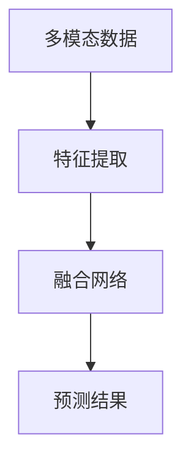
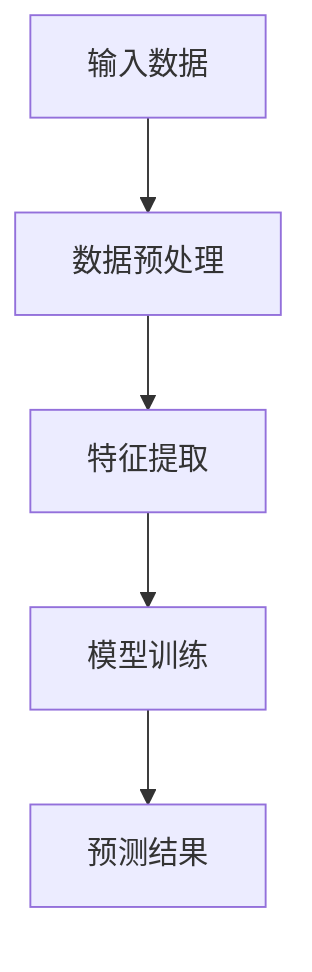
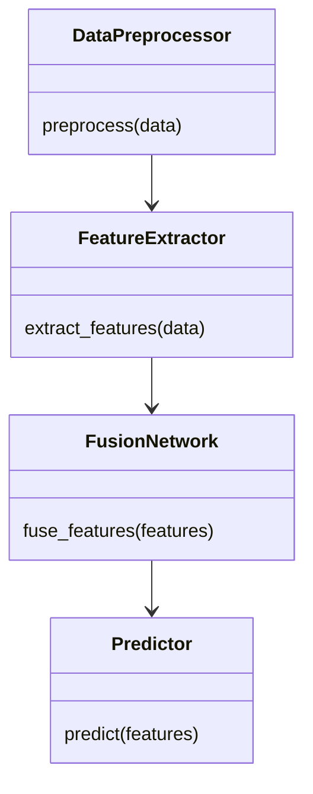
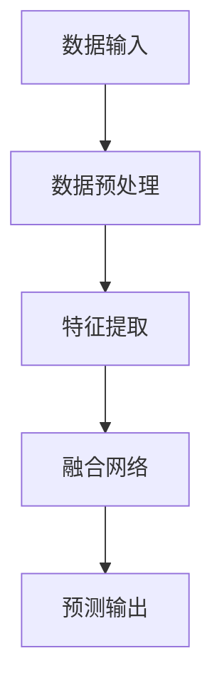
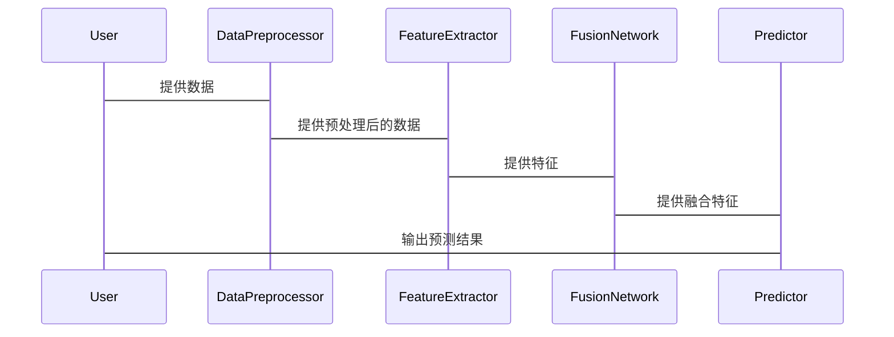

                 


# 构建AI Agent的多模态事件预测系统

> 关键词：AI Agent, 多模态数据, 事件预测, 系统架构, 机器学习

> 摘要：本文详细探讨了构建AI Agent的多模态事件预测系统的各个方面，包括背景介绍、核心概念、算法原理、系统架构设计、项目实战以及总结与展望。通过本文，读者可以系统地了解如何设计和实现一个高效的多模态事件预测系统，从而提升AI Agent的智能决策能力。

---

# 第一部分: AI Agent与多模态事件预测系统概述

# 第1章: 多模态事件预测系统背景介绍

## 1.1 问题背景

### 1.1.1 当前AI Agent的发展现状
AI Agent（人工智能代理）作为人工智能领域的重要组成部分，近年来取得了显著进展。从简单的规则驱动系统到复杂的深度学习模型，AI Agent的应用场景不断扩展，涵盖了自然语言处理、计算机视觉、机器人控制等多个领域。

### 1.1.2 多模态数据在AI Agent中的重要性
在现实世界中，信息的呈现方式是多样的，包括文本、图像、语音、视频等。单一模态的数据往往难以提供足够的信息来支持AI Agent的决策，而多模态数据的结合能够显著提升系统的感知能力和理解能力。

### 1.1.3 事件预测在AI Agent中的应用价值
事件预测是AI Agent的核心任务之一，它能够帮助系统提前预知潜在的事件，从而做出更优的决策。例如，在智能安防系统中，预测潜在的安全威胁；在自动驾驶中，预测其他交通参与者的行为。

## 1.2 问题描述

### 1.2.1 多模态数据的定义与特点
多模态数据是指由多种类型的数据组成，能够提供更全面的信息。例如，一段视频同时包含了视觉信息和听觉信息。

### 1.2.2 事件预测的核心问题
事件预测的核心问题是如何从多模态数据中提取有效的特征，并构建高效的预测模型。

### 1.2.3 AI Agent在事件预测中的角色
AI Agent通过多模态数据的融合、特征提取和模型训练，实现对事件的预测，并基于预测结果做出决策。

## 1.3 问题解决与边界

### 1.3.1 多模态事件预测系统的解决思路
通过多模态数据的融合，构建高效的事件预测模型，提升AI Agent的智能决策能力。

### 1.3.2 系统的边界与外延
系统的边界包括数据输入、模型训练和预测输出；外延则涉及数据源的获取和预测结果的应用。

### 1.3.3 核心要素与组成结构
系统的组成包括数据预处理模块、特征提取模块、模型训练模块和预测输出模块。

## 1.4 核心概念对比表

| 对比项 | 单一模态数据 | 多模态数据 |
|--------|--------------|------------|
| 信息量 | 较低         | 较高       |
| 数据类型 | 单一        | 多种       |
| 应用场景 | 有限        | 广泛       |

## 1.5 本章小结
本章介绍了多模态事件预测系统的基本概念和背景，明确了问题的解决思路和系统的组成结构。

---

# 第2章: 多模态事件预测系统的核心概念与联系

## 2.1 核心概念原理

### 2.1.1 多模态数据的融合机制
多模态数据的融合机制包括特征级融合和决策级融合。特征级融合是在特征提取阶段将不同模态的特征进行融合，而决策级融合则是在最终的决策阶段结合不同模态的预测结果。

### 2.1.2 事件预测的数学模型
事件预测的数学模型通常包括特征提取网络、融合网络和预测网络。特征提取网络负责从多模态数据中提取特征，融合网络将这些特征进行融合，预测网络则基于融合后的特征进行事件预测。

### 2.1.3 AI Agent的决策机制
AI Agent的决策机制包括感知、推理和执行三个阶段。感知阶段通过多模态数据获取信息，推理阶段基于感知的信息进行事件预测，执行阶段根据预测结果做出决策。

## 2.2 实体关系图



## 2.3 本章小结
本章详细探讨了多模态事件预测系统的核心概念和各部分之间的关系，为后续的算法设计奠定了基础。

---

# 第3章: 多模态事件预测系统的算法原理

## 3.1 算法原理概述

### 3.1.1 多模态数据的预处理
多模态数据的预处理包括数据清洗、标准化和对齐。数据清洗用于去除噪声，标准化用于统一数据格式，对齐则确保不同模态的数据在时间或空间上对齐。

### 3.1.2 事件预测模型的构建
事件预测模型通常包括特征提取网络、融合网络和预测网络。特征提取网络负责从多模态数据中提取特征，融合网络将这些特征进行融合，预测网络则基于融合后的特征进行事件预测。

### 3.1.3 AI Agent的决策优化
AI Agent的决策优化包括模型的训练和调优。通过大量的训练数据和优化算法，提升模型的预测准确率和鲁棒性。

## 3.2 算法流程图



## 3.3 算法实现代码

```python
def preprocess(data):
    # 数据预处理代码
    pass

def model_train(features):
    # 模型训练代码
    pass

def predict(model, input):
    # 预测代码
    pass
```

## 3.4 数学模型与公式

### 3.4.1 多模态融合公式
$$ y = f(x_1, x_2, ..., x_n) $$

### 3.4.2 事件预测公式
$$ p(y|X) = \text{Model}(X) $$

## 3.5 本章小结
本章详细介绍了多模态事件预测系统的算法原理，包括数据预处理、模型构建和预测流程。

---

# 第4章: 多模态事件预测系统的系统分析与架构设计

## 4.1 系统分析

### 4.1.1 项目背景
本项目旨在构建一个高效的多模态事件预测系统，提升AI Agent的智能决策能力。

### 4.1.2 系统功能设计
系统的功能包括数据输入、特征提取、模型训练和预测输出。

## 4.2 系统架构设计

### 4.2.1 领域模型类图



### 4.2.2 系统架构图



## 4.3 系统接口设计

### 4.3.1 输入接口
输入接口负责接收多模态数据，包括文本、图像和语音等。

### 4.3.2 输出接口
输出接口负责输出预测结果，包括事件类型和置信度等。

## 4.4 系统交互序列图



## 4.5 本章小结
本章详细探讨了多模态事件预测系统的系统架构设计，包括功能设计、架构图和接口设计。

---

# 第5章: 多模态事件预测系统的项目实战

## 5.1 环境安装

### 5.1.1 安装Python
安装Python 3.8或更高版本。

### 5.1.2 安装依赖库
安装必要的依赖库，例如TensorFlow、PyTorch、OpenCV等。

## 5.2 系统核心实现源代码

### 5.2.1 数据预处理代码
```python
def preprocess(data):
    # 数据预处理代码
    pass
```

### 5.2.2 模型训练代码
```python
def model_train(features):
    # 模型训练代码
    pass
```

### 5.2.3 预测代码
```python
def predict(model, input):
    # 预测代码
    pass
```

## 5.3 实际案例分析

### 5.3.1 案例背景
以智能安防系统为例，预测潜在的安全威胁。

### 5.3.2 数据准备
准备多模态数据，包括视频流和音频流。

### 5.3.3 模型训练
基于准备的数据，训练多模态事件预测模型。

### 5.3.4 模型预测
使用训练好的模型，对实时数据进行预测，输出预测结果。

## 5.4 代码应用解读与分析
详细解读代码的实现细节，分析代码的优缺点，并提出改进建议。

## 5.5 本章小结
本章通过实际案例，详细讲解了多模态事件预测系统的实现过程。

---

# 第6章: 总结与展望

## 6.1 最佳实践 tips
- 数据预处理是关键，确保数据的准确性和一致性。
- 模型选择要根据具体场景进行调整，避免过度复杂化。
- 定期更新模型，保持系统的预测能力。

## 6.2 本章小结
总结全文，重申多模态事件预测系统的重要性和应用价值。

## 6.3 未来展望
未来，随着AI技术的不断发展，多模态事件预测系统将在更多领域得到广泛应用。

---

# 作者

作者：AI天才研究院/AI Genius Institute & 禅与计算机程序设计艺术 /Zen And The Art of Computer Programming

