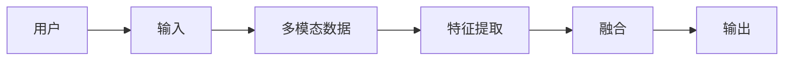
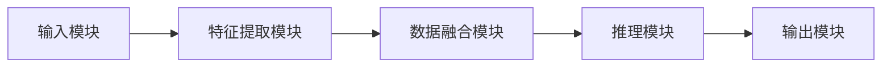
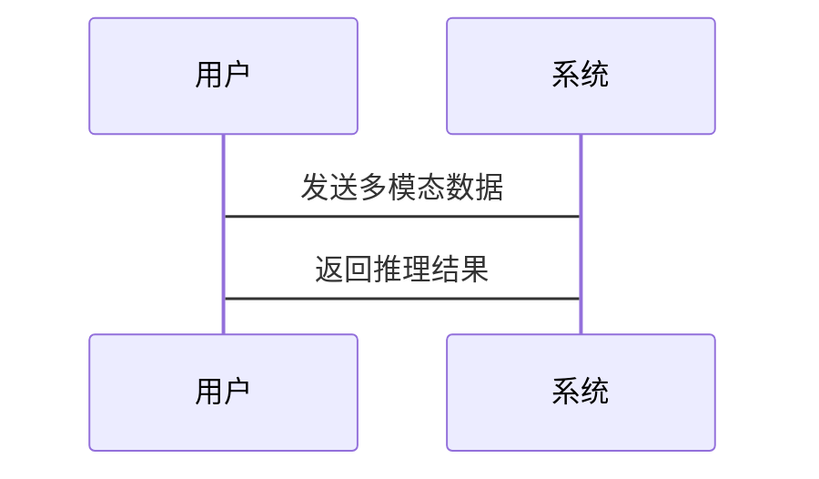

                 


# 构建AI Agent的多模态情境理解与推理系统

> 关键词：AI Agent，多模态情境理解，推理系统，深度学习，多模态数据融合，特征提取，系统架构设计

> 摘要：本文详细探讨了构建AI Agent的多模态情境理解与推理系统的各个方面，从核心概念、算法原理、系统架构设计到项目实战，旨在帮助读者全面理解并掌握该领域的关键技术。文章通过丰富的案例分析和详细的技术解读，为读者提供了一套完整的构建思路和实践指南。

---

# 第一部分: AI Agent与多模态情境理解概述

## 第1章: AI Agent的基本概念与多模态处理

### 1.1 AI Agent的定义与特点

AI Agent（人工智能代理）是一种能够感知环境、执行任务并做出决策的智能实体。它具备以下核心特点：

1. **自主性**：能够在没有外部干预的情况下自主运行。
2. **反应性**：能够实时感知环境并做出响应。
3. **目标导向性**：具备明确的目标，能够为实现目标而采取行动。
4. **学习能力**：能够通过数据和经验不断优化自身性能。

AI Agent可以是软件程序、机器人或其他智能设备，其目标是通过与环境交互，完成特定任务。

### 1.2 多模态数据的定义与特点

多模态数据指的是来自不同感官渠道（如视觉、听觉、文本等）的数据类型。例如：

- **视觉模态**：图像、视频等。
- **听觉模态**：音频、语音等。
- **文本模态**：文本、自然语言描述等。

多模态数据的特点包括：

1. **信息丰富性**：多模态数据能够提供更全面的信息，帮助AI Agent更好地理解环境。
2. **异构性**：不同模态的数据形式和特征提取方法不同。
3. **互补性**：不同模态的数据可以相互补充，提高整体理解能力。

### 1.3 多模态情境理解的背景与意义

在现实场景中，单一模态的数据往往不足以支持AI Agent完成复杂的任务。例如，在智能客服系统中，仅依赖文本信息难以准确理解用户的情感状态；在自动驾驶系统中，仅依赖视觉数据可能无法在恶劣天气条件下安全行驶。因此，多模态情境理解显得尤为重要，它能够帮助AI Agent更好地理解复杂场景，提高决策的准确性和鲁棒性。

---

## 第2章: 多模态数据的处理与融合

### 2.1 多模态数据的处理方法

#### 2.1.1 数据预处理

在进行多模态数据处理之前，通常需要进行数据预处理，包括：

1. **数据清洗**：去除噪声、填补缺失值等。
2. **数据标准化**：将不同模态的数据统一到相似的尺度。
3. **数据增强**：通过增加训练数据的多样性来提高模型的泛化能力。

#### 2.1.2 数据融合方法

多模态数据融合的方法多种多样，常见的包括：

1. **早期融合**：在数据输入阶段将不同模态的数据进行融合。
2. **晚期融合**：在特征提取或模型输出阶段进行融合。
3. **层次化融合**：根据数据的层次结构进行分层融合。

#### 2.1.3 数据融合的挑战与解决方案

数据融合的主要挑战包括模态间信息不一致、数据异构性以及计算复杂度高等。解决方案包括：

1. **对齐技术**：通过时间、空间或语义对齐来解决数据异构性问题。
2. **注意力机制**：在模型中引入注意力机制，动态调整不同模态的重要性。
3. **多任务学习**：通过多任务学习框架，同时优化多个模态的信息提取。

### 2.2 多模态数据的特征提取与表示

#### 2.2.1 视觉模态的特征提取

视觉模态的特征提取通常依赖于深度学习模型，如卷积神经网络（CNN）。例如，使用ResNet提取图像的深层特征。

#### 2.2.2 文本模态的特征提取

文本模态的特征提取通常使用词嵌入（如Word2Vec）或预训练语言模型（如BERT）。

#### 2.2.3 融合特征的表示方法

融合特征的表示方法包括：

1. **拼接表示**：将不同模态的特征向量拼接在一起。
2. **加权求和**：根据模态的重要性对特征向量进行加权求和。
3. **注意力机制**：动态调整特征的重要性。

### 2.3 多模态数据的对比分析

#### 2.3.1 数据特征对比表格

| 模态类型 | 特征维度 | 特征长度 | 是否可量化 |
|----------|----------|----------|----------|
| 视觉模态 | 1000维向量 | 1000 | 是 |
| 文本模态 | 500维向量 | 500 | 是 |

#### 2.3.2 ER实体关系图架构



---

## 第3章: 多模态模型的算法原理

### 3.1 多模态模型的训练流程

#### 3.1.1 数据预处理

1. 将多模态数据分别进行预处理，包括归一化、降维等。
2. 使用数据增强技术增加数据的多样性。

#### 3.1.2 模型训练

1. 使用多模态数据训练模型，通常采用端到端的训练方式。
2. 在训练过程中，使用交叉熵损失函数进行优化。

#### 3.1.3 模型评估

1. 使用验证集评估模型的性能，包括准确率、召回率等指标。

### 3.2 多模态模型的数学模型

#### 3.2.1 损失函数

多模态模型的损失函数通常包括分类损失和模态对齐损失：

$$
L = L_{\text{分类}} + \lambda L_{\text{对齐}}
$$

其中，$L_{\text{分类}}$是分类任务的损失函数，$L_{\text{对齐}}$是对齐任务的损失函数，$\lambda$是平衡系数。

#### 3.2.2 优化函数

常用的优化函数包括随机梯度下降（SGD）和Adam优化器。

---

## 第4章: 多模态情境理解的系统架构设计

### 4.1 问题场景介绍

在构建AI Agent的多模态情境理解系统时，通常需要考虑以下问题：

1. 如何高效地处理多模态数据？
2. 如何保证系统的实时性和响应速度？
3. 如何实现不同模态数据的高效融合？

### 4.2 系统功能设计

系统功能设计包括以下几个模块：

1. **输入模块**：接收多模态数据输入。
2. **特征提取模块**：对不同模态的数据进行特征提取。
3. **数据融合模块**：将不同模态的特征进行融合。
4. **推理模块**：基于融合后的特征进行情境理解和决策。

### 4.3 系统架构设计

系统架构设计采用模块化设计，如下图所示：



### 4.4 系统接口设计

系统接口设计包括：

1. **输入接口**：接收多模态数据。
2. **输出接口**：输出推理结果。

### 4.5 系统交互设计

系统交互设计如下图所示：



---

## 第5章: 项目实战

### 5.1 环境安装

1. 安装Python和必要的库（如TensorFlow、Keras、OpenCV等）。
2. 安装深度学习框架（如TensorFlow或PyTorch）。

### 5.2 核心代码实现

以下是一个简单的多模态数据融合的代码示例：

```python
import numpy as np

# 视觉模态特征
visual_feature = np.random.randn(1000)
# 文本模态特征
text_feature = np.random.randn(500)

# 模态对齐
aligned_feature = np.concatenate([visual_feature, text_feature])

# 推理
result = np.argmax(aligned_feature)
```

### 5.3 案例分析

以智能客服系统为例，分析如何利用多模态数据理解用户的情感状态。

### 5.4 项目小结

通过本项目，我们掌握了多模态数据融合的基本方法和实现技巧，为后续的系统优化奠定了基础。

---

## 第6章: 最佳实践与总结

### 6.1 小结

通过本文的介绍，我们全面了解了构建AI Agent的多模态情境理解与推理系统的各个方面，包括核心概念、算法原理、系统架构设计和项目实战。

### 6.2 注意事项

在实际应用中，需要注意以下几点：

1. 数据的多样性和质量对模型性能影响较大。
2. 模型的实时性和响应速度需要优化。
3. 系统的可扩展性和可维护性需要提前设计。

### 6.3 拓展阅读

推荐阅读以下书籍和论文：

1. 《Deep Learning》
2. 《Multi-modal Data Fusion for AI Agents》

---

作者：AI天才研究院/AI Genius Institute & 禅与计算机程序设计艺术 /Zen And The Art of Computer Programming

