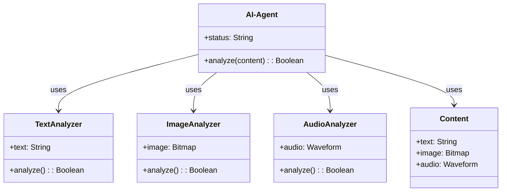
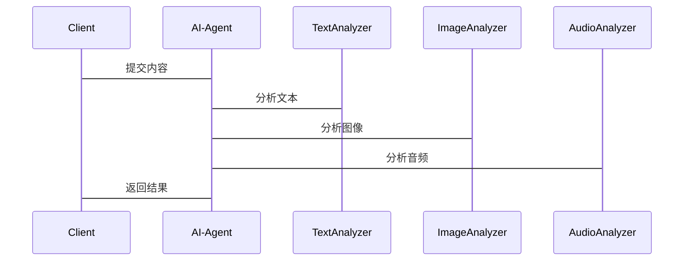

                 


# 构建AI Agent的实时多模态内容审核系统

## 关键词：AI Agent，多模态内容审核，实时性，系统架构，算法优化

## 摘要：本文详细探讨了构建AI Agent的实时多模态内容审核系统的核心概念、算法原理、系统架构及其实现方法。通过分析多模态数据的特征与融合方法，优化AI Agent的实时性处理能力，设计高效的系统架构，结合实际案例分析，为构建智能化的内容审核系统提供深度的技术指导。

---

# 第一部分: AI Agent与实时多模态内容审核系统概述

## 第1章: AI Agent与实时多模态内容审核系统背景

### 1.1 AI Agent的基本概念

#### 1.1.1 AI Agent的定义与特点

- **定义**：AI Agent（人工智能代理）是指具有感知环境、自主决策、执行任务能力的智能系统。
- **特点**：
  - **自主性**：无需外部干预，自主完成任务。
  - **反应性**：能够实时感知环境变化并做出响应。
  - **学习性**：通过数据和经验不断优化自身能力。
  - **协作性**：能够与其他系统或人类进行协作。

#### 1.1.2 多模态内容审核的背景与意义

- **背景**：随着互联网的快速发展，内容生成和传播速度空前提升，内容审核的难度和复杂性也显著增加。传统的单模态审核方式难以满足复杂场景的需求。
- **意义**：多模态内容审核能够综合分析文本、图像、音频、视频等多种信息，显著提高审核的准确性和全面性。

#### 1.1.3 实时性在内容审核中的重要性

- **实时性需求**：在社交媒体、在线教育等领域，实时内容审核能够快速拦截违规信息，保障用户体验和平台安全。
- **延迟影响**：内容审核的延迟可能导致信息扩散，影响平台声誉和用户信任。

---

### 1.2 问题背景与描述

#### 1.2.1 当前内容审核的主要挑战

- **数据复杂性**：多模态数据的多样性增加了审核的难度。
- **实时性要求**：需要在极短时间内完成审核，对系统性能提出高要求。
- **模型更新**：面对新型违规内容，模型需要快速迭代更新。

#### 1.2.2 多模态内容审核的优势

- **全面性**：通过多模态数据的融合，能够从多个角度识别违规内容。
- **准确性**：结合不同模态的信息可以有效降低误判率。

#### 1.2.3 实时审核的必要性与应用场景

- **必要性**：实时审核能够及时拦截违规内容，避免事态扩大。
- **应用场景**：社交媒体、在线教育、视频会议等领域对实时审核有强烈需求。

---

### 1.3 问题解决与边界

#### 1.3.1 AI Agent在内容审核中的作用

- **感知与理解**：AI Agent能够实时感知多模态数据，理解其含义。
- **决策与执行**：根据理解结果做出是否违规的决策，并执行相应操作（如标记或拦截）。

#### 1.3.2 系统的边界与外延

- **边界**：AI Agent仅负责内容的实时审核，不涉及后续处理（如通知用户或上报）。
- **外延**：AI Agent的实时审核能力可以与其他系统（如用户反馈系统）结合，形成完整的审核流程。

#### 1.3.3 核心要素与组成结构

- **核心要素**：多模态数据输入、AI Agent决策、实时反馈机制。
- **组成结构**：数据采集模块、数据融合模块、决策模块、反馈模块。

---

## 第二部分: 核心概念与原理分析

## 第2章: AI Agent与多模态内容审核的核心概念

### 2.1 AI Agent的核心原理

#### 2.1.1 AI Agent的感知与决策机制

- **感知**：通过多模态传感器或接口获取数据（如文本、图像、音频）。
- **理解**：利用NLP、计算机视觉等技术对数据进行解析和理解。
- **决策**：基于理解结果，判断是否违规，并做出相应的决策。

#### 2.1.2 多模态数据的融合与处理

- **数据融合**：将文本、图像、音频等多种数据进行融合，形成统一的表示。
- **特征提取**：从多模态数据中提取关键特征，用于后续的判断和决策。

#### 2.1.3 实时性与响应速度的优化

- **优化策略**：通过流式处理、并行计算等技术优化响应速度。
- **资源分配**：合理分配计算资源，确保实时性需求。

---

### 2.2 多模态内容审核的原理

#### 2.2.1 文本、图像、音频与视频的特征分析

- **文本特征**：关键词、句式、情感倾向。
- **图像特征**：颜色、形状、纹理、物体识别。
- **音频特征**：音调、节奏、语音识别。
- **视频特征**：动作、场景、行为识别。

#### 2.2.2 多模态数据的关联性与一致性

- **关联性**：不同模态数据之间的相互关系（如文本描述与图像内容是否一致）。
- **一致性**：多模态数据是否共同指向同一内容或意图。

#### 2.2.3 多模态模型的构建与训练

- **模型构建**：设计多模态融合的网络结构。
- **训练方法**：利用标注数据进行监督学习，优化模型性能。

---

### 2.3 核心概念对比分析

#### 2.3.1 不同模态数据的特征对比

| 模态类型 | 特征维度          | 示例                         |
|----------|-------------------|------------------------------|
| 文本     | 关键词、情感倾向   | "暴力"、"色情"               |
| 图像     | 颜色、物体识别     | 武器、裸露部位                |
| 音频     | 音调、语音识别     | 威胁语言、非法音乐           |
| 视频     | 动作、场景识别     | 斗殴、危险行为               |

#### 2.3.2 AI Agent与传统内容审核系统的对比

| 特性         | AI Agent               | 传统系统                 |
|--------------|------------------------|--------------------------|
| 处理速度      | 实时处理               | 延迟处理                 |
| 模态支持      | 多模态支持             | 单模态或少模态支持       |
| 自适应能力    | 强大的自适应能力       | 较弱的自适应能力         |
| 智能性        | 高度智能               | 依赖规则或关键词匹配     |

#### 2.3.3 实时性与非实时性的区别

| 特性         | 实时性                 | 非实时性                 |
|--------------|------------------------|--------------------------|
| 响应时间     | 几乎实时               | 延迟数秒或更长时间        |
| 处理场景     | 网络直播、即时通讯     | 非实时内容审核           |
| 资源消耗     | 高                    | 较低                     |

---

## 第三部分: 算法原理与数学模型

## 第3章: 多模态内容审核的算法原理

### 3.1 多模态Transformer模型

#### 3.1.1 模型结构与工作原理

- **模型结构**：由编码器和解码器组成，编码器将多模态数据编码为向量，解码器根据编码结果生成判断。
- **工作原理**：通过自注意力机制捕捉数据间的关联性，生成融合后的表示。

#### 3.1.2 多模态数据的编码与解码

- **编码**：将文本、图像等数据映射为向量表示。
- **解码**：根据编码结果生成最终的判断结果（如违规或合规）。

#### 3.1.3 模型的训练与优化

- **训练方法**：使用标注数据进行监督学习，采用交叉熵损失函数优化模型。
- **优化策略**：通过Adam优化器调整模型参数，提升模型性能。

---

### 3.2 实时性优化算法

#### 3.2.1 基于流式处理的实时算法

- **流式处理**：逐帧处理数据，减少数据累积带来的延迟。
- **应用场景**：实时视频流审核。

#### 3.2.2 并行计算与分布式处理

- **并行计算**：利用多核处理器或GPU加速计算。
- **分布式处理**：将任务分发到多个节点并行处理，提升处理能力。

#### 3.2.3 动态调整的自适应算法

- **动态调整**：根据负载情况自动调整处理策略。
- **自适应优化**：通过反馈机制优化模型性能。

---

### 3.3 数学模型与公式

#### 3.3.1 多模态融合的数学表达

$$ y = f(x_1, x_2, ..., x_n) $$

- **解释**：$y$ 为最终的判断结果，$x_i$ 为不同模态的输入数据，$f$ 为融合函数。

#### 3.3.2 损失函数与优化目标

$$ L = \text{loss}(y_{\text{pred}}, y_{\text{true}}) $$

- **解释**：$L$ 为损失函数，$y_{\text{pred}}$ 为模型预测结果，$y_{\text{true}}$ 为真实标签。

#### 3.3.3 优化算法的数学推导

$$ \theta_{t+1} = \theta_t - \eta \cdot \frac{\partial L}{\partial \theta_t} $$

- **解释**：$\theta$ 为模型参数，$\eta$ 为学习率，$\frac{\partial L}{\partial \theta_t}$ 为损失函数对参数的梯度。

---

## 第四部分: 系统分析与架构设计方案

## 第4章: 系统分析与架构设计方案

### 4.1 问题场景介绍

- **场景描述**：实时多模态内容审核系统需要在毫秒级别完成对文本、图像、音频等数据的审核。
- **核心目标**：快速、准确地识别违规内容，保障平台安全。

### 4.2 项目介绍

- **项目名称**：AI Agent实时多模态内容审核系统。
- **项目目标**：构建一个高效、准确的实时内容审核系统，能够处理多种模态的数据。

---

### 4.3 系统功能设计

#### 4.3.1 领域模型（Mermaid 类图）



- **解释**：AI-Agent 类与 TextAnalyzer、ImageAnalyzer、AudioAnalyzer 类交互，完成多模态数据的分析。

---

#### 4.3.2 系统架构设计（Mermaid 架构图）

```mermaid
architectural

    Client
    ----
    |   |
    |   |
    +---+
    Service Layer
    ----
    |   |
    |   |
    +---+
    Adapter Layer
    ----
    |   |
    |   |
    +---+
    Data Layer
    ----
    |   |
    |   |
    +---+
    Database
```

- **解释**：系统分为客户端、服务层、适配层和数据层，各层协同工作，确保实时性。

---

#### 4.3.3 系统接口设计

- **输入接口**：接收多模态数据（文本、图像、音频）。
- **输出接口**：返回审核结果（违规或合规）。
- **反馈接口**：接收用户反馈，优化模型。

---

#### 4.3.4 系统交互设计（Mermaid 序列图）



- **解释**：AI-Agent 逐一对多模态数据进行分析，并将结果反馈给客户端。

---

## 第五部分: 项目实战

## 第5章: 项目实战

### 5.1 环境安装

```bash
pip install transformers torch numpy
```

---

### 5.2 系统核心实现源代码

#### 5.2.1 数据预处理代码

```python
import numpy as np

def preprocess(text, image, audio):
    # 文本预处理
    text_vec = encode_text(text)
    # 图像预处理
    image_vec = encode_image(image)
    # 音频预处理
    audio_vec = encode_audio(audio)
    return text_vec, image_vec, audio_vec
```

---

#### 5.2.2 模型训练代码

```python
import torch
import torch.nn as nn

class MultimodalTransformer(nn.Module):
    def __init__(self):
        super().__init__()
        self.text_layer = TextEncoder()
        self.image_layer = ImageEncoder()
        self.audio_layer = AudioEncoder()
        self.fc = nn.Linear(512, 1)

    def forward(self, text, image, audio):
        text_out = self.text_layer(text)
        image_out = self.image_layer(image)
        audio_out = self.audio_layer(audio)
        # 融合特征
        fused = torch.cat([text_out, image_out, audio_out], dim=1)
        output = self.fc(fused)
        return output

model = MultimodalTransformer()
criterion = nn.CrossEntropyLoss()
optimizer = torch.optim.Adam(model.parameters(), lr=1e-4)
```

---

#### 5.2.3 模型推理代码

```python
def predict(model, text, image, audio):
    with torch.no_grad():
        text_vec, image_vec, audio_vec = preprocess(text, image, audio)
        output = model(text_vec, image_vec, audio_vec)
        return output.argmax().item()
```

---

### 5.3 实际案例分析与详细讲解

#### 5.3.1 案例分析

- **案例描述**：社交媒体平台上的一条动态，包含违规文本、图像和音频。
- **处理流程**：
  1. AI-Agent 接收动态内容。
  2. 分别对文本、图像、音频进行预处理。
  3. 融合特征后进行判断。
  4. 返回违规结果。

#### 5.3.2 代码应用解读与分析

- **代码解读**：
  - `preprocess` 函数对输入的多模态数据进行预处理。
  - `MultimodalTransformer` 模型融合多模态特征，输出判断结果。
  - `predict` 函数进行模型推理，返回判断结果。

---

## 第六部分: 最佳实践与小结

## 第6章: 最佳实践与小结

### 6.1 最佳实践 tips

- **模型优化**：定期更新模型，引入新的数据和规则。
- **系统调优**：优化数据处理流程，减少延迟。
- **错误处理**：建立完善的错误处理机制，确保系统稳定运行。

---

### 6.2 小结

- **核心总结**：本文详细介绍了构建AI Agent的实时多模态内容审核系统的背景、核心概念、算法原理和系统架构，提供了具体的实现方案和案例分析。
- **未来展望**：随着AI技术的发展，实时多模态内容审核系统将更加智能化、高效化，为更多领域提供支持。

---

## 作者：AI天才研究院/AI Genius Institute & 禅与计算机程序设计艺术 /Zen And The Art of Computer Programming

---

**感谢您的阅读！如果对内容有任何疑问或建议，请随时与我们联系。**

