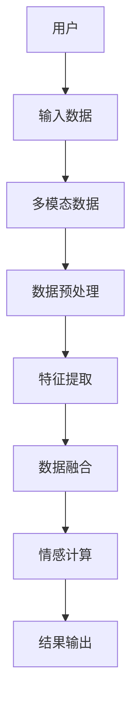
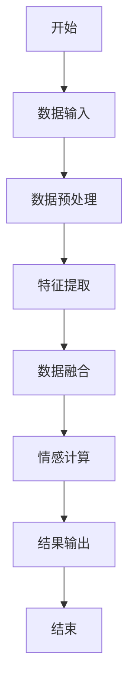
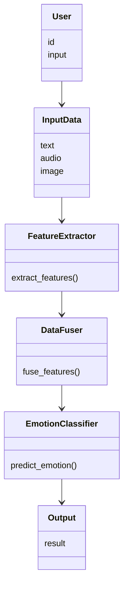
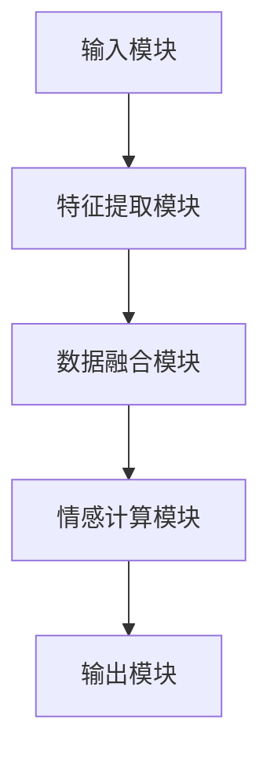
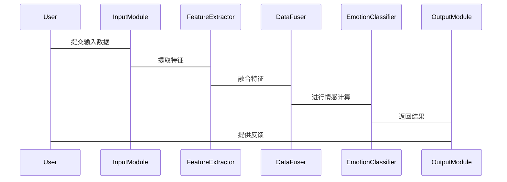

                 


# 构建AI Agent的实时多模态情感识别系统

> 关键词：AI Agent、多模态情感识别、实时处理、数据融合、机器学习、深度学习、计算机视觉

> 摘要：本文详细探讨了构建AI Agent的实时多模态情感识别系统的关键技术与实现方法。通过分析多模态数据融合、实时处理和情感计算的原理，结合实际应用场景，提出了一种高效的系统架构和实现方案，为智能交互系统的设计提供了参考。

---

## 第一部分: 背景介绍

### 第1章: AI Agent与实时多模态情感识别概述

#### 1.1 问题背景
- **AI Agent的定义与特点**：AI Agent是一种智能代理，能够感知环境、自主决策并执行任务。其特点包括自主性、反应性、主动性、社会性等。
- **多模态情感识别的需求与挑战**：在实际应用中，单一模态的数据往往不足以准确捕捉情感信息，因此需要结合文本、语音、图像等多种模态数据进行情感分析。
- **实时处理的重要性**：在实时场景中，如客服系统、智能助手等，快速准确的情感识别能够显著提升用户体验。

#### 1.2 问题描述
- **情感识别的定义**：通过分析多模态数据，推断用户的情感状态，如快乐、悲伤、愤怒等。
- **多模态数据的整合**：将文本、语音、图像等多种数据类型进行融合，以提高情感识别的准确性和鲁棒性。
- **实时处理的必要性**：在实时场景中，系统需要在数据流中快速处理并反馈结果，这对计算效率提出了更高的要求。

#### 1.3 问题解决
- **多模态数据融合方法**：采用加权融合、特征融合等方式，将不同模态的数据特征整合到统一的表示空间中。
- **实时处理的技术路线**：通过优化算法、减少计算复杂度、利用并行计算等手段，实现实时情感识别。
- **情感识别的模型选择**：选择适合多模态数据的模型，如基于深度学习的模型，能够有效捕捉复杂的情感特征。

#### 1.4 边界与外延
- **系统的边界**：本系统专注于实时多模态情感识别，不涉及后续的情感反馈或交互逻辑。
- **相关领域的外延**：情感识别技术可应用于智能客服、教育、医疗等领域，但本文仅讨论技术实现部分。
- **应用场景的限制**：系统设计基于典型场景，如在线客服、智能助手，不考虑极端环境或异常输入。

#### 1.5 核心概念结构与组成
- **核心概念的层次结构**：从数据输入到特征提取，再到融合与计算，最终输出情感结果。
- **核心要素的对比分析**：多模态数据与单模态数据在准确性、鲁棒性上的对比，实时处理与非实时处理在计算效率和延迟上的对比。
- **系统架构的初步设想**：基于多模态数据的输入模块、特征提取模块、数据融合模块、情感计算模块和结果输出模块。

---

## 第二部分: 核心概念与联系

### 第2章: 多模态数据融合与实时处理

#### 2.1 核心概念原理
- **多模态数据的定义**：文本、语音、图像等多种数据类型的组合，能够提供更全面的情感信息。
- **数据融合的原理**：将不同模态的数据特征进行整合，利用互补性信息提高情感识别的准确性。
- **实时处理的关键技术**：高效的数据处理算法、并行计算、轻量化模型设计。

#### 2.2 核心概念对比
- **多模态数据与单模态数据的对比**：
  | 对比维度 | 多模态数据 | 单模态数据 |
  |----------|------------|------------|
  | 准确性   | 高         | 低         |
  | 鲁棒性   | 强         | 弱         |
  | 信息量   | 大         | 小         |
- **实时处理与非实时处理的对比**：
  | 对比维度 | 实时处理   | 非实时处理 |
  |----------|------------|------------|
  | 延迟     | 低         | 高         |
  | 资源消耗 | 高         | 低         |
- **情感识别与其他识别任务的对比**：
  | 对比维度 | 情感识别   | 语音识别   | 图像识别   |
  |----------|------------|------------|------------|
  | 输入类型 | 文本、语音、图像 | 语音 | 图像 |
  | 输出类型 | 情感标签 | 文本 | 物体/场景 |

#### 2.3 ER实体关系图


---

## 第三部分: 算法原理讲解

### 第3章: 多模态情感识别算法

#### 3.1 算法原理
- **特征提取**：从多模态数据中提取有意义的特征，如文本中的情感词汇、语音中的声调特征、图像中的表情特征。
- **数据融合**：将不同模态的特征进行融合，常用的方法包括加权融合、特征融合、决策融合。
- **情感计算**：基于融合后的特征，使用机器学习或深度学习模型进行情感分类。

#### 3.2 算法流程图


#### 3.3 算法实现
- **特征提取代码**
```python
def extract_features(data):
    # 文本特征提取
    text_features = get_text_features(data['text'])
    # 语音特征提取
    audio_features = get_audio_features(data['audio'])
    # 图像特征提取
    image_features = get_image_features(data['image'])
    return text_features, audio_features, image_features
```

- **数据融合代码**
```python
def fuse_features(features):
    # 特征融合
    fused_features = []
    for i in range(len(features[0])):
        fused_features.append(features[0][i] + features[1][i] + features[2][i])
    return fused_features
```

- **情感计算代码**
```python
def calculate_emotion(features):
    # 使用深度学习模型进行情感分类
    model = load_model('emotion_model.h5')
    prediction = model.predict(features)
    return get_emotion_label(prediction)
```

#### 3.4 数学模型与公式
- **情感概率计算公式**：
  $$ P(\text{class}|x) = \frac{P(x|\text{class})P(\text{class})}{\sum_{i}P(x|\text{class}_i)P(\text{class}_i)} $$

---

## 第四部分: 系统分析与架构设计

### 第4章: 系统分析与架构设计

#### 4.1 问题场景介绍
- 系统应用于智能客服场景，需要实时识别用户的文本、语音和表情信息，判断其情感状态，并提供相应的反馈。

#### 4.2 系统功能设计
- **领域模型**


- **系统架构图**


- **系统接口设计**
  - 输入接口：接收文本、语音、图像数据。
  - 输出接口：返回情感标签或情感概率。

- **系统交互流程**


---

## 第五部分: 项目实战

### 第5章: 项目实战

#### 5.1 环境安装
- 安装必要的库，如TensorFlow、Keras、OpenCV、 librosa等。

#### 5.2 核心代码实现
- **特征提取**
```python
import librosa
import cv2
from transformers import BertTokenizer, BertModel

def extract_audio_features(audio_path):
    audio, sr = librosa.load(audio_path, sr=16000)
    mfccs = librosa.feature.mfcc(y=audio, sr=sr, n_mfcc=13)
    return mfccs.T

def extract_text_features(text):
    tokenizer = BertTokenizer.from_pretrained('bert-base-uncased')
    inputs = tokenizer(text, return_tensors='np')
    return inputs

def extract_image_features(image_path):
    img = cv2.imread(image_path)
    features = model.predict(img)
    return features
```

- **数据融合**
```python
def fuse_features(features_list):
    fused = []
    for i in range(len(features_list[0])):
        fused.append([features_list[0][i], features_list[1][i], features_list[2][i]])
    return fused
```

- **情感计算**
```python
import tensorflow as tf
from tensorflow.keras.models import load_model

model = load_model('emotion_model.h5')
def calculate_emotion(features):
    prediction = model.predict(tf.convert_to_tensor(features))
    return prediction
```

#### 5.3 案例分析
- 实际案例分析，如用户输入文本“我感到非常生气”，语音语调高亢，面部表情显示愤怒，系统应准确识别并反馈。

#### 5.4 项目总结
- 总结项目实现的关键点，如高效的数据处理、准确的特征提取和融合方法，以及模型的优化。

---

## 第六部分: 最佳实践与拓展

### 第6章: 最佳实践

#### 6.1 最佳实践
- 数据预处理：确保输入数据的标准化和一致性。
- 特征提取：选择适合不同模态的特征提取方法。
- 模型优化：通过数据增强、超参数调优等方法提升模型性能。

#### 6.2 小结
- 总结全文内容，强调多模态情感识别的重要性和实现方法。

#### 6.3 注意事项
- 数据隐私：确保用户数据的安全和隐私。
- 系统性能：优化算法以满足实时处理的需求。
- 模型泛化能力：在不同场景中验证系统的鲁棒性。

#### 6.4 拓展阅读
- 推荐相关领域的书籍和论文，如《Deep Learning》、《Speech and Language Processing》等。

---

## 作者：AI天才研究院 / AI Genius Institute & 禅与计算机程序设计艺术 / Zen And The Art of Computer Programming

---

本文详细探讨了构建AI Agent的实时多模态情感识别系统的关键技术与实现方法，结合理论分析和实际案例，为智能交互系统的设计提供了参考。希望对读者有所帮助！

