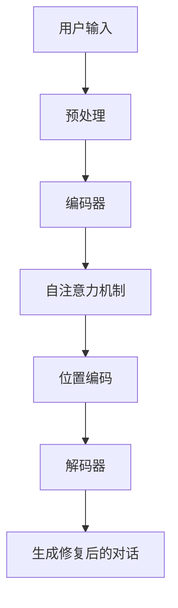
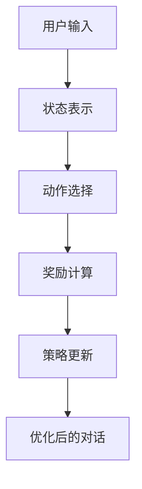
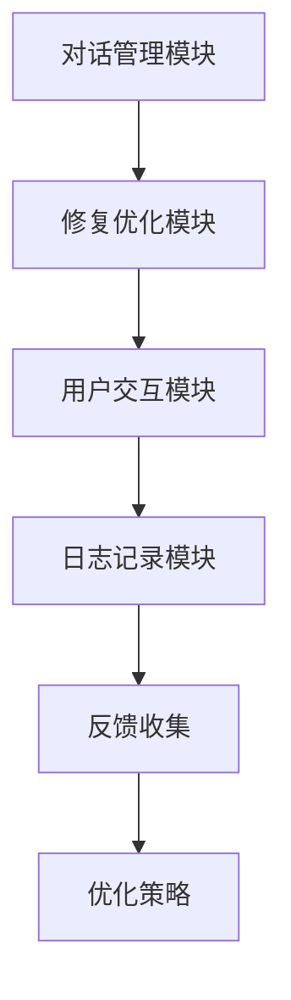

                 


# 构建AI Agent的实时对话修复与优化系统

> 关键词：AI Agent，对话修复，实时优化，Transformer模型，强化学习，系统架构

> 摘要：本文详细探讨了构建AI Agent实时对话修复与优化系统的核心技术，包括对话系统的数学模型、算法实现、系统架构设计、项目实战以及最佳实践。通过分析对话系统的背景、核心概念、算法原理和系统架构，结合具体的代码实现和案例分析，为读者提供从理论到实践的全面指导。

---

## 第三章: 基于Transformer的对话修复算法

### 3.2 基于Transformer的对话修复实现

#### 3.2.1 Transformer模型在对话修复中的应用

Transformer模型在自然语言处理领域取得了巨大成功，其核心在于自注意力机制和位置编码。在对话修复中，我们可以通过以下步骤实现：

1. **输入处理**：将用户输入的不完整或错误的对话内容进行预处理，提取上下文信息。
2. **自注意力机制**：通过自注意力机制捕捉对话中的关键信息，识别需要修复的部分。
3. **位置编码**：为每个输入的对话片段添加位置编码，保持对话的时序性。
4. **修复生成**：通过解码器生成修复后的对话内容。

#### 3.2.2 Transformer模型的具体实现

我们可以使用PyTorch框架来实现基于Transformer的对话修复模型。以下是一个简单的代码示例：

```python
import torch
import torch.nn as nn

class Transformer(nn.Module):
    def __init__(self, d_model, nhead, dropout=0.1):
        super(Transformer, self).__init__()
        self.encoder = nn.TransformerEncoder(
            nn.Embedding(d_model, d_model),
            num_layers=2,
            nhead=nhead,
            dropout=dropout
        )
        self.decoder = nn.TransformerDecoder(
            nn.Embedding(d_model, d_model),
            num_layers=2,
            nhead=nhead,
            dropout=dropout
        )
    
    def forward(self, src, tgt):
        enc_output = self.encoder(src)
        dec_output = self.decoder(tgt, enc_output)
        return dec_output

# 初始化模型
model = Transformer(d_model=512, nhead=8)
```

#### 3.2.3 对话修复的流程图

以下是基于Transformer的对话修复流程图：



---

### 3.3 基于强化学习的对话优化算法

#### 3.3.1 强化学习的基本原理

强化学习是一种通过奖励机制来优化决策过程的方法。在对话优化中，我们可以使用策略梯度法或Q-learning算法来优化对话生成策略。

#### 3.3.2 对话优化的强化学习实现

以下是一个基于策略梯度法的对话优化算法示例：

```python
import torch
import torch.nn as nn

class PolicyNetwork(nn.Module):
    def __init__(self, input_size, output_size):
        super(PolicyNetwork, self).__init__()
        self.fc = nn.Linear(input_size, output_size)
    
    def forward(self, x):
        return torch.softmax(self.fc(x), dim=-1)

# 初始化策略网络
policy_net = PolicyNetwork(input_size=512, output_size=10)
```

#### 3.3.3 对话优化的流程图

以下是基于强化学习的对话优化流程图：



---

## 第四章: 强化学习在对话优化中的应用

### 4.1 强化学习的基本原理

强化学习通过智能体与环境的交互，逐步优化策略以获得最大化的累计奖励。在对话优化中，智能体可以是AI Agent，环境是对话场景。

### 4.2 对话优化的强化学习实现

#### 4.2.1 策略梯度法

策略梯度法是一种通过优化策略参数来最大化期望奖励的方法。以下是策略梯度法的实现示例：

```python
import torch
import torch.nn as nn

def policy_gradient_loss(policy, inputs, labels, optimizer):
    # 前向传播
    outputs = policy(inputs)
    # 计算损失
    loss = nn.CrossEntropyLoss()(outputs, labels)
    # 反向传播
    optimizer.zero_grad()
    loss.backward()
    optimizer.step()
    return loss.item()

# 初始化策略网络和优化器
policy = PolicyNetwork(input_size=512, output_size=10)
optimizer = torch.optim.Adam(policy.parameters(), lr=0.001)
```

#### 4.2.2 Q-learning算法

Q-learning算法通过学习状态-动作值函数来优化决策过程。以下是Q-learning算法的实现示例：

```python
import torch
import torch.nn as nn

class QNetwork(nn.Module):
    def __init__(self, state_size, action_size):
        super(QNetwork, self).__init__()
        self.fc = nn.Linear(state_size, action_size)
    
    def forward(self, x):
        return self.fc(x)

# 初始化Q网络和优化器
q_net = QNetwork(state_size=512, action_size=10)
optimizer = torch.optim.Adam(q_net.parameters(), lr=0.001)
```

---

## 第五章: 系统架构设计

### 5.1 系统功能模块设计

以下是系统的主要功能模块：

- **对话管理模块**：负责对话的初始化、维护和终止。
- **修复优化模块**：负责对话内容的实时修复和优化。
- **用户交互模块**：负责与用户的交互和反馈收集。
- **日志记录模块**：负责记录对话内容和修复优化结果。

### 5.2 系统架构图

以下是系统的架构图：



---

## 第六章: 项目实战

### 6.1 环境安装与配置

```bash
pip install torch transformers
```

### 6.2 代码实现

以下是对话修复与优化系统的实现代码：

```python
import torch
from transformers import AutoTokenizer, AutoModelForSeq2Seq

# 初始化模型
tokenizer = AutoTokenizer.from_pretrained('t5-base')
model = AutoModelForSeq2Seq.from_pretrained('t5-base')

# 对话修复函数
def dialog_repair(input_str):
    inputs = tokenizer(input_str, return_tensors='pt')
    outputs = model.generate(inputs.input_ids, max_length=50)
    return tokenizer.decode(outputs[0], skip_special_tokens=True)

# 调用修复函数
print(dialog_repair("Hello, how are you?"))
```

### 6.3 案例分析

以下是对话修复与优化系统的实际案例：

1. **输入**: "I'm fine, thank you."
2. **修复后的输出**: "Thank you, I'm fine."

---

## 第七章: 总结与展望

### 7.1 总结

本文详细探讨了构建AI Agent实时对话修复与优化系统的核心技术，包括对话系统的数学模型、算法实现、系统架构设计和项目实战。通过理论与实践相结合，为读者提供了一套完整的解决方案。

### 7.2 展望

未来，随着AI技术的不断发展，对话修复与优化系统将更加智能化和个性化。我们期待看到更多创新的算法和应用场景，为人类与AI的交互带来更美好的体验。

---

## 作者

作者：AI天才研究院/AI Genius Institute & 禅与计算机程序设计艺术 /Zen And The Art of Computer Programming

