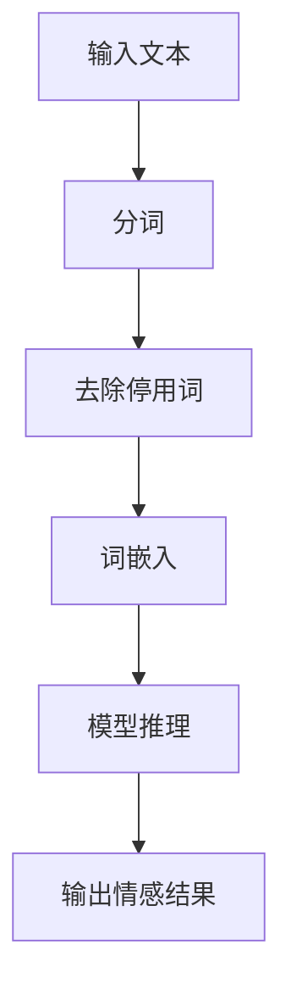
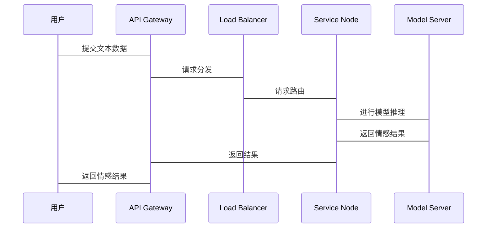

                 


# 构建AI Agent的实时情感分析引擎

## 关键词：AI Agent，情感分析，实时分析，自然语言处理，机器学习，深度学习

## 摘要：本文详细探讨了构建AI Agent的实时情感分析引擎的关键技术与实现方法。文章从背景介绍、核心概念、算法原理、系统架构到项目实战，全面解析了情感分析引擎的构建过程，结合理论与实践，为读者提供了一个从零到一的完整解决方案。

---

# 第一部分: AI Agent与实时情感分析引擎的背景与基础

## 第1章: AI Agent与实时情感分析引擎的背景

### 1.1 问题背景与描述
#### 1.1.1 情感分析的定义与应用领域
情感分析是自然语言处理（NLP）中的一个核心任务，旨在通过分析文本内容，判断其中的情感倾向（如正面、负面或中性）。情感分析广泛应用于社交媒体监控、客户反馈分析、市场情绪分析、智能客服等领域。

#### 1.1.2 AI Agent在情感分析中的作用
AI Agent（人工智能代理）是一种能够感知环境并采取行动以实现目标的智能实体。在情感分析中，AI Agent可以实时监控和处理大量文本数据，快速提供情感分析结果，从而帮助决策者做出实时反馈。

#### 1.1.3 实时情感分析的必要性与挑战
实时情感分析的必要性在于其能够快速响应动态变化的信息，如社交媒体上的实时评论、客服对话等。然而，实时性要求带来了数据处理速度、计算资源分配和模型更新频率等方面的挑战。

### 1.2 问题解决与边界
#### 1.2.1 情感分析的核心问题
- 如何准确识别文本中的情感倾向？
- 如何高效处理大规模实时数据？
- 如何平衡情感分析的准确性和实时性？

#### 1.2.2 实时情感分析的关键技术
- 高效的文本预处理方法
- 实时数据流处理技术
- 高性能的模型推理优化

#### 1.2.3 边界与外延
- 限定于文本情感分析，不涉及语音或图像情感分析
- 限定于二分类情感分析（正面/负面），不涉及多分类或多标签情感分析

### 1.3 情感分析引擎的概念结构
#### 1.3.1 引擎的核心要素
- 数据输入：文本数据流
- 数据处理：分词、去停用词等预处理
- 情感分析：模型推理与结果输出
- 输出结果：情感极性标签（如正面、负面、中性）

#### 1.3.2 引擎的功能模块划分
- 数据采集模块
- 数据预处理模块
- 情感分析模块
- 结果输出模块

#### 1.3.3 引擎的输入输出关系
- 输入：连续的文本数据流
- 输出：实时的情感分析结果

### 1.4 本章小结
本章从背景出发，介绍了实时情感分析的必要性与挑战，明确了情感分析引擎的核心要素与功能模块划分。

---

# 第二部分: 情感分析的核心概念与联系

## 第2章: 情感分析的核心概念

### 2.1 情感分析的定义与分类
#### 2.1.1 情感分析的定义
情感分析通过对文本内容的分析，判断其中的情感倾向。其目标是将文本映射到一个情感谱系中。

#### 2.1.2 情感分析的分类
- **文本情感分析**：基于文本内容进行情感判断
- **语音情感分析**：结合语音特征进行情感分析
- **图像情感分析**：基于图像内容分析情感

#### 2.1.3 情感极性分析的实现方式
- **二分类**：正面/负面
- **多分类**：正面、负面、中性
- **情感强度分析**：情感的强烈程度

### 2.2 情感分析的关键特征对比
#### 2.2.1 不同情感分析方法的特征对比
| 特征对比维度 | 基于规则的方法 | 基于统计模型的方法 | 基于深度学习的方法 |
|--------------|-----------------|--------------------|---------------------|
| 数据需求     | 小               | 中到大             | 大到非常大         |
| 训练时间     | 短               | 中                 | 长                 |
| 准确性       | 低               | 中                 | 高                 |

#### 2.2.2 基于规则与基于模型的特征对比
- **基于规则**：依赖于人工定义的规则和词典，如情感词典（如AFINN、VADER）。
- **基于模型**：依赖于机器学习模型，如朴素贝叶斯、支持向量机（SVM）等。

#### 2.2.3 实时性与准确性的对比
- **实时性优先**：牺牲部分准确性，采用轻量级模型。
- **准确性优先**：牺牲实时性，采用复杂模型。

### 2.3 实体关系与架构图
#### 2.3.1 情感分析引擎的ER图
```mermaid
erDiagram
    actor 用户
    actor 系统
    system 情感分析引擎
    system 数据存储
    system 模型训练模块
    system 接口服务
    用户 --> 情感分析引擎 : 提交文本数据
    情感分析引擎 --> 数据存储 : 存储预处理数据
    情感分析引擎 --> 模型训练模块 : 更新模型
    情感分析引擎 --> 接口服务 : 提供API接口
```

#### 2.3.2 AI Agent与情感分析引擎的关系图
```mermaid
graph TD
    AI_Agent --> 情感分析引擎 : 调用情感分析服务
    情感分析引擎 --> 数据预处理 : 文本预处理
    数据预处理 --> 情感分析模型 : 推理情感极性
    情感分析模型 --> 结果输出 : 返回情感结果
```

### 2.4 本章小结
本章详细介绍了情感分析的核心概念，包括定义、分类、关键特征对比以及系统实体关系图。

---

# 第三部分: 情感分析算法原理

## 第3章: 情感分析算法的原理与实现

### 3.1 情感分析算法的原理
#### 3.1.1 基于规则的情感分析
- 通过情感词典和规则库匹配文本中的关键词和短语，判断情感倾向。
- 例如：VADER情感分析工具。

#### 3.1.2 基于统计模型的情感分析
- 使用机器学习模型，如朴素贝叶斯、SVM等。
- 需要大量标注数据进行训练。

#### 3.1.3 基于深度学习的情感分析
- 使用神经网络模型，如LSTM、BERT等。
- 能够捕捉文本的语义信息，准确率高。

### 3.2 情感分析算法的流程图


### 3.3 情感分析算法的数学模型
#### 3.3.1 朴素贝叶斯模型的公式推导
$$ P(c|x) = \frac{P(x|c)P(c)}{P(x)} $$
其中，$c$表示类别（如正面或负面），$x$表示输入文本的特征向量。

#### 3.3.2 LSTM模型的结构解析
LSTM（长短期记忆网络）通过门控机制（遗忘门、输入门、输出门）来解决梯度消失问题，能够捕捉长距离依赖关系。

#### 3.3.3 情感分析的损失函数
$$ \text{Loss} = -\sum_{i=1}^{n} y_i \log(p_i) + (1-y_i)\log(1-p_i) $$
其中，$y_i$是真实标签，$p_i$是模型预测的概率。

### 3.4 算法实现的Python代码
#### 3.4.1 基于朴素贝叶斯的实现
```python
from sklearn.feature_extraction.text import TfidfVectorizer
from sklearn.naive_bayes import MultinomialNB
from sklearn.pipeline import Pipeline

pipeline = Pipeline([
    ('vectorizer', TfidfVectorizer()),
    ('classifier', MultinomialNB())
])
```

#### 3.4.2 基于LSTM的实现
```python
import tensorflow as tf
from tensorflow.keras.layers import LSTM, Dense, Embedding
from tensorflow.keras.models import Sequential

model = Sequential()
model.add(Embedding(input_dim= vocab_size, output_dim= embedding_dim))
model.add(LSTM(units= lstm_units, return_sequences=False))
model.add(Dense(units=1, activation='sigmoid'))
```

### 3.5 本章小结
本章详细介绍了情感分析的主要算法原理，包括基于规则、统计模型和深度学习的方法，并给出了具体的Python实现代码。

---

# 第四部分: 系统分析与架构设计

## 第4章: 情感分析引擎的系统架构

### 4.1 系统分析与设计
#### 4.1.1 问题场景介绍
- 实时处理大量文本数据，快速返回情感分析结果。
- 高可用性要求，确保系统稳定运行。

#### 4.1.2 系统功能设计
- 数据采集模块：接收实时文本数据流。
- 数据预处理模块：分词、去停用词、词嵌入。
- 情感分析模块：模型推理与结果输出。
- 结果输出模块：返回情感结果，并支持多种输出格式。

#### 4.1.3 系统架构设计
```mermaid
graph TD
    User --> API Gateway : 提交文本数据
    API Gateway --> Load_Balancer : 分发请求
    Load_Balancer --> Service_Node : 处理请求
    Service_Node --> Model_Server : 进行模型推理
    Model_Server --> Result --> API Gateway
    API Gateway --> User : 返回情感结果
```

#### 4.1.4 接口设计
- **输入接口**：接收文本数据流，支持HTTP POST请求。
- **输出接口**：返回情感分析结果，支持JSON格式。

#### 4.1.5 交互设计


### 4.2 本章小结
本章详细介绍了情感分析引擎的系统架构设计，包括功能模块划分、系统架构图、接口设计和交互设计。

---

# 第五部分: 项目实战

## 第5章: 项目实战与实现

### 5.1 环境安装与配置
#### 5.1.1 Python环境安装
- 安装Python 3.8及以上版本。
- 安装必要的库：sklearn、tensorflow、transformers等。

#### 5.1.2 依赖管理
- 使用虚拟环境管理依赖：`pip install virtualenv`

#### 5.1.3 环境配置
- 配置GPU支持（如NVIDIA GPU）。

### 5.2 系统核心实现源代码
#### 5.2.1 数据预处理模块
```python
import pandas as pd
from sklearn.feature_extraction.text import TfidfVectorizer

def preprocess(text):
    return TfidfVectorizer().fit_transform([text])
```

#### 5.2.2 情感分析模块
```python
from tensorflow.keras.models import load_model
import pickle

model = load_model('emotion_model.h5')
tokenizer = pickle.load(open('tokenizer.pkl', 'rb'))
```

#### 5.2.3 接口服务模块
```python
from flask import Flask, request, jsonify

app = Flask(__name__)

@app.route('/analyze', methods=['POST'])
def analyze():
    text = request.json['text']
    processed = preprocess(text)
    result = model.predict(processed)
    return jsonify({'emotion': 'positive' if result[0][0] > 0.5 else 'negative'})

if __name__ == '__main__':
    app.run()
```

### 5.3 实际案例分析与代码解读
#### 5.3.1 案例背景
- 数据集：IMDB电影评论数据集。
- 任务：二分类情感分析（正面/负面）。

#### 5.3.2 数据预处理
```python
import pandas as pd
from sklearn.model_selection import train_test_split
from sklearn.preprocessing import LabelEncoder

data = pd.read_csv('imdb_reviews.csv')
X_train, X_test, y_train, y_test = train_test_split(data['text'], data['label'], test_size=0.2)
labelencoder = LabelEncoder()
y_train = labelencoder.fit_transform(y_train)
y_test = labelencoder.transform(y_test)
```

#### 5.3.3 模型训练与优化
```python
from tensorflow.keras.layers import Dense, LSTM, Embedding, Dropout
from tensorflow.keras.models import Sequential
from tensorflow.keras.preprocessing.text import Tokenizer

tokenizer = Tokenizer(num_words=10000)
tokenizer.fit_on_texts(X_train)
X_train_sequence = tokenizer.texts_to_sequences(X_train)
X_test_sequence = tokenizer.texts_to_sequences(X_test)

model = Sequential()
model.add(Embedding(input_dim=10000, output_dim=50, input_length=500))
model.add(LSTM(units=64, return_sequences=False))
model.add(Dropout(0.5))
model.add(Dense(1, activation='sigmoid'))

model.compile(loss='binary_crossentropy', optimizer='adam', metrics=['accuracy'])
model.fit(X_train_sequence, y_train, epochs=5, batch_size=32, validation_data=(X_test_sequence, y_test))
```

### 5.4 项目小结
本章通过实际案例展示了情感分析引擎的构建过程，包括数据预处理、模型训练与优化、接口服务开发等环节。

---

# 第六部分: 总结与展望

## 第6章: 总结与展望

### 6.1 最佳实践 Tips
- 数据预处理是关键，尤其是文本清洗和特征提取。
- 模型选择要考虑实时性和准确性的平衡。
- 接口设计要简洁，支持多种数据格式。

### 6.2 本章小结
本文详细介绍了构建AI Agent的实时情感分析引擎的关键技术与实现方法，从背景介绍、核心概念、算法原理到系统架构和项目实战，为读者提供了一个全面的解决方案。

### 6.3 注意事项
- 数据隐私与安全问题需要重点关注。
- 模型更新与维护需要定期进行。
- 系统性能优化需要持续关注。

### 6.4 拓展阅读
- 《Deep Learning for NLP》
- 《Real-Time Data Processing with Apache Kafka》
- 《Designing Data-Intensive Applications》

---

# 作者：AI天才研究院/AI Genius Institute & 禅与计算机程序设计艺术 /Zen And The Art of Computer Programming

