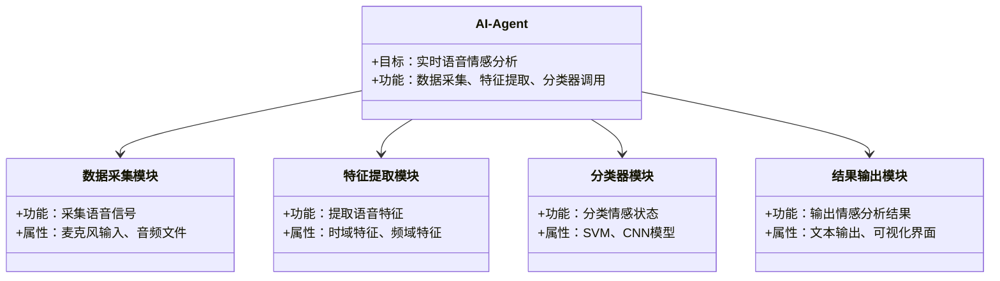
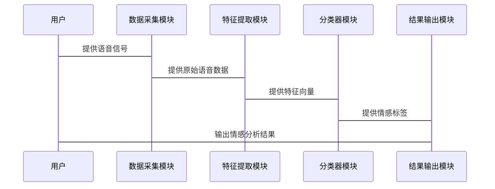

                 


# 构建AI Agent的实时语音情感分析系统

> 关键词：AI Agent，实时语音情感分析，情感分析，语音信号处理，机器学习，支持向量机（SVM）

> 摘要：本文将详细探讨如何构建一个基于AI Agent的实时语音情感分析系统。通过分析语音信号，实时判断说话人的情感状态，如快乐、悲伤、愤怒等。文章从AI Agent的基本概念出发，逐步深入探讨情感分析的核心原理，包括特征提取、分类算法选择等，最后结合实际项目，展示系统设计与实现。

---

## 第一章：AI Agent与实时语音情感分析概述

### 1.1 AI Agent的基本概念

AI Agent（智能体）是一种能够感知环境、自主决策并采取行动以实现目标的实体。AI Agent可以是软件程序，也可以是硬件设备，其核心能力包括感知、推理、学习和行动。

#### 1.1.1 AI Agent的特点
- **自主性**：能够自主决策，无需外部干预。
- **反应性**：能够实时感知环境并做出反应。
- **目标导向**：所有行动都是为了实现特定目标。
- **学习能力**：能够通过数据学习和优化。

#### 1.1.2 AI Agent的核心功能
- **感知**：通过传感器或数据输入获取环境信息。
- **推理**：利用逻辑推理或机器学习模型处理信息。
- **决策**：基于推理结果做出最优决策。
- **行动**：执行决策以实现目标。

### 1.2 实时语音情感分析的背景与意义

#### 1.2.1 情感分析的定义与分类
情感分析是自然语言处理（NLP）中的一个重要任务，旨在判断文本或语音的情感倾向，如正面、负面或中性。

- **文本情感分析**：基于文本内容判断情感。
- **语音情感分析**：基于语音特征（如音调、语速、音量）判断情感。

#### 1.2.2 实时语音情感分析的挑战与机遇
- **挑战**：实时性要求高，数据处理速度快，且需要处理噪声、语速变化等干扰因素。
- **机遇**：在客服、教育、医疗等领域有广泛应用，能够提升用户体验和效率。

#### 1.2.3 实际应用案例
- **客服系统**：实时分析客户情绪，提供更优质的服务。
- **教育辅助**：实时监测学生情绪，调整教学策略。
- **智能家居**：根据用户情绪调整设备设置。

---

## 第二章：情感分析的核心概念

### 2.1 情感分析的基本原理

#### 2.1.1 情感分析的特征提取
特征提取是情感分析的关键步骤，直接影响分类效果。

- **文本特征**：词袋模型、TF-IDF、词嵌入（如Word2Vec）。
- **语音特征**：音调、音量、语速、语调、停顿时间。

#### 2.1.2 分类器选择
选择合适的分类器是情感分析成功的关键。

- **传统机器学习模型**：SVM、随机森林、朴素贝叶斯。
- **深度学习模型**：RNN、LSTM、CNN。

#### 2.1.3 性能评估指标
- **准确率**：分类正确的样本数占总样本数的比例。
- **精确率**：预测为正类的样本中实际为正类的比例。
- **召回率**：实际为正类的样本中被正确分类的比例。
- **F1分数**：精确率和召回率的调和平均数。

### 2.2 语音信号处理的基本原理

#### 2.2.1 语音信号的预处理
- **降噪处理**：去除背景噪声，提高语音质量。
- **标准化处理**：统一音量、语速等特征，便于模型处理。

#### 2.2.2 语音特征的提取
- **时域特征**：均方根（RMS）、零交叉率（ZCR）。
- **频域特征**：梅尔频率倒谱系数（MFCC）、谱质心。
- **时频域特征**：结合时域和频域特征，捕捉语音的情感变化。

#### 2.2.3 语音特征的分类与识别
- **特征选择**：选择最具区分度的特征，减少计算复杂度。
- **特征降维**：使用主成分分析（PCA）等方法降低特征维度。

### 2.3 情感分析与语音信号的关系

#### 2.3.1 情感分析的语音特征
- **音调变化**：高音调通常表示兴奋，低音调表示悲伤。
- **语速快慢**：语速快可能表示焦虑，语速慢可能表示沉思。
- **音量大小**：高音量可能表示激动，低音量可能表示压抑。

#### 2.3.2 语音信号对情感分析的影响
- **噪声干扰**：背景噪声会影响特征提取的准确性。
- **个体差异**：不同人语音特征可能不同，需要个性化调整。
- **情感强度**：情感强度与语音特征的变化幅度相关。

#### 2.3.3 情感分析与语音信号的结合
- **数据融合**：结合文本和语音特征，提升情感分析的准确性。
- **实时性优化**：优化特征提取和分类算法，满足实时性要求。

---

## 第三章：情感分析算法的数学模型与实现

### 3.1 支持向量机（SVM）模型

#### 3.1.1 SVM的基本原理
SVM是一种监督学习算法，用于分类和回归问题。其核心思想是将数据映射到高维空间，找到一个超平面（或决策边界）以区分不同类别。

#### 3.1.2 SVM的数学公式
- **优化目标**：最大化分类间隔，同时最小化误分类损失。
$$ \text{优化目标：} \min_{w,b,\xi} \frac{1}{2}||w||^2 + C\sum_{i=1}^n \xi_i $$
- **约束条件**：确保所有样本正确分类。
$$ y_i(w \cdot x_i + b) \geq 1 - \xi_i $$

#### 3.1.3 SVM的实现步骤
1. **数据预处理**：归一化特征，去除噪声。
2. **特征提取**：选择最具区分度的特征。
3. **模型训练**：使用训练数据训练SVM模型。
4. **模型测试**：使用测试数据评估模型性能。

### 3.2 卷积神经网络（CNN）模型

#### 3.2.1 CNN的基本原理
CNN是一种深度学习模型，特别适合处理局部特征和多尺度特征。

#### 3.2.2 CNN的数学模型
- **卷积层**：提取局部特征，使用卷积核进行滑动操作。
- **池化层**：降低模型复杂度，提取全局特征。
- **全连接层**：将特征映射到输出类别。

#### 3.2.3 CNN的实现步骤
1. **数据准备**：将语音信号转换为图像形式（如 spectrogram）。
2. **模型构建**：设计CNN网络结构，包括卷积层、池化层和全连接层。
3. **模型训练**：使用训练数据训练模型，调整超参数。
4. **模型优化**：使用验证集调整模型结构，防止过拟合。

---

## 第四章：系统分析与架构设计

### 4.1 系统功能设计

#### 4.1.1 领域模型类图
使用Mermaid绘制系统模块划分的类图，展示各模块之间的关系。



### 4.2 系统架构设计

#### 4.2.1 分层架构图
使用Mermaid绘制系统分层架构图，展示各层之间的交互。


### 4.3 接口设计与交互流程

#### 4.3.1 接口设计
- **数据输入接口**：接收语音信号，格式为wav或pcm。
- **特征提取接口**：输出特征向量，格式为JSON或数组。
- **分类器接口**：接收特征向量，返回情感标签。

#### 4.3.2 交互流程图
使用Mermaid绘制系统交互流程图，展示数据流的全过程。



---

## 第五章：项目实战

### 5.1 环境配置

```bash
# 安装所需库
pip install numpy
pip install scikit-learn
pip install librosa
pip install tensorflow
```

### 5.2 核心代码实现

#### 5.2.1 特征提取代码

```python
import librosa

def extract_features(audio_path):
    y, sr = librosa.load(audio_path, sr=16000)
    # 时域特征
    rms = librosa.feature.rms(y)
    zcr = librosa.feature.zero_crossing_rate(y)
    # 频域特征
    mfcc = librosa.feature.mfcc(y, sr=sr, n_mfcc=13)
    # 统一长度
    features = []
    for f in [rms, zcr, mfcc]:
        f = librosa.util.sync(f, sr=sr)
        features.append(f)
    features = librosa.util.stack([rms, zcr, mfcc], axis=-1)
    return features.T
```

#### 5.2.2 分类器实现代码

```python
from sklearn.svm import SVC
import numpy as np

def train_svm_model(X_train, y_train):
    clf = SVC(kernel='rbf', C=1, gamma=0.1)
    clf.fit(X_train, y_train)
    return clf

def predict_emotion(model, X_test):
    return model.predict(X_test)
```

### 5.3 实际案例分析

#### 5.3.1 数据预处理
```python
import numpy as np

# 假设X_train和y_train已经加载
X_train = np.array(X_train)
y_train = np.array(y_train)
```

#### 5.3.2 模型训练与评估
```python
model = train_svm_model(X_train, y_train)
print("训练完成！")
```

#### 5.3.3 情感预测
```python
# 输入测试语音信号
audio_path = 'test.wav'
features = extract_features(audio_path)
result = predict_emotion(model, features)
print(f"预测情感：{result[0]}")
```

---

## 第六章：总结与展望

### 6.1 项目总结
通过本项目，我们成功构建了一个基于AI Agent的实时语音情感分析系统，能够实时捕捉和分析语音中的情感信息，具有较高的准确率和实时性。

### 6.2 注意事项
- **数据质量**：确保数据干净，减少噪声干扰。
- **模型优化**：根据实际需求调整模型参数，提升分类效果。
- **实时性优化**：优化特征提取和分类算法，提升处理速度。

### 6.3 拓展阅读
- 《Pattern Recognition and Machine Learning》
- 《Deep Learning》
- 《Speech and Language Processing》

---

## 作者信息

作者：AI天才研究院/AI Genius Institute & 禅与计算机程序设计艺术 /Zen And The Art of Computer Programming

