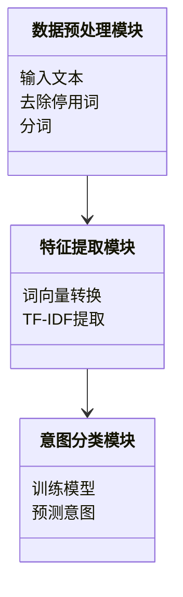
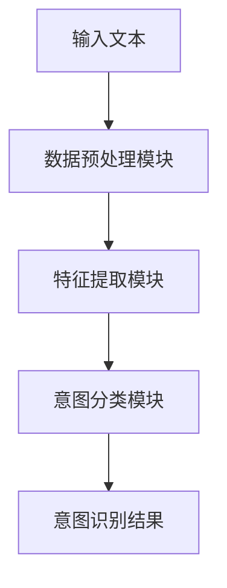
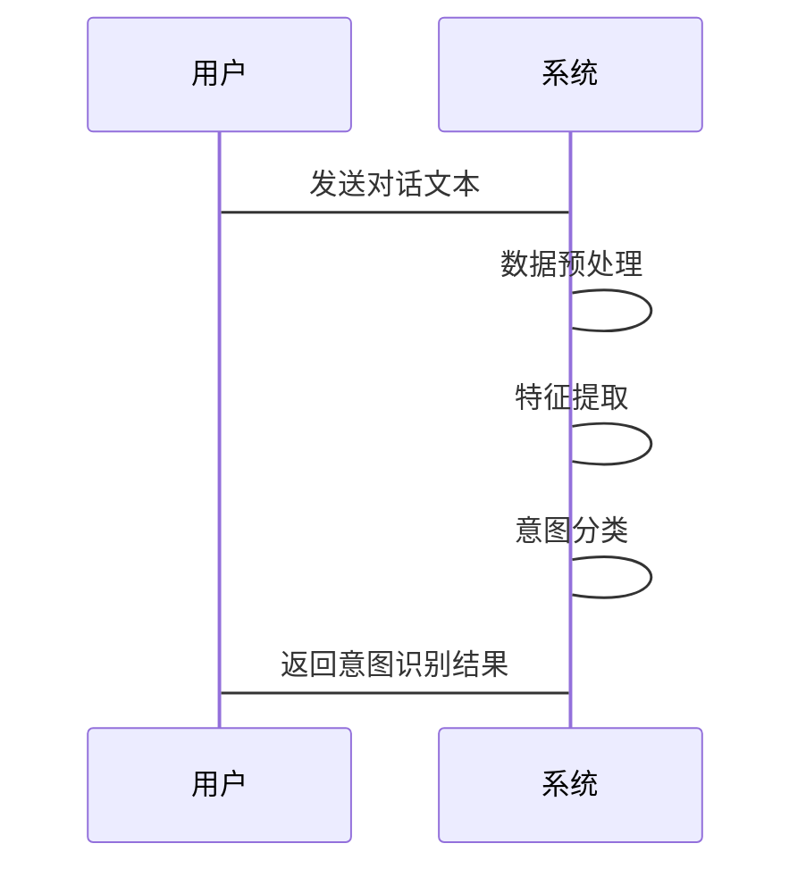

                 


# 构建AI Agent的对话意图识别系统

**关键词**：AI Agent，对话意图识别，自然语言处理，机器学习，深度学习

**摘要**：对话意图识别是构建智能对话系统的核心技术之一，旨在理解用户输入的对话内容并准确识别其意图。本文从背景介绍、核心概念、算法原理、系统架构设计、项目实战等方面详细讲解构建AI Agent对话意图识别系统的过程。通过分析对话意图识别的算法原理、系统架构和项目实现，帮助读者掌握构建高效、准确的对话意图识别系统的方法。

---

## 第一部分：对话意图识别的背景与问题背景

### 第1章：对话意图识别的背景

#### 1.1 问题背景
- **对话系统的挑战**：传统的基于规则的对话系统难以应对复杂多变的用户输入，而现代智能对话系统需要理解用户意图。
- **意图识别的重要性**：准确识别用户意图是实现智能对话系统的关键，直接影响用户体验和系统性能。
- **当前技术的局限性**：基于规则的方法难以覆盖所有场景，而统计方法和浅层学习方法在复杂语境下表现不佳。

#### 1.2 对话意图识别的定义
- **意图识别**：从用户输入的文本中识别其意图，通常是通过分析对话内容，结合上下文信息，推断用户的深层需求。
- **意图分类**：将用户意图分为多个类别，例如查询信息、预约服务、提取消息等。
- **意图识别的目标**：提高对话系统的智能化水平，使其能够更好地理解用户需求并提供精准服务。

#### 1.3 对话意图识别的边界与外延
- **边界**：对话意图识别专注于从文本中提取意图，不涉及情感分析或实体识别。
- **外延**：意图识别可以与其他技术结合，如自然语言生成、对话管理，共同构建完整的对话系统。

---

## 第二部分：对话意图识别的核心概念与联系

### 第2章：对话意图识别的核心概念

#### 2.1 对话意图识别的基本原理
- **上下文理解**：通过分析对话历史，理解当前对话的上下文信息。
- **特征提取**：从对话文本中提取关键特征，如关键词、句法结构、语义信息等。
- **模型训练**：利用机器学习或深度学习模型，训练意图分类器，使其能够准确识别意图。

#### 2.2 对话意图识别的关键技术
- **特征工程**：设计有效的特征提取方法，如词袋模型、TF-IDF、词嵌入等。
- **模型选择**：选择适合意图识别的算法，如朴素贝叶斯、支持向量机、神经网络等。
- **数据标注**：高质量的标注数据是意图识别系统的基础。

#### 2.3 对话意图识别的模型结构
- **规则模型**：基于预定义的规则，通过关键词匹配识别意图。
- **统计模型**：基于概率统计的方法，如朴素贝叶斯、最大熵模型。
- **深度学习模型**：基于神经网络的模型，如循环神经网络（RNN）、变换器（Transformer）。

### 第3章：对话意图识别的核心要素与联系

#### 3.1 对话上下文的重要性
- **上下文理解**：上下文信息对意图识别至关重要，尤其是处理多轮对话时。
- **上下文依赖性**：某些意图的识别需要依赖于对话历史信息，如“取消订单”需要知道订单号。

#### 3.2 对话历史与意图的关系
- **对话历史的作用**：对话历史提供了用户意图的背景信息，帮助模型更准确地识别当前意图。
- **意图的动态变化**：对话过程中，用户的意图可能发生变化，系统需要能够实时捕捉这些变化。

#### 3.3 对话意图与实体识别的结合
- **实体识别**：识别对话中的实体信息，如人名、地点、时间等。
- **意图与实体的关系**：意图识别结果通常依赖于实体信息，例如“预订酒店”需要知道日期和地点。

---

## 第三部分：对话意图识别的算法原理与实现

### 第4章：对话意图识别的算法原理

#### 4.1 基于规则的意图识别
- **规则模型的优势**：简单易实现，适合特定场景下的意图识别。
- **规则模型的局限性**：难以应对复杂多变的用户输入，需要频繁调整规则。

#### 4.2 基于统计的意图识别
- **统计模型的优势**：能够处理大量数据，发现数据中的潜在模式。
- **统计模型的局限性**：需要大量的标注数据，且模型解释性较差。

#### 4.3 基于深度学习的意图识别
- **深度学习模型的优势**：能够自动提取文本特征，处理复杂的语义信息。
- **深度学习模型的局限性**：需要大量的标注数据和计算资源。

### 第5章：对话意图识别的模型结构

#### 5.1 基于RNN的意图识别模型
- **循环神经网络的工作原理**：通过循环结构处理序列数据，捕捉上下文信息。
- **RNN在意图识别中的应用**：处理对话历史信息，捕捉序列特征。

#### 5.2 基于CNN的意图识别模型
- **卷积神经网络的工作原理**：通过卷积操作提取局部特征， pooling层降低维度。
- **CNN在意图识别中的应用**：提取文本中的局部特征，适用于短文本分类。

#### 5.3 基于Transformer的意图识别模型
- **Transformer的工作原理**：通过自注意力机制捕捉全局特征，编码器结构处理输入序列。
- **Transformer在意图识别中的应用**：处理长序列，捕捉全局上下文信息。

### 第6章：对话意图识别的算法实现

#### 6.1 数据预处理与特征提取
- **文本清洗**：去除停用词、标点符号等无关信息。
- **特征提取**：将文本转化为数值形式，如词向量、TF-IDF等。

#### 6.2 模型训练与优化
- **训练策略**：使用交叉熵损失函数，优化器选择Adam。
- **模型调优**：通过网格搜索选择最优参数，防止过拟合。

#### 6.3 模型评估与调优
- **评估指标**：准确率、召回率、F1分数。
- **模型调优**：通过验证集选择最佳模型，防止过拟合。

---

## 第四部分：对话意图识别的系统架构与设计

### 第7章：系统架构设计

#### 7.1 对话意图识别系统的整体架构
- **系统模块划分**：包括数据预处理模块、特征提取模块、意图分类模块。
- **系统交互流程**：用户输入对话文本，系统处理并返回意图识别结果。

#### 7.2 领域模型类图


#### 7.3 系统架构图


### 第8章：系统功能设计

#### 8.1 问题场景介绍
- **对话场景**：例如用户在智能客服系统中提出问题。
- **系统功能**：识别用户的意图，提供相应的服务。

#### 8.2 系统功能设计
- **意图分类**：将用户意图分为多个类别，例如查询信息、预约服务等。
- **上下文理解**：处理多轮对话，理解上下文信息。

#### 8.3 系统接口设计
- **输入接口**：接收用户的对话文本。
- **输出接口**：返回意图识别结果。

#### 8.4 系统交互流程


---

## 第五部分：项目实战

### 第9章：环境安装与系统实现

#### 9.1 环境安装
- **安装Python**：Python 3.6+
- **安装依赖库**：如numpy、pandas、scikit-learn、transformers

#### 9.2 核心实现代码
```python
import torch
import torch.nn as nn
import torch.optim as optim
from torch.utils.data import Dataset, DataLoader

class IntentClassifier(nn.Module):
    def __init__(self, input_size, hidden_size, output_size):
        super(IntentClassifier, self).__init__()
        self.fc1 = nn.Linear(input_size, hidden_size)
        self.fc2 = nn.Linear(hidden_size, output_size)
        self.relu = nn.ReLU()
        self.softmax = nn.Softmax(dim=1)

    def forward(self, x):
        out = self.fc1(x)
        out = self.relu(out)
        out = self.fc2(out)
        out = self.softmax(out)
        return out

# 训练数据准备
# 假设X为输入特征，y为意图标签
X_train = ... # 输入特征
y_train = ... # 意图标签
```

#### 9.3 代码解读与分析
- **模型定义**：定义意图分类器，包含两个全连接层和激活函数。
- **训练过程**：使用交叉熵损失函数和Adam优化器进行训练。
- **评估指标**：计算准确率、召回率和F1分数。

### 第10章：实际案例分析

#### 10.1 案例分析
- **案例背景**：例如智能客服系统中用户提出问题。
- **意图识别**：识别用户的意图，如查询订单状态、投诉问题等。

#### 10.2 案例解读
- **对话文本**：用户输入“我的订单还没有收到，可以帮我查一下吗？”
- **意图识别**：识别意图是“查询订单状态”。

### 第11章：项目小结

#### 11.1 项目总结
- **实现成果**：成功构建了对话意图识别系统，能够准确识别用户意图。
- **经验总结**：数据预处理和特征提取对系统性能影响较大，需要精心设计。

---

## 第六部分：最佳实践与总结

### 第12章：最佳实践 tips

#### 12.1 小结
- **系统构建**：从数据预处理到模型训练，再到系统部署，每一步都需要精心设计。
- **算法选择**：根据具体场景选择合适的算法，如深度学习模型在复杂场景下表现更好。

#### 12.2 注意事项
- **数据质量**：高质量的标注数据是系统性能的基础。
- **模型调优**：通过网格搜索和交叉验证选择最优参数，防止过拟合。

#### 12.3 拓展阅读
- **相关书籍**：《深度学习入门：基于Python的理论与实践》
- **论文推荐**：阅读最新的意图识别相关论文，了解前沿技术。

---

## 作者信息

**作者**：AI天才研究院/AI Genius Institute & 禅与计算机程序设计艺术 /Zen And The Art of Computer Programming

---

以上是《构建AI Agent的对话意图识别系统》的文章大纲，希望对您有所帮助！如果需要进一步的细节或具体章节内容，请随时告知。

