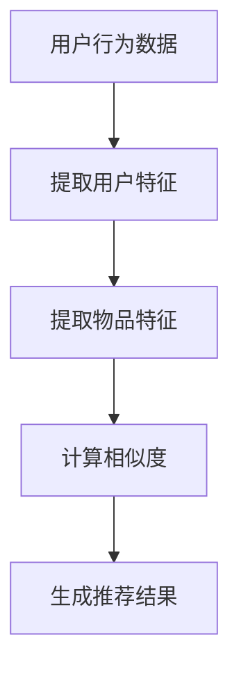
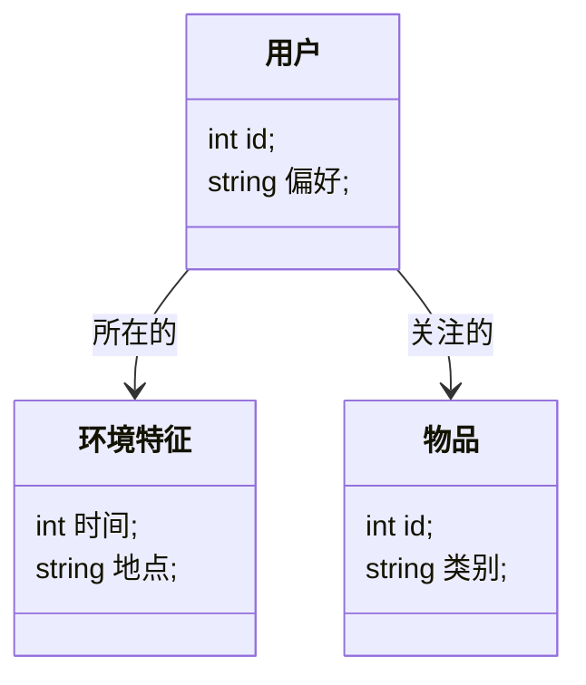
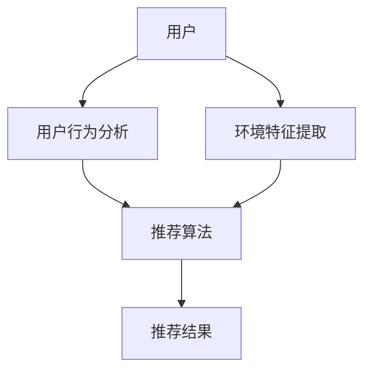
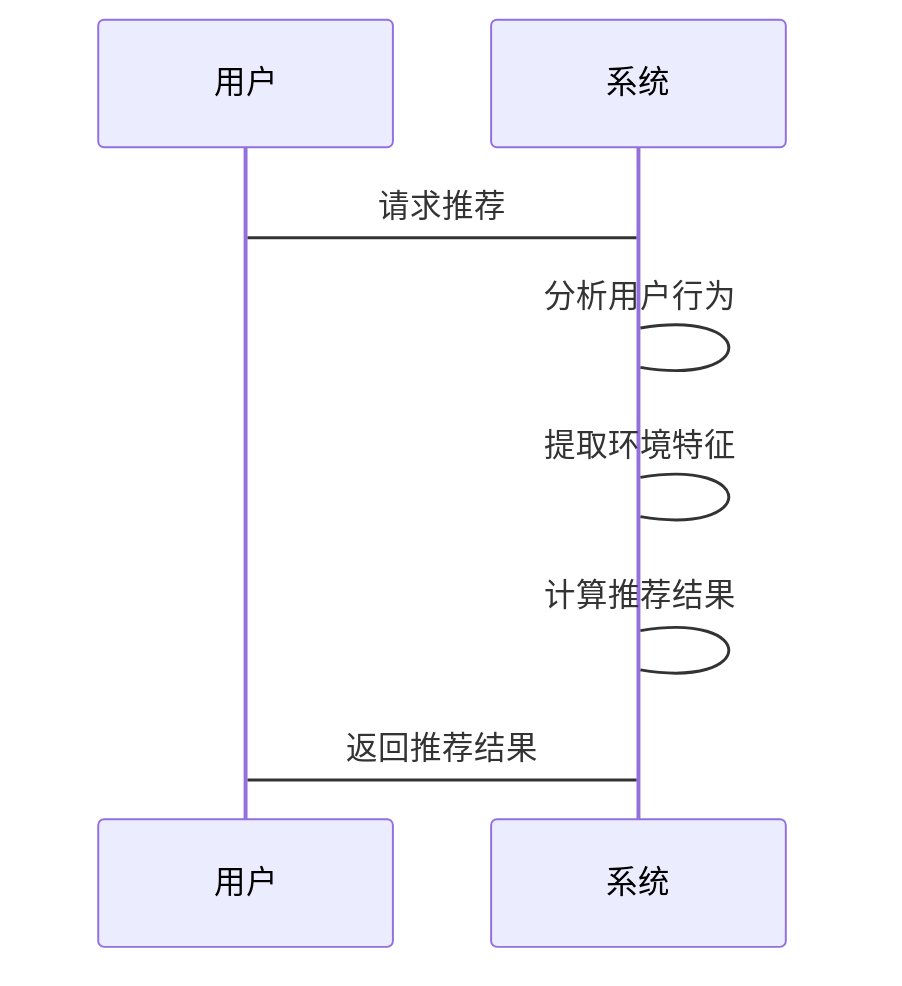

                 


# 《构建AI Agent的情境感知推荐系统》

## 关键词：情境感知推荐系统、AI Agent、推荐系统、机器学习、智能推荐、动态推荐

## 摘要：本文详细探讨了构建基于AI Agent的情境感知推荐系统的各个方面，从核心概念、算法原理到系统架构设计，再到项目实战，为读者提供全面的技术指导。文章深入分析了情境感知推荐系统的重要性、工作原理及其实现方法，结合实际案例，帮助读者掌握构建高效推荐系统的技能。

---

## 第1章: 情境感知推荐系统概述

### 1.1 问题背景与描述

#### 1.1.1 传统推荐系统的局限性
传统推荐系统主要基于用户历史行为和偏好进行推荐，但存在以下问题：
- **数据稀疏性**：当用户行为数据不足时，推荐效果不佳。
- **静态性**：无法实时捕捉用户动态需求和环境变化。
- **缺乏情境理解**：无法结合用户所处的具体情境（如时间、地点、设备等）进行推荐。

#### 1.1.2 情境感知推荐的定义与目标
情境感知推荐系统是一种能够实时感知用户所处情境（环境特征、用户行为、时间、地点等），并根据这些信息动态调整推荐结果的推荐系统。其目标是提供更加精准、个性化和情境化的推荐。

#### 1.1.3 情境感知推荐的边界与外延
- **边界**：情境感知推荐系统专注于基于用户行为和环境特征的推荐，不考虑用户的内部心理状态。
- **外延**：可以与其他技术（如增强学习、实时数据流处理）结合，提升推荐系统的动态性和智能性。

### 1.2 情境感知推荐的核心要素

#### 1.2.1 用户行为分析
用户行为分析是情境感知推荐的基础，包括：
- **显式行为**：如点击、收藏、购买等。
- **隐式行为**：如浏览时长、停留次数等。

#### 1.2.2 环境特征提取
环境特征提取是情境感知推荐的重要组成部分，包括：
- **时间特征**：如一天中的时间段、星期几等。
- **地点特征**：如用户所处的地理位置。
- **设备特征**：如用户使用的设备类型（手机、电脑等）。

#### 1.2.3 内容理解与关联
内容理解与关联是将推荐内容与用户需求和环境特征相结合的关键步骤，包括：
- **内容特征提取**：如文本内容的关键词提取、图像内容的特征提取等。
- **内容与情境的关联**：根据用户的情境特征，调整推荐内容的权重。

---

## 第2章: 情境感知推荐系统的概念与联系

### 2.1 核心概念原理

#### 2.1.1 情境感知推荐的原理概述
情境感知推荐系统通过感知用户的情境特征（环境、行为等），结合推荐算法，生成动态的推荐结果。其核心在于实时捕捉和分析用户的情境信息，动态调整推荐策略。

#### 2.1.2 情境感知推荐与传统推荐的对比
| 比较维度 | 传统推荐系统 | 情境感知推荐系统 |
|----------|---------------|------------------|
| 数据来源 | 用户行为数据 | 用户行为+环境数据 |
| 推荐依据 | 用户偏好 | 用户行为+环境特征 |
| 动态性   | 静态 | 动态 |

#### 2.1.3 情境感知推荐的核心算法特点
- **实时性**：能够实时处理用户行为和环境数据。
- **动态性**：根据情境变化调整推荐结果。
- **个性化**：结合用户和情境特征，提供个性化推荐。

### 2.2 实体关系图

```mermaid
er
  actor: 用户
  item: 物品
  context: 环境特征
  user_behavior: 用户行为
  recommendation: 推荐结果
  actor --> user_behavior: 产生
  user_behavior --> recommendation: 影响
  context --> recommendation: 调整
```

---

## 第3章: 情境感知推荐系统的算法原理

### 3.1 算法概述

#### 3.1.1 基于协同过滤的推荐算法

##### 3.1.1.1 算法流程
1. 数据预处理：收集用户行为数据，构建用户-物品矩阵。
2. 相似性计算：计算用户之间的相似性（如余弦相似度）。
3. 推荐生成：基于相似用户的偏好，生成推荐列表。

##### 3.1.1.2 数学公式
$$ \text{相似度} = \frac{\sum_{i=1}^{n} (u_i - \bar{u})(v_i - \bar{v})}{\sqrt{\sum_{i=1}^{n} (u_i - \bar{u})^2} \cdot \sqrt{\sum_{i=1}^{n} (v_i - \bar{v})^2}} $$

#### 3.1.2 基于内容的推荐算法

##### 3.1.2.1 算法流程
1. 提取物品特征：如文本内容的关键词、图像的特征向量。
2. 计算用户偏好：基于用户行为，生成用户偏好向量。
3. 计算相似度：基于内容特征计算推荐结果。

##### 3.1.2.2 数学公式
$$ \text{相似度} = \frac{\sum_{i=1}^{n} w_i \cdot f_i}{\sum_{i=1}^{n} w_i} $$
其中，$w_i$ 是特征 $i$ 的权重，$f_i$ 是特征 $i$ 的值。

#### 3.1.3 混合推荐模型

##### 3.1.3.1 算法流程
1. 组合协同过滤和基于内容的推荐结果。
2. 根据权重调整推荐结果。

##### 3.1.3.2 数学公式
$$ \text{最终推荐} = \alpha \cdot \text{协同过滤结果} + (1-\alpha) \cdot \text{基于内容的推荐结果} $$
其中，$\alpha$ 是协同过滤的权重。

### 3.2 算法流程图



---

## 第4章: 情境感知推荐系统的系统分析与架构设计

### 4.1 系统分析

#### 4.1.1 问题场景介绍
情境感知推荐系统需要实时处理用户行为和环境数据，动态生成推荐结果。

#### 4.1.2 系统功能设计

##### 4.1.2.1 用户行为分析模块
- 收集用户行为数据，分析用户偏好。

##### 4.1.2.2 环境特征提取模块
- 提取时间、地点、设备等环境特征。

##### 4.1.2.3 推荐算法模块
- 实现协同过滤、基于内容的推荐算法。

##### 4.1.2.4 推荐结果输出模块
- 输出最终的推荐结果。

### 4.2 系统架构设计

#### 4.2.1 领域模型类图



#### 4.2.2 系统架构图



#### 4.2.3 系统接口设计

##### 4.2.3.1 API接口
- `/api/v1/recommend/?user_id=123&context=time=14:00,location=beijing`

##### 4.2.3.2 返回结果格式
```json
{
    "status": "success",
    "data": ["推荐物品1", "推荐物品2", ...]
}
```

#### 4.2.4 系统交互流程图



---

## 第5章: 情境感知推荐系统的项目实战

### 5.1 环境安装

#### 5.1.1 安装Python和相关库
```bash
pip install numpy pandas scikit-learn
```

#### 5.1.2 安装Jupyter Notebook
```bash
pip install jupyter
```

### 5.2 核心代码实现

#### 5.2.1 数据预处理
```python
import pandas as pd
data = pd.read_csv('user_behavior.csv')
```

#### 5.2.2 协同过滤实现
```python
from sklearn.metrics.pairwise import cosine_similarity
user_matrix = data.pivot('user_id', 'item_id', 'rating')
similarity_matrix = cosine_similarity(user_matrix)
```

#### 5.2.3 基于内容的推荐实现
```python
from sklearn.feature_extraction.text import TfidfVectorizer
vectorizer = TfidfVectorizer()
item_descriptions = data['description'].tolist()
tfidf_matrix = vectorizer.fit_transform(item_descriptions)
```

#### 5.2.4 混合推荐模型实现
```python
alpha = 0.5
hybrid_recommendations = alpha *协同过滤结果 + (1-alpha) * 基于内容的推荐结果
```

### 5.3 案例分析与总结

#### 5.3.1 案例分析
假设我们有一个电商推荐系统，用户在下午2点位于北京，系统会根据用户的历史购买记录和当前时间、地点推荐相关商品。

#### 5.3.2 总结
通过本章的实战，读者可以掌握情境感知推荐系统的实现方法，并能够将其应用到实际项目中。

---

## 第6章: 最佳实践与小结

### 6.1 最佳实践 tips

- **实时性**：确保推荐系统能够实时处理用户行为和环境数据。
- **数据质量**：保证数据的完整性和准确性。
- **模型优化**：定期优化推荐算法，提升推荐效果。

### 6.2 小结

本文详细介绍了情境感知推荐系统的构建过程，从核心概念、算法原理到系统架构设计，再到项目实战，为读者提供了全面的技术指导。

### 6.3 注意事项

- **数据隐私**：在处理用户数据时，需要注意数据隐私和安全。
- **性能优化**：优化推荐算法的性能，提升用户体验。

### 6.4 拓展阅读

- 《推荐系统实战》
- 《机器学习实战》
- 《AI Agent: 理论与实践》

---

## 作者：AI天才研究院 & 禅与计算机程序设计艺术

