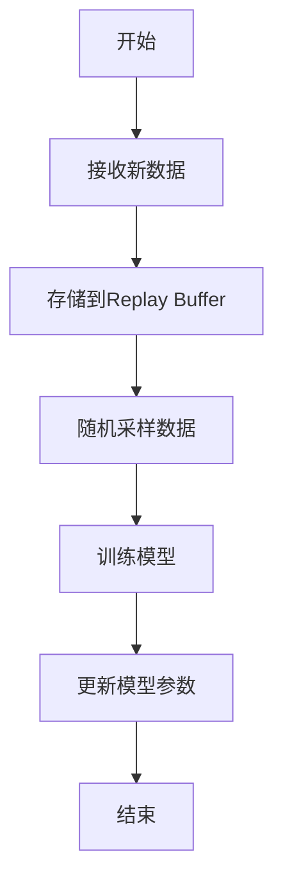
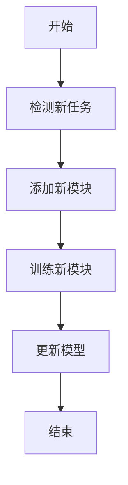
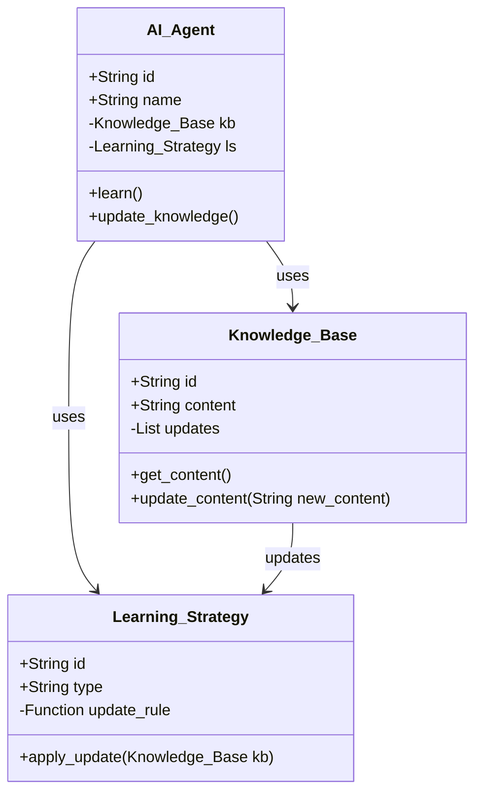
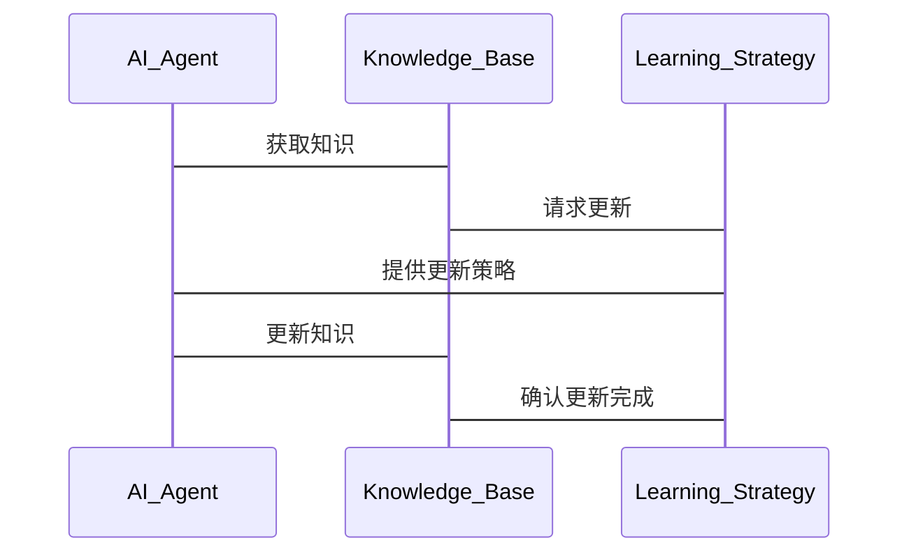

                 


# 构建AI Agent的持续学习与知识更新机制

> 关键词：AI Agent，持续学习，知识更新，机器学习，在线学习，知识表示

> 摘要：  
本文详细探讨了构建AI Agent的持续学习与知识更新机制的核心原理、算法实现、系统设计及实际应用。首先，我们介绍了AI Agent的基本概念及其持续学习与知识更新的必要性。接着，深入分析了持续学习与知识更新的核心概念、算法原理以及系统架构。最后，通过实际案例展示了如何设计和实现一个具备持续学习能力的AI Agent，并总结了相关的最佳实践。

---

## 第1章: 持续学习与知识更新的背景与问题背景

### 1.1 问题背景

#### 1.1.1 AI Agent的定义与核心功能
AI Agent（人工智能代理）是一种能够感知环境、自主决策并执行任务的智能系统。其核心功能包括：

- **感知环境**：通过传感器或数据输入接口获取环境信息。
- **决策与推理**：基于感知的信息进行分析、推理和决策。
- **执行动作**：根据决策结果执行具体的动作或输出结果。
- **学习与适应**：通过学习算法不断优化自身的知识库和行为策略。

#### 1.1.2 持续学习与知识更新的必要性
在动态变化的环境中，AI Agent需要具备持续学习和知识更新的能力，以应对以下挑战：

1. **环境变化**：环境中的信息、规则或任务目标可能会发生变化。
2. **数据流式更新**：AI Agent需要处理实时数据流，保持对最新信息的敏感性。
3. **任务复杂性**：复杂的任务可能需要AI Agent不断学习新的知识和技能。

#### 1.1.3 当前AI Agent的局限性与挑战
传统的AI Agent通常依赖于静态的知识库和预训练模型，难以应对以下问题：

- **知识过时**：随着环境变化，原有的知识可能不再适用。
- **学习效率**：面对海量数据，如何高效地更新知识是一个挑战。
- **模型适应性**：现有模型可能无法快速适应新任务或新数据。

### 1.2 问题描述

#### 1.2.1 知识更新的定义与目标
知识更新是指AI Agent在运行过程中，动态地调整其知识库，以反映最新信息、任务需求或环境变化。其目标是确保AI Agent的知识始终准确、完整且适应当前任务需求。

#### 1.2.2 持续学习的核心问题与边界
持续学习的核心问题是如何在不遗忘之前所学知识的情况下，快速适应新任务或新数据。其边界包括：

- **任务边界**：持续学习仅针对特定任务或领域。
- **数据边界**：持续学习通常处理顺序数据流或增量数据。
- **资源边界**：受限于计算资源和内存资源。

#### 1.2.3 知识更新与持续学习的关系
知识更新是持续学习的结果，而持续学习是实现知识更新的手段。持续学习通过优化算法，使得知识更新更加高效和准确。

### 1.3 问题解决思路

#### 1.3.1 知识表示与存储的优化
- **知识表示**：使用符号逻辑、向量表示或图结构表示知识。
- **知识存储**：采用分布式存储或分模块存储，便于更新和维护。

#### 1.3.2 持续学习算法的设计与实现
- **算法设计**：设计能够支持增量学习的算法，如 Replay、Progressive Neural Networks 等。
- **算法实现**：通过神经网络实现持续学习，确保模型能够逐步优化。

#### 1.3.3 知识更新机制的构建与应用
- **更新机制**：设计基于规则或基于模型的知识更新机制。
- **机制应用**：将知识更新机制应用于具体任务中，如自然语言处理、图像识别等。

### 1.4 本章小结

#### 1.4.1 核心概念的总结
- AI Agent的核心功能包括感知、决策、执行和学习。
- 持续学习与知识更新是AI Agent适应动态环境的关键能力。

#### 1.4.2 问题解决的思路框架
- 从知识表示、算法设计到机制构建，逐步实现持续学习与知识更新。

#### 1.4.3 下文展开的内容提示
- 下文将详细探讨持续学习与知识更新的核心概念及其联系。

---

## 第2章: 持续学习与知识更新的核心概念

### 2.1 持续学习的定义与核心要素

#### 2.1.1 持续学习的定义
持续学习是指AI Agent在运行过程中，通过不断接收新的数据或任务，逐步优化自身的模型或知识库，以适应环境变化。

#### 2.1.2 核心要素：知识表示、学习策略、更新机制
- **知识表示**：如何将知识以计算机可处理的形式表示。
- **学习策略**：选择何种算法或策略进行学习。
- **更新机制**：如何动态调整知识或模型。

#### 2.1.3 持续学习与在线学习的区别
- **在线学习**：处理流式数据，实时更新模型。
- **持续学习**：不仅处理流式数据，还支持多任务学习和任务迁移。

### 2.2 知识更新的定义与实现方式

#### 2.2.1 知识更新的定义
知识更新是指AI Agent在运行过程中，动态地调整其知识库，以反映最新信息、任务需求或环境变化。

#### 2.2.2 知识更新的实现方式
- **增量学习**：逐步更新模型，避免重新训练。
- **模块化学习**：将知识分解为模块，分别更新。

#### 2.2.3 知识更新的评价指标
- **更新效率**：更新速度和资源消耗。
- **更新效果**：更新后模型的准确性和稳定性。

### 2.3 持续学习与知识更新的关系

#### 2.3.1 持续学习是知识更新的基础
- 持续学习提供了一种动态优化模型的方法，使得知识更新成为可能。

#### 2.3.2 知识更新是持续学习的目标
- 通过知识更新，AI Agent能够保持其知识库的准确性和适用性。

#### 2.3.3 两者的相互作用与协同
- 持续学习通过优化算法，使得知识更新更加高效和准确。

### 2.4 核心概念对比表

#### 2.4.1 持续学习与在线学习对比表

| 特性                | 持续学习               | 在线学习               |
|---------------------|----------------------|----------------------|
| 数据输入方式         | 流式数据或增量数据     | 流式数据               |
| 学习目标             | 多任务学习             | 单任务学习             |
| 模型更新方式         | 动态调整模型参数       | 实时更新模型参数       |
| 适应性               | 高                   | 高                   |

#### 2.4.2 知识更新与模型微调对比表

| 特性                | 知识更新               | 模型微调               |
|---------------------|----------------------|----------------------|
| 更新对象             | 知识库或模型参数       | 模型参数               |
| 更新方式             | 增量更新               | 重新训练或微调         |
| 更新目标             | 适应新任务             | 优化模型性能           |
| 适用场景             | 动态环境               | 新任务或数据变化       |

### 2.5 ER实体关系图

```mermaid
erDiagram
    actor User {
        <String> id
        <String> name
    }
    agent AI_Agent {
        <String> id
        <String> name
        <Knowledge> knowledge_base
        <Learning_Strategy> learning_strategy
    }
    knowledge_base {
        <String> id
        <String> content
    }
    learning_strategy {
        <String> id
        <String> type
    }
    AI_Agent --> knowledge_base: contains
    AI_Agent --> learning_strategy: uses
```

---

## 第3章: 持续学习与知识更新的算法原理

### 3.1 基于Replay的持续学习算法

#### 3.1.1 算法原理
Replay算法通过存储之前的经验，逐步优化模型参数，防止知识遗忘。

#### 3.1.2 算法实现

```python
class ReplayBuffer:
    def __init__(self, buffer_size):
        self.buffer = deque(maxlen=buffer_size)
    
    def store(self, transition):
        self.buffer.append(transition)
    
    def sample(self, batch_size):
        return random.sample(self.buffer, batch_size)
```

#### 3.1.3 算法流程图



### 3.2 基于Progressive Neural Networks的知识更新算法

#### 3.2.1 算法原理
Progressive Neural Networks通过增加新的神经网络模块，逐步扩展模型容量。

#### 3.2.2 算法实现

```python
class ProgressiveNeuralNetwork:
    def __init__(self):
        self.modules = []
    
    def add_module(self, module):
        self.modules.append(module)
    
    def forward(self, x):
        for module in self.modules:
            x = module(x)
        return x
```

#### 3.2.3 算法流程图



---

## 第4章: 系统分析与架构设计

### 4.1 问题场景介绍

#### 4.1.1 问题场景
AI Agent需要在动态环境中实时处理任务，要求具备持续学习和知识更新能力。

### 4.2 项目介绍

#### 4.2.1 项目目标
构建一个具备持续学习能力的AI Agent，能够在动态环境中实时更新知识库。

### 4.3 系统功能设计

#### 4.3.1 领域模型



### 4.4 系统架构设计

#### 4.4.1 系统架构图


### 4.5 系统接口设计

#### 4.5.1 接口设计
- `update_knowledge()`：更新知识库。
- `learn()`：执行学习任务。

### 4.6 系统交互流程图



---

## 第5章: 项目实战

### 5.1 环境安装

#### 5.1.1 环境配置
- 安装Python、TensorFlow、Keras等框架。

### 5.2 核心代码实现

#### 5.2.1 知识更新实现

```python
def update_knowledge(kb, new_data):
    # 更新知识库
    kb.update(new_data)
```

#### 5.2.2 持续学习实现

```python
def continuous_learning(agent, data_stream):
    for data in data_stream:
        agent.learn(data)
        agent.update_knowledge()
```

### 5.3 实际案例分析

#### 5.3.1 案例介绍
构建一个多领域知识更新的AI Agent，应用于自然语言处理任务。

#### 5.3.2 案例分析
通过实际数据流测试，验证AI Agent的知识更新能力和学习效率。

---

## 第6章: 最佳实践与总结

### 6.1 最佳实践

#### 6.1.1 知识表示的选择
- 根据任务需求选择合适的知识表示方法。

#### 6.1.2 持续学习算法的优化
- 定期评估和优化学习策略。

#### 6.1.3 知识更新的频率控制
- 根据任务需求和资源限制，合理控制知识更新的频率。

### 6.2 小结

#### 6.2.1 核心内容回顾
- AI Agent的持续学习与知识更新是动态环境中的关键能力。

#### 6.2.2 注意事项
- 确保知识更新的准确性和效率。

### 6.3 拓展阅读

#### 6.3.1 推荐资料
- 《Neural Networks and Deep Learning》
- 《Hands-On Machine Learning with Scikit-Learn, Keras, and TensorFlow》

---

## 作者：AI天才研究院/AI Genius Institute & 禅与计算机程序设计艺术 /Zen And The Art of Computer Programming

