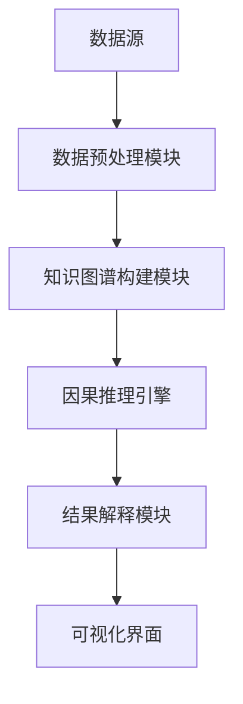

                 


# 构建AI Agent的知识图谱因果推理引擎

> 关键词：知识图谱，因果推理，AI Agent，因果图模型，反事实推理

> 摘要：本文将详细介绍如何构建一个基于知识图谱的因果推理引擎，并将其应用于AI Agent的智能决策过程中。通过分析知识图谱与因果推理的核心概念、算法原理、系统架构设计以及实际项目案例，本文旨在为读者提供一个全面且深入的技术指南，帮助他们理解并实现AI Agent的知识图谱因果推理引擎。

---

## 目录

1. **知识图谱与因果推理概述**
   - 1.1 知识图谱的定义与特点
   - 1.2 因果推理的基本概念
   - 1.3 AI Agent的基本概念

2. **知识图谱与因果推理的核心概念**
   - 2.1 知识图谱的构建过程
   - 2.2 因果推理的基本原理
   - 2.3 知识图谱与因果推理的关系

3. **知识图谱因果推理的数学模型**
   - 3.1 知识图谱的表示模型
   - 3.2 因果推理的数学模型
   - 3.3 知识图谱与因果推理的联合建模

4. **知识图谱因果推理的系统架构设计**
   - 4.1 系统功能设计
   - 4.2 系统架构设计
   - 4.3 接口设计与交互流程

5. **知识图谱因果推理的项目实战**
   - 5.1 环境安装与数据准备
   - 5.2 知识图谱构建与因果推理引擎实现
   - 5.3 实际案例分析与结果解读

6. **总结与展望**
   - 6.1 核心知识点总结
   - 6.2 未来发展方向

7. **附录**
   - 7.1 工具安装指南
   - 7.2 数据集介绍

---

## 第1章: 知识图谱与因果推理概述

### 1.1 知识图谱的定义与特点

知识图谱是一种用于表示实体及其关系的结构化数据。它通过将实体和关系表示为图中的节点和边，构建出一个庞大的语义网络。知识图谱的核心特点包括：

- **语义丰富性**：能够表示实体之间的复杂关系。
- **可扩展性**：支持大规模数据的构建和扩展。
- **动态性**：能够实时更新和演化。

### 1.2 因果推理的基本概念

因果推理是一种用于理解因果关系的推理方法。它通过分析变量之间的因果关系，推断出因果关系的强度和方向。因果推理的基本原理包括：

- **因果关系的定义**：因果关系是指一个事件（原因）导致另一个事件（结果）的发生。
- **因果图模型**：通过图模型表示变量之间的因果关系。
- **反事实推理**：通过假设相反的事实来推断因果关系。

### 1.3 AI Agent的基本概念

AI Agent是一种智能体，能够感知环境、自主决策并执行任务。AI Agent的核心特征包括：

- **自主性**：能够在没有外部干预的情况下自主运行。
- **反应性**：能够根据环境的变化调整自己的行为。
- **学习能力**：能够通过经验改进自己的决策能力。

---

## 第2章: 知识图谱与因果推理的核心概念

### 2.1 知识图谱的构建过程

知识图谱的构建过程包括数据采集与预处理、实体识别与关系抽取以及知识图谱的存储与管理。

- **数据采集与预处理**：从多种数据源采集数据，并进行清洗和预处理。
- **实体识别与关系抽取**：通过自然语言处理技术识别实体及其关系。
- **知识图谱的存储与管理**：使用图数据库存储知识图谱，并进行高效的查询和管理。

### 2.2 因果推理的基本原理

因果推理的基本原理包括结构方程模型和反事实推理。

- **结构方程模型**：通过方程描述变量之间的因果关系。
- **反事实推理**：通过假设相反的事实推断因果关系。

### 2.3 知识图谱与因果推理的关系

知识图谱为因果推理提供了丰富的语义信息，而因果推理则增强了知识图谱的推理能力。两者的结合能够提升AI Agent的智能决策能力。

---

## 第3章: 知识图谱因果推理的数学模型

### 3.1 知识图谱的表示模型

知识图谱的表示模型包括基于图的表示方法和基于向量的表示方法。

- **基于图的表示方法**：通过图结构表示实体及其关系。
- **基于向量的表示方法**：通过向量嵌入技术表示实体和关系。

### 3.2 因果推理的数学模型

因果推理的数学模型包括结构方程模型和反事实推理。

- **结构方程模型**：通过方程描述变量之间的因果关系，如：
  $$ y = \beta x + \epsilon $$
- **反事实推理**：通过假设相反的事实推断因果关系，如：
  $$ do(x) = y $$

### 3.3 知识图谱与因果推理的联合建模

知识图谱与因果推理的联合建模包括知识图谱嵌入与因果推理的结合，以及基于图的因果推理模型。

- **知识图谱嵌入与因果推理的结合**：将知识图谱嵌入到因果推理模型中，提升推理能力。
- **基于图的因果推理模型**：通过图结构进行因果推理，如因果图模型。

---

## 第4章: 知识图谱因果推理的系统架构设计

### 4.1 系统功能设计

系统功能设计包括数据采集与处理模块、知识图谱构建模块、因果推理引擎模块以及结果解释与可视化模块。

- **数据采集与处理模块**：从多种数据源采集数据，并进行清洗和预处理。
- **知识图谱构建模块**：通过实体识别与关系抽取构建知识图谱。
- **因果推理引擎模块**：基于知识图谱进行因果推理，输出结果。
- **结果解释与可视化模块**：将推理结果进行解释和可视化。

### 4.2 系统架构设计

系统架构设计包括模块划分、数据流设计以及系统交互设计。



### 4.3 接口设计与交互流程

接口设计与交互流程包括系统接口设计、数据流设计以及用户交互设计。

- **系统接口设计**：定义系统各模块之间的接口，确保数据流的畅通。
- **数据流设计**：从数据源到知识图谱构建，再到因果推理引擎，最终输出结果。
- **用户交互设计**：用户通过可视化界面与系统交互，获取推理结果。

---

## 第5章: 知识图谱因果推理的项目实战

### 5.1 环境安装与数据准备

环境安装包括安装Python、图数据库以及其他必要的库和工具。

- **Python安装**：安装Python 3.x及以上版本。
- **图数据库安装**：安装Neo4j或其他图数据库。
- **相关库安装**：安装networkx、pandas等库。

### 5.2 知识图谱构建与因果推理引擎实现

知识图谱构建包括数据采集、实体识别和关系抽取。因果推理引擎实现包括结构方程模型和反事实推理。

- **知识图谱构建代码示例**：
  ```python
  import networkx as nx
  G = nx.Graph()
  G.add_nodes_from(["A", "B", "C"])
  G.add_edges_from([("A", "B"), ("B", "C")])
  ```
- **因果推理引擎代码示例**：
  ```python
  def structural_equation_model(x, beta):
      return beta * x + np.random.normal(0, 1)
  ```

### 5.3 实际案例分析与结果解读

通过具体案例分析，展示知识图谱因果推理引擎的实际应用和效果。

- **案例分析**：假设一个因果关系模型，通过数据验证因果关系的强度和方向。
- **结果解读**：解释因果推理引擎的输出结果，分析其在实际场景中的应用价值。

---

## 第6章: 总结与展望

### 6.1 核心知识点总结

本文详细介绍了知识图谱与因果推理的核心概念、算法原理、系统架构设计以及实际项目案例。

### 6.2 未来发展方向

未来的发展方向包括更复杂的因果图模型、更高效的反事实推理算法以及知识图谱的动态更新与演化。

---

## 第7章: 附录

### 7.1 工具安装指南

详细说明如何安装Python、图数据库以及其他相关工具。

### 7.2 数据集介绍

介绍常用的知识图谱数据集及其应用场景。

---

## 作者：AI天才研究院/AI Genius Institute & 禅与计算机程序设计艺术 /Zen And The Art of Computer Programming

