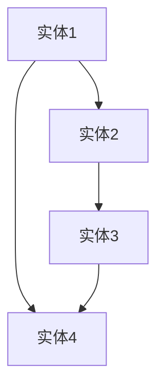
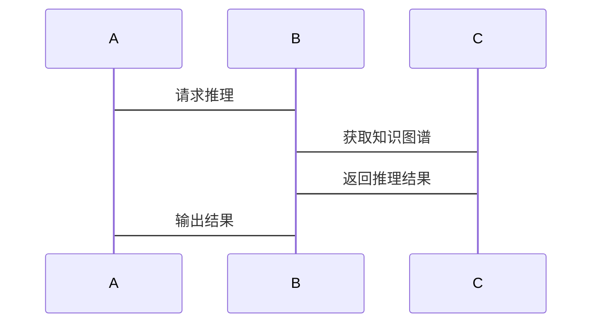

                 


# 构建AI Agent的知识图谱多模态推理系统

## 关键词
- AI Agent
- 知识图谱
- 多模态推理
- 符号-神经网络结合
- 系统架构设计

## 摘要
构建一个高效的AI Agent需要结合知识图谱和多模态推理技术。本文从知识图谱和多模态推理的基本概念出发，详细阐述了它们在AI Agent中的应用。通过分析知识图谱的构建与管理、多模态推理算法的实现，以及知识图谱与多模态推理的结合，本文为构建AI Agent的知识图谱多模态推理系统提供了系统化的解决方案。最后，结合实际案例，探讨了该系统的应用前景。

---

# 第1章 知识图谱与多模态推理概述

## 1.1 知识图谱的定义与特点
### 1.1.1 知识图谱的定义
知识图谱是一种以图结构形式表示知识的语义网络，由节点（实体）和边（关系）组成，广泛应用于搜索引擎、问答系统和推荐系统。

### 1.1.2 知识图谱的核心特点
| 特性 | 描述 |
|------|------|
| 结构化 | 实体和关系的结构化表示，便于计算机理解和推理。 |
| 语义化 | 包含丰富的语义信息，支持跨语言和跨领域的知识关联。 |
| 可扩展性 | 支持动态扩展，能够整合多模态数据。 |

### 1.1.3 知识图谱与传统数据库的区别
- **存储方式**：知识图谱以图结构存储，传统数据库以行和列存储。
- **查询方式**：知识图谱支持复杂的语义查询，传统数据库支持简单的事务查询。

### 1.1.4 知识图谱的应用场景
- 智能问答系统
- 知识推理与推荐
- 多语言理解与生成

## 1.2 多模态推理的定义与特点
### 1.2.1 多模态推理的定义
多模态推理是同时利用多种数据模态（如文本、图像、语音）进行推理的过程，能够提升AI系统的感知和理解能力。

### 1.2.2 多模态推理的核心特点
- **多模态数据融合**：能够同时处理和关联不同模态的数据。
- **跨模态推理**：能够跨越不同数据模态进行推理和关联。
- **语义理解**：能够理解数据背后的语义信息。

### 1.2.3 多模态推理的应用场景
- 多模态问答系统
- 视觉推理与理解
- 跨模态信息检索

## 1.3 AI Agent的定义与特点
### 1.3.1 AI Agent的定义
AI Agent是一种能够感知环境、自主决策并执行任务的智能体，广泛应用于自动驾驶、智能助手和机器人等领域。

### 1.3.2 AI Agent的核心特点
- **自主性**：能够自主决策和行动。
- **反应性**：能够实时感知环境并做出反应。
- **学习能力**：能够通过学习提升性能。

## 1.4 知识图谱在AI Agent中的作用
### 1.4.1 知识图谱作为AI Agent的知识库
知识图谱为AI Agent提供了丰富的背景知识，支持其进行推理和决策。

### 1.4.2 知识图谱支持多模态推理的优势
知识图谱能够整合多种数据模态，为多模态推理提供语义支持。

### 1.4.3 知识图谱在AI Agent中的应用案例
- **智能问答**：基于知识图谱进行问答和推理。
- **推荐系统**：利用知识图谱进行个性化推荐。

## 1.5 本章小结
本章介绍了知识图谱和多模态推理的基本概念和特点，分析了它们在AI Agent中的重要性。知识图谱为AI Agent提供了知识基础，而多模态推理技术则增强了AI Agent的理解和推理能力。

---

# 第2章 知识图谱构建与管理

## 2.1 知识图谱的构建流程
### 2.1.1 数据采集与预处理
- 数据来源：结构化数据、文本数据、图像数据。
- 数据清洗：去重、去噪和格式统一。

### 2.1.2 实体识别与关系抽取
- 实体识别：使用NLP技术从文本中提取实体。
- 关系抽取：识别实体之间的关系并构建关系三元组。

### 2.1.3 知识图谱的构建与存储
- 数据建模：设计知识图谱的实体和关系模型。
- 数据存储：使用图数据库（如Neo4j）存储知识图谱。

### 2.1.4 知识图谱的可视化与探索
- 使用工具（如Gephi）进行知识图谱的可视化。
- 通过可视化工具进行知识图谱的交互式探索。

## 2.2 知识图谱的管理与优化
### 2.2.1 知识图谱的存储与索引
- 图数据库的存储优化：索引优化、分片存储。
- 知识图谱的更新：动态更新知识图谱以反映最新信息。

### 2.2.2 知识图谱的更新与维护
- 数据增量更新：定期更新知识图谱以添加新数据。
- 数据清洗：去除过时或错误的数据。

### 2.2.3 知识图谱的质量评估
- 数据完整性：评估知识图谱的覆盖率。
- 数据准确性：评估知识图谱的正确性。

## 2.3 知识图谱的可视化与探索
### 2.3.1 知识图谱的可视化方法
- 图形化表示：使用节点和边表示实体和关系。
- 层次化布局：根据关系密度进行层次化布局。

### 2.3.2 知识图谱的交互式探索
- 用户交互：支持用户通过输入关键词或实体进行知识图谱的探索。
- 路径查询：支持用户查询实体之间的关系路径。

### 2.3.3 知识图谱的可解释性
- 通过可视化工具展示推理过程和结果。
- 提供推理结果的语义解释。

## 2.4 本章小结
本章详细介绍了知识图谱的构建流程、管理与优化方法，以及可视化与探索技术。知识图谱的构建和管理是构建AI Agent知识图谱多模态推理系统的基础。

---

# 第3章 多模态推理算法与实现

## 3.1 多模态推理的基本原理
### 3.1.1 多模态数据的表示与融合
- 多模态数据表示：将不同模态的数据表示为统一的形式。
- 数据融合：将不同模态的数据进行融合，以提取更丰富的语义信息。

### 3.1.2 多模态推理的逻辑框架
- 多模态推理框架：包括数据输入、特征提取、推理和结果输出。
- 跨模态推理：在不同模态之间进行推理。

### 3.1.3 多模态推理的挑战与解决方案
- 挑战：跨模态信息关联困难、推理结果的可解释性不足。
- 解决方案：使用符号逻辑和深度学习结合的方法。

## 3.2 知识图谱中的推理算法
### 3.2.1 基于符号逻辑的推理算法
- 符号逻辑推理：基于谓词逻辑的推理方法。
- 知识图谱中的符号逻辑推理：在知识图谱中应用符号逻辑进行推理。

### 3.2.2 基于概率统计的推理算法
- 概率推理：基于贝叶斯网络的概率推理方法。
- 知识图谱中的概率推理：在知识图谱中应用概率统计进行推理。

### 3.2.3 基于深度学习的推理算法
- 神经符号推理：结合符号逻辑和深度学习的推理方法。
- 知识图谱中的神经符号推理：在知识图谱中应用神经符号推理进行推理。

## 3.3 多模态推理的实现步骤
### 3.3.1 数据预处理与特征提取
- 数据预处理：对多模态数据进行清洗和格式统一。
- 特征提取：提取多模态数据的特征表示。

### 3.3.2 推理模型的训练与优化
- 模型训练：使用多模态数据训练推理模型。
- 模型优化：通过调整超参数和优化算法提升模型性能。

### 3.3.3 推理结果的解释与验证
- 推理结果解释：对推理结果进行语义解释。
- 推理结果验证：通过验证集评估推理模型的性能。

## 3.4 本章小结
本章介绍了多模态推理的基本原理和算法实现，重点分析了符号逻辑推理、概率推理和深度学习推理在知识图谱中的应用。

---

# 第4章 知识图谱与多模态推理的结合

## 4.1 知识图谱与多模态数据的整合
### 4.1.1 知识图谱与文本数据的整合
- 文本数据的语义分析：将文本数据映射到知识图谱中。
- 文本信息的推理与关联：在知识图谱中进行文本信息的推理和关联。

### 4.1.2 知识图谱与图像数据的整合
- 图像数据的语义分析：将图像数据映射到知识图谱中。
- 图像信息的推理与关联：在知识图谱中进行图像信息的推理和关联。

### 4.1.3 知识图谱与语音数据的整合
- 语音数据的语义分析：将语音数据映射到知识图谱中。
- 语音信息的推理与关联：在知识图谱中进行语音信息的推理和关联。

## 4.2 基于知识图谱的多模态推理模型
### 4.2.1 模型的整体架构设计
- 多模态数据输入：接收多种数据模态的输入。
- 特征提取与融合：对多模态数据进行特征提取和融合。
- 推理与输出：基于知识图谱进行推理并输出结果。

### 4.2.2 模型的训练与优化策略
- 模型训练：使用多模态数据训练推理模型。
- 模型优化：通过调整超参数和优化算法提升模型性能。

### 4.2.3 模型的推理与解释方法
- 推理过程：基于知识图谱进行推理。
- 推理结果解释：对推理结果进行语义解释。

## 4.3 知识图谱在多模态推理中的优势
### 4.3.1 知识图谱提供丰富的上下文信息
- 知识图谱中的实体和关系为多模态推理提供了丰富的上下文信息。
- 通过知识图谱，推理模型能够理解数据背后的语义信息。

### 4.3.2 知识图谱支持跨模态的信息关联
- 知识图谱能够将不同模态的数据进行关联，支持跨模态推理。
- 通过知识图谱，推理模型能够跨越不同数据模态进行推理和关联。

### 4.3.3 知识图谱提升推理的准确性和可解释性
- 知识图谱中的实体和关系为推理提供了明确的语义支持，提高了推理的准确性。
- 知识图谱中的推理过程具有可解释性，便于理解和验证。

## 4.4 本章小结
本章详细介绍了知识图谱与多模态推理的结合方式，分析了知识图谱在多模态推理中的优势和应用。知识图谱为多模态推理提供了丰富的知识支持，显著提升了推理的准确性和可解释性。

---

# 第5章 系统分析与架构设计方案

## 5.1 问题场景介绍
- **问题背景**：构建一个支持多模态推理的AI Agent，需要整合知识图谱和多模态数据。
- **问题描述**：如何高效地构建和管理知识图谱，如何实现多模态推理算法。
- **问题解决**：通过系统化的方法设计知识图谱和多模态推理系统。

## 5.2 项目介绍
### 5.2.1 项目目标
- 构建一个支持多模态推理的知识图谱系统。
- 实现基于知识图谱的多模态推理算法。

### 5.2.2 系统功能设计
- 数据采集与预处理：采集多模态数据并进行预处理。
- 知识图谱构建：构建和管理知识图谱。
- 多模态推理：实现多模态推理算法。
- 结果输出：输出推理结果并提供解释。

### 5.2.3 系统架构设计
- **分层架构**：包括数据层、知识图谱层、推理层和应用层。
- **模块化设计**：每个功能模块独立实现，便于维护和扩展。

### 5.2.4 实体关系图架构


### 5.2.5 系统交互流程


## 5.3 系统架构设计
### 5.3.1 系统架构图


### 5.3.2 系统接口设计
- 数据接口：定义数据输入和输出接口。
- 知识图谱接口：定义知识图谱的查询和更新接口。
- 推理接口：定义推理算法的调用接口。

### 5.3.3 系统交互流程
- 数据采集：通过数据接口采集多模态数据。
- 数据预处理：对采集的数据进行清洗和格式统一。
- 知识图谱构建：根据预处理后的数据构建知识图谱。
- 多模态推理：基于知识图谱进行多模态推理。
- 结果输出：输出推理结果并提供语义解释。

## 5.4 本章小结
本章从系统设计的角度，详细介绍了构建AI Agent的知识图谱多模态推理系统的架构设计和接口设计。通过模块化设计和分层架构，确保了系统的可维护性和可扩展性。

---

# 第6章 项目实战

## 6.1 环境安装
- **工具安装**：安装图数据库（如Neo4j）、深度学习框架（如TensorFlow、PyTorch）。
- **依赖安装**：安装NLP工具（如spaCy、NLTK）和可视化工具（如Gephi）。

## 6.2 系统核心实现源代码
### 6.2.1 知识图谱构建代码
```python
import neo4j
from neo4j.exceptions import Neo4jError

# 连接Neo4j数据库
driver = neo4j.Driver("bolt://localhost:7687", auth=("neo4j", "password"))

# 创建实体节点
def create_entity(tx, entity_name):
    tx.run("CREATE (n:Entity {name: $name})", name=entity_name)

# 创建关系节点
def create_relation(tx, from_entity, to_entity, relation_type):
    tx.run("MATCH (a {name: $from}), (b {name: $to}) CREATE (a)-[r:%s]->(b)" % relation_type, 
            from=from_entity, to=to_entity)

# 使用事务创建节点和关系
with driver.session() as session:
    session.write_transaction(create_entity, "实体1")
    session.write_transaction(create_entity, "实体2")
    session.write_transaction(create_relation, "实体1", "实体2", "关系1")
```

### 6.2.2 多模态推理实现代码
```python
import tensorflow as tf
from tensorflow import keras

# 定义神经符号推理模型
class NeuralSymbolicModel(keras.Model):
    def __init__(self):
        super(NeuralSymbolicModel, self).__init__()
        self.embedding = keras.layers.Embedding(...)
        self.lstm = keras.layers.LSTM(...)
        self.dense = keras.layers.Dense(...)

    def call(self, inputs):
        # 输入处理
        embeddings = self.embedding(inputs)
        lstm_outputs = self.lstm(embeddings)
        outputs = self.dense(lstm_outputs)
        return outputs

# 模型训练
model = NeuralSymbolicModel()
model.compile(optimizer='adam', loss='binary_crossentropy', metrics=['accuracy'])
model.fit(x_train, y_train, epochs=10, batch_size=32)
```

## 6.3 代码应用解读与分析
### 6.3.1 知识图谱构建代码解读
- 数据库连接：使用Neo4j数据库存储知识图谱。
- 实体节点创建：将实体名称映射为图节点。
- 关系节点创建：根据实体关系创建边。

### 6.3.2 多模态推理代码解读
- 神经符号推理模型：结合符号逻辑和深度学习进行推理。
- 模型训练：使用多模态数据训练推理模型。
- 模型评估：评估推理模型的性能。

## 6.4 实际案例分析
### 6.4.1 案例背景
- 数据来源：假设我们有一个包含实体和关系的多模态数据集。
- 数据特点：数据包括文本、图像和语音等多种模态。

### 6.4.2 案例分析
- 数据预处理：清洗和格式化多模态数据。
- 知识图谱构建：根据预处理后的数据构建知识图谱。
- 多模态推理：基于知识图谱进行推理并输出结果。

## 6.5 项目小结
本章通过实际案例展示了如何构建AI Agent的知识图谱多模态推理系统。通过代码实现和案例分析，验证了系统的可行性和有效性。

---

# 第7章 总结与展望

## 7.1 总结
本文详细介绍了构建AI Agent的知识图谱多模态推理系统的各个方面，包括知识图谱和多模态推理的基本概念、构建与管理、算法实现，以及系统设计和项目实战。知识图谱为AI Agent提供了丰富的知识支持，而多模态推理技术则增强了AI Agent的理解和推理能力。

## 7.2 未来展望
随着人工智能技术的不断发展，知识图谱和多模态推理技术将更加成熟。未来的研究方向包括：
- 更高效的知识图谱构建与管理方法。
- 更强大的多模态推理算法。
- 更智能化的AI Agent系统。

## 7.3 最佳实践Tips
- 在构建知识图谱时，注意数据的多样性和准确性。
- 在实现多模态推理时，结合符号逻辑和深度学习技术。
- 在设计系统时，注重模块化和可扩展性。

## 7.4 本章小结
本文总结了构建AI Agent的知识图谱多模态推理系统的各个方面，并展望了未来的发展方向，为读者提供了系统的解决方案和实践指导。

---

# 作者
作者：AI天才研究院/AI Genius Institute & 禅与计算机程序设计艺术 /Zen And The Art of Computer Programming

