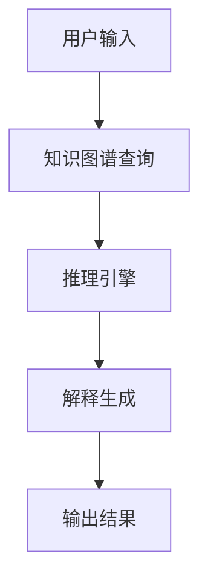
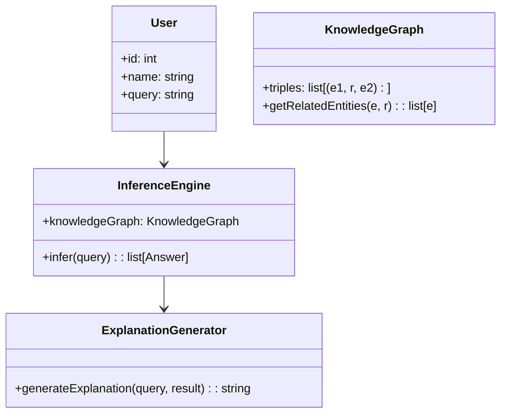

                 


# 构建AI Agent的知识图谱推理解释器

> **关键词**：知识图谱，AI Agent，推理解释器，知识推理，人工智能，自然语言处理，机器学习

> **摘要**：  
> 随着人工智能技术的快速发展，知识图谱在AI Agent中的应用日益广泛。本文将深入探讨如何构建基于知识图谱的AI Agent推理解释器，从背景介绍、核心概念、算法原理到系统设计和项目实战，全面解析其构建过程。通过本文，读者将掌握知识图谱推理解释器的核心原理和实现方法，为构建智能化的AI Agent系统提供理论支持和实践指导。

---

# 第一部分: 构建AI Agent的知识图谱推理解释器概述

---

## 第1章: 知识图谱与AI Agent概述

### 1.1 知识图谱的基本概念

#### 1.1.1 知识图谱的定义与特点

知识图谱是一种结构化的语义知识库，由实体（概念）和关系（属性或联系）组成，用于描述现实世界中的各种实体及其之间的关联。知识图谱的特点包括：

- **结构化**：通过图结构表示实体和关系，支持复杂的语义查询。
- **可扩展性**：能够动态扩展，支持大规模数据的存储和处理。
- **语义丰富性**：通过实体间的关系和属性，提供丰富的语义信息。

#### 1.1.2 知识图谱的构建与应用

知识图谱的构建通常包括数据抽取、实体识别、关系抽取和知识融合等步骤。其应用场景广泛，例如搜索引擎优化、智能问答系统、推荐系统等。

---

### 1.2 AI Agent的基本概念

#### 1.2.1 AI Agent的定义与分类

AI Agent（人工智能代理）是指在计算机系统中模拟人类或其他智能体行为的实体。AI Agent可以根据智能水平分为：

- **反应式AI Agent**：基于当前感知做出反应，适用于实时任务。
- **认知式AI Agent**：具备推理、规划和决策能力，适用于复杂任务。

#### 1.2.2 AI Agent的核心功能与应用场景

AI Agent的核心功能包括感知环境、推理分析、决策制定和执行操作。其应用场景涵盖自动驾驶、智能助手、智能客服等领域。

---

### 1.3 知识图谱与AI Agent的结合

#### 1.3.1 知识图谱在AI Agent中的作用

知识图谱为AI Agent提供了丰富的语义信息和知识库，帮助其更好地理解上下文、推理逻辑和生成解释。

#### 1.3.2 知识图谱推理解释器的定义与目标

知识图谱推理解释器是AI Agent的核心组件，负责根据用户输入和知识图谱进行推理，并生成可解释的输出。其目标是实现智能化、可解释的知识推理。

---

## 第2章: 知识图谱推理解释器的核心概念与原理

### 2.1 知识图谱推理解释器的背景与问题背景

#### 2.1.1 知识图谱推理解释器的背景介绍

随着AI Agent的广泛应用，对知识图谱推理的需求日益增加。知识图谱推理解释器能够帮助AI Agent更好地理解用户意图并生成合理的解释。

#### 2.1.2 知识图谱推理解释器的核心问题与目标

知识图谱推理解释器的核心问题包括：如何高效地从知识图谱中提取相关信息，如何进行推理，以及如何生成可理解的解释。其目标是实现高效、准确的知识推理和解释生成。

---

### 2.2 知识图谱推理解释器的核心概念

#### 2.2.1 知识图谱推理解释器的定义与属性特征对比

知识图谱推理解释器通过将用户输入与知识图谱中的实体和关系匹配，生成推理结果并提供解释。其核心属性包括：

| 属性 | 描述 |
|------|------|
| 输入 | 用户查询或问题 |
| 知识库 | 结构化的知识图谱 |
| 推理引擎 | 基于规则或机器学习的推理算法 |
| 解释生成器 | 将推理结果转化为自然语言解释 |

#### 2.2.2 知识图谱推理解释器的ER实体关系图架构

```mermaid
er
actor: 用户
plays: 参与者
KnowledgeGraph: 知识图谱
plays: 实体与关系
InferenceEngine: 推理引擎
plays: 推理逻辑
ExplanationGenerator: 解释生成器
plays: 解释输出
```

---

### 2.3 知识图谱推理解释器的算法原理

#### 2.3.1 知识图谱推理解释器的算法流程



---

## 第3章: 知识图谱推理解释器的算法原理

### 3.1 知识图谱表示与推理算法

#### 3.1.1 知识图谱的表示方法

知识图谱通常使用三元组（头实体，关系，尾实体）表示，例如：`(中国, 资源丰富, 石油)`。

#### 3.1.2 基于规则的推理算法

基于规则的推理算法通过预定义的逻辑规则进行推理，例如：如果A是B的子类，且B是C的子类，则A是C的子类。

#### 3.1.3 基于机器学习的推理算法

基于机器学习的推理算法通过训练模型从数据中学习推理规则，例如：使用图神经网络进行实体关系推理。

---

### 3.2 知识图谱推理解释器的数学模型

#### 3.2.1 知识图谱的表示模型

$$
\text{知识图谱} = \{ (e_1, r_1, e_2), (e_2, r_2, e_3), \ldots \}
$$

其中，$e$ 表示实体，$r$ 表示关系。

#### 3.2.2 推理算法的数学表达

$$
\text{推理结果} = f(\text{知识图谱}, \text{查询})
$$

其中，$f$ 是推理函数，$\text{知识图谱}$ 和 $\text{查询}$ 是输入。

---

## 第4章: 系统分析与架构设计方案

### 4.1 问题场景介绍

知识图谱推理解释器需要处理的任务包括知识图谱查询、推理引擎调用和解释生成。

---

### 4.2 项目介绍

本项目旨在构建一个基于知识图谱的AI Agent推理解释器，支持用户查询和知识推理。

---

### 4.3 系统功能设计

#### 4.3.1 领域模型设计



---

### 4.4 系统架构设计

#### 4.4.1 系统架构图


---

## 第5章: 项目实战

### 5.1 环境安装

安装必要的依赖库，例如：networkx、numpy、pandas。

---

### 5.2 核心代码实现

#### 5.2.1 知识图谱构建与存储

```python
from typing import List
from networkx import DiGraph

class KnowledgeGraph:
    def __init__(self):
        self.graph = DiGraph()
    
    def add_triple(self, e1: str, r: str, e2: str):
        self.graph.add_edge(e1, e2, label=r)
    
    def get_related_entities(self, entity: str) -> List[str]:
        neighbors = list(self.graph.neighbors(entity))
        return neighbors
```

#### 5.2.2 推理引擎实现

```python
class InferenceEngine:
    def __init__(self, knowledge_graph: KnowledgeGraph):
        self.knowledge_graph = knowledge_graph
    
    def infer(self, query: str) -> List[str]:
        related_entities = self.knowledge_graph.get_related_entities(query)
        return related_entities
```

---

### 5.3 案例分析与详细讲解

假设知识图谱包含以下三元组：

```
(中国, 资源丰富, 石油)
(石油, 主要能源, 中国)
```

用户查询：“中国的主要资源是什么？”  
推理过程：

1. 根据查询，推理引擎从知识图谱中提取与“中国”相关的实体：“石油”。
2. 解释生成器生成解释：“中国的主要资源是石油。”

---

## 第6章: 总结与展望

### 6.1 本章总结

知识图谱推理解释器是构建智能化AI Agent的核心组件。本文详细介绍了其核心概念、算法原理和系统设计，并通过项目实战展示了其具体实现。

### 6.2 技术展望

未来，知识图谱推理解释器将更加智能化和可解释，支持更复杂的推理任务和多语言处理。

---

## 第7章: 最佳实践与注意事项

### 7.1 最佳实践

- 数据质量是关键，确保知识图谱的准确性和完整性。
- 推理引擎的设计应结合具体应用场景，选择合适的推理算法。
- 解释生成器应生成简洁、准确的解释，提高用户体验。

---

## 作者信息

作者：AI天才研究院/AI Genius Institute & 禅与计算机程序设计艺术 /Zen And The Art of Computer Programming

---

以上是构建AI Agent的知识图谱推理解释器的技术博客文章的完整目录和内容框架。希望对您有所帮助！

