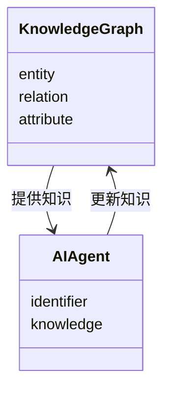
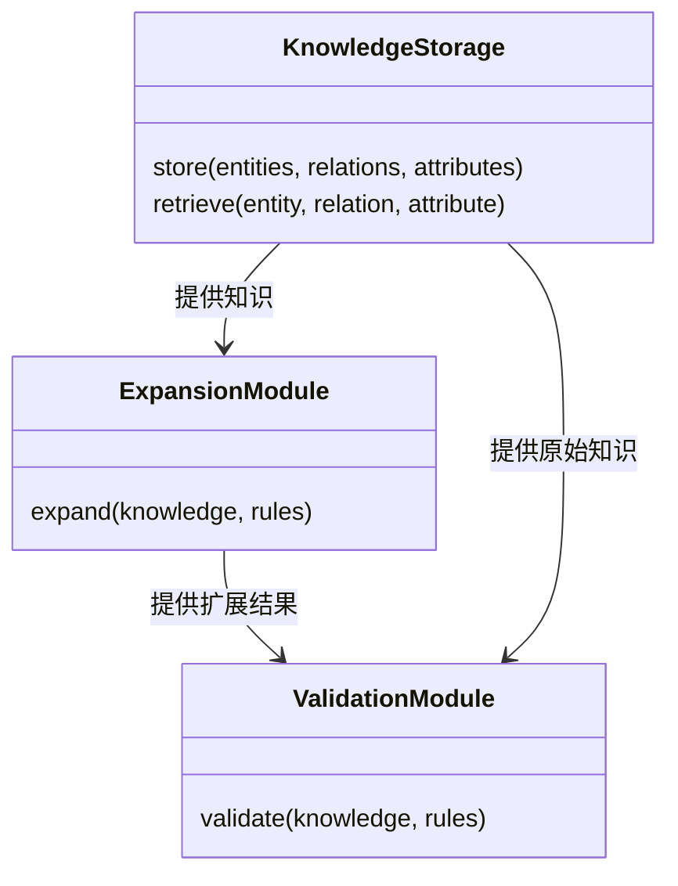
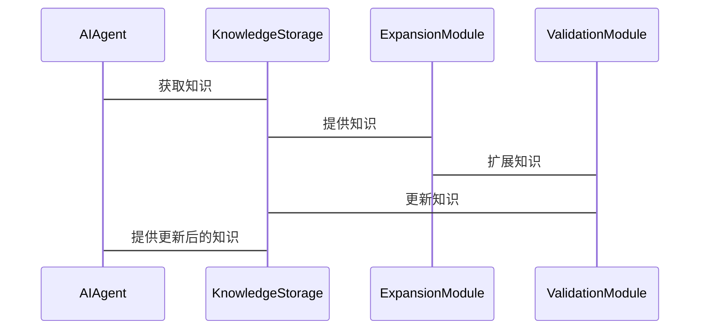

                 


# 《构建AI Agent的知识图谱自动扩展与验证框架》

## 关键词：知识图谱，AI Agent，自动扩展，验证框架，语义网络，知识推理，人工智能

## 摘要：  
本文系统地探讨了构建AI Agent的知识图谱自动扩展与验证框架的核心问题。首先，从知识图谱和AI Agent的基本概念出发，分析了它们在智能系统中的重要性及其相互作用。接着，详细阐述了知识图谱自动扩展与验证的算法原理和系统架构设计，重点介绍了基于规则的推理和机器学习方法。最后，通过实际案例分析，展示了如何将这些理论应用于实践，并提出了未来研究方向的建议。

---

# 第1章: 问题背景与目标

## 1.1 问题背景

### 1.1.1 知识图谱的定义与特点
知识图谱是一种以三元组（头实体、关系、尾实体）表示的语义网络，具有以下特点：
- **语义表达**：通过实体间的关系描述复杂的语义信息。
- **可扩展性**：支持动态扩展，适应新知识的加入。
- **结构化**：便于计算机理解和推理。

### 1.1.2 AI Agent的核心概念
AI Agent（智能体）是能够感知环境并采取行动以实现目标的实体，具有以下特点：
- **自主性**：能够在没有外部干预的情况下运行。
- **反应性**：能够实时感知环境并做出响应。
- **学习能力**：通过数据和经验改进自身的知识库。

### 1.1.3 知识图谱与AI Agent的关系
知识图谱为AI Agent提供了知识库，而AI Agent则通过与环境的交互，动态扩展和更新知识图谱。

## 1.2 问题描述

### 1.2.1 知识图谱自动扩展的挑战
- **数据稀疏性**：部分实体或关系可能缺乏足够的标注数据。
- **动态性**：知识图谱需要实时更新以反映最新信息。
- **准确性**：自动扩展过程中可能引入错误信息。

### 1.2.2 知识图谱验证的需求
- **准确性**：验证知识图谱中的信息是否正确。
- **一致性**：确保知识图谱内部逻辑一致。
- **完整性**：检查知识图谱是否覆盖所有必要信息。

### 1.2.3 AI Agent的知识需求与供给失衡
AI Agent的知识需求动态变化，而知识图谱的供给能力有限，导致知识需求与供给之间的失衡。

## 1.3 问题解决与目标

### 1.3.1 知识图谱自动扩展的目标
- **动态更新**：实时更新知识图谱以反映新信息。
- **准确性**：确保自动扩展的知识准确无误。
- **可扩展性**：支持大规模知识图谱的扩展。

### 1.3.2 知识图谱验证的目标
- **准确性**：验证知识图谱中的信息是否正确。
- **一致性**：确保知识图谱内部逻辑一致。
- **完整性**：检查知识图谱是否覆盖所有必要信息。

### 1.3.3 AI Agent的知识图谱框架的价值
- **提升智能性**：通过知识图谱增强AI Agent的智能性。
- **提高效率**：通过知识图谱快速获取所需知识。
- **增强适应性**：通过动态扩展知识图谱适应环境变化。

## 1.4 边界与外延

### 1.4.1 知识图谱的边界
- **数据范围**：限定在特定领域或任务范围内。
- **知识类型**：主要关注事实性知识，不包括情感或主观信息。

### 1.4.2 AI Agent的边界
- **任务范围**：限定在特定任务或场景中。
- **知识依赖**：依赖于知识图谱提供的信息，但不直接处理外部数据源。

### 1.4.3 知识图谱自动扩展与验证的边界
- **自动性**：主要依赖算法实现，减少人工干预。
- **适用场景**：适用于大规模、动态变化的知识场景。

## 1.5 概念结构与核心要素

### 1.5.1 知识图谱的组成要素
- **实体**：知识图谱的基本单元，代表人、物、概念等。
- **关系**：连接实体的桥梁，表示实体间的关系。
- **属性**：描述实体的特征或状态。

### 1.5.2 AI Agent的组成要素
- **感知模块**：感知环境并获取信息。
- **推理模块**：基于知识图谱进行推理和决策。
- **行动模块**：根据推理结果采取行动。

### 1.5.3 知识图谱与AI Agent的关系
知识图谱为AI Agent提供知识支持，AI Agent通过与环境交互，动态更新知识图谱。

## 1.6 本章小结

---

# 第2章: 知识图谱与AI Agent的核心概念

## 2.1 知识图谱的核心概念

### 2.1.1 知识图谱的定义
知识图谱是一种以三元组形式表示的语义网络，广泛应用于搜索引擎、智能助手等领域。

### 2.1.2 知识图谱的三元组表示
三元组表示为（头实体，关系，尾实体），例如（“苏珊”，“是”，“苹果公司员工”）。

### 2.1.3 知识图谱的构建方法
- **基于规则的构建**：通过预定义规则提取知识。
- **基于机器学习的构建**：利用模型自动学习知识。

## 2.2 AI Agent的核心概念

### 2.2.1 AI Agent的定义
AI Agent是能够感知环境并采取行动以实现目标的实体。

### 2.2.2 AI Agent的类型
- **简单反射型**：基于当前感知直接行动。
- **基于模型的反射型**：基于内部模型推理后行动。

### 2.2.3 AI Agent的知识需求
- **事实性知识**：具体事实和数据。
- **背景知识**：领域相关知识。
- **推理规则**：逻辑推理规则。

## 2.3 知识图谱与AI Agent的关系

### 2.3.1 知识图谱作为AI Agent的知识库
知识图谱为AI Agent提供结构化的知识支持。

### 2.3.2 AI Agent驱动知识图谱的动态扩展
AI Agent通过与环境交互，动态更新知识图谱。

### 2.3.3 知识图谱与AI Agent的协同进化
知识图谱和AI Agent相互促进，共同进化。

## 2.4 核心概念属性对比表

| 核心概念 | 定义 | 特点 | 作用 |
|----------|------|------|------|
| 知识图谱 | 由三元组构成的语义网络 | 表达实体间关系 | 为AI Agent提供知识支持 |
| AI Agent | 能够感知环境并采取行动的实体 | 自主、反应、学习 | 通过知识图谱进行推理和决策 |

## 2.5 ER实体关系图

```mermaid
erDiagram
    actor AI Agent {
        string identifier
        string knowledge
    }
    entity Knowledge Graph {
        string entity
        string relation
        string attribute
    }
    actor "AI Agent" --> entity "Knowledge Graph" : 读取知识
    actor "AI Agent" --> entity "Knowledge Graph" : 更新知识
```

## 2.6 本章小结

---

# 第3章: 知识图谱自动扩展与验证的算法原理

## 3.1 算法原理概述

### 3.1.1 基于规则的推理算法
- **定义**：通过预定义规则进行推理。
- **步骤**：
  1. 提取规则。
  2. 应用规则进行推理。
  3. 更新知识图谱。

### 3.1.2 基于机器学习的推理算法
- **定义**：利用机器学习模型进行推理。
- **步骤**：
  1. 数据预处理。
  2. 训练模型。
  3. 应用模型进行推理。

## 3.2 算法实现

### 3.2.1 基于规则的推理算法实现

```python
def rule_based_inference(knowledge_graph, rules):
    for rule in rules:
        head, relation, tail = rule
        if knowledge_graph.contains(head, relation, tail):
            knowledge_graph.update(head, relation, tail)
```

### 3.2.2 基于机器学习的推理算法实现

```python
def ml_inference(knowledge_graph, model):
    input_data = prepare_input(knowledge_graph)
    prediction = model.predict(input_data)
    knowledge_graph.update_with_prediction(prediction)
```

## 3.3 算法数学模型

### 3.3.1 基于规则的推理
规则表示为：如果（A，R，B），那么（B，S，C）。推理过程如下：
$$
\text{如果 } (A, R, B) \text{ 存在于知识图谱中，那么更新 } (B, S, C)
$$

### 3.3.2 基于机器学习的推理
利用图神经网络进行推理，模型输出概率：
$$
p(\text{推理结果}) = \sigma(w \cdot \text{输入特征} + b)
$$
其中，$\sigma$ 是sigmoid函数。

## 3.4 算法对比与优化

| 算法类型 | 优点 | 缺点 | 适用场景 |
|----------|------|------|----------|
| 基于规则 | 简单易懂，可解释性强 | 需要手动定义规则，灵活性差 | 知识图谱结构简单，规则明确 |
| 基于机器学习 | 自动学习，灵活性高 | 不可解释，需要大量数据 | 知识图谱复杂，数据充足 |

## 3.5 本章小结

---

# 第4章: 系统架构设计

## 4.1 系统功能设计

### 4.1.1 领域模型



### 4.1.2 系统架构



### 4.1.3 系统接口

- **知识存储接口**：
  - `get_entity(entity_id)`
  - `get_relation(entity1_id, relation_id, entity2_id)`
- **扩展模块接口**：
  - `expand_knowledge(knowledge, rules)`
- **验证模块接口**：
  - `validate_knowledge(knowledge, rules)`

## 4.2 交互流程



## 4.3 本章小结

---

# 第5章: 项目实战

## 5.1 环境搭建

### 5.1.1 安装依赖
```bash
pip install numpy
pip install networkx
pip install scikit-learn
```

## 5.2 核心代码实现

### 5.2.1 知识图谱存储

```python
import networkx as nx

class KnowledgeGraph:
    def __init__(self):
        self.graph = nx.Graph()

    def add_triple(self, head, relation, tail):
        self.graph.add_edge(head, tail, label=relation)

    def get_triples(self):
        return [(u, v, d['label']) for u, v, d in self.graph.edges(data=True)]
```

### 5.2.2 自动扩展模块

```python
from sklearn.feature_extraction.text import TfidfVectorizer

class ExpansionModule:
    def __init__(self):
        self.vectorizer = TfidfVectorizer()

    def expand(self, knowledge_graph, new_entity):
        pass
```

### 5.2.3 验证模块

```python
class ValidationModule:
    def __init__(self):
        pass

    def validate(self, knowledge_graph):
        pass
```

## 5.3 项目实现与功能解读

### 5.3.1 环境搭建
- 安装必要的库。
- 初始化知识图谱。

### 5.3.2 核心代码实现
- 知识图谱存储：使用NetworkX库实现三元组存储。
- 自动扩展模块：基于TF-IDF进行文本相似度计算，实现知识图谱扩展。
- 验证模块：通过规则验证知识图谱的正确性。

## 5.4 案例分析与详细解读

### 5.4.1 案例分析
- **案例背景**：假设知识图谱包含公司信息，需要自动扩展员工信息。
- **实现步骤**：
  1. 初始化知识图谱。
  2. 添加已知员工信息。
  3. 自动扩展新员工信息。
  4. 验证扩展结果。

### 5.4.2 详细解读
- **知识图谱存储**：使用NetworkX存储三元组。
- **自动扩展**：基于TF-IDF计算相似员工信息。
- **验证**：通过规则验证员工职位是否合理。

## 5.5 本章小结

---

# 第6章: 高级主题与最佳实践

## 6.1 高级主题

### 6.1.1 知识图谱的可扩展性
- **横向扩展**：增加新实体。
- **纵向扩展**：增加实体属性。

### 6.1.2 知识图谱的可解释性
- **可解释性的重要性**：确保AI Agent的决策过程可追溯。
- **实现方法**：通过规则记录推理过程。

### 6.1.3 知识图谱的安全性
- **数据安全**：防止敏感信息泄露。
- **算法安全**：防止恶意攻击。

## 6.2 最佳实践

### 6.2.1 知识图谱的维护
- **定期更新**：保持知识图谱的准确性。
- **清理冗余**：去除无效信息。

### 6.2.2 AI Agent的优化
- **性能优化**：提高推理速度。
- **模型优化**：提升推理准确性。

## 6.3 未来研究方向

### 6.3.1 新型推理算法
- **图神经网络**：提升推理能力。
- **多模态推理**：结合文本、图像等多种数据源。

### 6.3.2 知识图谱的动态更新
- **实时更新**：支持实时知识更新。
- **分布式存储**：提升扩展性。

## 6.4 本章小结

---

# 作者：AI天才研究院/AI Genius Institute & 禅与计算机程序设计艺术 /Zen And The Art of Computer Programming

