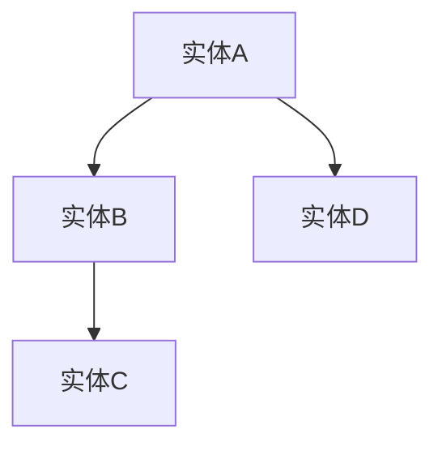
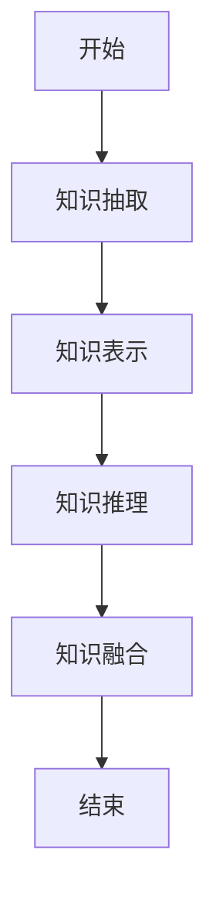
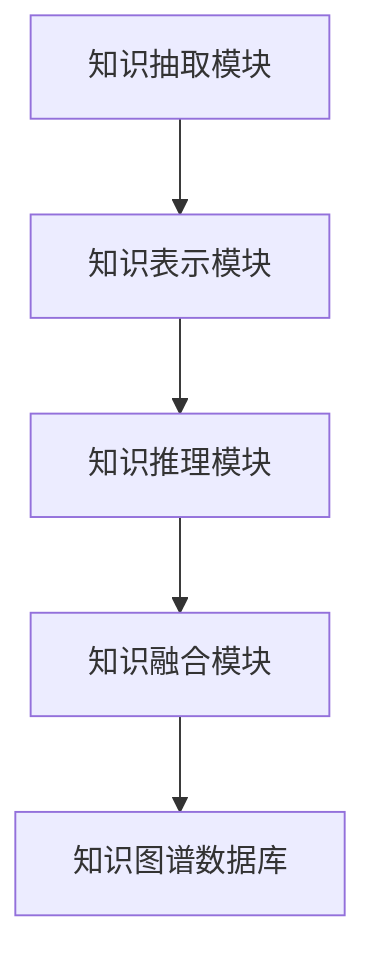

                 


# 构建AI Agent的知识图谱自动扩展系统

> 关键词：知识图谱，AI Agent，自动扩展，系统构建，算法原理

> 摘要：本文系统地阐述了如何构建一个基于知识图谱的AI Agent自动扩展系统。通过分析知识图谱的核心概念与AI Agent的交互机制，结合实际应用场景，提出了系统的设计与实现方案。文章从背景介绍、核心概念、算法原理、系统架构、项目实战到最佳实践，全面解析了构建该系统的各个方面。

---

# 第一部分: 背景与基础知识

## 第1章: 知识图谱与AI Agent概述

### 1.1 问题背景

知识图谱（Knowledge Graph）是一种将结构化知识以图的形式表示的数据结构，其节点代表实体或概念，边代表实体之间的关系。AI Agent（人工智能代理）是一种能够感知环境并采取行动以实现目标的智能实体。随着AI技术的快速发展，知识图谱作为AI Agent的知识库，能够为AI Agent提供丰富的上下文信息，帮助其更好地理解和执行任务。

#### 1.1.1 知识图谱的定义与特点
- **定义**：知识图谱是一种以图结构形式表示知识的数据库，其节点代表实体或概念，边代表实体之间的关系。
- **特点**：
  - 结构化：数据以节点和边的形式组织，便于计算机理解和推理。
  - 可扩展性：能够动态扩展，支持新增实体和关系。
  - 语义丰富性：通过实体间的关系，能够表达复杂的语义信息。

#### 1.1.2 AI Agent的核心概念
- **定义**：AI Agent是一种能够感知环境、自主决策并执行任务的智能实体。
- **核心功能**：
  - 感知环境：通过传感器或数据接口获取环境信息。
  - 分析决策：基于知识库或模型进行推理和决策。
  - 执行任务：根据决策结果执行具体操作。

#### 1.1.3 知识图谱在AI Agent中的作用
- **知识存储**：知识图谱作为AI Agent的知识库，存储丰富的实体和关系信息。
- **推理支持**：通过知识图谱的结构化数据，AI Agent可以进行语义推理，理解复杂场景。
- **动态更新**：知识图谱能够动态扩展，AI Agent可以实时获取最新知识。

### 1.2 问题描述

知识图谱的自动扩展是构建AI Agent系统的关键挑战。传统知识图谱构建依赖人工标注，效率低下且难以应对动态变化的场景。AI Agent需要能够自动扩展知识图谱，以适应复杂多变的环境。

#### 1.2.1 知识图谱自动扩展的需求
- **动态性**：知识图谱需要能够实时更新，适应新场景和新数据。
- **准确性**：自动扩展的知识需要保证高精度，避免引入错误信息。
- **高效性**：扩展过程需要高效，以支持实时应用。

#### 1.2.2 AI Agent的知识获取挑战
- **数据多样性**：AI Agent需要处理多种类型的数据来源。
- **语义理解**：需要理解实体间复杂的语义关系。
- **实时性**：知识获取需要快速响应，支持实时决策。

#### 1.2.3 系统构建的目标与意义
- **目标**：构建一个能够自动扩展知识图谱的AI Agent系统，支持动态知识更新和语义推理。
- **意义**：通过自动化知识扩展，提升AI Agent的智能水平，使其能够更好地适应复杂环境。

### 1.3 问题解决思路

知识图谱的自动扩展可以通过以下步骤实现：
1. **数据获取**：从多种数据源获取知识信息。
2. **知识抽取**：从文本或数据中提取实体和关系。
3. **知识融合**：将新知识整合到现有知识图谱中，解决冲突和冗余。
4. **动态更新**：实时监控环境变化，自动触发知识扩展。

### 1.4 边界与外延

知识图谱的自动扩展系统需要考虑以下边界：
- **数据源限制**：仅支持特定类型的数据输入。
- **知识覆盖范围**：仅扩展特定领域的知识。
- **系统性能**：扩展过程可能影响系统性能，需进行优化。

### 1.5 概念结构与核心要素

知识图谱的构建和扩展涉及以下核心要素：
- **实体**：知识图谱中的基本单位，代表具体或抽象的概念。
- **关系**：描述实体之间的关联，支持语义推理。
- **属性**：实体的特征或属性，丰富知识表示。

---

# 第二部分: 核心概念与联系

## 第2章: 知识图谱与AI Agent的关系

### 2.1 核心概念原理

知识图谱作为AI Agent的知识库，支持其进行语义推理和决策。AI Agent通过与知识图谱的交互，实现知识的动态扩展和更新。

#### 2.1.1 知识图谱作为AI Agent的知识库
- **知识表示**：知识图谱为AI Agent提供结构化的知识表示。
- **推理支持**：AI Agent基于知识图谱进行语义推理，理解复杂场景。

#### 2.1.2 AI Agent驱动知识图谱的扩展
- **主动学习**：AI Agent通过与环境交互，主动获取新知识。
- **动态更新**：AI Agent实时更新知识图谱，确保知识的最新性。

### 2.2 概念属性特征对比表

以下是知识图谱与传统数据库的对比：

| 特性         | 知识图谱               | 传统数据库         |
|--------------|-----------------------|---------------------|
| 数据结构     | 图结构（节点和边）     | 行列结构           |
| 数据关系     | 语义关系丰富           | 纯粹的属性关系     |
| 可扩展性     | 高度可扩展             | 较低可扩展性       |
| 查询效率     | 较低                   | 较高               |

### 2.3 ER实体关系图

以下是知识图谱的实体关系图：



---

## 第3章: 知识图谱自动扩展的核心算法

### 3.1 算法原理

知识图谱的自动扩展涉及多种算法，包括知识抽取、关系推理和知识融合。

#### 3.1.1 知识抽取算法

知识抽取算法用于从文本或数据中提取实体和关系。

- **命名实体识别（NER）**：识别文本中的实体，如人名、地名等。
- **关系抽取**：识别实体之间的关系，如“属于”、“位于”等。

#### 3.1.2 知识推理算法

知识推理算法用于基于现有知识图谱进行推理。

- **路径推理**：通过知识图谱中的路径进行推理。
- **图嵌入（Graph Embedding）**：将实体和关系表示为向量，用于相似性计算。

#### 3.1.3 知识融合算法

知识融合算法用于将新知识整合到现有知识图谱中。

- **冲突检测**：检测新知识与现有知识的冲突。
- **合并策略**：制定知识合并的策略，如优先保留高置信度的知识。

### 3.2 算法流程图

以下是知识图谱自动扩展的算法流程图：



### 3.3 算法实现代码

以下是知识抽取的Python代码示例：

```python
def extract_entities(text):
    # 使用预训练的NER模型进行实体识别
    entities = []
    for token in text:
        if token['entity'] != 'O':
            entities.append(token['text'])
    return entities

def extract_relations(text):
    # 使用预训练的关系抽取模型进行关系识别
    relations = []
    for token in text:
        if token['relation'] != 'None':
            relations.append((token['head'], token['tail']))
    return relations
```

---

## 第4章: 系统分析与架构设计

### 4.1 系统功能设计

知识图谱自动扩展系统需要具备以下功能：
- **知识抽取**：从多种数据源抽取实体和关系。
- **知识表示**：将抽取的知识表示为图结构。
- **知识推理**：基于知识图谱进行语义推理。
- **知识融合**：将新知识整合到现有知识图谱中。

### 4.2 系统架构设计

以下是系统的架构图：



### 4.3 系统接口设计

系统接口设计包括：
- **输入接口**：接收外部数据源输入。
- **输出接口**：输出知识图谱的扩展结果。
- **API接口**：提供给AI Agent调用知识图谱的能力。

---

## 第5章: 项目实战

### 5.1 环境安装

构建知识图谱自动扩展系统需要以下环境：
- **Python**：3.8+
- **TensorFlow**：2.0+
- **Spacy**：3.0+

### 5.2 核心代码实现

以下是知识图谱自动扩展系统的实现代码：

```python
class KnowledgeGraph:
    def __init__(self):
        self.nodes = []
        self.edges = []

    def add_node(self, node):
        self.nodes.append(node)

    def add_edge(self, source, target, relation):
        self.edges.append((source, target, relation))

def main():
    kg = KnowledgeGraph()
    kg.add_node("实体A")
    kg.add_node("实体B")
    kg.add_edge("实体A", "实体B", "关系1")
    print(kg.nodes)
    print(kg.edges)

if __name__ == "__main__":
    main()
```

### 5.3 代码解读

- **KnowledgeGraph类**：管理知识图谱的节点和边。
- **add_node方法**：添加节点。
- **add_edge方法**：添加边，记录实体之间的关系。
- **main函数**：初始化知识图谱，添加节点和边，输出结果。

### 5.4 实际案例分析

以下是一个实际案例分析：

**场景**：电商知识图谱构建。

**步骤**：
1. **数据获取**：从电商网站获取商品信息。
2. **知识抽取**：抽取商品实体和属性。
3. **知识表示**：将商品信息表示为图结构。
4. **知识推理**：推理商品之间的关系。
5. **知识融合**：将新知识整合到现有知识图谱中。

---

## 第6章: 最佳实践与小结

### 6.1 最佳实践

- **数据清洗**：确保数据质量，减少错误信息。
- **算法优化**：优化知识抽取和推理算法，提升效率。
- **系统监控**：实时监控系统性能，及时发现和解决问题。

### 6.2 小结

通过本文的系统阐述，我们了解了如何构建一个基于知识图谱的AI Agent自动扩展系统。从知识图谱的核心概念到算法实现，再到系统架构设计，每一步都需要精心设计和优化。通过实际案例分析，我们验证了系统的可行性和有效性。

### 6.3 注意事项

- 知识图谱的自动扩展需要考虑数据的多样性和动态性。
- 系统设计需要兼顾性能和可扩展性。
- 算法实现需要考虑计算效率和准确性。

### 6.4 拓展阅读

- **知识图谱**：深入学习知识图谱的构建与应用。
- **图神经网络**：研究图神经网络在知识图谱推理中的应用。
- **AI Agent**：探索AI Agent在不同领域的应用。

---

# 作者

作者：AI天才研究院/AI Genius Institute  
禅与计算机程序设计艺术 /Zen And The Art of Computer Programming

