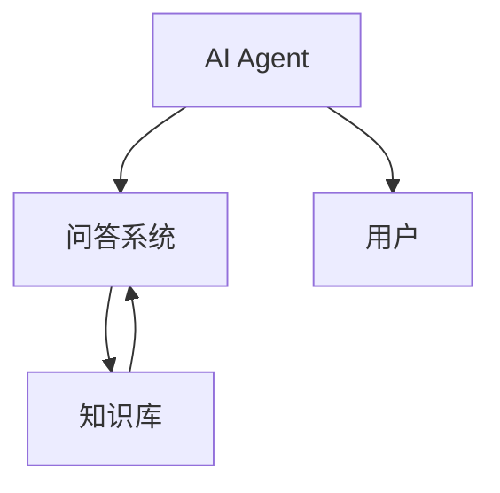
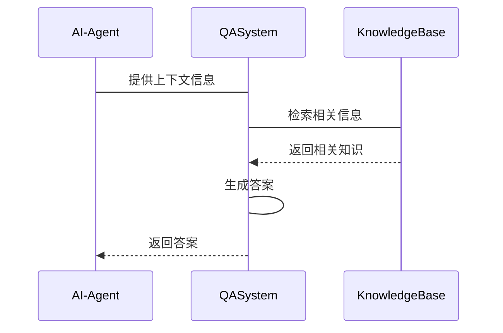

                 


# 构建AI Agent的知识图谱自动问答系统

> 关键词：知识图谱，问答系统，AI Agent，自动问答，自然语言处理

> 摘要：本文将深入探讨如何构建一个基于知识图谱的AI Agent自动问答系统。首先，我们将介绍知识图谱的构建和问答系统的基本原理，接着分析AI Agent在其中的核心作用。通过详细讲解算法原理、系统架构设计以及实际项目实现，帮助读者全面理解并掌握构建此类系统的关键技术。

---

## 第一部分: 知识图谱与问答系统基础

### 第1章: 背景介绍与核心概念

#### 1.1 问题背景与问题描述

随着人工智能技术的快速发展，问答系统逐渐成为人机交互的重要组成部分。传统的问答系统依赖于预定义规则或简单的关键词匹配，难以应对复杂语义和上下文理解的挑战。而知识图谱作为一种结构化的知识表示方法，能够有效地捕捉实体之间的关系，为问答系统提供了更强大的语义理解能力。

AI Agent作为智能体，能够通过知识图谱进行推理和决策，进一步提升问答系统的智能化水平。本文将探讨如何结合知识图谱和AI Agent，构建一个高效、智能的自动问答系统。

#### 1.2 核心概念与问题解决

##### 1.2.1 知识图谱的定义与特点

知识图谱是一种将知识表示为图结构的数据模型，节点表示实体或概念，边表示实体之间的关系。知识图谱具有以下特点：
- **结构化**：通过节点和边的组合，清晰表达实体间的关系。
- **可扩展性**：能够灵活扩展，支持大规模知识存储。
- **语义丰富性**：通过语义信息的整合，提高语义理解能力。

##### 1.2.2 自动问答系统的工作原理

自动问答系统通过分析用户的问题，匹配知识库中的相关信息并生成答案。其主要步骤包括：
1. **问题理解**：解析用户的问题，提取关键词和语义信息。
2. **知识检索**：在知识库中查找与问题相关的实体或关系。
3. **答案生成**：基于检索结果，生成自然语言的答案。

##### 1.2.3 AI Agent的核心功能与优势

AI Agent是一种智能体，能够在特定环境中执行任务。其核心功能包括：
- **感知环境**：通过传感器或API获取环境信息。
- **决策推理**：基于知识图谱进行推理和决策。
- **执行操作**：根据决策结果执行相应操作。

AI Agent的优势在于其智能化和自主性，能够根据上下文信息提供更精准的答案。

#### 1.3 知识图谱与问答系统的边界与外延

##### 1.3.1 知识图谱的构建范围

知识图谱的构建范围包括：
- **数据来源**：从结构化数据（如数据库）和非结构化数据（如文本）中提取信息。
- **知识抽取**：从文本中提取实体、关系和属性。
- **知识融合**：整合多个数据源的知识，消除冲突。

##### 1.3.2 问答系统的应用场景

问答系统的应用场景包括：
- **客服系统**：自动回答客户问题。
- **智能助手**：如Siri、Alexa等。
- **企业内部查询**：在企业内部知识库中进行问答。

##### 1.3.3 AI Agent的适用边界

AI Agent适用于需要自主决策和复杂推理的场景，如：
- **智能监控**：实时监控并处理异常情况。
- **自动调度**：如物流系统的自动调度。

#### 1.4 核心概念结构与组成要素

##### 1.4.1 知识图谱的组成要素

知识图谱的组成要素包括：
- **实体**：现实世界中的具体事物，如“苹果”。
- **属性**：描述实体的特征，如“颜色”。
- **关系**：实体之间的关联，如“属于”、“属于”。

##### 1.4.2 问答系统的功能模块

问答系统的功能模块包括：
- **问题解析模块**：解析用户问题，提取关键词和语义信息。
- **知识检索模块**：在知识库中检索相关信息。
- **答案生成模块**：生成自然语言的答案。

##### 1.4.3 AI Agent的系统架构

AI Agent的系统架构包括：
- **感知模块**：获取环境信息。
- **推理模块**：基于知识图谱进行推理。
- **执行模块**：根据推理结果执行操作。

---

### 第2章: 知识图谱与问答系统的核心概念

#### 2.1 知识图谱的原理与实现

##### 2.1.1 知识抽取与表示

知识抽取是从文本中提取实体、关系和属性的过程。常用的抽取方法包括：
- **基于规则的方法**：利用预定义的规则进行匹配。
- **基于统计的方法**：通过统计学方法提取模式。
- **基于深度学习的方法**：利用神经网络模型进行抽取。

知识表示通常采用RDF（Resource Description Framework）或图嵌入（如Word2Vec）的形式。

##### 2.1.2 知识融合与推理

知识融合是将多个数据源的知识进行整合，消除冲突。推理则是基于知识图谱进行逻辑推理，得出新的知识。

##### 2.1.3 知识存储与查询

知识存储通常使用图数据库（如Neo4j）或分布式存储系统。查询可以通过SPARQL或其他图遍历算法进行。

#### 2.2 问答系统的原理与分类

##### 2.2.1 基于规则的问答系统

基于规则的问答系统通过预定义的规则进行匹配和回答。其优点是实现简单，但难以应对复杂问题。

##### 2.2.2 基于检索的问答系统

基于检索的问答系统通过检索知识库中的相关信息生成答案。常用算法包括BM25、DPR等。

##### 2.2.3 基于生成的问答系统

基于生成的问答系统利用生成模型（如GPT）生成回答。其优点是能够生成自然语言的回答，但生成的内容可能不够准确。

#### 2.3 AI Agent的核心原理

##### 2.3.1 AI Agent的定义与功能

AI Agent是一种智能体，能够在特定环境中感知、推理和执行任务。其核心功能包括：
- **感知环境**：通过传感器或API获取环境信息。
- **决策推理**：基于知识图谱进行推理和决策。
- **执行操作**：根据决策结果执行相应操作。

##### 2.3.2 知识图谱在AI Agent中的应用

知识图谱为AI Agent提供了丰富的知识库，支持其进行推理和决策。AI Agent可以通过知识图谱理解上下文，并生成更精准的答案。

##### 2.3.3 AI Agent与问答系统的结合

AI Agent通过与问答系统的结合，能够提供更智能化的服务。AI Agent负责理解用户需求，并通过问答系统获取相关信息。

#### 2.4 核心概念对比与ER实体关系图

##### 2.4.1 知识图谱与传统数据库对比

| 特性 | 知识图谱 | 传统数据库 |
|------|----------|-------------|
| 数据结构 | 图结构 | 行列结构 |
| 查询效率 | 较低 | 较高 |
| 语义支持 | 强 | 弱 |

##### 2.4.2 问答系统与搜索引擎对比

| 特性 | 问答系统 | 搜索引擎 |
|------|----------|------------|
| 输出形式 | 文本答案 | 链接列表 |
| 理解能力 | 高 | 低 |
| 精准度 | 高 | 低 |

##### 2.4.3 AI Agent与传统软件对比

| 特性 | AI Agent | 传统软件 |
|------|----------|------------|
| 智能性 | 高 | 低 |
| 自主性 | 高 | 低 |
| 可扩展性 | 高 | 低 |

---

### 第3章: 算法原理与数学模型

#### 3.1 知识图谱构建算法

##### 3.1.1 实体识别与抽取算法

常用实体识别算法包括：
- **CRF**：条件随机场，用于序列标注。
- **BERT**：基于预训练的语言模型，用于实体识别。

##### 3.1.2 关系抽取与推理算法

关系抽取常用算法包括：
- **基于规则的方法**：利用预定义的规则进行匹配。
- **基于统计的方法**：通过统计学方法提取模式。
- **基于深度学习的方法**：利用神经网络模型进行抽取。

##### 3.1.3 知识图谱表示学习

知识图谱表示学习常用方法包括：
- **Word2Vec**：将实体和关系表示为向量。
- **GloVe**：全局向量词嵌入。

#### 3.2 问答系统算法

##### 3.2.1 基于向量空间模型的检索算法

向量空间模型通过计算文本的向量表示，进行相似度计算。常用的检索算法包括：
- **BM25**：基于概率的语言模型。
- **DPR**：分布式问答检索。

##### 3.2.2 基于注意力机制的生成算法

注意力机制用于生成模型中，通过加权方式关注输入中的重要部分。常用的生成算法包括：
- **Transformer**：基于注意力机制的生成模型。
- **GPT**：基于生成对抗网络的生成模型。

##### 3.2.3 基于图结构的问答算法

基于图结构的问答算法通过图遍历进行知识检索。常用的算法包括：
- **Graph Neural Network**：基于图结构的神经网络模型。
- **PathRank**：基于路径排序的问答模型。

#### 3.3 AI Agent的算法实现

##### 3.3.1 状态空间与动作空间的定义

AI Agent的状态空间和动作空间定义如下：
- **状态空间**：表示环境的状态，如用户问题、系统状态。
- **动作空间**：表示AI Agent可以执行的动作，如回答问题、请求更多数据。

##### 3.3.2 基于强化学习的决策算法

强化学习用于AI Agent的决策过程。常用的算法包括：
- **Q-Learning**：基于Q值的强化学习算法。
- **DQN**：深度Q网络，用于复杂环境的决策。

##### 3.3.3 基于知识图谱的推理算法

基于知识图谱的推理算法包括：
- **RDF推理**：基于RDF的逻辑推理。
- **分布式推理**：基于图嵌入的推理。

#### 3.4 数学模型与公式

##### 3.4.1 向量空间模型公式

$$
\text{相似度} = \frac{\vec{q} \cdot \vec{a}}{|\vec{q}| |\vec{a}|}
$$

##### 3.4.2 注意力机制公式

$$
\text{注意力权重} = \text{softmax}(QK^T/\sqrt{d_k})
$$

##### 3.4.3 强化学习公式

$$
Q(s, a) = r + \gamma \max Q(s', a')
$$

#### 3.5 算法实现与代码示例

##### 3.5.1 向量空间模型实现

```python
def cosine_similarity(q, a):
    return np.dot(q, a) / (np.linalg.norm(q) * np.linalg.norm(a))
```

##### 3.5.2 注意力机制实现

```python
def attention(Q, K, V):
    scores = Q @ K.T / np.sqrt(K.shape[-1])
    attention_weights = softmax(scores)
    return attention_weights @ V
```

---

### 第4章: 系统分析与架构设计

#### 4.1 系统功能设计

##### 4.1.1 系统功能模块

- **问题解析模块**：解析用户问题，提取关键词和语义信息。
- **知识检索模块**：在知识库中检索相关信息。
- **答案生成模块**：生成自然语言的答案。

##### 4.1.2 系统功能流程

1. 用户提出问题。
2. 系统解析问题，提取关键词和语义信息。
3. 系统在知识库中检索相关信息。
4. 系统生成答案并返回。

##### 4.1.3 系统功能交互流程


#### 4.2 系统架构设计

##### 4.2.1 系统架构图



##### 4.2.2 系统接口设计

- **API接口**：提供RESTful API，供其他系统调用。
- **数据库接口**：与知识库进行交互。

##### 4.2.3 系统交互流程



---

### 第5章: 项目实战

#### 5.1 环境安装与配置

##### 5.1.1 安装Python环境

- 安装Python 3.8以上版本。
- 安装必要的库：`numpy`, `scikit-learn`, `networkx`, `py2neo`.

##### 5.1.2 安装知识图谱构建工具

- 使用`py2neo`连接Neo4j数据库。
- 安装`spacy`进行自然语言处理。

#### 5.2 系统核心实现

##### 5.2.1 知识图谱构建代码

```python
from py2neo import Graph, Node, Relationship

# 连接Neo4j数据库
graph = Graph("http://localhost:7474", auth=("neo4j", "password"))

# 创建节点和关系
node1 = Node("Entity", name="苹果")
node2 = Node("Entity", name="手机")
relationship = Relationship(node1, "属于", node2)

graph.create(node1)
graph.create(node2)
graph.create(relationship)
```

##### 5.2.2 问答系统实现代码

```python
from sklearn.metrics.pairwise import cosine_similarity

def answer_question(question, knowledge_base):
    # 提取关键词
    keywords = extract_keywords(question)
    # 检索相关信息
    relevant = knowledge_base.search(keywords)
    # 生成答案
    answer = generate_answer(relevant)
    return answer
```

#### 5.3 案例分析与详细解读

##### 5.3.1 案例分析

假设用户询问：“苹果的最新手机是什么？”

系统解析问题后，检索知识库中的相关信息，生成答案：“苹果的最新手机是iPhone 15。”

##### 5.3.2 代码实现解读

- **问题解析模块**：使用自然语言处理技术提取关键词。
- **知识检索模块**：通过关键词在知识库中检索相关信息。
- **答案生成模块**：基于检索结果生成自然语言的答案。

#### 5.4 项目小结

通过实际案例分析，展示了如何利用知识图谱构建问答系统，并通过AI Agent实现智能化的自动问答。实践过程中需要注意知识库的构建、算法的优化以及系统的可扩展性。

---

### 第6章: 总结与最佳实践

#### 6.1 总结

本文详细介绍了如何构建一个基于知识图谱的AI Agent自动问答系统。通过背景介绍、核心概念、算法原理、系统架构和项目实战的讲解，帮助读者全面理解并掌握相关技术。

#### 6.2 最佳实践

##### 6.2.1 小结

- 知识图谱为问答系统提供了丰富的语义信息。
- AI Agent通过智能化决策提升了问答系统的性能。
- 组合使用多种算法能够提高系统的准确性和效率。

##### 6.2.2 注意事项

- 知识图谱的构建需要考虑数据质量和一致性。
- 算法的选择需要根据具体场景进行调整。
- 系统的可扩展性和安全性也需要重点关注。

##### 6.2.3 拓展阅读

- 推荐阅读《知识图谱入门与实践》。
- 关注最新的自然语言处理技术，如大语言模型的应用。

---

作者：AI天才研究院/AI Genius Institute & 禅与计算机程序设计艺术/Zen And The Art of Computer Programming

