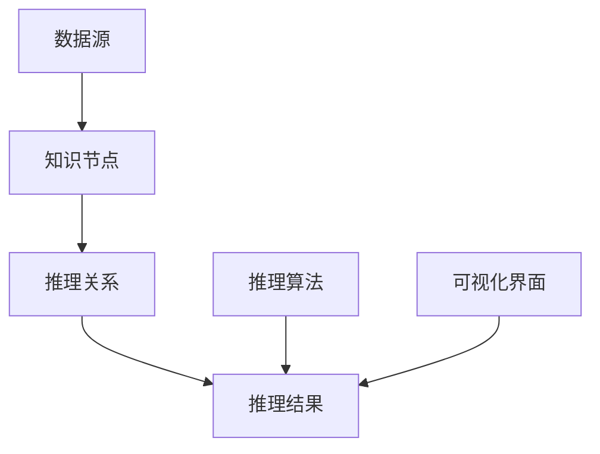
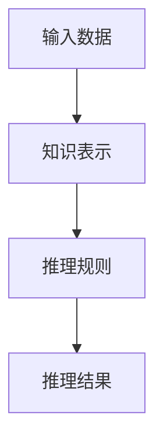
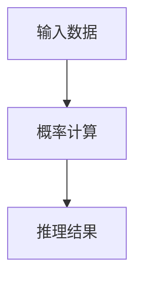
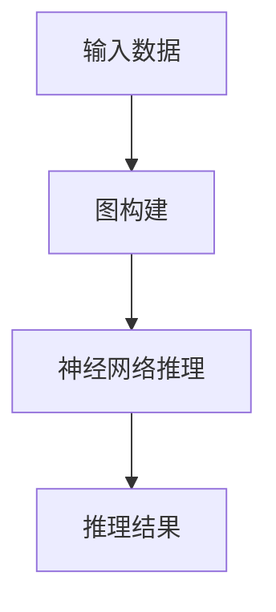
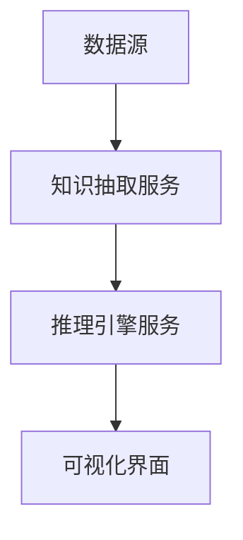
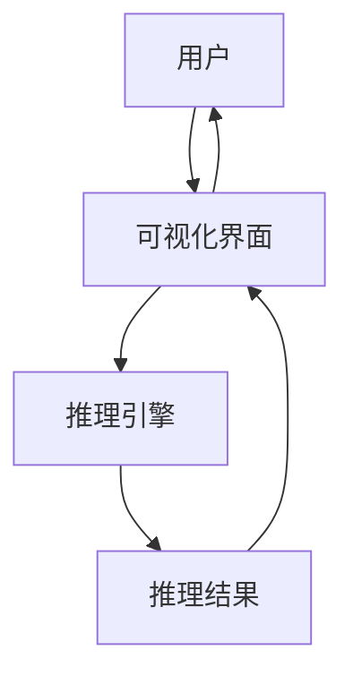

                 


# 《构建AI Agent的知识推理链可视化工具》

## 关键词：
- 知识推理链
- AI Agent
- 可视化工具
- 算法原理
- 系统架构

## 摘要：
本文详细探讨了构建AI Agent的知识推理链可视化工具的方法和步骤。首先介绍了知识推理链和AI Agent的基本概念，接着分析了可视化工具在知识推理中的重要性。然后，从算法原理、系统架构到项目实战，逐步展开讲解。通过实际案例和代码实现，展示了如何构建一个高效的知识推理链可视化工具。最后，总结了工具的应用价值和未来发展。

---

# 第一部分: 背景与概述

## 第1章: 问题背景与目标

### 1.1 问题背景

#### 1.1.1 知识推理链的定义与重要性
知识推理链是指从数据中提取知识，并通过推理过程建立知识之间的关联。它是AI Agent进行智能决策的基础，能够帮助AI理解复杂问题并提供解决方案。

#### 1.1.2 AI Agent在知识推理中的作用
AI Agent通过知识推理链处理信息，能够实现自主决策和问题解决。它是连接数据和智能应用的桥梁。

#### 1.1.3 可视化工具在知识推理中的价值
可视化工具能够将复杂的知识推理过程直观展示，帮助开发者和用户更好地理解和优化推理链。

### 1.2 问题描述

#### 1.2.1 知识推理链的构建挑战
知识推理链的构建涉及数据采集、知识表示、推理算法等多个环节，每个环节都存在技术挑战。

#### 1.2.2 AI Agent与知识推理链的关系
AI Agent依赖知识推理链进行智能决策，而知识推理链则通过AI Agent实现其应用价值。

#### 1.2.3 可视化工具的需求与目标
可视化工具的需求源于对知识推理过程的可解释性和优化需求，其目标是提供直观、高效的可视化解决方案。

### 1.3 解决方案概述

#### 1.3.1 知识推理链可视化工具的功能定位
可视化工具旨在将知识推理链的各个步骤和结果以图形化形式展示，帮助用户更好地理解推理过程。

#### 1.3.2 AI Agent的知识推理链构建方法
通过符号逻辑推理、概率推理和图神经网络等方法，构建高效的知识推理链。

#### 1.3.3 可视化工具的核心价值
提供直观的可视化界面，优化知识推理链的设计和性能，降低开发门槛。

### 1.4 边界与外延

#### 1.4.1 知识推理链的边界
知识推理链的边界包括数据采集、知识表示、推理算法和结果展示等环节。

#### 1.4.2 AI Agent的边界
AI Agent的边界涉及感知、推理、决策和执行等模块。

#### 1.4.3 可视化工具的适用范围
可视化工具适用于知识推理链的设计、优化和监控等场景。

### 1.5 核心概念结构

#### 1.5.1 知识推理链的核心要素
知识推理链的核心要素包括数据源、知识表示、推理算法和可视化展示。

#### 1.5.2 AI Agent的知识处理流程
AI Agent的知识处理流程包括数据采集、知识表示、推理计算和结果应用。

#### 1.5.3 可视化工具的模块组成
可视化工具的模块包括数据输入、知识表示、推理过程展示和结果分析。

---

## 第2章: 核心概念与联系

### 2.1 知识推理链的核心原理

#### 2.1.1 知识表示与存储
知识表示是将数据转化为可推理的形式，常用的方法包括符号逻辑和图表示。

#### 2.1.2 推理算法的实现
推理算法包括符号逻辑推理、概率推理和图神经网络推理。

#### 2.1.3 可视化展示的逻辑
可视化展示将推理过程和结果以图形化形式呈现，便于用户理解和分析。

### 2.2 AI Agent与知识推理链的关系

#### 2.2.1 AI Agent的知识需求
AI Agent需要知识推理链提供支持，以实现智能决策。

#### 2.2.2 知识推理链对AI Agent的支持
知识推理链通过提供推理能力和可解释性，增强AI Agent的智能水平。

#### 2.2.3 可视化工具在AI Agent中的作用
可视化工具帮助AI Agent开发者优化推理链的设计和性能。

### 2.3 核心概念对比分析

#### 2.3.1 知识表示与数据表示的对比
知识表示更关注语义和关联，而数据表示更关注结构和存储。

#### 2.3.2 推理算法的类型与适用场景
符号逻辑推理适用于确定性问题，概率推理适用于不确定性问题，图神经网络适用于复杂关联问题。

#### 2.3.3 可视化工具的功能与性能对比
功能对比：知识推理链的可视化工具需要支持多种推理算法和展示方式；性能对比：高效的可视化工具需要快速渲染和交互。

### 2.4 ER实体关系图



---

## 第3章: 算法原理与数学模型

### 3.1 符号逻辑推理算法

#### 3.1.1 基本原理
符号逻辑推理基于命题逻辑和谓词逻辑，通过规则和推理规则进行推理。

#### 3.1.2 算法流程


#### 3.1.3 数学模型
$$ P(A \land B) = P(A) \times P(B) $$

### 3.2 概率推理算法

#### 3.2.1 基本原理
概率推理基于贝叶斯定理，通过概率分布进行推理。

#### 3.2.2 算法流程


#### 3.2.3 数学模型
$$ P(A|B) = \frac{P(B|A) \times P(A)}{P(B)} $$

### 3.3 图神经网络推理算法

#### 3.3.1 基本原理
图神经网络通过图结构数据进行推理，利用节点和边的关系进行计算。

#### 3.3.2 算法流程


#### 3.3.3 数学模型
$$ Z = \sum_{s} \exp(h(s)) $$

---

## 第4章: 系统架构与设计

### 4.1 系统模块划分

#### 4.1.1 知识抽取模块
负责从数据源中抽取知识，常用方法包括分词、实体识别和关系抽取。

#### 4.1.2 推理引擎模块
负责执行推理算法，生成推理结果。

#### 4.1.3 可视化界面模块
负责展示推理过程和结果，提供交互功能。

### 4.2 功能设计

#### 4.2.1 知识表示功能
支持多种知识表示形式，如符号表示和图表示。

#### 4.2.2 推理过程展示
展示推理过程的每一步，便于用户理解和优化。

#### 4.2.3 可视化分析功能
提供多种可视化方式，如图表和网络图，帮助用户分析推理结果。

### 4.3 系统架构设计

#### 4.3.1 分层架构
系统分为数据层、推理层和展示层，每层负责不同的功能。

#### 4.3.2 微服务架构
系统采用微服务架构，各模块独立运行，便于扩展和维护。

#### 4.3.3 架构图展示


### 4.4 接口设计

#### 4.4.1 API接口定义
定义RESTful API接口，提供数据输入、推理过程查询和结果获取功能。

#### 4.4.2 接口实现
通过Python Flask框架实现API接口，支持JSON格式的数据传输。

#### 4.4.3 接口调用
用户可以通过调用API接口，获取推理结果和可视化展示。

### 4.5 交互设计

#### 4.5.1 用户界面设计
设计直观的用户界面，支持用户输入数据、选择推理算法和查看结果。

#### 4.5.2 交互流程
用户输入数据 -> 系统处理数据 -> 系统执行推理 -> 系统展示结果。

#### 4.5.3 交互序列图


---

## 第5章: 项目实战

### 5.1 环境安装

#### 5.1.1 安装Python
安装Python 3.8以上版本。

#### 5.1.2 安装依赖库
安装numpy、pandas、networkx、flask等依赖库。

#### 5.1.3 安装可视化工具
安装graphviz和pydot，用于生成图表。

### 5.2 核心代码实现

#### 5.2.1 知识抽取模块
```python
import networkx as nx

def extract Knowledge(data):
    G = nx.Graph()
    nodes = data['nodes']
    edges = data['edges']
    for node in nodes:
        G.add_node(node)
    for edge in edges:
        G.add_edge(edge[0], edge[1])
    return G
```

#### 5.2.2 推理引擎模块
```python
def infer(G):
    for node in G.nodes():
        for neighbor in G.neighbors(node):
            print(f"{node} is connected to {neighbor}")
```

#### 5.2.3 可视化界面模块
```python
from flask import Flask, render_template, request
import networkx as nx

app = Flask(__name__)

@app.route('/')
def index():
    return render_template('index.html')

@app.route('/infer', methods=['POST'])
def infer_route():
    data = request.json
    G = extract_Knowledge(data)
    infer(G)
    return '推理完成'
```

### 5.3 案例分析

#### 5.3.1 案例场景
以医疗领域为例，构建疾病诊断的知识推理链。

#### 5.3.2 数据输入
输入病人的症状和检查结果，系统抽取相关知识。

#### 5.3.3 推理过程
系统通过符号逻辑推理，推断出可能的疾病。

#### 5.3.4 可视化展示
展示推理过程和结果，帮助医生诊断。

### 5.4 项目总结

#### 5.4.1 项目实现的关键点
实现了知识抽取、推理引擎和可视化界面的功能。

#### 5.4.2 项目实现的经验
注重模块化设计和API接口的规范性。

#### 5.4.3 项目实现的不足
推理算法的性能有待优化，可视化界面的交互性需要增强。

---

## 第6章: 总结与展望

### 6.1 核心内容回顾

#### 6.1.1 知识推理链的核心原理
知识推理链通过符号逻辑、概率推理和图神经网络等方法进行推理。

#### 6.1.2 可视化工具的功能与价值
可视化工具帮助用户理解和优化知识推理链的设计。

#### 6.1.3 AI Agent的应用前景
AI Agent结合知识推理链和可视化工具，将在智能决策领域发挥重要作用。

### 6.2 应用前景展望

#### 6.2.1 知识推理链的未来发展
知识推理链将更加智能化和自动化，支持多种推理算法和复杂场景。

#### 6.2.2 可视化工具的创新方向
可视化工具将更加注重交互性和动态性，支持实时监控和优化。

#### 6.2.3 AI Agent的拓展应用
AI Agent将应用于更多领域，如医疗、金融和教育等，提供智能化服务。

### 6.3 最佳实践 tips

#### 6.3.1 开发建议
注重模块化设计，选择合适的算法和工具，保持代码的可维护性。

#### 6.3.2 使用建议
根据实际需求选择合适的知识推理链和可视化工具，优化推理过程和结果展示。

#### 6.3.3 注意事项
注意数据隐私和安全，确保系统的稳定性和可靠性。

### 6.4 小结

知识推理链可视化工具是AI Agent的重要组成部分，通过本文的讲解，读者可以全面了解其构建方法和应用价值。

### 6.5 拓展阅读

建议读者进一步学习符号逻辑、概率推理和图神经网络的相关知识，深入了解知识图谱和AI Agent的最新进展。

---

## 作者：AI天才研究院/AI Genius Institute & 禅与计算机程序设计艺术 /Zen And The Art of Computer Programming

