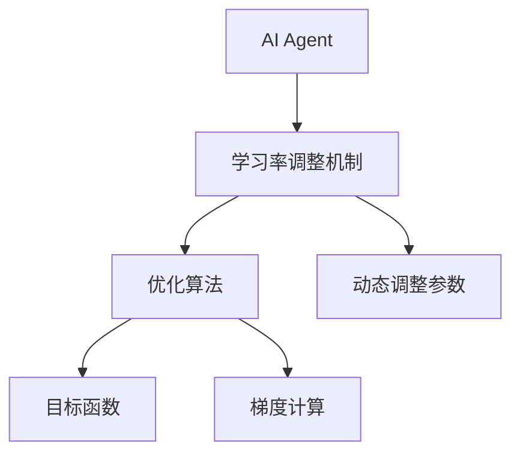
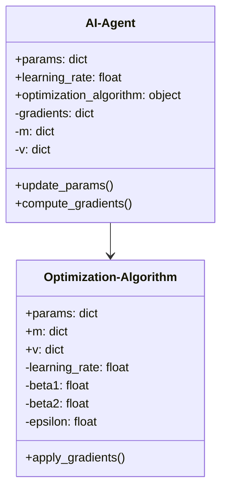

                 


# 构建AI Agent的自适应学习率调整机制

## 关键词：AI Agent，自适应学习率，机器学习优化，动态环境，AI算法实现

## 摘要：本文探讨如何在AI Agent中实现自适应学习率调整机制，涵盖算法选择、系统设计和优化策略。通过详细分析自适应学习率调整的原理、实现方法及实际应用案例，帮助读者理解并掌握这一技术。

---

## 第一部分: AI Agent与自适应学习率调整机制概述

### 第1章: AI Agent的背景与概念

#### 1.1 AI Agent的基本概念
- **定义与特点**：AI Agent是指在特定环境中能够感知并自主决策的智能体，具备自主性、反应性、目标导向性和学习能力。
- **分类与应用场景**：分为简单反射型、基于模型的反应型、目标驱动型和实用驱动型AI Agent，广泛应用于自动驾驶、智能助手、机器人控制等领域。
- **自适应学习率调整的必要性**：AI Agent在动态环境中需要快速适应变化，传统固定学习率难以满足需求。

#### 1.2 自适应学习率调整的背景
- **问题背景**：传统学习率调整方法在复杂动态环境中表现不佳，可能导致收敛速度慢或震荡。
- **问题描述**：学习率固定可能导致优化过程不稳定，难以适应不同阶段的梯度变化。
- **解决方案**：引入自适应学习率调整机制，根据梯度变化动态调整学习率，提高优化效率。

---

## 第二部分: 自适应学习率调整机制的核心概念

### 第2章: 自适应学习率调整机制的核心概念

#### 2.1 自适应学习率调整的原理
- **学习率的基本概念**：学习率是优化算法中控制参数更新步长的超参数，直接影响模型收敛速度和稳定性。
- **自适应调整的核心思想**：根据梯度信息动态调整学习率，平衡优化过程中的稳定性与收敛速度。
- **动态优化的目标函数**：通过自适应调整学习率，优化目标函数在动态环境下的收敛性。

#### 2.2 相关算法对比分析
- **Adam优化器的工作原理**：结合动量和自适应学习率调整，适用于大多数问题。
- **RMSProp与AdaGrad的区别**：RMSProp使用梯度平方的移动平均，AdaGrad针对稀疏梯度问题。
- **自适应学习率调整算法的优缺点对比**：表格形式展示不同算法的特征对比。

| 算法名称 | 优点 | 缺点 | 适用场景 |
|----------|------|------|----------|
| Adam     | 收敛快，适应性强 | 参数调整复杂 | 大多数场景 |
| RMSProp  | 稳定性好 | 对动量支持差 | 高维问题 |
| AdaGrad  | 处理稀疏梯度好 | 收敛速度慢 | 稀疏数据 |

#### 2.3 核心概念的ER实体关系图


---

## 第三部分: 自适应学习率调整算法的数学模型与实现

### 第3章: 自适应学习率调整算法的数学模型

#### 3.1 Adam优化器的数学推导
- **参数更新公式**：
$$ \theta_{t+1} = \theta_t - \eta \frac{m_t}{\sqrt{v_t + \epsilon}} $$
其中：
- $\theta_t$ 表示第 $t$ 步的参数
- $\eta$ 表示学习率
- $m_t$ 表示梯度的移动平均
- $v_t$ 表示梯度平方的移动平均
- $\epsilon$ 表示防止除零的常数

#### 3.2 RMSProp算法的数学公式
- **梯度平方的平均更新**：
$$ v_t = \beta_2 v_{t-1} + (1 - \beta_2) g_t^2 $$
其中：
- $v_t$ 表示第 $t$ 步的梯度平方平均
- $\beta_2$ 表示动量系数
- $g_t$ 表示第 $t$ 步的梯度

#### 3.3 自适应学习率调整的通用框架
- **动态学习率计算公式**：
$$ \eta_t = \eta_{t-1} \cdot \frac{\sqrt{v_{t-1} + \epsilon}}{g_t} $$

---

### 第4章: 自适应学习率调整算法的实现

#### 4.1 基于Adam优化器的实现
- **Python代码实现**：
```python
import numpy as np

def adam_optimizer(initial_params, learning_rate, beta1=0.9, beta2=0.999, epsilon=1e-8):
    params = initial_params.copy()
    m = {key: np.zeros_like(value) for key, value in params.items()}
    v = {key: np.zeros_like(value) for key, value in params.items()}

    for t in range(1000):
        gradients = compute_gradients(params)
        for key in params:
            m[key] = beta1 * m[key] + (1 - beta1) * gradients[key]
            v[key] = beta2 * v[key] + (1 - beta2) * gradients[key]**2
            params[key] = params[key] - learning_rate * m[key] / (np.sqrt(v[key] + epsilon))
    return params
```

---

## 第四部分: 系统分析与架构设计

### 第5章: 系统分析与架构设计方案

#### 5.1 问题场景介绍
- **动态环境下的优化问题**：AI Agent需要在不断变化的环境中实时调整参数，确保稳定性和高效性。

#### 5.2 系统功能设计
- **领域模型**：


---

## 第五部分: 项目实战

### 第6章: 项目实战

#### 6.1 环境安装与配置
- **Python环境**：安装Python 3.8及以上版本。
- **依赖管理**：安装numpy和tensorflow等库。

#### 6.2 核心代码实现
- **自适应学习率调整的代码实现**：
```python
import numpy as np

def adaptive_learning_rate_optimizer(initial_params, learning_rate, beta1=0.9, beta2=0.999, epsilon=1e-8):
    params = initial_params.copy()
    m = {key: np.zeros_like(value) for key, value in params.items()}
    v = {key: np.zeros_like(value) for key, value in params.items()}

    for t in range(1000):
        gradients = compute_gradients(params)
        for key in params:
            m[key] = beta1 * m[key] + (1 - beta1) * gradients[key]
            v[key] = beta2 * v[key] + (1 - beta2) * gradients[key]**2
            params[key] = params[key] - learning_rate * m[key] / (np.sqrt(v[key] + epsilon))
    return params
```

#### 6.3 案例分析与解读
- **实际案例分析**：通过具体案例展示自适应学习率调整在AI Agent中的实际效果，对比不同算法的性能。

---

## 第六部分: 总结与展望

### 第7章: 总结与展望

#### 7.1 小结
- **核心内容回顾**：本文详细介绍了AI Agent的自适应学习率调整机制，从理论到实践全面解析。

#### 7.2 最佳实践 tips
- **算法选择建议**：根据具体问题选择合适的自适应学习率调整算法。
- **参数调优注意事项**：合理设置超参数，避免过拟合和欠拟合。
- **系统优化建议**：结合实际场景优化系统架构，提高效率。

#### 7.3 拓展阅读
- 推荐相关书籍和论文，供读者深入学习。

---

## 作者：AI天才研究院/AI Genius Institute & 禅与计算机程序设计艺术 /Zen And The Art of Computer Programming

---

通过以上内容，您可以全面了解构建AI Agent的自适应学习率调整机制的相关知识，从理论到实践，帮助您更好地理解和应用这一技术。

