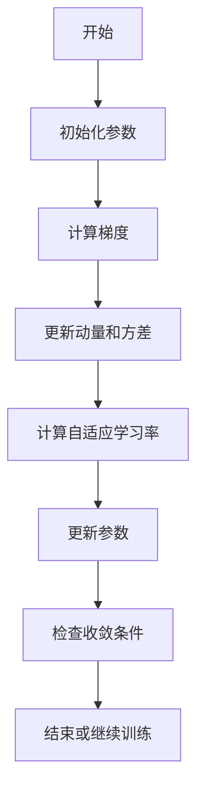
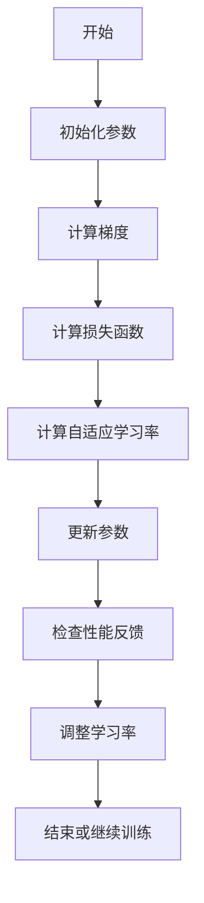
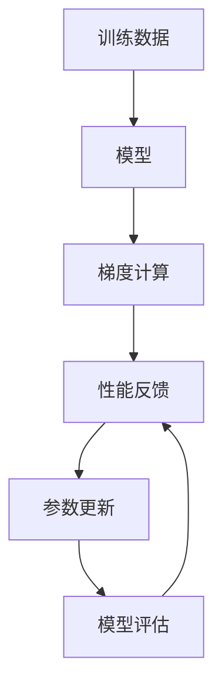
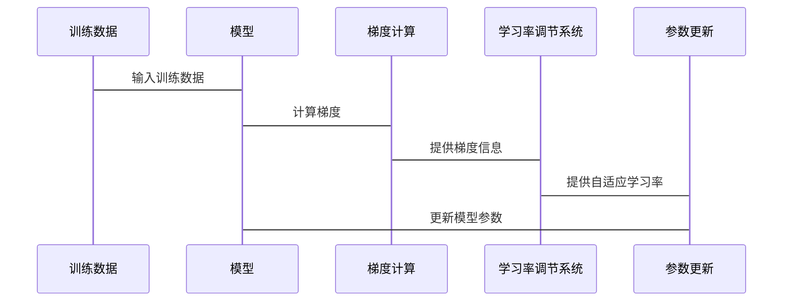

                 


# 构建AI Agent的自适应学习率调节系统

> 关键词：AI Agent，自适应学习率，学习率调节，机器学习，优化算法

> 摘要：在机器学习和深度学习领域，优化算法的性能很大程度上依赖于学习率的调节。传统固定学习率的方法在实际应用中常常表现出收敛速度慢、训练不稳定等问题。本文详细探讨了构建AI Agent的自适应学习率调节系统的方法，从问题背景到核心概念，从算法原理到系统架构，再到项目实战，全面解析了自适应学习率调节系统的设计与实现。通过本文的学习，读者能够理解自适应学习率调节的原理，掌握其实现方法，并能够在实际项目中应用这些技术。

---

# 第一部分: 自适应学习率调节系统背景与核心概念

## 第1章: 问题背景与问题描述

### 1.1 机器学习优化问题的背景

#### 1.1.1 机器学习中的优化问题
机器学习模型的训练过程本质上是一个优化问题。我们需要通过优化算法找到模型参数的最优解，使得模型在训练数据上的损失函数达到最小值。学习率是优化算法中的关键超参数，它决定了每一步参数更新的步幅大小。

#### 1.1.2 学习率在优化中的作用
学习率的大小直接影响优化算法的收敛速度和最终的模型性能。如果学习率过大，优化过程可能会跳过最优解；如果学习率过小，优化过程可能会收敛速度过慢，甚至陷入局部最优。

#### 1.1.3 传统学习率调节的局限性
传统的学习率调节方法通常采用固定学习率或基于训练轮数的衰减策略。这些方法在一定程度上可以缓解学习率不合适的问题，但仍然存在以下局限性：
- 需要手动调整学习率，增加了人工干预的复杂性。
- 无法根据训练过程中梯度的变化自动调整学习率。

### 1.2 AI Agent的自适应学习需求

#### 1.2.1 AI Agent的核心概念
AI Agent（人工智能代理）是一种能够感知环境并采取行动以实现目标的智能体。在机器学习和深度学习的场景中，AI Agent通常指具有自主学习能力的模型，能够在动态环境中不断优化自身的性能。

#### 1.2.2 自适应学习在AI Agent中的重要性
自适应学习能力是AI Agent的核心能力之一。它使得AI Agent能够根据环境的变化和反馈信息动态调整自身的学习策略，从而在复杂环境中保持高性能。

#### 1.2.3 传统学习率调节的不足
传统学习率调节方法无法满足AI Agent的自适应学习需求。AI Agent需要在动态环境中实时调整学习率，以应对不断变化的环境和任务需求。

### 1.3 问题解决与边界定义

#### 1.3.1 自适应学习率调节的目标
自适应学习率调节的目标是在训练过程中，根据当前的梯度信息和模型性能动态调整学习率，从而加速收敛速度、提高模型性能并减少人工干预。

#### 1.3.2 系统的边界与外延
自适应学习率调节系统专注于优化算法中的学习率调节问题，其边界包括：
- 输入：模型的梯度信息、模型性能反馈。
- 输出：动态调整后的学习率。
- 外延：与优化算法（如梯度下降、Adam）的结合。

#### 1.3.3 核心要素与概念结构
自适应学习率调节系统的概念结构包括以下几个核心要素：
- 梯度信息：用于判断当前参数更新的方向和幅度。
- 模型性能反馈：用于评估当前模型的性能，指导学习率的调整。
- 学习率调节策略：根据梯度和性能反馈动态调整学习率的方法。

---

## 第2章: 自适应学习率调节的核心概念

### 2.1 学习率调节的基本原理

#### 2.1.1 学习率的定义与作用
学习率（Learning Rate，$\eta$）是优化算法中的超参数，决定了每一步参数更新的步幅大小。公式表示为：
$$
\theta_{t+1} = \theta_t - \eta \cdot \nabla J(\theta_t)
$$
其中，$\theta$是模型参数，$J$是损失函数，$\nabla J$是损失函数的梯度。

#### 2.1.2 传统学习率调节方法
传统的学习率调节方法包括：
- 固定学习率：在整个训练过程中使用固定的学习率。
- 学习率衰减：随着时间的推移，逐步降低学习率，例如指数衰减或分段衰减。

#### 2.1.3 自适应调节的核心思想
自适应调节的核心思想是根据训练过程中的梯度信息和模型性能动态调整学习率，以实现更快的收敛速度和更好的模型性能。

### 2.2 自适应学习率调节的实现机制

#### 2.2.1 动态调整的数学模型
自适应学习率调节的数学模型可以表示为：
$$
\eta_t = f(\eta_{t-1}, \nabla J_t, J_t)
$$
其中，$\eta_t$是当前时刻的学习率，$\nabla J_t$是当前时刻的梯度，$J_t$是当前时刻的损失函数值，$f$是自适应调节策略。

#### 2.2.2 基于梯度信息的自适应方法
基于梯度信息的自适应方法根据梯度的大小动态调整学习率。例如：
$$
\eta_t = \frac{\eta_0}{\sqrt{t} + \epsilon}
$$
其中，$\eta_0$是初始学习率，$t$是训练轮数，$\epsilon$是防止除以零的常数。

#### 2.2.3 基于性能反馈的自适应策略
基于性能反馈的自适应策略根据模型的性能动态调整学习率。例如，当模型性能提升时，保持较大的学习率；当模型性能下降时，减小学习率。

### 2.3 核心概念对比分析

#### 2.3.1 不同学习率调节方法的对比
以下是一个对比分析表格：

| 方法                | 优点                          | 缺点                          |
|---------------------|-------------------------------|-------------------------------|
| 固定学习率          | 实现简单                      | 需要手动调整，适应性差        |
| 学习率衰减          | 可以逐步降低学习率，减少震荡    | 衰减速度难以选择，可能过早降低 |
| 自适应调节          | 动态调整，适应性强             | 实现复杂，需要额外计算          |

#### 2.3.2 自适应调节与其他优化方法的联系
自适应调节与Adam优化器（Adaptive Moment Estimation）密切相关。Adam优化器结合了动量和自适应学习率调节的思想，是一种高效的优化算法。

#### 2.3.3 关键参数与性能指标的对比
以下是一个关键参数对比分析表格：

| 参数                | 作用                          | 示例值                          |
|---------------------|-------------------------------|-------------------------------|
| 初始学习率（$\eta_0$） | 控制优化的初始步幅大小        | 0.001                          |
| 动量系数（$\beta_1$） | 用于平滑梯度变化               | 0.9                            |
| 自适应系数（$\beta_2$）| 用于自适应学习率调节          | 0.999                          |

---

## 第3章: 自适应学习率调节的算法原理

### 3.1 基于梯度的方法

#### 3.1.1 梯度下降的基本原理
梯度下降（Gradient Descent）是一种最基础的优化算法，通过不断减小损失函数的梯度来找到模型参数的最优解。

#### 3.1.2 动量法与Adam优化器
动量法（Momentum）通过引入动量项加速优化过程，而Adam优化器结合了动量和自适应学习率调节的思想。

#### 3.1.3 自适应学习率调节的数学模型
自适应学习率调节的数学模型可以表示为：
$$
m_t = \beta_1 m_{t-1} + (1-\beta_1) \nabla J_t
$$
$$
v_t = \beta_2 v_{t-1} + (1-\beta_2) (\nabla J_t)^2
$$
$$
\eta_t = \frac{\eta_0}{\sqrt{v_t} + \epsilon}
$$
其中，$m_t$是动量项，$v_t$是方差项，$\beta_1$和$\beta_2$是动量系数和自适应系数。

### 3.2 基于性能的方法

#### 3.2.1 网络训练中的性能反馈
性能反馈可以通过损失函数值或准确率来衡量模型的性能。

#### 3.2.2 基于损失函数的自适应调整
基于损失函数的自适应调整方法可以根据当前的损失函数值动态调整学习率：
$$
\eta_t = \eta_0 \cdot \frac{1}{1 + \frac{J_t}{J_{\text{min}}}}
$$
其中，$J_{\text{min}}$是损失函数的最小值。

#### 3.2.3 基于准确率的动态调节策略
基于准确率的动态调节策略可以根据模型的准确率动态调整学习率：
$$
\eta_t = \eta_0 \cdot \text{min}(1, \text{acc}_t / \text{acc}_{\text{target}})
$$
其中，$\text{acc}_t$是当前准确率，$\text{acc}_{\text{target}}$是目标准确率。

### 3.3 混合方法与优化策略

#### 3.3.1 梯度与性能的结合
混合方法将梯度信息和性能反馈结合起来，综合考虑两者动态调整学习率。

#### 3.3.2 分阶段的自适应调节
分阶段的自适应调节方法在训练的不同阶段采用不同的学习率调节策略，例如初始阶段使用较大的学习率快速收敛，后期使用较小的学习率精调参数。

#### 3.3.3 动态权重分配的实现
动态权重分配的实现方法可以根据梯度的稀疏性和重要性动态调整学习率。

---

## 第4章: 自适应学习率调节的数学模型与公式

### 4.1 基础公式

#### 4.1.1 学习率的基本公式
$$
\eta_t = \eta_0 \cdot \frac{1}{1+\frac{t}{\beta}}
$$
其中，$\beta$是衰减常数。

#### 4.1.2 自适应学习率调节的数学模型
$$
\eta_t = \frac{\eta_0}{\sqrt{v_t} + \epsilon}
$$
其中，$v_t$是梯度的平方的平均值，$\epsilon$是防止除以零的常数。

### 4.2 算法流程

#### 4.2.1 基于梯度的自适应调节算法流程


#### 4.2.2 基于性能的自适应调节算法流程


### 4.3 优化策略

#### 4.3.1 动量与自适应的结合
$$
m_t = \beta_1 m_{t-1} + (1-\beta_1) \nabla J_t
$$
$$
v_t = \beta_2 v_{t-1} + (1-\beta_2) (\nabla J_t)^2
$$
$$
\eta_t = \frac{\eta_0}{\sqrt{v_t} + \epsilon}
$$

#### 4.3.2 分阶段调节策略
$$
\eta_t = \begin{cases}
\eta_0 & \text{if } t < T/2 \\
\eta_0/2 & \text{if } T/2 \leq t < 3T/4 \\
\eta_0/4 & \text{if } 3T/4 \leq t
\end{cases}
$$
其中，$T$是总的训练轮数。

---

## 第5章: 系统分析与架构设计

### 5.1 问题场景介绍

#### 5.1.1 系统目标
自适应学习率调节系统的目标是实现动态调整学习率，提高模型训练效率和性能。

#### 5.1.2 问题分析
AI Agent需要在动态环境中实时调整学习率，以应对环境的变化和任务的需求。

### 5.2 系统功能设计

#### 5.2.1 领域模型设计


#### 5.2.2 系统架构设计


#### 5.2.3 接口设计
- 输入接口：梯度信息、性能反馈
- 输出接口：自适应学习率
- 调用接口：参数更新接口、模型评估接口

### 5.3 系统实现

#### 5.3.1 算法实现
```python
def adaptive_learning_rate(eta0, beta1, beta2, epsilon, iterations):
    m = 0
    v = 0
    for t in range(iterations):
        gradient = compute_gradient()  # 计算梯度
        m = beta1 * m + (1 - beta1) * gradient
        v = beta2 * v + (1 - beta2) * (gradient ** 2)
        eta = eta0 / (np.sqrt(v) + epsilon)
        update_parameters(eta * gradient)
```

#### 5.3.2 代码解读
- `m`和`v`分别表示动量和方差。
- `eta`是当前时刻的学习率，根据当前的梯度和方差动态调整。
- `update_parameters`函数负责更新模型参数。

### 5.4 交互设计

#### 5.4.1 交互流程


---

## 第6章: 项目实战

### 6.1 环境安装

#### 6.1.1 安装Python
安装Python 3.x，确保版本兼容性。

#### 6.1.2 安装依赖库
安装必要的Python库，例如numpy、tensorflow、pymermaid。

```bash
pip install numpy tensorflow pymermaid
```

### 6.2 系统核心实现

#### 6.2.1 核心代码实现
```python
import numpy as np
from tensorflow import keras
from tensorflow.keras import layers

def compute_adaptive_learning_rate(eta0, beta1, beta2, epsilon, iterations):
    m = 0
    v = 0
    for t in range(iterations):
        gradient = compute_gradient()  # 假设compute_gradient()是计算梯度的函数
        m = beta1 * m + (1 - beta1) * gradient
        v = beta2 * v + (1 - beta2) * (gradient ** 2)
        eta = eta0 / (np.sqrt(v) + epsilon)
        update_parameters(eta * gradient)

def update_parameters(gradient_step):
    # 假设参数是全局变量，这里只展示更新逻辑
    global theta
    theta -= gradient_step
```

#### 6.2.2 代码解读
- `compute_adaptive_learning_rate`函数实现了自适应学习率调节的核心逻辑。
- `compute_gradient`函数用于计算梯度。
- `update_parameters`函数用于更新模型参数。

### 6.3 应用与案例分析

#### 6.3.1 案例分析
以训练一个简单的神经网络为例，我们可以通过自适应学习率调节系统动态调整学习率，观察模型的训练效果。

#### 6.3.2 训练过程监控
在训练过程中，我们需要监控模型的损失函数值和准确率，以评估自适应学习率调节的效果。

### 6.4 项目总结

#### 6.4.1 项目小结
通过本项目，我们实现了自适应学习率调节系统的核心功能，验证了其在实际场景中的有效性。

#### 6.4.2 经验总结
- 自适应学习率调节能够显著提高模型的训练效率和性能。
- 实现自适应学习率调节需要结合梯度信息和性能反馈。
- 系统设计时需要考虑模型的动态变化和环境的不确定性。

---

## 第7章: 最佳实践与注意事项

### 7.1 最佳实践

#### 7.1.1 系统设计
- 确保系统具有良好的可扩展性和可维护性。
- 使用模块化设计，便于后续优化和功能扩展。

#### 7.1.2 参数选择
- 合理选择初始学习率、动量系数和自适应系数。
- 根据具体任务和数据集调整参数。

### 7.2 小结

#### 7.2.1 核心要点总结
- 自适应学习率调节的核心思想是根据梯度和性能动态调整学习率。
- 实现自适应学习率调节需要结合梯度信息和性能反馈。
- 自适应学习率调节能够显著提高模型的训练效率和性能。

### 7.3 注意事项

#### 7.3.1 参数选择
- 初始学习率的选择对优化过程至关重要，建议从较小的值开始尝试。
- 动量系数和自适应系数需要根据具体任务和数据集进行调整。

#### 7.3.2 训练监控
- 在训练过程中需要实时监控模型的损失函数和准确率，以便及时调整参数和策略。
- 注意防止梯度爆炸和梯度消失问题。

### 7.4 拓展阅读

#### 7.4.1 相关论文
- "Adam: A Method for Stochastic Optimization"（Adam优化器论文）
- "Adaptive Learning Rate Methods for Deep Learning"（自适应学习率方法综述）

#### 7.4.2 技术博客
- TensorFlow官方博客：[Understanding Adam](https://tensorflow.googleblog.com/2016/11/understanding-adam.html)
- PyTorch官方博客：[Deep Learning with PyTorch: A 60 Minute Blitz](https://pytorch.org/tutorials/beginner/deep_learning_with_pytorch_tutorial.html)

---

# 作者：AI天才研究院/AI Genius Institute & 禅与计算机程序设计艺术 /Zen And The Art of Computer Programming

