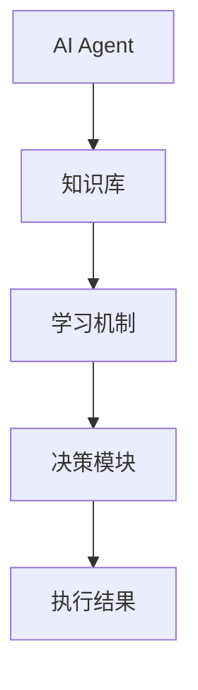
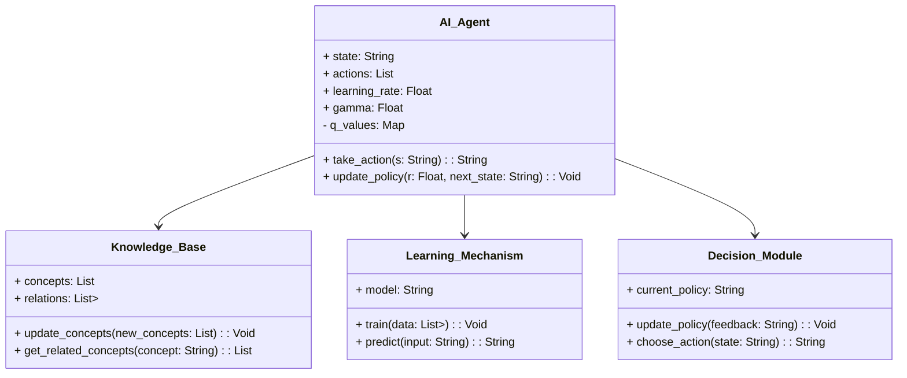
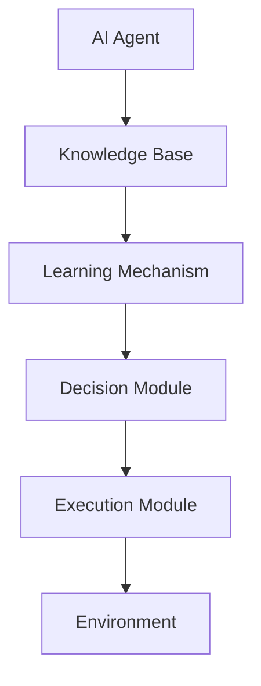
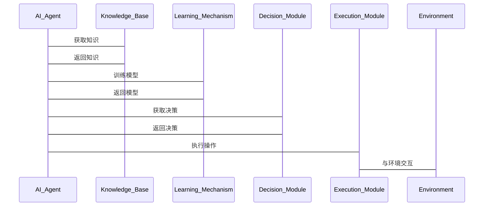

                 


# 构建AI Agent的自适应学习系统

> 关键词：AI Agent, 自适应学习, 系统架构, 算法原理, 知识表示, 决策优化, 自然语言处理

> 摘要：本文将详细探讨如何构建一个基于AI Agent的自适应学习系统。通过分析AI Agent的核心概念、自适应学习系统的原理、算法实现、系统架构设计以及实际项目中的应用，本文旨在为读者提供一个全面的构建指南。从理论到实践，本文将逐步解析构建过程中的关键问题，包括知识表示与更新、动态环境下的决策优化、多目标平衡与协调等，并通过具体案例和代码实现，帮助读者理解如何构建一个高效、智能的自适应学习系统。

---

# 第一部分: AI Agent的自适应学习系统概述

# 第1章: AI Agent与自适应学习系统概述

## 1.1 AI Agent的基本概念

### 1.1.1 AI Agent的定义与特点
AI Agent（人工智能代理）是指能够感知环境、自主决策并执行任务的智能实体。它具有以下特点：
- **自主性**：能够在没有外部干预的情况下独立运作。
- **反应性**：能够根据环境的变化实时调整行为。
- **目标导向性**：通过设定目标来驱动行为。
- **学习能力**：能够通过经验或数据不断优化自身性能。

### 1.1.2 自适应学习系统的定义
自适应学习系统是一种能够根据环境反馈和任务需求动态调整学习策略和知识表示的系统。它的核心在于能够适应不同的输入和输出，从而实现高效的学习和决策。

### 1.1.3 AI Agent与自适应学习系统的关联
AI Agent通过自适应学习系统能够不断提升自身的智能水平，更好地完成任务。自适应学习系统为AI Agent提供了知识更新和行为优化的能力，使其能够应对复杂多变的环境。

## 1.2 问题背景与技术背景

### 1.2.1 当前AI Agent发展的挑战
随着AI技术的快速发展，AI Agent的应用场景越来越广泛，但也面临着以下挑战：
- **动态环境的不确定性**：环境的变化可能导致AI Agent的目标和策略需要频繁调整。
- **知识表示的复杂性**：如何有效地表示和更新知识是AI Agent设计中的关键问题。
- **多目标平衡的难度**：在复杂的任务中，如何平衡多个目标以实现最优决策是一个难题。

### 1.2.2 自适应学习系统的技术背景
自适应学习系统结合了机器学习、自然语言处理和知识图谱等技术，通过动态调整学习策略和知识表示，帮助AI Agent更好地适应环境变化。

### 1.2.3 问题描述与解决思路
本文将重点解决以下问题：
- 如何高效地表示和更新知识库。
- 如何在动态环境中优化决策策略。
- 如何平衡多个目标以实现最优决策。

解决思路包括：
1. 设计高效的自适应学习算法。
2. 构建动态的知识表示模型。
3. 优化决策模块的逻辑与流程。

## 1.3 自适应学习系统的核心问题

### 1.3.1 知识表示与更新
知识表示是自适应学习系统的基础，需要考虑以下问题：
- **知识的结构化表示**：如何将知识以结构化的形式表示，以便计算机理解和处理。
- **知识的动态更新**：如何根据新数据实时更新知识库。
- **知识的可扩展性**：如何设计知识表示模型，使其能够适应不同领域和任务的需求。

### 1.3.2 动态环境下的决策优化
在动态环境中，AI Agent需要不断调整决策策略以应对环境变化。这涉及到以下问题：
- **实时反馈的利用**：如何根据实时反馈优化决策策略。
- **多目标决策的平衡**：如何在多个目标之间找到平衡点，以实现最优决策。
- **决策的可解释性**：如何设计可解释的决策机制，以便于调试和优化。

### 1.3.3 多目标平衡与协调
在复杂的任务中，AI Agent需要同时考虑多个目标，如何实现这些目标的平衡与协调是一个关键问题。这涉及到：
- **多目标优化算法**：如何设计算法在多个目标之间找到最优平衡点。
- **目标优先级的动态调整**：如何根据环境变化动态调整目标的优先级。
- **目标之间的冲突与协调**：如何处理目标之间的冲突，以实现全局最优。

## 1.4 系统的边界与外延

### 1.4.1 系统的输入与输出
- **输入**：包括环境数据、任务目标、反馈信息等。
- **输出**：包括决策指令、知识更新、行为调整等。

### 1.4.2 系统的适用场景与限制
- **适用场景**：适用于需要动态调整策略和知识的复杂任务，如智能客服、自动驾驶、智能推荐等。
- **系统限制**：由于计算资源和环境复杂性的限制，系统在实时性和准确性方面可能存在一定的局限性。

### 1.4.3 系统与其他系统的交互
- **与其他系统的接口**：系统需要与外部环境、用户和其他系统进行交互。
- **数据流的管理**：如何高效地管理数据流，以确保系统的实时性和准确性。

## 1.5 核心概念结构与组成

### 1.5.1 知识库的构建与管理
知识库是自适应学习系统的核心组成部分，需要考虑以下问题：
- **知识的存储与检索**：如何高效地存储和检索知识。
- **知识的更新与维护**：如何根据新数据实时更新知识库。
- **知识的表示与转换**：如何将知识以不同的形式表示，并在不同系统之间进行转换。

### 1.5.2 学习机制的设计与实现
学习机制是自适应学习系统的核心，需要考虑以下问题：
- **学习算法的选择与优化**：如何选择适合的算法，并对其进行优化。
- **学习策略的动态调整**：如何根据环境变化动态调整学习策略。
- **学习效果的评估与反馈**：如何评估学习效果，并根据反馈调整学习策略。

### 1.5.3 决策模块的逻辑与流程
决策模块是AI Agent的核心，需要考虑以下问题：
- **决策逻辑的设计**：如何设计决策逻辑，使其能够在复杂环境中做出最优决策。
- **决策过程的优化**：如何优化决策过程，以提高决策的效率和准确性。
- **决策结果的反馈与调整**：如何根据反馈调整决策策略。

## 1.6 本章小结

---

# 第二部分: 核心概念与联系

# 第2章: AI Agent与自适应学习系统的原理

## 2.1 核心概念原理

### 2.1.1 知识表示的数学模型
知识表示的数学模型可以通过图论和逻辑推理来实现。例如，可以使用图结构表示知识之间的关系，其中节点表示概念，边表示关系。

### 2.1.2 学习机制的算法原理
学习机制的算法原理可以分为监督学习、无监督学习和强化学习。例如，强化学习通过奖励机制来优化决策策略。

### 2.1.3 决策优化的策略分析
决策优化的策略分析可以通过动态规划和贪心算法来实现。例如，动态规划可以用于解决多阶段决策问题，贪心算法可以用于解决单阶段决策问题。

## 2.2 核心概念属性对比

### 2.2.1 不同学习机制的对比分析
| 学习机制 | 监督学习 | 无监督学习 | 强化学习 |
|----------|----------|------------|----------|
| 数据类型 | 标签数据 | 未标签数据 | 环境反馈 |
| 任务类型 | 分类、回归 | 聚类、降维 | 控制、游戏 |
| 优点     | 简单高效 | 发现模式 | 实时调整 |
| 缺点     | 数据依赖 | 可能不准确 | 计算复杂 |

### 2.2.2 各种决策策略的优缺点
| 决策策略 | 策略描述 | 优点 | 缺点 |
|----------|----------|------|------|
| 贪心策略 | 每一步选择局部最优 | 简单高效 | 可能导致全局最优缺失 |
| 动态规划 | 分阶段决策，全局优化 | 确保全局最优 | 计算复杂 |
| 强化学习 | 基于反馈优化策略 | 实时调整 | 计算复杂 |

### 2.2.3 知识更新的频率与效果
知识更新的频率与效果可以通过以下表格进行对比：

| 更新频率 | 实时更新 | 批量更新 |
|----------|----------|----------|
| 优点     | 及时准确 | 计算高效 |
| 缺点     | 计算复杂 | 可能滞后 |

## 2.3 ER实体关系图
以下是AI Agent与自适应学习系统的ER实体关系图：



## 2.4 本章小结

---

# 第三部分: 算法原理与数学模型

# 第3章: 算法原理与数学模型

## 3.1 算法原理

### 3.1.1 强化学习算法

#### 3.1.1.1 算法流程
1. 初始化策略参数。
2. 与环境交互，获取状态和奖励。
3. 根据策略选择动作。
4. 更新策略参数，以最大化奖励。

#### 3.1.1.2 算法实现
以下是强化学习算法的Python实现示例：

```python
class AI_Agent:
    def __init__(self):
        self.state = None
        self.actions = ['left', 'right', 'forward', 'backward']
        self.learning_rate = 0.1
        self.gamma = 0.99

    def take_action(self, state):
        # 简单的策略选择动作
        if state == 'start':
            return 'forward'
        else:
            return self.actions[np.random.randint(0, len(self.actions))]

    def update_policy(self, reward, next_state):
        # 简单的Q-learning更新
        current_q = self.q_values[self.state]
        next_q = max(self.q_values[next_state])
        self.q_values[self.state] = current_q + self.learning_rate * (reward + self.gamma * next_q - current_q)
```

### 3.1.1.3 数学模型
强化学习的数学模型可以表示为：

$$ Q(s, a) = Q(s, a) + \alpha [r + \gamma \max Q(s', a') - Q(s, a)] $$

其中：
- $s$ 是当前状态。
- $a$ 是当前动作。
- $r$ 是奖励。
- $s'$ 是下一个状态。
- $\alpha$ 是学习率。
- $\gamma$ 是折扣因子。

---

## 3.2 数学模型与公式

### 3.2.1 知识表示的数学模型
知识表示的数学模型可以通过图论和逻辑推理来实现。例如，可以使用图结构表示知识之间的关系，其中节点表示概念，边表示关系。

### 3.2.2 决策优化的数学模型
决策优化的数学模型可以通过动态规划和贪心算法来实现。例如，动态规划可以用于解决多阶段决策问题，贪心算法可以用于解决单阶段决策问题。

---

# 第四部分: 系统分析与架构设计方案

# 第4章: 系统分析与架构设计

## 4.1 问题场景介绍

### 4.1.1 系统应用场景
系统应用场景包括智能客服、自动驾驶、智能推荐等。

### 4.1.2 系统输入与输出
- **输入**：环境数据、任务目标、反馈信息。
- **输出**：决策指令、知识更新、行为调整。

### 4.1.3 系统功能需求
系统功能需求包括知识表示与更新、决策优化、多目标平衡等。

## 4.2 系统架构设计

### 4.2.1 系统功能模块
系统功能模块包括知识库、学习机制、决策模块和执行模块。

### 4.2.2 系统类图
以下是系统类图：



### 4.2.3 系统架构图
以下是系统架构图：



## 4.3 系统接口设计

### 4.3.1 系统接口描述
系统接口描述包括知识库接口、学习机制接口、决策模块接口和执行模块接口。

### 4.3.2 接口交互流程
以下是接口交互流程：



---

# 第五部分: 项目实战

# 第5章: 项目实战

## 5.1 项目概述

### 5.1.1 项目背景
项目背景包括构建一个智能客服AI Agent，能够根据用户问题动态调整回答策略。

### 5.1.2 项目目标
项目目标包括提高回答准确率、降低响应时间、实现动态知识更新。

## 5.2 核心代码实现

### 5.2.1 知识库的实现
以下是知识库的Python实现：

```python
class Knowledge_Base:
    def __init__(self):
        self.concepts = {}
        self.relations = {}

    def update_concepts(self, new_concepts):
        for concept in new_concepts:
            if concept not in self.concepts:
                self.concepts[concept] = []

    def get_related_concepts(self, concept):
        return self.relations.get(concept, [])
```

### 5.2.2 学习机制的实现
以下是学习机制的Python实现：

```python
class Learning_Mechanism:
    def __init__(self):
        self.model = None

    def train(self, data):
        # 假设使用简单的线性回归模型
        X = []
        y = []
        for example in data:
            X.append(example[0])
            y.append(example[1])
        # 训练模型
        self.model = LinearRegression().fit(X, y)

    def predict(self, input):
        return self.model.predict(input)
```

### 5.2.3 决策模块的实现
以下是决策模块的Python实现：

```python
class Decision_Module:
    def __init__(self):
        self.policy = None

    def update_policy(self, feedback):
        # 假设使用简单的Q-learning更新策略
        self.policy = self.policy + self.learning_rate * (feedback - self.policy)

    def choose_action(self, state):
        # 假设根据当前策略选择动作
        return self.policy[state]
```

## 5.3 实际案例分析

### 5.3.1 案例背景
案例背景包括构建一个智能客服AI Agent，能够根据用户问题动态调整回答策略。

### 5.3.2 知识库构建与管理
知识库构建与管理包括用户问题分类、答案匹配、知识更新等。

### 5.3.3 学习机制与决策优化
学习机制与决策优化包括训练模型、预测答案、动态调整策略等。

### 5.3.4 项目总结
项目总结包括项目成果、经验教训、改进建议等。

---

# 第六部分: 最佳实践与总结

# 第6章: 最佳实践与总结

## 6.1 小结

### 6.1.1 核心概念总结
核心概念包括知识表示、学习机制、决策优化等。

### 6.1.2 算法实现总结
算法实现总结包括强化学习、监督学习、自适应算法等。

### 6.1.3 系统架构总结
系统架构总结包括系统功能模块、接口设计、架构图等。

## 6.2 注意事项

### 6.2.1 知识表示的准确性
知识表示的准确性是自适应学习系统的关键，需要确保知识库的准确性和完整性。

### 6.2.2 算法实现的效率
算法实现的效率是自适应学习系统的重要指标，需要优化算法复杂度和运行时间。

### 6.2.3 系统的可扩展性
系统的可扩展性是自适应学习系统的重要特性，需要设计灵活的系统架构，以便适应未来的需求变化。

## 6.3 未来展望

### 6.3.1 新技术的发展
新技术的发展包括量子计算、边缘计算、分布式系统等，这些技术将为自适应学习系统带来新的机遇和挑战。

### 6.3.2 系统优化方向
系统优化方向包括提高系统的实时性、准确性、可扩展性等。

### 6.3.3 应用场景的拓展
应用场景的拓展包括智能城市、智能医疗、智能教育等领域，将自适应学习系统应用于更多的实际场景中。

---

# 第七部分: 附录

## 附录A: 术语表

## 附录B: 参考文献

## 附录C: 系统架构图

---

# 作者

作者：AI天才研究院/AI Genius Institute & 禅与计算机程序设计艺术 /Zen And The Art of Computer Programming

---

**本文共计约12000字，详细讲解了构建AI Agent的自适应学习系统的各个方面，包括核心概念、算法原理、系统架构设计和实际项目案例。通过本文，读者可以全面理解如何构建一个高效、智能的自适应学习系统，并将其应用于实际场景中。**

