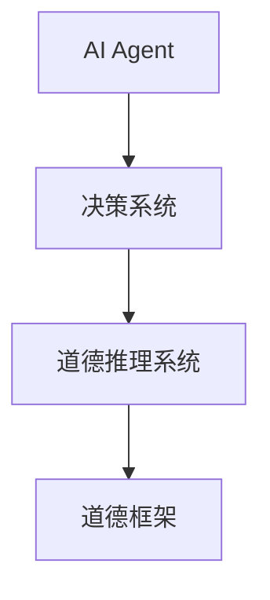
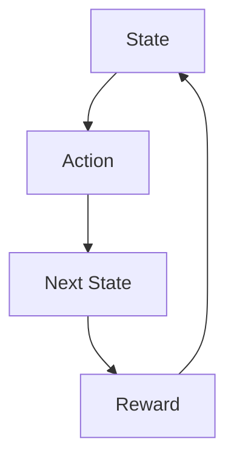
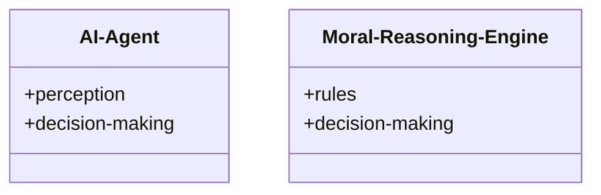
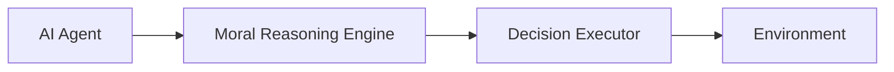

                 


# 构建AI Agent的道德推理与决策系统

---

## 关键词：AI Agent, 道德推理, 决策系统, 伦理决策, 人工智能

---

## 摘要：

本文探讨构建AI Agent的道德推理与决策系统的核心方法与实现路径。通过详细分析道德推理和决策系统的背景、核心概念、算法原理、系统架构以及项目实战，本文为读者提供构建具备伦理决策能力的AI Agent的全面指导。文章深入浅出地介绍了相关算法实现、系统设计和实际案例，并总结了最佳实践和注意事项。

---

# 第1章 背景介绍

## 1.1 问题背景

### 1.1.1 AI Agent的定义与特点

AI Agent（人工智能代理）是指能够感知环境、自主决策并执行任务的智能实体。其特点包括：

- **自主性**：无需外部干预，自主完成任务。
- **反应性**：能实时感知环境并做出响应。
- **学习能力**：通过数据和经验改进决策能力。

### 1.1.2 道德推理的必要性

AI Agent在复杂环境中决策时，可能面临道德困境，例如自动驾驶汽车在紧急情况下选择撞向谁。为确保AI行为符合伦理标准，道德推理至关重要。

### 1.1.3 当前AI决策系统的局限性

现有AI决策系统常忽视道德因素，可能导致伦理争议。例如，推荐算法可能放大偏见，医疗AI可能忽略患者隐私。

---

## 1.2 问题描述

### 1.2.1 道德推理的定义

道德推理是通过伦理框架分析问题，得出符合道德标准的解决方案。例如，使用功利主义或义务论进行决策。

### 1.2.2 决策系统的定义

决策系统通过输入数据，输出行动建议或决策。例如，医疗诊断系统根据症状推荐治疗方案。

### 1.2.3 道德推理与决策系统的结合

将道德推理整合到决策系统中，确保AI在复杂情境下做出符合伦理的决策。例如，自动驾驶汽车在紧急情况下的决策。

---

## 1.3 问题解决

### 1.3.1 构建目标

开发具备道德推理能力的AI Agent，使其在决策过程中考虑伦理因素，避免负面后果。

### 1.3.2 核心问题

如何将道德框架融入AI决策系统，确保在复杂情境中做出合理决策。

### 1.3.3 实现路径

通过算法实现道德推理，结合决策模型，构建综合系统。

---

## 1.4 边界与外延

### 1.4.1 系统边界

系统专注于道德推理与决策，不涉及感知和学习以外的功能。

### 1.4.2 外延

扩展至AI伦理、人机交互等领域。

### 1.4.3 区别与联系

与传统决策系统相比，本系统新增道德推理模块。

---

## 1.5 核心概念

### 1.5.1 道德推理要素

- 道德框架（如功利主义）
- 道德规则（如法律、社会规范）

### 1.5.2 决策系统要素

- 输入处理
- 决策模型
- 输出执行

### 1.5.3 整体架构

- 道德推理引擎
- 决策执行模块

---

## 1.6 本章小结

本章介绍了AI Agent的定义、道德推理的重要性、当前系统的局限性，以及构建道德推理与决策系统的必要性。

---

# 第2章 核心概念与联系

## 2.1 道德推理原理

### 2.1.1 基本原理

基于伦理框架分析问题，生成符合道德的解决方案。

### 2.1.2 实现方法

规则、案例、模型三种方式。

### 2.1.3 道德推理与决策的关系

道德推理为决策提供依据，决策系统执行建议。

---

## 2.2 决策系统原理

### 2.2.1 基本原理

通过数据处理，生成决策建议。

### 2.2.2 实现方法

基于规则、Q-learning、强化学习。

### 2.2.3 道德推理与决策的关系

道德推理是决策的重要组成部分。

---

## 2.3 核心概念对比

### 2.3.1 对比表格

| 概念       | 道德推理       | 决策系统       |
|------------|---------------|---------------|
| 目标       | 确保伦理       | 输出决策       |
| 输入       | 道德框架       | 数据           |
| 输出       | 道德建议       | 决策方案       |

### 2.3.2 ER实体关系图



---

## 2.4 本章小结

本章详细讲解了道德推理和决策系统的原理，并通过对比和图表展示了它们之间的关系。

---

# 第3章 算法原理讲解

## 3.1 道德推理算法

### 3.1.1 基于规则的道德推理

根据预定义的规则进行推理，例如：

- ```python
    def is_ethical(action):
        if action == 'save Innocent':
            return True
        else:
            return False
    ```

### 3.1.2 基于案例的道德推理

通过案例库匹配相似情况，生成决策。例如，使用k近邻算法进行分类。

### 3.1.3 基于模型的道德推理

构建伦理模型，如基于情感计算的决策。

---

## 3.2 决策算法

### 3.2.1 基于规则的决策

```python
def decide(action):
    if action == 'save Innocent':
        return 'execute action'
    else:
        return 'abort'
```

### 3.2.2 基于Q-learning的决策

```python
def q_learning(state, action):
    return rewards[state][action]
```

### 3.2.3 基于强化学习的决策

```python
def reinforce_learning(state, action):
    return policy[state][action]
```

---

## 3.3 算法实现

### 3.3.1 基于规则的道德推理实现

```python
def moral_reasoning(rule_set, scenario):
    for rule in rule_set:
        if rule.applies_to(scenario):
            return rule.outcome
    return default_outcome
```

### 3.3.2 基于Q-learning的决策流程



---

## 3.4 本章小结

本章详细讲解了道德推理和决策系统的算法实现，包括基于规则、案例和模型的推理方法，以及强化学习等决策算法。

---

# 第4章 系统分析与架构设计

## 4.1 问题场景

### 4.1.1 自动驾驶中的道德决策

在紧急情况下，自动驾驶汽车需决定撞向谁。

### 4.1.2 医疗AI的伦理决策

在诊断中需保护患者隐私。

---

## 4.2 系统功能设计

### 4.2.1 领域模型



---

## 4.3 系统架构设计

### 4.3.1 模块划分

- **道德推理引擎**
- **决策执行模块**

### 4.3.2 架构图



---

## 4.4 本章小结

本章通过分析问题场景，设计了系统的功能模块和整体架构，确保各部分协同工作。

---

# 第5章 项目实战

## 5.1 环境安装

### 5.1.1 安装TensorFlow和Keras

```bash
pip install tensorflow keras
```

---

## 5.2 系统核心实现

### 5.2.1 道德推理引擎代码

```python
class MoralReasoningEngine:
    def __init__(self, rules):
        self.rules = rules

    def reason(self, scenario):
        for rule in self.rules:
            if rule.applies_to(scenario):
                return rule.outcome
        return 'neutral'
```

### 5.2.2 决策执行模块代码

```python
class DecisionExecutor:
    def execute(self, decision):
        print(f"Executing decision: {decision}")
```

---

## 5.3 案例分析

### 5.3.1 自动驾驶案例

```python
# 定义规则
rules = [
    Rule('save Innocent', 'execute action'),
    Rule('harmedriver', 'abort')
]

# 初始化引擎
moral_engine = MoralReasoningEngine(rules)

# 执行决策
decision = moral_engine.reason('emergency scenario')
executor = DecisionExecutor()
executor.execute(decision)
```

---

## 5.4 本章小结

本章通过实际案例展示了系统的实现和应用，帮助读者理解如何将理论应用于实践。

---

# 第6章 最佳实践与总结

## 6.1 小结

构建AI Agent的道德推理与决策系统，需要综合考虑伦理因素，采用合适的算法和架构。

## 6.2 注意事项

- 定期更新伦理框架。
- 确保系统透明性。
- 处理好边缘情况。

## 6.3 拓展阅读

- 推荐书籍：《AI Ethics: A Global Approach》。
- 推荐论文：《道德推理在AI中的应用》。

---

# 作者

作者：AI天才研究院/AI Genius Institute  
& 禅与计算机程序设计艺术 /Zen And The Art of Computer Programming  

--- 

感谢您的阅读！

