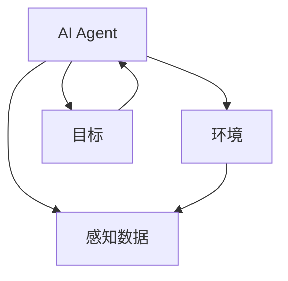
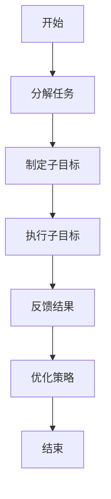
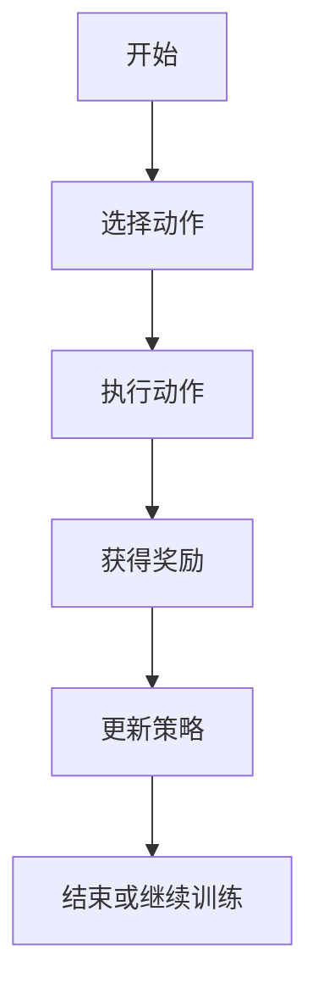
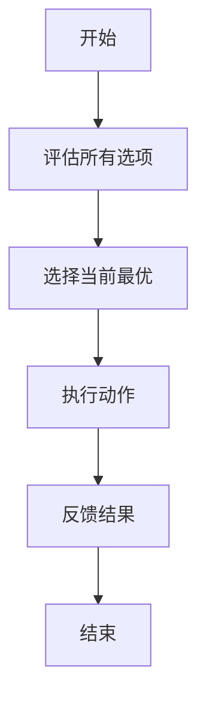
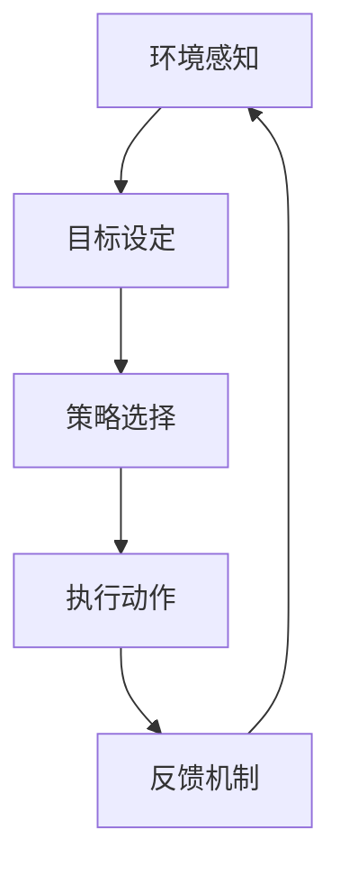
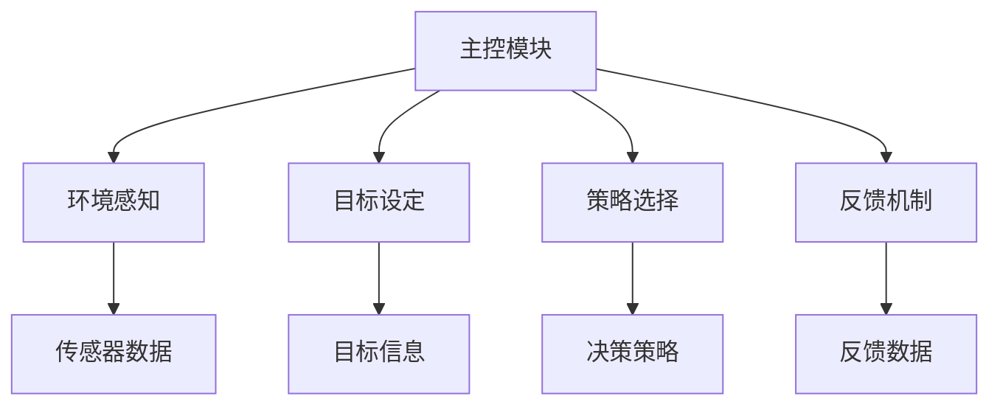
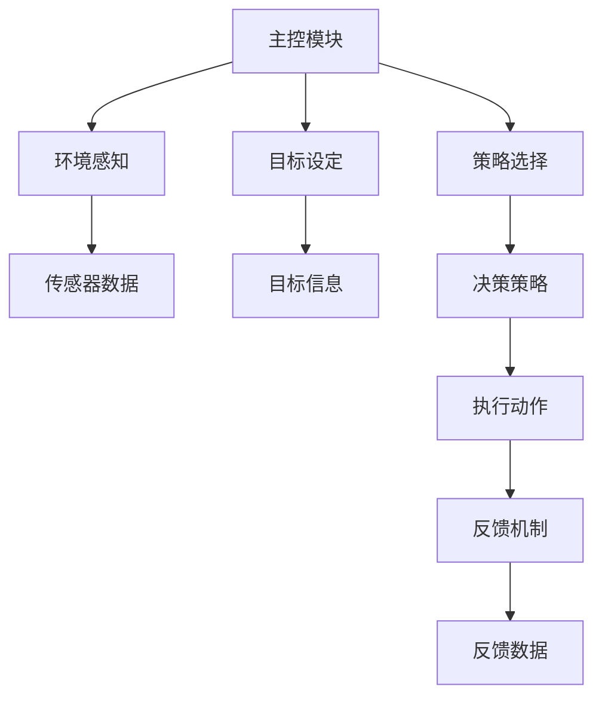
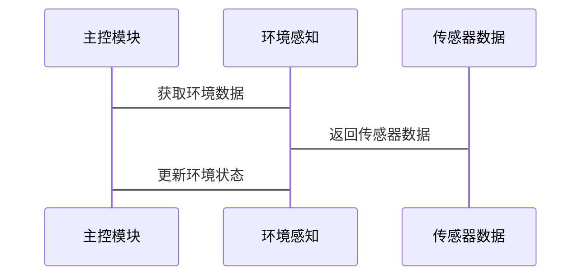

                 


# 构建AI Agent的长期规划与决策系统

## 关键词：AI Agent, 长期规划, 决策系统, 系统架构, 强化学习, 分层规划, 项目实战

## 摘要：  
本文详细探讨了构建AI Agent的长期规划与决策系统的各个方面，从核心概念到算法实现，再到系统架构设计和项目实战，旨在为读者提供全面的技术指导。文章首先介绍了AI Agent的背景与概念，然后深入分析了核心概念与联系，详细讲解了分层规划和强化学习的算法原理，并通过Mermaid图展示了系统的架构设计。最后，通过项目实战和案例分析，帮助读者理解如何将理论应用于实践，并提出了系统的优化与扩展方向。

---

# 第1章: AI Agent的背景与概念

## 1.1 问题背景

### 1.1.1 长期规划与决策的挑战
在复杂动态的环境中，AI Agent需要具备长期规划与决策的能力，以应对不确定性、资源限制和多目标冲突等问题。传统的基于短视策略的决策方法难以满足实际需求，例如自动驾驶中的路径规划需要考虑交通规则、障碍物和目标到达时间等多个因素。

### 1.1.2 AI Agent在智能系统中的角色
AI Agent作为智能系统的核心组成部分，负责感知环境、分析信息、制定策略和执行动作。例如，在智能家居中，AI Agent可以协调各种设备的工作，优化能源使用。

### 1.1.3 当前技术的局限性与改进方向
当前的AI Agent在长期规划与决策方面存在以下问题：
- **目标设定**：缺乏明确的长期目标，导致决策缺乏方向。
- **动态适应**：难以根据环境变化实时调整策略。
- **反馈机制**：反馈机制不完善，难以从经验中学习和优化。

改进方向包括引入分层规划算法、强化学习和自适应机制，以增强系统的长期规划与决策能力。

## 1.2 核心概念与定义

### 1.2.1 AI Agent的基本定义
AI Agent是一种智能实体，能够感知环境、分析信息、制定策略并执行动作。它可以分为简单反射型、基于模型的反应型、目标驱动型和效用驱动型等类型。

### 1.2.2 长期规划与决策的内涵
长期规划与决策是指AI Agent在复杂环境中，基于当前状态和历史经验，制定一系列行动策略以实现长期目标的过程。例如，在机器人路径规划中，AI Agent需要考虑路径的长度、障碍物、目标位置等多个因素。

### 1.2.3 系统边界与外延
系统的边界包括感知环境、决策过程和执行动作。外延则涉及与外部系统的交互、数据输入输出以及与其他AI Agent的协作。

## 1.3 系统架构与核心要素

### 1.3.1 系统架构的组成
AI Agent的长期规划与决策系统通常包括以下组成部分：
- **感知层**：负责收集环境信息，如传感器数据。
- **决策层**：分析信息，制定策略，如分层规划和强化学习。
- **执行层**：执行决策，如驱动设备动作。

### 1.3.2 核心要素的特征对比
通过对比目标设定、环境感知、策略选择和反馈机制等核心要素的特征，可以更好地理解系统的设计需求。

| 核心要素 | 特征 |
|----------|------|
| 目标设定 | 长期性、层次性、可调整性 |
| 环境感知 | 实时性、准确性、全面性 |
| 策略选择 | 优化性、适应性、可解释性 |
| 反馈机制 | 及时性、有效性、自适应性 |

### 1.3.3 实体关系图



---

# 第2章: 核心概念与联系

## 2.1 核心概念原理

### 2.1.1 长期规划与决策的数学模型
长期规划与决策可以基于马尔可夫决策过程（MDP）模型进行建模。MDP模型由状态空间、动作空间、转移概率和奖励函数构成。数学表示如下：

$$
MDP = (S, A, P, R, \gamma)
$$

其中：
- $S$：状态空间
- $A$：动作空间
- $P$：状态转移概率
- $R$：奖励函数
- $\gamma$：折扣因子

### 2.1.2 AI Agent的行为决策机制
AI Agent的行为决策机制包括基于规则的决策和基于学习的决策。基于规则的决策适用于规则明确的场景，而基于学习的决策适用于复杂动态的场景。

### 2.1.3 系统优化与平衡
系统优化需要在性能、效率和可扩展性之间找到平衡点。例如，通过优化算法复杂度和减少计算资源消耗来提高系统的效率。

## 2.2 实体关系图

### 2.2.1 ER实体关系图
通过ER图展示系统中的实体关系，例如AI Agent与环境、目标、感知数据之间的关系。

```mermaid
erd
    entity AI Agent {
        id
        状态
        目标
        感知数据
    }
    entity 环境 {
        id
        状态
        感知数据
    }
    AI Agent -[1..n]--> 环境
    AI Agent -[1..n]--> 目标
    AI Agent -[1..n]--> 感知数据
```

---

# 第3章: 算法原理与实现

## 3.1 算法原理

### 3.1.1 分层规划算法
分层规划算法将问题分解为多个层次，从高层目标到具体执行步骤。例如，在自动驾驶中，高层目标是到达目的地，底层目标是避开障碍物。

### 3.1.2 强化学习机制
强化学习通过与环境的交互，学习最优策略。数学模型如下：

$$
V(s) = r + \gamma \max_a V(s')
$$

其中：
- $V(s)$：状态$s$的价值
- $r$：立即奖励
- $\gamma$：折扣因子
- $s'$：下一个状态

### 3.1.3 贪婪算法与动态规划
贪婪算法在每一步选择当前最优动作，动态规划则通过迭代方法求解最优策略。

## 3.2 算法流程图

### 3.2.1 分层规划流程



### 3.2.2 强化学习流程



### 3.2.3 贪婪算法流程



## 3.3 算法实现

### 3.3.1 Python代码实现

```python
import numpy as np

class Agent:
    def __init__(self, states, actions):
        self.states = states
        self.actions = actions
        self.value = np.zeros(states)
    
    def choose_action(self, state):
        return np.argmax(self.value[state])
    
    def update_value(self, state, reward, next_state):
        self.value[state] = reward + gamma * self.value[next_state]

# 示例使用
gamma = 0.9
agent = Agent(5, 3)
agent.update_value(0, 1, 1)
agent.choose_action(0)
```

### 3.3.2 代码结构与功能
代码结构包括类定义、动作选择和价值更新函数。功能模块分别负责状态管理、动作选择和价值更新。

### 3.3.3 代码示例
上述代码示例展示了如何实现一个简单的强化学习算法，通过不断更新价值函数来优化决策策略。

---

# 第4章: 系统分析与架构设计

## 4.1 问题场景分析

### 4.1.1 项目背景
以自动驾驶为例，AI Agent需要在复杂的交通环境中规划路径、避开障碍物并安全到达目的地。

### 4.1.2 项目目标
实现一个能够进行长期规划与决策的AI Agent，具备环境感知、目标设定和策略优化能力。

### 4.1.3 项目范围
系统需要支持多种传感器数据输入，具备路径规划和决策优化功能，并能与外部系统进行交互。

## 4.2 系统功能设计

### 4.2.1 领域模型设计
领域模型包括环境感知、目标设定、策略选择和反馈机制等模块。

### 4.2.2 功能模块划分
系统功能模块包括：
- 环境感知模块
- 目标设定模块
- 策略选择模块
- 反馈机制模块

### 4.2.3 模块交互流程



## 4.3 系统架构设计

### 4.3.1 系统架构图



### 4.3.2 模块划分与职责
- 主控模块：协调各功能模块的交互。
- 环境感知模块：负责收集和处理环境数据。
- 目标设定模块：设定和调整长期目标。
- 策略选择模块：基于当前状态和目标制定决策。
- 反馈机制模块：根据执行结果调整策略。

## 4.4 接口与交互设计

### 4.4.1 系统接口定义
系统接口包括传感器数据输入接口、目标信息输入接口和反馈数据输出接口。

### 4.4.2 接口交互流程



### 4.4.3 序列图设计



---

# 第5章: 项目实战与案例分析

## 5.1 环境安装与配置

### 5.1.1 开发环境搭建
推荐使用Python和相关库，如NumPy、Matplotlib和TensorFlow。

### 5.1.2 依赖库安装
安装必要的依赖库：

```bash
pip install numpy matplotlib tensorflow
```

## 5.2 核心代码实现

### 5.2.1 系统核心代码

```python
import numpy as np

class Agent:
    def __init__(self, states, actions):
        self.states = states
        self.actions = actions
        self.value = np.zeros(states)
    
    def choose_action(self, state):
        return np.argmax(self.value[state])
    
    def update_value(self, state, reward, next_state):
        self.value[state] = reward + gamma * self.value[next_state]

# 示例使用
gamma = 0.9
agent = Agent(5, 3)
agent.update_value(0, 1, 1)
action = agent.choose_action(0)
print(action)
```

### 5.2.2 代码功能解读
代码实现了AI Agent的核心功能，包括状态管理、动作选择和价值更新。

## 5.3 案例分析

### 5.3.1 案例场景
以自动驾驶为例，AI Agent需要在复杂的交通环境中规划路径、避开障碍物并安全到达目的地。

### 5.3.2 代码应用解读
通过代码实现路径规划和决策优化，展示AI Agent在实际应用中的表现。

### 5.3.3 系统优化建议
建议引入更复杂的算法，如深度强化学习，以提高系统的决策能力。

## 5.4 项目总结

### 5.4.1 实践总结
项目展示了如何将理论应用于实践，验证了系统的可行性和有效性。

### 5.4.2 问题与改进
在实际应用中，可能遇到数据不足、计算资源限制等问题，需要进一步优化算法和系统架构。

---

# 第6章: 优化与扩展

## 6.1 系统优化

### 6.1.1 算法优化
引入更高效的算法，如Q-learning和Deep Q-Networks（DQN），以提高系统的决策效率。

### 6.1.2 系统性能提升
通过并行计算和分布式系统设计，提高系统的处理能力。

## 6.2 未来扩展

### 6.2.1 系统扩展方向
未来可以结合多智能体系统和边缘计算，进一步提高系统的协作能力和计算效率。

### 6.2.2 新功能开发
开发更复杂的目标设定和自适应机制，以应对更复杂的环境挑战。

---

# 第7章: 结论与展望

## 7.1 结论

本文详细探讨了构建AI Agent的长期规划与决策系统的各个方面，从核心概念到算法实现，再到系统架构设计和项目实战，为读者提供了全面的技术指导。

## 7.2 未来展望

未来的研究方向包括更复杂的决策模型、更高效的算法优化和更智能的系统架构设计。通过不断的研究和实践，AI Agent的长期规划与决策系统将更加智能和高效。

---

# 作者：AI天才研究院/AI Genius Institute & 禅与计算机程序设计艺术 /Zen And The Art of Computer Programming

