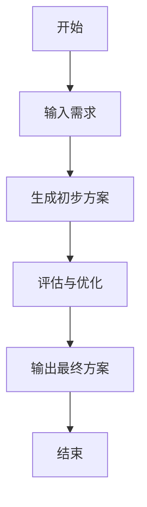
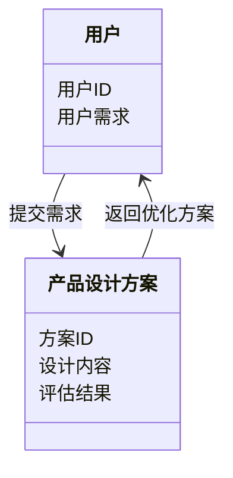
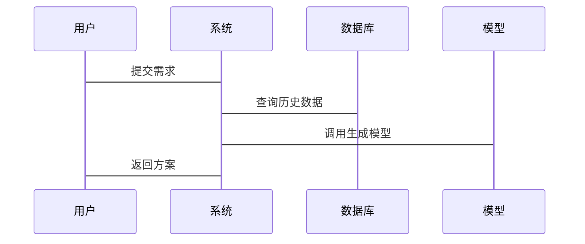

                 


# 构建AI辅助的金融产品设计系统

**关键词**：AI辅助设计，金融产品，生成式AI，强化学习，系统架构，金融创新

**摘要**：本文详细探讨如何构建一个基于生成式AI和强化学习的金融产品设计系统，旨在解决传统金融产品设计中的低效与高成本问题，通过AI技术实现智能化、自动化的产品设计流程，提高设计效率和产品创新能力。文章从系统背景、核心概念、算法原理、系统架构到实际项目案例，全面阐述了AI辅助金融产品设计的实现过程，为读者提供了一套完整的解决方案。

---

# 第1章: 金融产品设计的现状与问题

## 1.1 传统金融产品设计的痛点

### 1.1.1 传统金融产品设计的流程与挑战

传统金融产品设计流程通常涉及多个环节，包括需求分析、市场调研、产品定义、风险评估、合规审查等。然而，这一流程存在以下主要挑战：

1. **低效性**：传统设计流程依赖人工操作，耗时长且效率低下。
2. **高成本**：需要大量人力资源投入，尤其是高级金融分析师和产品经理。
3. **适应性差**：面对快速变化的市场环境，传统设计流程难以及时响应。
4. **创新能力有限**：依赖经验丰富的设计师，创新性受到限制。

### 1.1.2 人工设计的低效与高成本

人工设计金融产品不仅需要大量时间，还需要高度专业化的技能和知识。例如，设计一个风险管理产品可能需要数周时间，涉及复杂的数学建模和市场分析。这种低效性不仅增加了企业的成本，还可能导致市场机会的错失。

### 1.1.3 市场需求变化对设计的冲击

金融市场变化迅速，客户需求也在不断演变。传统设计流程难以快速响应这些变化，导致产品设计可能在市场发布时已经过时或不符合实际需求。

---

## 1.2 AI辅助设计的潜力与优势

### 1.2.1 AI在金融产品设计中的应用前景

AI技术，尤其是生成式AI和强化学习，为金融产品设计提供了新的可能性。通过AI，可以快速生成多个产品设计方案，优化产品参数，提高设计效率和创新性。

### 1.2.2 AI辅助设计的核心优势

AI辅助设计的核心优势包括：

1. **高效性**：AI可以在短时间内生成多个设计方案，显著缩短设计周期。
2. **智能化**：AI能够基于历史数据和市场趋势，提供数据驱动的设计建议。
3. **创新性**：AI可以探索人类设计师可能忽略的新思路和新方案。
4. **个性化**：AI可以根据不同客户的需求，定制个性化的产品设计方案。

### 1.2.3 未来趋势与技术挑战

尽管AI在金融产品设计中的应用前景广阔，但仍然面临一些技术挑战，例如数据质量、模型解释性以及算法的泛化能力等。

---

## 1.3 本章小结

本章分析了传统金融产品设计的痛点及其挑战，并探讨了AI辅助设计的潜力与优势。通过对比传统设计与AI辅助设计，我们得出结论：AI技术可以显著提高金融产品设计的效率和创新性，但仍需克服一些技术挑战。

---

# 第2章: AI辅助设计系统的定义与核心要素

## 2.1 AI辅助设计系统的定义

### 2.1.1 系统的核心目标

AI辅助设计系统的核心目标是通过AI技术，帮助金融设计师快速生成和优化产品设计方案，提高设计效率和创新能力。

### 2.1.2 系统的主要功能模块

AI辅助设计系统的主要功能模块包括：

1. **需求分析模块**：解析用户需求，生成初步设计方案。
2. **生成式AI模块**：基于需求生成多个设计方案。
3. **优化模块**：对生成的方案进行优化，确保符合市场和合规要求。
4. **反馈与迭代模块**：根据用户反馈，不断优化设计方案。

## 2.2 核心概念的属性对比

### 2.2.1 与传统金融系统的核心区别

| 属性               | 传统金融系统           | AI辅助设计系统         |
|--------------------|-----------------------|-----------------------|
| 核心目标           | 支持交易与结算         | 辅助产品设计与创新     |
| 技术基础           | 传统IT系统与人工操作   | 生成式AI与强化学习     |
| 创新性             | 较低                   | 较高                   |

### 2.2.2 与大数据分析系统的对比

| 属性               | 大数据分析系统         | AI辅助设计系统         |
|--------------------|-----------------------|-----------------------|
| 核心功能           | 数据收集与分析         | 数据驱动的设计生成与优化|
| 技术基础           | 数据挖掘与统计分析     | 生成式AI与强化学习     |
| 输出形式           | 数据报告与预测结果     | 产品设计方案与优化建议|

### 2.2.3 与传统AI应用的差异

| 属性               | 传统AI应用             | AI辅助设计系统         |
|--------------------|-----------------------|-----------------------|
| 应用场景           | 数据分类、预测等       | 产品设计与优化         |
| 输入形式           | 结构化数据             | 结构化与非结构化数据   |
| 输出形式           | 预测结果               | 产品设计方案与优化建议|

---

## 2.3 系统的ER实体关系图

```mermaid
er
  actor: 用户
  role: 设计师
  entity: 产品设计方案
  relationship: 提交与反馈
  actor -|> entity: 提交需求
  entity -|> relationship: 生成方案
  relationship -|> actor: 提供反馈
```

---

## 2.4 本章小结

本章定义了AI辅助设计系统的概念，分析了其与传统金融系统、大数据分析系统和传统AI应用的核心区别，并通过ER图展示了系统的实体关系。

---

# 第3章: AI辅助设计系统的算法原理

## 3.1 生成式AI模型的核心原理

### 3.1.1 大语言模型的生成机制

生成式AI模型（如GPT系列）通过大量预训练的语料库，学习语言的分布规律，能够在给定输入的基础上生成符合上下文的输出。

### 3.1.2 基于GPT系列的生成模型

GPT模型通过自注意力机制（Self-Attention）捕捉输入中的语义关系，并通过解码器生成输出。

### 3.1.3 强化学习在生成式AI中的应用

强化学习通过不断试错，优化生成模型的输出，使其更符合用户需求。

---

## 3.2 算法流程图



---

## 3.3 算法实现代码示例

```python
def generate_design(demand):
    model = load_model()  # 加载预训练模型
    prompt = construct_prompt(demand)  # 构建提示语
    response = model.generate(prompt)  # 生成设计方案
    return response
```

---

## 3.4 数学模型与公式

### 3.4.1 概率生成模型的数学表达

$$P(\text{output}|\text{input}) = \theta(\text{input})$$

### 3.4.2 损失函数的计算

$$\text{Loss} = -\sum_{i=1}^{n} \log P(y_i|x)$$

---

## 3.5 本章小结

本章详细介绍了生成式AI模型的核心原理，包括其生成机制、强化学习的应用，以及算法流程图和数学公式。

---

# 第4章: 系统分析与架构设计

## 4.1 问题场景介绍

本系统旨在解决金融产品设计中的效率低下和创新能力不足的问题，通过AI技术实现快速生成和优化设计方案。

---

## 4.2 系统功能设计

### 4.2.1 领域模型类图



---

## 4.3 系统架构设计

### 4.3.1 系统架构图


---

## 4.4 系统接口设计

### 4.4.1 系统接口描述

- **输入接口**：接收用户需求描述。
- **输出接口**：返回优化后的设计方案。

### 4.4.2 系统交互序列图



---

## 4.5 本章小结

本章通过系统分析与架构设计，明确了系统的功能模块和交互流程，为后续的实现奠定了基础。

---

# 第5章: 项目实战——AI辅助金融产品设计系统实现

## 5.1 环境安装

- 安装Python 3.8+
- 安装相关库：`transformers`, `torch`

## 5.2 核心代码实现

```python
from transformers import GPT2LMHeadModel, GPT2Tokenizer

def generate_design(demand):
    model_name = "gpt2-large"
    tokenizer = GPT2Tokenizer.from_pretrained(model_name)
    model = GPT2LMHeadModel.from_pretrained(model_name)

    inputs = tokenizer.encode(demand, return_tensors="pt")
    outputs = model.generate(inputs, max_length=500, temperature=0.7)

    response = tokenizer.decode(outputs[0], skip_special_tokens=True)
    return response
```

---

## 5.3 代码应用解读与分析

通过上述代码，我们可以实现基于GPT-2模型的生成式AI，快速生成金融产品设计方案。参数设置（如`temperature`）可以影响生成内容的多样性和创造性。

---

## 5.4 实际案例分析

### 5.4.1 案例背景

假设我们需要设计一款风险管理产品，用户需求为“设计一个基于机器学习的信用评分模型”。

### 5.4.2 案例实现

运行上述代码，输入需求后，系统生成设计方案，包括数据预处理、模型选择、训练与评估等内容。

### 5.4.3 案例分析

通过AI辅助设计系统，我们可以快速生成多种设计方案，并根据反馈不断优化，最终得到一个高效且创新的信用评分模型。

---

## 5.5 项目小结

本章通过实际案例展示了AI辅助设计系统的实现过程，包括环境安装、代码实现和案例分析。

---

# 第6章: 最佳实践与系统优化

## 6.1 小结

AI辅助设计系统通过生成式AI和强化学习，显著提高了金融产品设计的效率和创新性。

---

## 6.2 注意事项

1. **数据质量**：确保输入数据的准确性和完整性。
2. **模型解释性**：需要对生成的方案进行解释性分析。
3. **合规性**：确保生成的方案符合金融监管要求。

---

## 6.3 拓展阅读

1. 《生成式AI在金融领域的应用》
2. 《强化学习算法的实现与优化》
3. 《金融产品设计的创新与实践》

---

# 作者：AI天才研究院/AI Genius Institute & 禅与计算机程序设计艺术 /Zen And The Art of Computer Programming

---

本文通过详细分析AI辅助金融产品设计的背景、核心概念、算法原理、系统架构和实际案例，为读者提供了一套完整的解决方案。从理论到实践，本文为金融行业的创新与发展提供了新的思路和方向。

