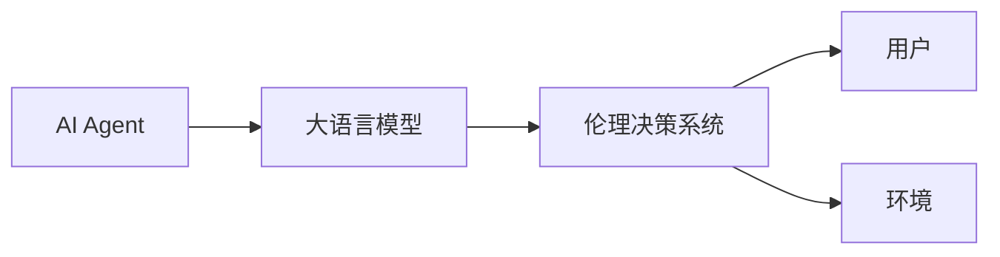
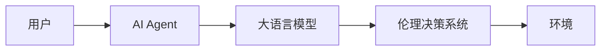

                 


# 《构建LLM支持的AI Agent伦理决策系统》

## 关键词：LLM, AI Agent, 伦理决策系统, 人工智能, 大语言模型

## 摘要：  
随着大语言模型（LLM）技术的快速发展，AI Agent在各个领域的应用越来越广泛。然而，AI Agent的决策过程往往缺乏伦理考量，导致潜在的风险和问题。本文将详细探讨如何构建一个基于LLM的AI Agent伦理决策系统，涵盖系统设计的核心概念、算法原理、架构设计以及实际项目实现。通过本篇文章，读者将深入了解如何在AI Agent中融入伦理决策机制，确保其行为符合人类伦理规范。

---

# 第一部分: 背景介绍与核心概念

## 第1章: LLM支持的AI Agent伦理决策系统概述

### 1.1 问题背景
#### 1.1.1 当前AI Agent的发展现状
AI Agent（人工智能代理）是一种能够感知环境、自主决策并执行任务的智能系统。近年来，AI Agent在各个领域得到了广泛应用，例如智能助手、自动驾驶、智能客服等。然而，随着AI Agent的复杂性和决策权限的增加，其潜在的伦理问题也逐渐浮现。

#### 1.1.2 LLM在AI Agent中的作用
大语言模型（LLM）如GPT-3、GPT-4等，具备强大的自然语言处理能力和上下文理解能力。LLM可以作为AI Agent的核心模块，帮助其理解和生成人类语言，从而实现更复杂的对话和决策任务。

#### 1.1.3 伦理决策的重要性
AI Agent的决策过程需要考虑伦理因素，例如隐私保护、责任归属、公平性等。如果AI Agent在没有伦理约束的情况下做出决策，可能会引发严重后果。因此，构建一个基于LLM的伦理决策系统至关重要。

### 1.2 问题描述
#### 1.2.1 AI Agent决策中的伦理挑战
AI Agent在决策过程中可能面临以下伦理挑战：
- **隐私泄露**：AI Agent可能在不知情的情况下泄露用户隐私。
- **决策偏见**：AI Agent可能因为训练数据中的偏见而做出不公正的决策。
- **责任问题**：当AI Agent的决策导致负面结果时，责任归属不明确。

#### 1.2.2 LLM在伦理决策中的优势
LLM在伦理决策中的优势主要体现在以下几点：
- **语义理解能力强**：LLM能够理解复杂的语义关系，从而更好地分析决策中的伦理问题。
- **可解释性高**：LLM可以通过生成的文本解释其决策过程，提高透明度。
- **适应性强**：LLM可以根据不同的场景和需求，灵活调整其决策策略。

#### 1.2.3 伦理决策系统的核心目标
伦理决策系统的核心目标是：
- 确保AI Agent的决策过程符合伦理规范。
- 提供可解释的决策过程，方便用户理解和监督。
- 在复杂场景中权衡不同伦理因素，做出最优决策。

### 1.3 问题解决
#### 1.3.1 构建LLM支持的伦理决策系统的方法
构建LLM支持的伦理决策系统可以按照以下步骤进行：
1. **需求分析**：明确AI Agent的使用场景和伦理要求。
2. **数据准备**：收集和整理与伦理相关的数据，用于训练LLM。
3. **模型训练**：基于伦理数据训练或微调LLM模型。
4. **系统集成**：将LLM集成到AI Agent中，实现伦理决策功能。
5. **测试与优化**：对系统进行测试，优化其伦理决策能力。

#### 1.3.2 系统设计的关键步骤
系统设计的关键步骤包括：
1. **需求分析**：了解AI Agent的具体需求和伦理要求。
2. **数据准备**：收集与伦理相关的数据，确保数据的多样性和代表性。
3. **模型设计**：设计适合伦理决策的模型架构。
4. **系统集成**：将模型集成到AI Agent中，确保其正常运行。
5. **测试与优化**：通过测试发现系统中的问题，并进行优化。

#### 1.3.3 伦理决策系统的边界与外延
伦理决策系统的边界包括：
- **输入范围**：系统能够处理的输入类型和范围。
- **输出范围**：系统能够输出的决策类型和范围。
- **适用场景**：系统适用的具体场景和领域。

伦理决策系统的外延包括：
- **扩展功能**：系统可以扩展的功能模块。
- **适用范围**：系统可以应用的领域和行业。

### 1.4 核心概念与联系
#### 1.4.1 伦理决策系统的概念结构
伦理决策系统的概念结构包括以下几个方面：
- **输入**：用户请求、环境信息等。
- **处理**：模型分析输入，生成决策。
- **输出**：决策结果和解释。
- **反馈**：用户对决策的反馈，用于优化系统。

#### 1.4.2 核心要素组成
伦理决策系统的组成要素包括：
- **LLM模型**：用于理解和生成文本。
- **伦理规则库**：包含伦理规范和决策准则。
- **决策逻辑**：用于根据伦理规则生成决策。
- **反馈机制**：用于优化系统性能。

#### 1.4.3 LLM与AI Agent的实体关系图
以下是LLM与AI Agent的实体关系图：



## 第2章: 核心概念与联系

### 2.1 核心概念原理
#### 2.1.1 LLM的基本原理
LLM的基本原理包括以下几个步骤：
1. **输入处理**：接收用户输入，进行分词和编码。
2. **模型训练**：基于大量数据训练模型，生成概率分布。
3. **生成输出**：根据概率分布生成输出文本。

#### 2.1.2 AI Agent的决策机制
AI Agent的决策机制包括以下几个步骤：
1. **感知环境**：获取环境中的相关信息。
2. **分析问题**：分析问题，生成多个可能的解决方案。
3. **选择最优方案**：根据伦理规则选择最优的决策方案。
4. **执行决策**：执行选定的决策方案。

#### 2.1.3 伦理决策的数学模型
伦理决策的数学模型可以表示为：
$$
\text{决策} = f_{\text{伦理}}(\text{输入})
$$
其中，$f_{\text{伦理}}$是基于伦理规则的决策函数，$\text{输入}$是决策的输入。

### 2.2 概念属性特征对比
以下是对核心概念的属性特征对比：

| 概念       | 输入类型      | 输出类型      | 决策机制          |
|------------|---------------|---------------|-------------------|
| LLM        | 文本           | 文本           | 生成式模型         |
| AI Agent   | 环境信息       | 行动           | 综合决策模型        |
| 伦理决策系统 | 输入文本+环境信息 | 合法决策+解释 | 综合分析模型        |

### 2.3 ER实体关系图
以下是伦理决策系统的ER实体关系图：



## 第3章: 算法原理讲解

### 3.1 算法流程
#### 3.1.1 LLM的训练流程
LLM的训练流程包括以下几个步骤：
1. **数据准备**：收集和整理训练数据。
2. **模型初始化**：初始化模型参数。
3. **训练过程**：通过反向传播优化模型参数。
4. **评估与优化**：评估模型性能，进行优化。

#### 3.1.2 AI Agent的决策流程
AI Agent的决策流程包括以下几个步骤：
1. **感知环境**：获取环境中的相关信息。
2. **分析问题**：分析问题，生成多个可能的解决方案。
3. **伦理判断**：根据伦理规则选择最优的决策方案。
4. **执行决策**：执行选定的决策方案。

### 3.2 算法原理
#### 3.2.1 LLM的数学模型
LLM的数学模型可以表示为：
$$
P(y|x) = \prod_{i=1}^{n} P(y_i|y_{i-1},x)
$$
其中，$P(y|x)$是条件概率，表示生成文本$y$的概率。

#### 3.2.2 AI Agent的决策模型
AI Agent的决策模型可以表示为：
$$
D(x) = \arg\max_{y} f_{\text{伦理}}(x,y)
$$
其中，$D(x)$是决策函数，$f_{\text{伦理}}(x,y)$是伦理评分函数。

#### 3.2.3 伦理评分函数的设计
伦理评分函数的设计需要考虑以下几个方面：
1. **隐私保护**：评估决策对用户隐私的影响。
2. **公平性**：评估决策的公平性。
3. **责任归属**：评估决策的责任归属。

### 3.3 代码实现
以下是伦理评分函数的Python实现示例：

```python
def ethical_score(x, y):
    # 评估隐私风险
    privacy_score = 0
    # 评估公平性
    fairness_score = 0
    # 评估责任归属
    responsibility_score = 0
    # 综合评分
    total_score = (privacy_score + fairness_score + responsibility_score) / 3
    return total_score
```

### 3.4 本章小结

---

## 作者：AI天才研究院/AI Genius Institute & 禅与计算机程序设计艺术 /Zen And The Art of Computer Programming

