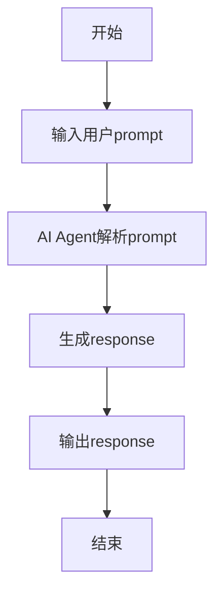
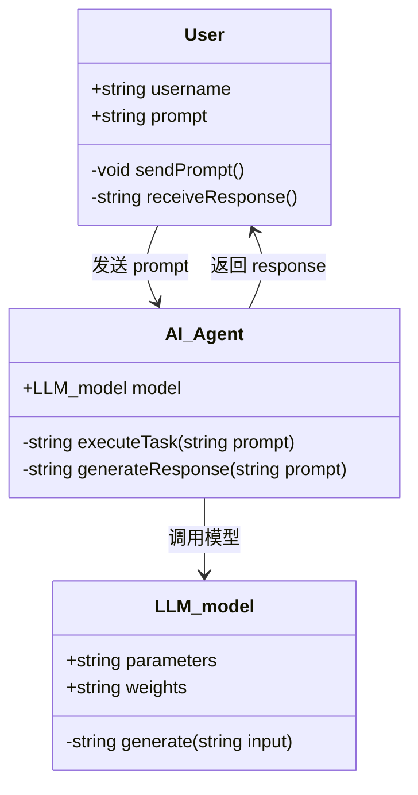
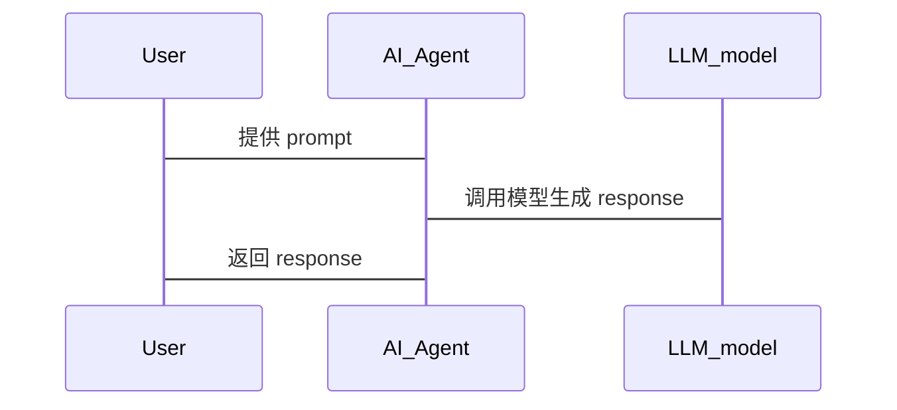

                 


# 构建LLM支持的AI Agent创造性写作系统

## 关键词：LLM, AI Agent, 创造性写作, 系统架构, 项目实战

## 摘要：本文详细探讨了如何构建一个基于大语言模型（LLM）支持的AI Agent创造性写作系统。文章从背景介绍、核心概念、算法原理、系统架构、项目实战到总结与展望，全面分析了该系统的构建过程。通过详细的代码实现和系统设计，展示了如何将LLM与AI Agent结合，实现智能化的创造性写作。

---

## 第一部分：背景介绍

### 第1章：LLM支持的AI Agent概述

#### 1.1 问题背景

- **创造性写作的需求与挑战**：创造性写作需要丰富的想象力和独特的表达方式，但传统工具难以满足个性化需求。随着AI技术的发展，利用LLM辅助写作成为可能。
- **LLM在创造性写作中的作用**：LLM能够生成高质量的文本，提供创意建议，并帮助作者克服创作瓶颈。
- **AI Agent在写作中的应用前景**：AI Agent可以作为用户的智能助手，实时分析需求并提供个性化建议，提升写作效率和质量。

#### 1.2 核心概念与问题描述

- **LLM的定义与特点**：LLM是一种基于深度学习的模型，能够处理复杂语言任务，具备强大的生成和理解能力。
- **AI Agent的基本概念**：AI Agent是一个智能实体，能够感知环境并执行任务，通过与用户的交互提供服务。
- **LLM支持的AI Agent创造性写作系统的定义**：该系统结合LLM和AI Agent，通过自然语言处理技术，辅助用户进行创造性写作。
- **系统边界与外延**：系统专注于写作辅助，边界包括用户输入、模型调用和结果输出，外延涉及多语言支持和跨平台应用。
- **核心要素与概念结构**：系统由用户、AI Agent、LLM模型三部分组成，通过交互实现写作辅助。

### 第2章：LLM与AI Agent的核心概念与联系

#### 2.1 核心概念原理

- **LLM的工作原理**：基于Transformer架构，通过自注意力机制生成相关文本。
- **AI Agent的决策机制**：通过解析用户需求，调用LLM生成响应，实现智能交互。
- **LLM与AI Agent的结合方式**：AI Agent作为中间层，负责解析需求并调用LLM生成内容。

#### 2.2 概念属性特征对比

| 特性 | LLM | AI Agent |
|------|------|----------|
| 输入 | 文本 | 用户指令 |
| 输出 | 文本 | 动作或内容 |
| 功能 | 生成和理解文本 | 分析需求并执行任务 |
| 学习方式 | 监督学习 | 强化学习 |
| 应用场景 | 写作、对话 | 辅助决策、自动化任务 |

#### 2.3 ER实体关系图

```mermaid
erDiagram
    actor User {
        +string username
        +string prompt
    }
    agent AI_Agent {
        +string response
        +LLM_model model
    }
    model LLM_model {
        +string parameters
        +string weights
    }
    User -> AI_Agent : 提供 prompt
    AI_Agent -> LLM_model : 调用模型
    AI_Agent -> User : 返回 response
```

### 第3章：算法原理讲解

#### 3.1 算法流程



#### 3.2 算法实现

```python
def generate_response(prompt):
    # 解析用户输入的prompt
    parsed_prompt = parse_prompt(prompt)
    # 调用LLM模型生成response
    response = llm_model.generate(parsed_prompt)
    return response
```

#### 3.3 数学模型与公式

- **LLM的数学模型**：$$P(\text{output}|\text{input}) = \theta$$
- **梯度下降算法**：$$\theta_{t+1} = \theta_t - \eta \nabla_{\theta} \mathcal{L}$$

---

## 第二部分：系统架构设计

### 第4章：系统分析与架构设计方案

#### 4.1 问题场景介绍

- **目标**：构建一个支持创造性写作的系统，帮助用户生成高质量文本。
- **项目介绍**：基于LLM和AI Agent的结合，实现智能写作辅助。

#### 4.2 系统功能设计

- **领域模型类图**



- **系统架构设计**


- **系统接口设计**：API接口实现用户与AI Agent的交互，LLM模型提供生成文本的功能。
- **系统交互序列图**



---

## 第三部分：项目实战

### 第5章：项目实战

#### 5.1 环境安装

- **Python环境**：Python 3.8+
- **依赖安装**：安装Hugging Face库或其他LLM框架。

#### 5.2 核心代码实现

```python
from transformers import GPT2LMHeadModel, GPT2Tokenizer

class AI_Agent:
    def __init__(self, model_name="gpt2"):
        self.model = GPT2LMHeadModel.from_pretrained(model_name)
        self.tokenizer = GPT2Tokenizer.from_pretrained(model_name)
    
    def generate_response(self, prompt):
        inputs = self.tokenizer.encode(prompt, return_tensors='pt')
        outputs = self.model.generate(inputs, max_length=50, num_beams=5, temperature=0.7)
        response = self.tokenizer.decode(outputs[0], skip_special_tokens=True)
        return response

# 使用示例
agent = AI_Agent()
prompt = "写一篇关于人工智能的文章"
response = agent.generate_response(prompt)
print(response)
```

#### 5.3 代码应用解读与分析

- **代码结构**：AI Agent类初始化加载模型，generate_response方法解析prompt并生成response。
- **功能实现**：通过Hugging Face库调用LLM模型，生成高质量文本。

#### 5.4 案例分析与详细讲解

- **案例1**：用户输入“写一篇关于人工智能的文章”，系统生成相关文本。
- **案例2**：用户输入“创作一首诗歌”，系统生成诗歌内容。

#### 5.5 项目小结

- **总结**：通过实战，展示了如何利用LLM构建AI Agent，实现创造性写作。
- **注意事项**：模型选择、参数调优和用户反馈优化。

---

## 第四部分：总结与展望

### 第6章：总结与展望

#### 6.1 总结

- **核心内容回顾**：文章详细讲解了构建LLM支持的AI Agent创造性写作系统的背景、核心概念、算法原理、系统架构和项目实战。
- **主要收获**：通过实践，掌握了如何将LLM与AI Agent结合，实现智能写作辅助。

#### 6.2 展望

- **改进方向**：优化模型性能，增强交互体验，扩展多语言支持。
- **未来研究**：探索更先进的模型架构，提升生成文本的质量和多样性。

---

## 作者信息

作者：AI天才研究院/AI Genius Institute & 禅与计算机程序设计艺术 /Zen And The Art of Computer Programming

---

这篇文章通过系统的背景介绍、核心概念、算法原理、系统架构和项目实战，详细阐述了如何构建一个基于LLM支持的AI Agent创造性写作系统。通过丰富的代码示例和图表，帮助读者理解和实现这一系统。

