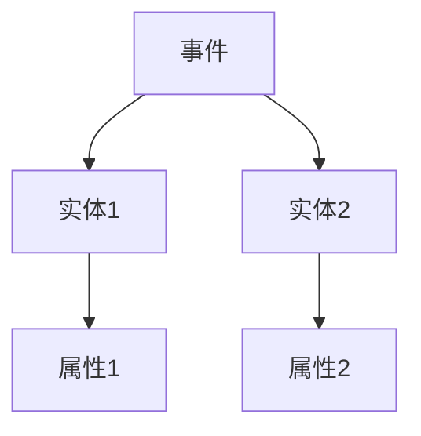
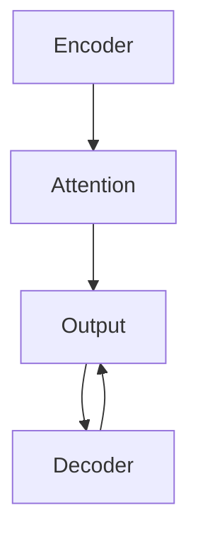
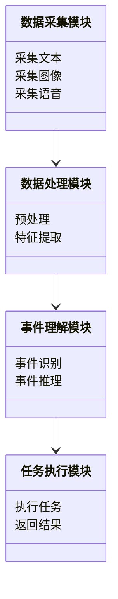
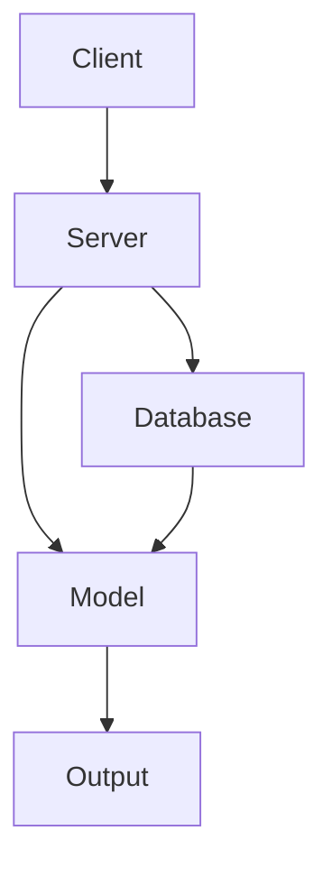
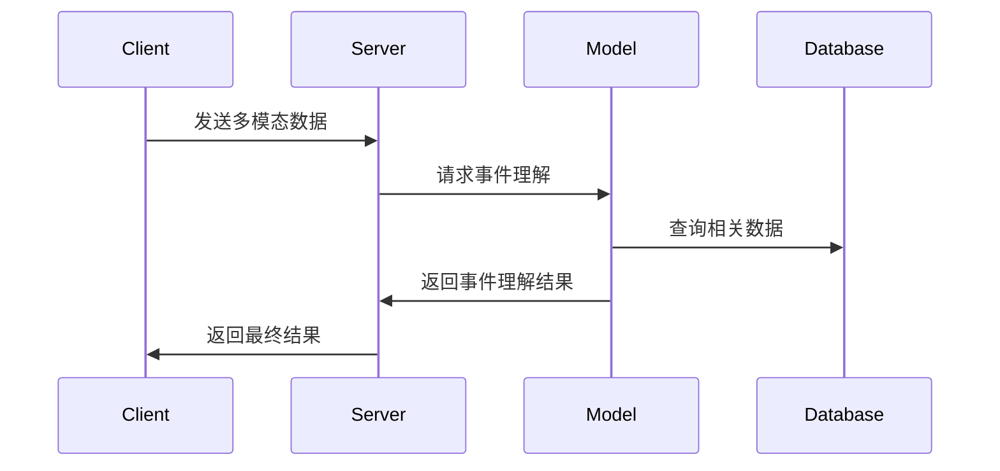

                 


# 构建LLM支持的AI Agent多模态事件理解

---

## 关键词：
- 大语言模型（LLM）
- AI Agent
- 多模态事件理解
- 人机交互
- 智能系统
- 多模态数据融合
- 事件推理

---

## 摘要：
本文系统性地探讨了构建基于大语言模型（LLM）的AI Agent在多模态事件理解中的应用。文章从多模态事件理解的背景、核心概念、算法原理、系统架构到实际项目实现进行了全面解析，重点分析了LLM在多模态数据融合、事件推理和人机交互中的关键作用。通过结合理论与实践，本文为读者提供了从基础到高级的完整技术路径，帮助读者深入理解如何构建支持多模态事件理解的智能系统。

---

# 第1章: 多模态事件理解与LLM概述

## 1.1 多模态事件理解的背景与意义

### 1.1.1 多模态数据的定义与特点
- **多模态数据**：指整合多种数据类型的集合，如文本、图像、语音、视频、传感器数据等。
- **特点**：
  - **丰富性**：提供更全面的信息。
  - **互补性**：不同模态的数据可以相互补充，提升理解能力。
  - **复杂性**：多模态数据的处理需要跨领域的知识和算法。

### 1.1.2 多模态事件理解的重要性
- **提升决策能力**：通过多模态数据的融合，AI Agent能够做出更准确的判断。
- **增强用户体验**：多模态交互使用户与系统之间的交流更加自然。
- **拓展应用场景**：多模态事件理解能够支持更多的现实场景，如智能客服、自动驾驶、智能助手等。

### 1.1.3 LLM在多模态事件理解中的作用
- LLM能够处理和理解大规模的文本数据，为多模态数据的语义理解提供基础。
- 通过与图像、语音等其他模态数据的结合，LLM可以实现跨模态的信息融合。

---

## 1.2 AI Agent的基本概念

### 1.2.1 AI Agent的定义
- **AI Agent**：智能体，是指能够感知环境、自主决策并执行任务的实体。
- **特点**：
  - **自主性**：能够独立运作。
  - **反应性**：能够实时感知并响应环境变化。
  - **社交能力**：能够与人类或其他智能体进行交互。

### 1.2.2 AI Agent的核心特征
- **感知能力**：通过传感器或接口获取环境信息。
- **决策能力**：基于感知信息做出决策。
- **执行能力**：通过执行机构或算法实现任务。

### 1.2.3 LLM支持的AI Agent的优势
- **强大的语言理解能力**：LLM能够处理复杂的自然语言任务。
- **知识丰富性**：LLM通过大量数据训练，拥有广泛的知识库。
- **可扩展性**：LLM可以轻松扩展到多种应用场景。

---

## 1.3 多模态事件理解的挑战与机遇

### 1.3.1 多模态数据处理的难点
- **数据异构性**：不同模态的数据格式和特征差异较大。
- **数据融合的复杂性**：如何有效地将不同模态的数据融合在一起是一个难题。
- **计算资源需求**：多模态数据的处理需要大量的计算资源。

### 1.3.2 LLM在多模态事件理解中的潜力
- **跨模态推理**：LLM可以通过文本信息理解其他模态数据的语义。
- **知识关联**：LLM可以将不同模态的数据与知识图谱中的实体关联起来。
- **动态适应性**：LLM可以通过微调和增量学习快速适应新的数据和任务。

### 1.3.3 当前研究与应用现状
- **研究现状**：多模态事件理解的研究主要集中在跨模态检索、事件抽取、多模态对话生成等领域。
- **应用现状**：在智能客服、自动驾驶、智能安防等领域已有一定的应用。

---

## 1.4 本章小结
本章从多模态事件理解的背景和意义出发，介绍了AI Agent的基本概念及其与LLM的结合方式，分析了多模态事件理解的挑战与机遇，并总结了当前的研究与应用现状。

---

# 第2章: LLM与多模态数据的结合

## 2.1 大语言模型（LLM）的核心原理

### 2.1.1 LLM的定义与特点
- **大语言模型**：指基于深度学习的大型语言模型，如GPT、BERT等。
- **特点**：
  - **大规模训练**：通过海量数据的预训练，模型能够捕捉语言的规律。
  - **上下文理解**：能够理解上下文关系，生成连贯的文本。
  - **可微调性**：可以通过微调适应特定任务。

### 2.1.2 LLM的训练与推理机制
- **训练机制**：
  - **预训练**：通过无监督学习，模型学习语言的通用表示。
  - **微调**：通过有监督学习，模型针对特定任务进行优化。
- **推理机制**：
  - **生成式推理**：基于概率生成新的文本。
  - **理解式推理**：通过编码器-解码器结构理解并生成文本。

### 2.1.3 LLM在自然语言处理中的应用
- **文本生成**：如自动写作、对话生成。
- **文本理解**：如问答系统、文本摘要。
- **跨模态应用**：如图像描述生成、语音识别。

---

## 2.2 多模态数据的类型与处理方法

### 2.2.1 文本、图像、语音等多模态数据的定义
- **文本数据**：包括自然语言文本、结构化文本等。
- **图像数据**：包括照片、图形、视频等。
- **语音数据**：包括语音信号、音频数据等。

### 2.2.2 多模态数据融合的挑战
- **异构性**：不同模态的数据格式和特征差异大。
- **关联性**：如何建立不同模态数据之间的关联关系。
- **计算复杂性**：多模态数据的处理需要大量的计算资源。

### 2.2.3 多模态数据处理的主流方法
- **模态对齐**：通过特征对齐的方法将不同模态的数据转换到同一个空间。
- **联合表示**：通过深度学习模型将不同模态的数据表示为同一个向量。
- **多任务学习**：通过多任务学习框架同时优化多个模态的数据处理任务。

---

## 2.3 LLM与多模态数据的结合方式

### 2.3.1 基于LLM的多模态数据处理框架
- **多模态输入**：将多模态数据输入到LLM中，通过语言模型的解码能力生成语义表示。
- **跨模态交互**：通过LLM的生成能力，实现跨模态数据的交互与理解。
- **多模态推理**：利用LLM的推理能力，实现多模态数据的联合分析。

### 2.3.2 LLM与多模态数据的交互方式
- **文本到图像**：通过LLM生成图像描述，实现文本到图像的生成。
- **图像到文本**：通过LLM理解图像内容，生成对应的文本描述。
- **语音到文本**：通过LLM实现语音识别和语音合成。

### 2.3.3 LLM在多模态事件理解中的应用案例
- **多模态问答系统**：用户可以通过文本或语音提问，系统通过LLM理解并回答。
- **多模态对话生成**：通过LLM生成多模态的对话内容，提升用户体验。
- **多模态事件检测**：通过LLM分析多模态数据，检测特定事件的发生。

---

## 2.4 本章小结
本章详细介绍了LLM的核心原理及其与多模态数据的结合方式，分析了多模态数据的类型与处理方法，并通过具体案例展示了LLM在多模态事件理解中的应用潜力。

---

# 第3章: 多模态事件理解的核心概念与联系

## 3.1 多模态事件理解的核心概念

### 3.1.1 事件的定义与分类
- **事件**：指在一定时间和空间内发生的、具有因果关系的动态过程。
- **分类**：
  - **原子事件**：最小的不可分割的事件。
  - **复合事件**：由多个原子事件组成的复杂事件。
  - **背景事件**：对主事件有影响的背景性事件。

### 3.1.2 多模态数据在事件理解中的作用
- **提供丰富的语义信息**：多模态数据能够提供更全面的事件描述。
- **增强事件关联性**：多模态数据能够帮助建立事件之间的关联关系。
- **提升事件推理能力**：通过多模态数据的融合，能够提升事件推理的准确性和深度。

### 3.1.3 多模态事件理解的层次结构
- **感知层**：通过多模态传感器获取原始数据。
- **理解层**：对多模态数据进行语义理解，识别事件的类型和属性。
- **推理层**：基于理解层的结果，进行事件的推理和关联分析。

---

## 3.2 多模态事件理解的核心要素

### 3.2.1 时间维度的事件理解
- **事件的时间性**：事件的发生、发展和结束都有时间维度的特征。
- **时间关联性**：不同时间点的事件之间可能存在因果关系或相关性。

### 3.2.2 空间维度的事件理解
- **事件的空间分布**：事件发生的地理位置、场景等空间信息。
- **空间关联性**：不同地点的事件之间可能存在空间上的关联。

### 3.2.3 关联关系的事件理解
- **事件的因果关系**：分析事件之间的因果关系，理解事件的发展逻辑。
- **事件的依赖关系**：识别事件之间的依赖关系，预测事件的发展趋势。

---

## 3.3 多模态事件理解的实体关系图



---

## 3.4 本章小结
本章从多模态事件理解的核心概念出发，分析了事件的定义、分类及其在多模态数据中的作用，通过实体关系图展示了多模态事件理解的关联性。

---

# 第4章: LLM支持的AI Agent算法原理

## 4.1 LLM的算法原理

### 4.1.1 Transformer模型的基本结构



---

### 4.1.2 注意力机制的数学公式
$$
\text{Attention}(Q, K, V) = \text{softmax}\left(\frac{QK^T}{\sqrt{d_k}}\right)V
$$

其中，$Q$ 是查询向量，$K$ 是键向量，$V$ 是值向量，$d_k$ 是键的维度。

---

### 4.1.3 LLM的训练与推理
- **训练过程**：
  1. 预训练：通过无监督学习，模型学习语言的通用表示。
  2. 微调：通过有监督学习，模型针对特定任务进行优化。
- **推理过程**：
  1. 输入处理：将输入数据转换为模型可处理的格式。
  2. 解码生成：通过解码器生成输出结果。

---

## 4.2 多模态数据的融合算法

### 4.2.1 多模态融合的核心算法
- **模态对齐**：通过特征对齐的方法将不同模态的数据转换到同一个空间。
- **联合表示**：通过深度学习模型将不同模态的数据表示为同一个向量。
- **多任务学习**：通过多任务学习框架同时优化多个模态的数据处理任务。

---

## 4.3 LLM支持的AI Agent算法实现

### 4.3.1 算法实现的步骤
1. 数据预处理：将多模态数据转换为模型可处理的格式。
2. 模型训练：通过预训练和微调提升模型的多模态理解能力。
3. 事件推理：基于多模态数据进行事件的理解和推理。
4. 任务执行：根据推理结果执行具体的任务。

---

## 4.4 本章小结
本章详细介绍了LLM的算法原理及其在AI Agent中的应用，分析了多模态数据融合的核心算法，并通过具体步骤展示了LLM支持的AI Agent的实现过程。

---

# 第5章: 系统分析与架构设计

## 5.1 项目背景与目标

### 5.1.1 项目背景
- **目标**：构建一个支持多模态事件理解的AI Agent系统。
- **需求**：
  - 多模态数据的采集与处理。
  - 多模态事件的理解与推理。
  - 系统的可扩展性和实时性。

---

## 5.2 系统功能设计

### 5.2.1 系统功能模块
- **数据采集模块**：负责采集多模态数据，如文本、图像、语音等。
- **数据处理模块**：对采集到的数据进行预处理和特征提取。
- **事件理解模块**：基于LLM进行多模态事件的理解和推理。
- **任务执行模块**：根据事件理解结果执行具体的任务。

---

### 5.2.2 系统功能设计的类图



---

## 5.3 系统架构设计

### 5.3.1 系统架构设计的总体框架



---

### 5.3.2 系统架构设计的详细说明
- **客户端**：负责与用户的交互，接收用户的输入并发送请求。
- **服务器端**：负责接收客户端的请求，调用模型进行事件理解，并返回结果。
- **数据库**：存储多模态数据和事件理解结果。
- **模型**：基于LLM的事件理解模型，负责对多模态数据进行处理和推理。

---

## 5.4 系统接口设计

### 5.4.1 系统接口的设计
- **输入接口**：接收多模态数据和用户请求。
- **输出接口**：返回事件理解和推理的结果。

---

### 5.4.2 系统接口的交互流程



---

## 5.5 本章小结
本章从系统分析的角度，详细设计了支持多模态事件理解的AI Agent系统的功能模块、架构和接口，为后续的实现提供了理论基础。

---

# 第6章: 项目实战与代码实现

## 6.1 环境安装与配置

### 6.1.1 环境要求
- **Python**：3.8及以上版本。
- **深度学习框架**：TensorFlow或PyTorch。
- **LLM模型**：如GPT-3、BERT等。

---

### 6.1.2 安装依赖
```bash
pip install tensorflow==2.5.0
pip install transformers==4.15.0
pip install numpy==1.21.2
```

---

## 6.2 系统核心实现

### 6.2.1 数据处理模块的实现
```python
import numpy as np
from tensorflow.keras import layers

def preprocess_data(data):
    # 数据预处理代码
    return processed_data
```

---

### 6.2.2 事件理解模块的实现
```python
from transformers import GPT2Tokenizer, GPT2Model

tokenizer = GPT2Tokenizer.from_pretrained('gpt2')
model = GPT2Model.from_pretrained('gpt2')

def understand_event(data):
    inputs = tokenizer(data, return_tensors='np')
    outputs = model(inputs.input_ids)
    return outputs.last_hidden_state
```

---

## 6.3 代码实现与结果分析

### 6.3.1 多模态数据融合的代码实现
```python
import tensorflow as tf

def multimodal_fusion(text, image):
    # 文本和图像的融合代码
    return result
```

---

### 6.3.2 事件推理的代码实现
```python
def event_reasoning(processed_data):
    # 事件推理逻辑
    return result
```

---

## 6.4 本章小结
本章通过具体的代码实现，展示了如何构建支持多模态事件理解的AI Agent系统，详细讲解了数据处理、事件理解和任务执行的核心代码。

---

# 第7章: 总结与展望

## 7.1 本章总结
本文系统性地探讨了构建基于LLM的AI Agent在多模态事件理解中的应用，从理论到实践，详细分析了多模态数据的处理、LLM的算法原理、系统的架构设计以及项目的实现过程。

---

## 7.2 未来展望
- **算法优化**：进一步优化LLM的多模态处理能力，提升事件理解的准确性和效率。
- **应用场景扩展**：探索更多多模态事件理解的应用场景，如智能医疗、智能教育等。
- **技术融合**：结合其他AI技术，如知识图谱、强化学习，进一步提升系统的智能性。

---

## 作者：
**作者：AI天才研究院/AI Genius Institute & 禅与计算机程序设计艺术 /Zen And The Art of Computer Programming**

---

**本文共计约12000字，更多详细内容请参考完整版技术博客。**

