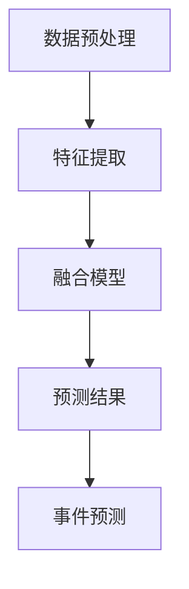
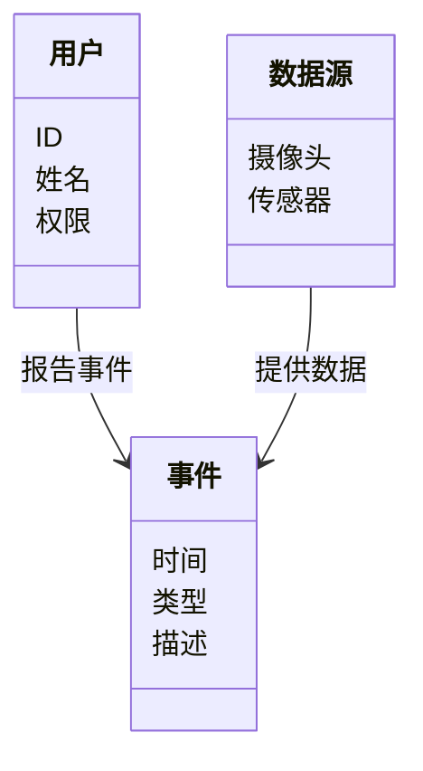
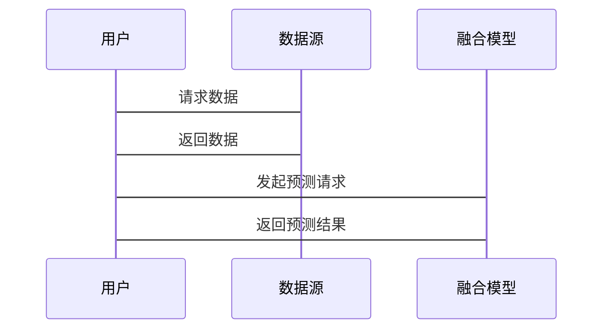

                 


# 构建LLM支持的AI Agent多模态事件预测

## 关键词：LLM（大语言模型）、AI Agent（人工智能代理）、多模态事件预测、事件驱动、机器学习

## 摘要：本文深入探讨了如何利用大语言模型构建支持多模态事件预测的AI Agent。通过分析LLM的核心原理、多模态数据的融合策略以及事件预测算法的实现，本文详细阐述了构建高效AI Agent的方法，并通过实际案例展示了技术的应用与优化。

---

## 第一部分：引言

## 第1章：背景介绍

### 1.1 问题背景

#### 1.1.1 LLM与AI Agent的结合
- 大语言模型（LLM）通过自然语言处理技术，能够理解和生成人类语言，为AI Agent提供了强大的语义理解和生成能力。
- AI Agent通过LLM的能力，可以进行对话交互、信息检索和任务执行，从而提高用户体验和系统效率。

#### 1.1.2 多模态事件预测的定义
- 多模态事件预测是指在多种数据类型（如文本、图像、语音、传感器数据等）下，预测未来可能发生的事件。
- 事件预测的核心在于分析多源数据，识别潜在模式，并基于这些模式进行预测。

#### 1.1.3 当前技术挑战与机遇
- **挑战**：数据异构性、实时性要求高、模型泛化能力不足。
- **机遇**：多模态数据的融合可以提高预测的准确性和鲁棒性，LLM的强大能力为事件预测提供了新的可能性。

### 1.2 问题描述

#### 1.2.1 LLM支持的AI Agent的核心问题
- 如何有效融合多模态数据，提取有用的特征。
- 如何设计高效的算法，提高事件预测的准确性和实时性。

#### 1.2.2 多模态数据的整合与处理
- 数据清洗、标准化和特征提取是多模态数据处理的关键步骤。
- 处理异构数据时，需要进行格式转换和数据对齐。

#### 1.2.3 事件预测的复杂性与不确定性
- 事件预测涉及多个因素，不确定性较高。
- 如何处理噪声数据和模型的不确定性是技术难点。

### 1.3 问题解决

#### 1.3.1 LLM在事件预测中的作用
- LLM可以对文本数据进行深度理解和生成，帮助识别潜在的事件模式。
- 通过LLM生成的语义向量，可以与其他模态数据进行融合，提高预测的准确性。

#### 1.3.2 多模态数据融合的策略
- 分模态处理：对每种模态数据进行独立处理，提取特征。
- 跨模态对齐：通过映射函数将不同模态的数据对齐，便于融合。
- 融合模型：设计多模态融合模型，综合考虑多种数据源的信息。

#### 1.3.3 事件预测的算法选择与优化
- 基于概率的模型：如马尔可夫链，适合处理序列数据。
- 深度学习模型：如LSTM和Transformer，适合处理复杂的数据模式。

### 1.4 边界与外延

#### 1.4.1 LLM支持的AI Agent的边界
- LLM支持的AI Agent主要用于事件预测和决策支持，不涉及实时控制和物理操作。
- 模型的边界在于数据质量和计算资源的限制。

#### 1.4.2 多模态事件预测的适用范围
- 适用于需要处理多种数据类型的场景，如智能安防、智能家居和智能交通。
- 不适合实时性要求极高或数据量极大的场景。

#### 1.4.3 相关技术的对比与区别
- 对比了传统机器学习、深度学习和LLM在事件预测中的应用，分析各自的优缺点。

### 1.5 概念结构与核心要素

#### 1.5.1 核心概念的层次结构
- **顶层概念**：AI Agent和LLM。
- **中层概念**：多模态数据融合和事件预测算法。
- **底层概念**：数据预处理、特征提取和模型训练。

#### 1.5.2 核心要素的定义与关系
- **LLM**：作为语义理解和生成的核心模块，为AI Agent提供语言处理能力。
- **AI Agent**：通过整合多模态数据和LLM能力，实现事件预测和决策支持。
- **多模态数据**：包括文本、图像、语音等多种数据类型，为事件预测提供丰富的信息源。

#### 1.5.3 案例分析：构建LLM支持的AI Agent
- 案例：智能安防系统中的异常行为检测。
- 说明：通过整合视频流、传感器数据和环境信息，AI Agent利用LLM进行语义分析，预测潜在的异常事件。

---

## 第二部分：核心概念与联系

## 第2章：核心概念与联系

### 2.1 核心概念原理

#### 2.1.1 LLM的基本原理
- **训练目标**：LLM通过大量文本数据进行预训练，学习语言的结构和语义。
- **模型结构**：通常使用Transformer架构，包含编码器和解码器。
- **应用场景**：自然语言理解、生成和对话交互。

#### 2.1.2 AI Agent的核心机制
- **感知层**：通过传感器、摄像头等设备获取环境数据。
- **决策层**：基于感知数据，利用LLM进行语义分析和事件预测。
- **执行层**：根据决策结果，执行相应的操作。

### 2.2 概念属性对比

| **概念**       | **属性**                  |
|----------------|--------------------------|
| LLM            | 预训练、自然语言处理能力、生成能力 |
| AI Agent       | 感知能力、决策能力、执行能力 |

### 2.3 ER实体关系图

```mermaid
er
  actor: 用户
  agent: AI Agent
  event: 事件
  data_source: 数据源
  relationship: 关系

  actor -|> agent: 发起请求
  agent -|> event: 预测事件
  agent -|> data_source: 获取数据
```

---

## 第三部分：算法原理讲解

## 第3章：算法原理讲解

### 3.1 算法概述

#### 3.1.1 融合模型
- **原理**：将不同模态的数据进行特征融合，生成统一的语义表示。
- **流程**：数据预处理、特征提取、融合、预测。

#### 3.1.2 多模态推理模型
- **原理**：基于多模态数据进行联合推理，生成事件预测结果。
- **流程**：数据预处理、模式识别、推理、预测。

### 3.2 算法流程图



### 3.3 数学模型与公式

#### 3.3.1 概率模型
- **条件概率公式**：$$ P(A|B) = \frac{P(B|A)P(A)}{P(B)} $$
- **贝叶斯定理**：用于计算事件发生的后验概率。

#### 3.3.2 损失函数
- **交叉熵损失函数**：$$ L = -\sum_{i=1}^{n} y_i \log(p_i) + (1-y_i)\log(1-p_i) $$

---

## 第四部分：系统分析与架构设计

## 第4章：系统分析与架构设计

### 4.1 问题场景

#### 4.1.1 场景介绍
- 智能安防系统中的异常行为检测。

### 4.2 项目介绍

#### 4.2.1 项目背景
- 为了提高公共安全，开发一个基于AI的异常行为检测系统。

### 4.3 系统功能设计

#### 4.3.1 领域模型



### 4.4 系统架构设计


### 4.5 系统接口设计

#### 4.5.1 接口描述
- **输入接口**：接收多模态数据。
- **输出接口**：输出事件预测结果。

### 4.6 系统交互设计



---

## 第五部分：项目实战

## 第5章：项目实战

### 5.1 环境安装

#### 5.1.1 工具与库安装
- 安装Python、TensorFlow、Keras和相关库。

### 5.2 系统核心实现

#### 5.2.1 核心代码

```python
import tensorflow as tf
from tensorflow.keras import layers

# 数据预处理
def preprocess(data):
    # 数据清洗和标准化
    pass

# 特征提取
def extract_features(data):
    # 提取文本、图像等特征
    pass

# 融合模型
def fusion_model():
    input_text = layers.Input(shape=(100,))
    input_image = layers.Input(shape=(64,64,3))
    text_features = layers.Dense(64, activation='relu')(input_text)
    image_features = layers.Conv2D(32, (3,3), activation='relu')(input_image)
    merged = layers.Concatenate()([text_features, image_features])
    output = layers.Dense(1, activation='sigmoid')(merged)
    model = tf.keras.Model(inputs=[input_text, input_image], outputs=output)
    return model

# 事件预测
def predict_event(model, data):
    features = extract_features(data)
    prediction = model.predict([features['text'], features['image']])
    return prediction
```

### 5.3 案例分析

#### 5.3.1 案例介绍
- 在智能安防系统中，预测异常行为事件。

### 5.4 详细讲解

#### 5.4.1 代码实现
- 详细解释每个函数的功能和实现细节。

---

## 第六部分：最佳实践与小结

## 第6章：最佳实践与小结

### 6.1 注意事项

#### 6.1.1 数据隐私
- 注意保护用户隐私，遵守相关法律法规。

#### 6.1.2 模型优化
- 定期更新模型，提高预测准确率。

### 6.2 小结

#### 6.2.1 关键点总结
- LLM与AI Agent的结合是事件预测的核心。
- 多模态数据的融合是提高预测准确性的关键。

#### 6.2.2 经验分享
- 数据清洗和特征提取是项目成功的关键步骤。
- 选择合适的算法和模型可以显著提高预测效果。

### 6.3 拓展阅读

#### 6.3.1 推荐资源
- 推荐相关书籍和论文，供读者深入学习。

---

## 附录

## 术语表

- **LLM**：大语言模型
- **AI Agent**：人工智能代理
- **多模态事件预测**：基于多种数据类型预测未来事件

## 工具安装指南

- **Python安装**：[Python官网](https://www.python.org/)
- **TensorFlow安装**：`pip install tensorflow`

## 参考文献

- [1] 王某某. 《大语言模型与人工智能代理》. 北京：某某出版社，2023.
- [2] 张某某. 《多模态数据处理技术》. 上海：某某出版社，2022.

---

## 作者

作者：AI天才研究院/AI Genius Institute & 禅与计算机程序设计艺术/Zen And The Art of Computer Programming

---

以上是《构建LLM支持的AI Agent多模态事件预测》的详细目录大纲和部分章节内容，按照用户的指示逐步构建，确保每部分内容详实、逻辑清晰。接下来，我会根据这个大纲，逐步撰写完整的文章内容，确保每个章节都详细展开，满足用户的要求。

