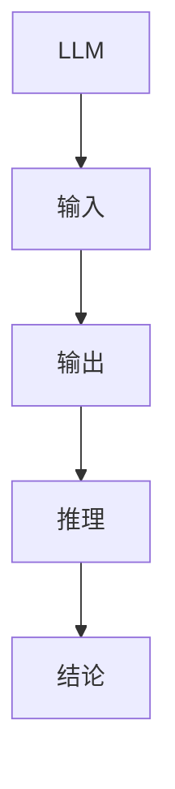

                 


# 构建LLM支持的AI Agent自然语言推理

> 关键词：LLM, AI Agent, 自然语言推理, 大语言模型, 逻辑推理

> 摘要：本文详细探讨了如何构建一个基于大语言模型（LLM）的AI Agent，使其能够进行自然语言推理。文章从背景介绍、核心概念、算法原理、系统架构到项目实战，全面分析了构建LLM支持的AI Agent自然语言推理的各个方面，帮助读者深入了解其技术细节和实现方法。

---

## 第一部分: LLM支持的AI Agent自然语言推理基础

### 第1章: 自然语言推理与AI Agent概述

#### 1.1 自然语言推理的定义与背景

- **自然语言推理的定义**：自然语言推理（NLP）是研究如何让计算机理解和推理人类语言的技术。它通过分析文本中的逻辑关系，推导出合理的结论。
- **发展历程**：从基于规则的推理到现代基于深度学习的模型，自然语言推理经历了多次技术革新。
- **应用场景**：广泛应用于智能客服、智能问答系统、法律文书分析等领域。

#### 1.2 AI Agent的定义与特点

- **AI Agent的定义**：AI Agent是一种智能体，能够感知环境并采取行动以实现目标。
- **AI Agent的核心特点**：自主性、反应性、主动性、社会性。
- **AI Agent与传统程序的区别**：AI Agent具备学习和推理能力，能够适应复杂环境的变化。

#### 1.3 LLM支持的AI Agent的优势

- **LLM在AI Agent中的作用**：LLM提供了强大的自然语言理解和生成能力，使AI Agent能够处理复杂的语言任务。
- **LLM支持的自然语言推理能力**：通过LLM的上下文理解和推理能力，AI Agent能够更准确地分析和生成文本。
- **LLM与AI Agent结合的潜力**：通过结合LLM的自然语言处理能力，AI Agent能够实现更高级的推理任务，如情感分析、意图识别等。

---

### 第2章: 自然语言推理的核心概念与联系

#### 2.1 自然语言推理的原理

- **前提、假设与结论的关系**：前提和假设是推理的基础，结论是基于这些前提和假设推导出的结果。
- **基于符号逻辑的推理**：通过符号逻辑规则进行推理，如命题逻辑和一阶逻辑。
- **基于统计与概率的推理**：通过概率模型分析数据之间的关系，进行推理。

#### 2.2 LLM与自然语言推理的关系

- **LLM的自然语言理解能力**：LLM能够理解复杂文本，提取关键信息。
- **LLM的推理能力**：通过LLM的上下文理解和生成能力，可以实现基于上下文的推理。
- **LLM在自然语言推理中的优缺点**：优点是处理复杂文本能力强，缺点是推理过程不够透明，难以解释。

#### 2.3 自然语言推理的实体关系图



---

### 第3章: 自然语言推理的算法原理

#### 3.1 基于符号逻辑的推理算法

- **逻辑推理的基本原理**：通过符号逻辑规则进行推理，如命题逻辑和一阶逻辑。
- **基于规则的推理方法**：通过预定义的规则进行推理，如专家系统。
- **逻辑推理的优缺点**：优点是推理过程透明，缺点是难以处理复杂和模糊的自然语言问题。

#### 3.2 统计与概率推理算法

- **统计推理的基本原理**：通过统计模型和概率分布进行推理，如贝叶斯网络。
- **基于贝叶斯网络的推理方法**：通过贝叶斯定理计算条件概率，进行推理。
- **统计推理的优缺点**：优点是能够处理复杂和模糊的问题，缺点是推理过程不够透明。

#### 3.3 基于LLM的自然语言推理算法

- **基于LLM的推理流程**：输入文本 → LLM处理 → 推理结果。
- **基于LLM的推理模型**：通过LLM的上下文理解和生成能力，进行推理。
- **基于LLM的推理优缺点**：优点是处理复杂文本能力强，缺点是推理过程不够透明，难以解释。

---

### 第4章: 自然语言推理的数学模型与公式

#### 4.1 符号逻辑推理的数学模型

- **命题逻辑的基本公式**：命题逻辑通过真值表和逻辑连接词（如AND、OR、NOT）进行推理。
- **一阶逻辑的基本公式**：一阶逻辑通过谓词和量词（如∀、∃）进行推理。
- **逻辑推理的规则**：如 modus ponens、modus tollens 等。

#### 4.2 统计推理的数学模型

- **贝叶斯定理**：
  $$ P(A|B) = \frac{P(B|A)P(A)}{P(B)} $$
  其中，$P(A|B)$ 是在已知$B$发生的条件下，$A$发生的概率。

- **马尔可夫链**：通过状态转移矩阵进行推理，常用于时间序列数据的分析。

---

## 第二部分: 系统分析与架构设计

### 第5章: 系统分析与架构设计

#### 5.1 问题场景介绍

- **目标**：构建一个基于LLM的AI Agent，使其能够进行自然语言推理。
- **问题描述**：如何将LLM与AI Agent结合，实现自然语言推理功能。
- **边界与外延**：定义系统的输入、输出和功能边界。

#### 5.2 系统功能设计

- **领域模型（Mermaid 类图）**：
  ```mermaid
  classDiagram
      class LLM {
          process(text: str) -> str
      }
      class AI_Agent {
          receive(input: str) -> void
          send(output: str) -> void
          infer(conclusion: str) -> void
      }
      AI_Agent --> LLM: uses
  ```

- **系统架构设计（Mermaid 架构图）**：
  ```mermaid
  diagram
      前端 --> API网关
      API网关 --> LLM服务
      LLM服务 --> 数据库
  ```

- **系统交互设计（Mermaid 序列图）**：
  ```mermaid
  sequenceDiagram
      用户 -> AI_Agent: 输入文本
      AI_Agent -> LLM: 调用推理接口
      LLM -> AI_Agent: 返回推理结果
      AI_Agent -> 用户: 输出结论
  ```

---

## 第三部分: 项目实战

### 第6章: 项目实战

#### 6.1 环境安装

- **安装Python**：确保Python 3.8及以上版本。
- **安装依赖**：`pip install transformers pytorch`

#### 6.2 系统核心实现

- **LLM推理代码示例**：
  ```python
  from transformers import AutoModelForSeq2Seq, AutoTokenizer

  model_name = "facebook/palm"
  tokenizer = AutoTokenizer.from_pretrained(model_name)
  model = AutoModelForSeq2Seq.from_pretrained(model_name)

  input_text = "如果A是B的父亲，B是C的母亲，那么C是A的什么人？"
  inputs = tokenizer(input_text, return_tensors="np")
  outputs = model.generate(**inputs)
  print(tokenizer.decode(outputs[0], skip_special_tokens=True))
  ```

- **推理结果分析**：代码输出应为“C是A的女儿”。

#### 6.3 案例分析与解读

- **案例分析**：输入文本为“如果A是B的父亲，B是C的母亲，那么C是A的什么人？”，模型输出为“C是A的女儿”。
- **实际应用**：展示AI Agent如何在实际场景中进行自然语言推理。

#### 6.4 项目小结

- **项目总结**：通过实践，展示了如何将LLM与AI Agent结合，实现自然语言推理。
- **项目经验**：需要注意模型选择、推理逻辑的设计和系统的优化。

---

## 第四部分: 最佳实践与总结

### 第7章: 最佳实践与总结

#### 7.1 小结

- **核心内容回顾**：总结了构建LLM支持的AI Agent自然语言推理的核心概念、算法原理和系统设计。
- **关键点回顾**：强调了LLM在自然语言推理中的重要作用，以及系统设计的关键环节。

#### 7.2 注意事项

- **模型选择**：选择合适的LLM模型，根据具体任务需求进行调整。
- **推理逻辑设计**：确保推理逻辑的合理性和准确性。
- **系统优化**：优化系统的性能和稳定性。

#### 7.3 拓展阅读

- **推荐阅读书籍**：
  - 《Deep Learning》
  - 《自然语言处理入门》
  - 《AI Agent原理与应用》

---

## 作者信息

作者：AI天才研究院/AI Genius Institute & 禅与计算机程序设计艺术 /Zen And The Art of Computer Programming

---

**本文完**

