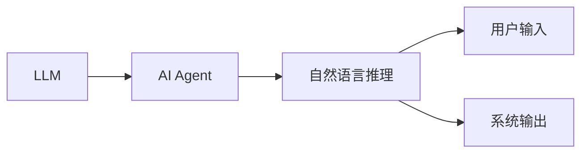

                 


---

# 构建LLM支持的AI Agent自然语言推理系统

> **关键词**: LLM, AI Agent, 自然语言推理, 系统架构, 项目实战

> **摘要**: 本文详细介绍了如何构建一个基于大语言模型（LLM）支持的AI Agent自然语言推理系统。通过背景介绍、核心概念、算法原理、系统架构、项目实战和最佳实践等部分，系统地阐述了从理论到实践的全过程，帮助读者深入理解并掌握相关技术。

---

## 目录

---

# 第一部分: 背景介绍

# 第1章: 问题背景与描述

## 1.1 问题背景

### 1.1.1 当前自然语言处理的挑战

随着自然语言处理（NLP）技术的快速发展，我们面临着如何构建更智能、更高效的AI系统来理解和推理人类语言的挑战。传统NLP模型在处理复杂语义和上下文关系时存在局限性，而大语言模型（LLM）的出现为解决这些问题提供了新的可能性。

### 1.1.2 LLM在NLP中的应用现状

LLM如GPT-3、GPT-4等模型通过自监督学习和大规模预训练，展现了强大的上下文理解和生成能力。然而，如何将这些能力应用于实际场景中的自然语言推理任务，仍是一个需要深入研究的问题。

### 1.1.3 AI Agent在智能系统中的作用

AI Agent作为智能系统的主体，负责接收输入、处理信息并输出结果。LLM的引入使得AI Agent能够更自然地理解和生成人类语言，从而在对话系统、智能助手等领域展现出广泛的应用潜力。

## 1.2 问题描述

### 1.2.1 自然语言推理的核心问题

自然语言推理旨在理解文本中的语义关系，判断一个句子是否可以推导出另一个句子。这涉及到多个方面，包括句子间的逻辑关系、上下文的理解以及推理的准确性。

### 1.2.2 LLM支持的AI Agent的必要性

为了使AI Agent能够具备推理能力，需要依赖LLM的强大语言理解能力。通过LLM的支持，AI Agent可以更准确地理解用户输入，并生成合理的推理结果。

### 1.2.3 系统构建的目标与边界

系统构建的目标是设计一个能够实现自然语言推理的AI Agent，支持多轮对话和复杂场景的推理任务。系统的边界包括输入输出格式、推理范围以及性能指标。

## 1.3 问题解决与系统构建

### 1.3.1 系统构建的总体思路

从需求分析到系统设计，再到实现与测试，系统构建需要遵循清晰的步骤。通过模块化设计，将系统分解为功能模块，逐一实现。

### 1.3.2 系统的核心功能与模块

系统的核心功能包括语言理解、推理计算和结果生成。主要模块包括输入处理模块、推理引擎和输出生成模块。

### 1.3.3 系统的边界与外延

明确系统的功能边界，避免超出设计范围。同时，扩展系统的应用场景，考虑未来可能的功能增强和性能优化。

## 1.4 本章小结

通过本章的介绍，我们理解了构建LLM支持的AI Agent自然语言推理系统的背景、问题和目标，为后续章节奠定了基础。

---

# 第2章: 核心概念与联系

## 2.1 核心概念原理

### 2.1.1 LLM的基本原理

LLM基于Transformer架构，通过自监督学习进行预训练，具备强大的语言生成和理解能力。

### 2.1.2 自然语言推理的定义与特点

自然语言推理是判断给定句子间的关系，具有语义理解、逻辑推理和不确定性处理的特点。

### 2.1.3 AI Agent的定义与功能

AI Agent是智能系统的核心，负责接收输入、处理信息并输出结果，具备感知、决策和执行能力。

## 2.2 核心概念对比

### 2.2.1 LLM与传统NLP模型的对比

通过对比表格分析LLM与传统NLP模型在训练方式、参数规模和任务处理能力上的差异。

### 2.2.2 自然语言推理与传统推理的对比

比较自然语言推理与传统符号逻辑推理在数据驱动、语义理解和不确定性处理方面的不同。

### 2.2.3 AI Agent与传统AI系统的对比

从自主性、实时性和交互性等方面分析AI Agent与传统AI系统的区别。

## 2.3 实体关系图

通过Mermaid流程图展示LLM、AI Agent和自然语言推理之间的关系。



## 2.4 本章小结

本章通过对比和关系图，清晰地阐述了核心概念之间的联系，为后续章节的理解提供了支持。

---

# 第3章: 算法原理讲解

## 3.1 LLM的训练过程

### 3.1.1 基于Transformer的模型结构

详细讲解Transformer的编码器和解码器结构，以及自注意力机制的工作原理。

### 3.1.2 自监督学习与微调

介绍LLM通过自监督学习进行预训练，再通过微调适应特定任务的方法。

### 3.1.3 损失函数与优化器

使用数学公式和代码示例，讲解常用的损失函数和优化器，如交叉熵损失和Adam优化器。

```python
def loss_function(logits, labels):
    loss = F.cross_entropy(logits, labels)
    return loss

def optimize(loss, optimizer):
    optimizer.zero_grad()
    loss.backward()
    optimizer.step()
```

## 3.2 自然语言推理算法

### 3.2.1 基于LLM的推理流程

通过流程图展示自然语言推理的步骤，包括输入处理、模型调用和结果解析。

### 3.2.2 分类任务与回归任务

比较自然语言推理中的分类和回归任务，分析其适用场景和实现方法。

### 3.2.3 多轮对话中的推理机制

介绍多轮对话中如何维护上下文，确保推理的连贯性和一致性。

## 3.3 系统整体流程

通过Mermaid流程图展示系统整体流程，包括用户输入、LLM处理和结果输出。


## 3.4 本章小结

本章详细讲解了LLM的训练过程和自然语言推理算法，为系统实现奠定了理论基础。

---

# 第4章: 系统分析与架构设计方案

## 4.1 问题场景介绍

### 4.1.1 系统目标与功能

明确系统的总体目标和具体功能，如支持多种语言和多轮对话。

### 4.1.2 项目介绍与范围

介绍项目的背景、目标和范围，明确系统的适用场景和用户群体。

## 4.2 系统功能设计

### 4.2.1 功能模块划分

将系统划分为输入处理模块、推理引擎和输出生成模块。

### 4.2.2 领域模型设计

通过Mermaid类图展示系统各模块之间的关系和交互。

## 4.3 系统架构设计

### 4.3.1 分层架构设计

将系统分为输入层、处理层和输出层，明确各层的功能和接口。

### 4.3.2 系统架构图

通过Mermaid架构图展示系统的整体架构。


## 4.4 系统接口设计

### 4.4.1 输入接口设计

定义输入格式和数据结构，确保系统的输入一致性。

### 4.4.2 输出接口设计

明确输出格式和数据结构，确保系统的输出符合用户需求。

## 4.5 系统交互设计

### 4.5.1 交互流程设计

通过Mermaid序列图展示系统的交互流程。


## 4.6 本章小结

本章通过系统分析和架构设计，为项目的实现提供了清晰的指导。

---

# 第5章: 项目实战

## 5.1 环境搭建与安装

### 5.1.1 开发环境选择

推荐使用Python和相关深度学习框架，如TensorFlow或PyTorch。

### 5.1.2 依赖库安装

列出项目所需的依赖库，并提供安装命令。

## 5.2 系统核心实现

### 5.2.1 输入处理模块

编写代码实现用户输入的接收和预处理。

### 5.2.2 推理引擎实现

基于LLM实现自然语言推理逻辑，包括文本生成和结果解析。

### 5.2.3 输出生成模块

实现结果的格式化输出，确保输出符合用户需求。

## 5.3 代码应用解读与分析

### 5.3.1 核心代码示例

提供关键代码片段，并进行详细解读。

### 5.3.2 代码结构分析

分析项目的整体代码结构，帮助读者理解代码的组织方式。

## 5.4 实际案例分析

### 5.4.1 案例背景

介绍实际案例的背景和需求。

### 5.4.2 案例分析

详细分析案例中的数据处理、模型调用和结果输出过程。

### 5.4.3 结果解读

展示推理结果，并进行解读和分析。

## 5.5 本章小结

本章通过项目实战，展示了系统的实现过程和实际应用，帮助读者巩固所学知识。

---

# 第6章: 最佳实践与注意事项

## 6.1 小结与回顾

### 6.1.1 核心内容回顾

总结文章的核心内容和关键知识点。

### 6.1.2 项目实现的关键点

回顾项目实现中的关键点和注意事项。

## 6.2 注意事项与建议

### 6.2.1 开发中的常见问题

列举开发过程中可能遇到的问题，并提供解决方案。

### 6.2.2 性能优化建议

提供系统性能优化的建议，包括模型选择和代码优化。

## 6.3 拓展阅读

### 6.3.1 相关领域研究

介绍自然语言处理和AI Agent领域的最新研究进展。

### 6.3.2 深入学习资源

推荐相关的书籍、论文和在线资源，供读者进一步学习。

## 6.4 本章小结

本章通过小结、注意事项和拓展阅读，帮助读者更好地理解和应用所学知识。

---

# 结语

通过本文的详细讲解，读者可以系统地了解如何构建一个基于LLM的AI Agent自然语言推理系统。从理论到实践，我们逐步深入探讨了系统的各个组成部分，希望本文能为读者在相关领域的研究和实践提供有价值的参考。

---

# 作者

**作者：AI天才研究院/AI Genius Institute & 禅与计算机程序设计艺术 /Zen And The Art of Computer Programming**

---

**本文遵循CC BY-SA 4.0协议，转载请注明出处。**

